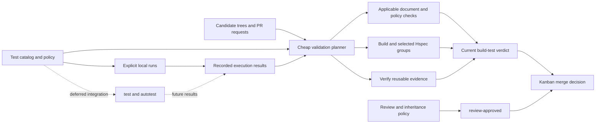

# Lean CI, test selection, and reusable validation design

Make validation effective enough to catch integration mistakes and inexpensive
enough to use continuously while one owner develops the engine through parallel
agent workflows. Spend work on changed behavior, preserve useful evidence across
documentation updates, and keep expensive exploratory testing available without
putting every probe on every PR's critical path.

Design state: `ready for issue processing`

Owner: `coghex/hetoimasia`; publication target: `master`.
Created 2026-09-10 in the owner's `docs-wip` worktree and subsequently published.
The owner settled optional-test selection, review inheritance, and deferred
skill integration on 2026-09-10. The final design pass checked the current
repository and tracker. Policy decisions are settled; Q-4 explicitly delegates
bounded implementation choices to the affected issue specifications. The
owner explicitly approved readiness for issue processing on 2026-09-10.

Status legend: `[ ]` unprocessed · `[#N]` linked to issue N · `[no-issue]`
reviewed and deliberately not tracked separately · `[deferred]` blocked on a
concrete precondition

## Processing status

- [x] EPIC. Establish effective, selective CI and validation reuse — [#8]
- [x] CI-1. Define the shared catalog and explainable test selection — [#10]
- [x] CI-2. Run selected validation through stable, parallel GitHub checks — [#11]
- [x] CI-3. Preserve valid CI evidence across documentation changes — [#12]
- [x] CI-4. Carry review approval through clean base merges independently of CI — [#13]
- [ ] CI-5. Integrate `test` and `autotest` with the shared testing contract — [deferred]: the owner explicitly requests `test`/`autotest` integration

CI-1 through CI-4 are implemented and epic #8 is closed. Their delivery
boundaries remain below as design history, not an unfiled work queue. Current
behavior, including GLFW's later native/display worker and image caching, is in
[validation.md](validation.md) rather than here, because this document records
the design rather than the shipped system.
CI-5 resumes when the owner requests skill integration; inspect the skills'
actual interfaces then before choosing adapter or scheduler changes.

## Epic contract

- **Goal:** each candidate receives an understandable validation plan and a
  current merge verdict, executing only necessary or explicitly requested work.
- **Done when:** required checks work for the current logger PRs;
  classified prose changes preserve valid code evidence; selected tests and
  their dependencies run with accurate results while optional tests remain
  outside automatic PR selection; approval inheritance survives the complete
  Kanban merge path independently of CI freshness; the shared catalog and result
  contract support later local testing integration. Deferred CI-5 is not a
  prerequisite for completing the initial CI arc.
- **Users and operators:** the solo owner, implementation/review agents, Kanban's
  controllers, and testing skills using Hetoimasia's testing framework.
- **Arc label:** `ci` (created 2026-09-10); umbrella epic #8.

## Current state and evidence

### Hetoimasia

Initial inspection of primary `0328f9af410e2a07b6a41b749cbad4c559275e98` on
2026-09-10 found no `.github/workflows/` or `.drain-prs.json`. At that revision
the Cabal project had three packages, four engine Hspec examples, three workflow
Hspec examples, a console smoke, local `-Werror`, a pinned Hackage index, and documented
GHC/Cabal versions, with no Vulkan workload or Python engine-probe suite.
Logger implementation is advancing independently; these counts describe that
inspection baseline, not the eventual CI implementation target.

Kanban's shared CLI/review components and both repository services are installed.
Installation does not create this repository's required GitHub checks. The
drainer defaults to `build-test` and `review-approved`; absent checks leave a
candidate waiting. See [workflow](workflow.md) and
[package metadata](../hetoimasia.cabal).

Final-pass inspection on 2026-09-10 found primary at
`e0691ec6a54940dc62a36054c1bc750b08be1cca`, with no CI workflows yet. Logging
PR #5 has landed; the open tracker contains logging epic #1 and children #3–#4,
with no open PR or overlapping CI arc. Recheck during issue processing because
logging work is concurrent. The dedicated [logging](logging_design.md) and
[resource](resource_ownership_design.md) contracts remain authoritative.

### Synarchy: retain the ideas, assess their costs

Inspected `coghex/synarchy` at
`6ee9a7aa39a7b005c75e387c775dc6b0693f6385`. These are source observations, not
new timing measurements or a claim that every historical defect remains live.

| Evidence | Useful behavior | Hetoimasia opportunity or caution |
| --- | --- | --- |
| [CI workflow](https://github.com/coghex/synarchy/blob/6ee9a7aa39a7b005c75e387c775dc6b0693f6385/.github/workflows/ci.yml) | Cabal checks, static audits, and behavior probes are separate workers; `build-test` explicitly aggregates their results with `always()` | Static checks still wait for image resolution. The static worker contains 30 named steps and 73 explicit Python command lines even for ordinary docs. Introduce checks for demonstrated contracts and select their actual inputs. |
| [Docs selector](https://github.com/coghex/synarchy/blob/6ee9a7aa39a7b005c75e387c775dc6b0693f6385/tools/ci_docs_fast_path.py) | Reads the complete change range and excludes documentation-shaped save-compat inputs that need a compiled codec | Only additions/modifications under `docs/` qualify. Root README/instruction changes, deletions, and renames force the build. Replace these location/status shortcuts with explicit input classification. |
| [Expensive gates](https://github.com/coghex/synarchy/blob/6ee9a7aa39a7b005c75e387c775dc6b0693f6385/tools/ci_expensive_gates.py), [probe selection](https://github.com/coghex/synarchy/blob/6ee9a7aa39a7b005c75e387c775dc6b0693f6385/tools/ci_probes.py) | Selective expensive coverage; unknown inputs widen coverage; omitted probes have explicit reasons | The ordinary headless Hspec suite remains broad, and some real-engine Python probes run automatically on matching PRs. The owner wants a different probe policy here. |
| [Cache epochs](https://github.com/coghex/synarchy/blob/6ee9a7aa39a7b005c75e387c775dc6b0693f6385/tools/ci_cache_epoch.py) and CI image workflow | Compatible toolchain/dependency/build caches; prose changes do not age compiled-product caches; images follow recipe content | Borrow compatibility keys and observability first. A bespoke image publisher and historical epoch machinery need a measured payoff. Separate CI jobs currently can rebuild the same executable prerequisites. |
| [Review decision](https://github.com/coghex/synarchy/blob/6ee9a7aa39a7b005c75e387c775dc6b0693f6385/tools/review_gate_decision.py) | Replays the prior head with the incorporated base using Git's real merge; preserves approval only if the replay is conflict-free and its tree equals the submitted tree | This already repairs earlier raw-patch/path-intersection mistakes. Retain the exact replay idea; clean merges alone do not establish test equivalence. |
| [Review label policy](https://github.com/coghex/synarchy/blob/6ee9a7aa39a7b005c75e387c775dc6b0693f6385/tools/review_gate_label_policy.py) | Verifies label mutation through a fresh API read and makes the required check consume the actual decision | Do not rely on an old event payload or expect a token-created label edit to trigger another workflow. |
| [Probe registry](https://github.com/coghex/synarchy/blob/6ee9a7aa39a7b005c75e387c775dc6b0693f6385/tools/probe_runner_registry.py), [scheduler](https://github.com/coghex/synarchy/blob/6ee9a7aa39a7b005c75e387c775dc6b0693f6385/tools/probe_runner_scheduler.py), [claims](https://github.com/coghex/synarchy/blob/6ee9a7aa39a7b005c75e387c775dc6b0693f6385/tools/probe_claim.py) | Stable probe identities, duration/resource metadata, parallel scheduling, ownership, and retained results | Retain resource-aware execution and deduplication. Do not import hundreds of game-specific probes or repeat-until-green behavior. |
| [External test evidence](https://github.com/coghex/synarchy/blob/6ee9a7aa39a7b005c75e387c775dc6b0693f6385/tools/probe_external_evidence.py) | Reads the separate testing coordinator's evidence without treating interpreted test reports as flake measurements | The sweep schedules by duration; this reader does not implement oldest-first selection. Borrow the separation of execution evidence from interpretation. Integrating the owner's `test` and `autotest` skills is deferred; the initial CI arc needs only a compatible catalog and result contract. |

Kanban itself also participates in freshness decisions (inspected source
`427b0ae19f5e6e3edab1b6456024db15d7a7e35f`): its
`tools/drain_prs.py::branch_update_carried_approval` checks the current head,
successful `dismiss-stale-approval`, and the approval label together.
`coordination_only_base_advance` can avoid a branch update for configured
coordination paths, but rejects overlaps with the PR's own paths. A local CI
optimization is incomplete if GitHub rules or that downstream consumer undo it.

## Decisions supplied by the owner

### D-1. Effectiveness first, efficiency second

Optimize useful defect coverage and feedback for a solo developer. Avoid process
whose maintenance costs more than the failures it prevents. Preserve explicit
tradeoffs rather than representing a shortcut as stronger evidence than it is.

### D-2. Categorized CI and explicit PR test requests

The owner explicitly selected mandatory + affected + PR-requested groups,
retaining the optional-test qualification below. Some checks must run for every
applicable change. Affected tests are automatically mandatory only when they
are not listed as optional. A PR can
explicitly request additional tests. Optional tests, typically probes, belong
to periodic testing unless explicitly requested; affected paths alone never
promote them into required PR work. This also applies to optional Hspec groups.
The exact initial groups and request transport remain proposals in P-1.

### D-3. Engine probes are requested work

Python engine probes run when requested for local feature validation or by the
testing skills/framework. They are not a blanket automatic PR tier. Keep Hspec
as the primary test framework; the execution lane follows a test's purpose and
cost, not merely its implementation language. Hspec can exercise Python tooling.

### D-4. Documentation publication should preserve valid code evidence

A new commit hash alone must not force expensive revalidation or invalidate
otherwise applicable evidence. Compare the relevant contents of the revisions.
This does not authorize calling changed fixtures, shader inputs, build policy,
or test-consumed Markdown harmless, nor turning an existing failure green.

### D-5. Allow deliberate solo-owner approval shortcuts

The owner explicitly selected retaining review approval when a base update
exactly reproduces a clean merge of the approved work, as used in Synarchy.
Such an update does not require another review agent.
CI freshness is independent: if code or other behavior-affecting inputs changed,
rerun the necessary non-optional CI subset on the integrated candidate, plus
explicitly requested applicable tests. Approval can remain fresh while CI is
pending or failing. Groups with identical inputs can reuse applicable evidence;
classified prose-only updates preserve valid code evidence under D-4. Optional
groups remain excluded from automatic reruns under D-2. P-3 describes the
automatic proof that an update really is only a clean base merge; this is not
permission to invent a new review.

### D-6. Share the testing contract; defer periodic skill integration

Independent tests should overlap where machine resources allow. The owner
identified `test` and `autotest` as the skills used for deliberately paced,
oldest-first testing, and explicitly deferred their integration for now.
Design Hetoimasia's catalog, selection, and result contract here so those skills
can use them later. Hspec remains the primary way to write tests. Whether later
integration needs an adapter or scheduler changes is deferred until the skills
are inspected; this decision does not call for a competing scheduler now.

## Implementation proposals within the agreed policy

D-1 through D-6 govern behavior. The proposals below guide implementation;
Q-4 identifies the details to make concrete during issue processing. A change
to the owner's optional-test, freshness, or deferred-integration policy requires
returning to that decision explicitly.

### P-1. One test catalog and one resolved validation plan

Use stable group IDs and a single declarative catalog shared by CI, local
commands, and the testing framework. Each group identifies its command,
component, inputs/dependencies, fixtures, runner needs, timeout, and execution
category, with an explicit optional/non-optional classification. Optional status
is independent of implementation language and runner eligibility. Keep observed
duration/failure history separate from those declarations.
Register groups at useful behavioral boundaries, not an entry per assertion.
Start with a handful of groups corresponding to the existing components and
workflow tests; do not build a hand-maintained module dependency database.
Use Cabal's package graph to establish component dependencies when selecting
their consumers, and add explicit non-Haskell inputs at their owning groups.

| Category | Proposed trigger | Initial examples |
| --- | --- | --- |
| Always-evaluated checks | Every candidate, including standalone docs | Plan validity, input classification, evidence applicability, stable aggregate verdict; relevant cheap document checks |
| Mandatory fast tests/builds | Every code-affecting candidate within the non-optional floor; docs-only updates can reuse valid code evidence | Compilation, fast logger/resource invariants, console integration; initially the non-optional engine suite is small enough to run whole |
| Selected non-optional groups | Affected component/dependency selection plus explicit PR requests | Extended lifecycle scenarios, scripting integration, rendering data preparation |
| Optional groups, including engine probes and measurements | Explicit request or periodic tester; never automatic affected-test selection | Future GPU images, long-running scenarios, stress and performance experiments; any Hspec group explicitly listed as optional |
| Broad backstop | Owner-requested broad run or the periodic tester's rotation | Less frequent groups and occasional clean builds |

The owner's selection rule is:

```text
required PR work = applicable mandatory floor
                + affected non-optional groups
                + explicitly requested groups
```

The floor contains no optional groups. An affected group has changed source,
dependencies, fixtures, configuration, or other declared inputs; "changed-input
tests" is not a separate test category. A logger API change, for example, can
affect runtime tests even when the runtime test files themselves are untouched.

Unknown inputs broaden applicable non-optional coverage. They do not override
optional status, even for a shared dependency or test-harness change. Selecting
a group's build/fixture prerequisites must not silently select optional test
executions. Invalid or missing classification gets a visible diagnostic; an
existing optional declaration is never lost through conservative fallback.
A request adds coverage; it does not remove mandatory non-optional coverage.

The plan explains why each group ran, was reused, was outside scope, or awaits
a requested manual run. An unrequested optional group is an explained omission,
not a missing CI check or a reason to block the PR. Unknown group IDs, malformed
requests, and an empty Hspec selection that was supposed to match examples are
errors.

PR requests should name catalog entries, never arbitrary shell commands. A
small structured block in the PR body is the first transport proposal; freeze
its normalized content with the head/base and policy revision. Editing the
request must refresh the plan even without a code commit, and a late run for an
older plan must not satisfy the new one. Requests for optional groups must say
whether the declared runner executes them in CI or requires local evidence;
requesting a GPU-only group must not silently produce a skipped success on a
CPU runner. An explicit all-Hspec request stays available, including optional
Hspec groups because that broader coverage was explicitly requested.

### P-2. Keep commit identity, execution identity, and review identity distinct

GitHub still needs a verdict attached to the appropriate current commit. A
previous commit's successful check cannot simply substitute for that status.
The cheap current check may instead explain why recorded execution evidence
still applies. [GitHub required-check behavior](https://docs.github.com/en/pull-requests/how-tos/merge-and-close-pull-requests/troubleshooting-required-status-checks)

Proposed execution identity for one group:

```text
group and test definition
+ relevant source/dependency closure, fixtures and runtime inputs
+ build/test configuration, toolchain, target platform and selected options
+ classification/selection policy version
= comparable input identity
```

Preserve the exact executed commit/tree, commands, original result, timestamps,
platform, and artifact references. A reused result remains an earlier execution;
record the new applicability proof separately. Never advance the oldest-first
framework's last-executed timestamp merely because a SHA changed or a result
was reused. Build caches accelerate execution; they are not passing-test receipts.

Compare full, pinned endpoint trees for equivalence. Use the PR's merge-base
range to identify its contribution, and the actual candidate integration tree
to account for upstream dependencies. Include filenames, additions/deletions,
file modes, both rename endpoints, and transitive inputs; use NUL-safe Git
output. Two disjoint edited filenames can still affect the same test.

A code-changing base merge invalidates CI for the affected required groups and
those groups execute again on the integrated candidate. Retaining review does
not bypass this rerun. Evidence reuse covers unchanged group inputs, especially
prose-only updates; it must not turn evidence for the previous code into a pass
for changed code. Optional groups remain optional throughout this comparison.

Ordinary prose, test-consumed documents, packaging inputs, and review/instruction
policy need separate impact classifications. A Markdown edit can affect a
document check or review policy without requiring Haskell recompilation. A
compiler-input change is only one kind of behavior-affecting change: shaders,
Lua, assets, generated inputs and configuration count for their consumers too.
If a build embeds Git metadata, account for that actual input explicitly.

Use an explicit harmless-prose policy plus declared consumers; do not make
`*.md` globally exempt. Pure prose renames/deletions and root documentation can
take the fast path when their consumers justify it. Classification changes
themselves invalidate the relevant policy checks. Compare under established
policy so a candidate cannot exempt its own newly modified inputs unchecked.

A missing, failed, cancelled, expired/unavailable, or incompatible receipt
does not produce reuse success. Run the required group or show the obstacle.
Keep later known failures visible; do not choose an older pass to conceal them.
This is a claim about declared inputs, not proof against all nondeterminism.

### P-3. Preserve review through exact replay; validate affected integration

The owner's selected inheritance rule, inspired by current Synarchy:

```text
An existing applicable approval is present.
Replay its approved head onto the base actually incorporated into the update.
Git reports a clean merge, and the resulting tree equals the submitted tree.
The approval still applies to the PR's issue/specification.
=> retain the earlier review with recorded provenance.
```

Use Git's real merge, including rename handling. A later fetched master tip is
not necessarily the base the update incorporated. Edits added during an update,
reverts of approved work, conflict resolutions, and unverifiable history do not
inherit approval through this rule. Preserve the original reviewer and reviewed
revision; do not report that the reviewer examined the new integration tree.

Test selection is independent of review inheritance. If upstream changed a
relevant interface, implementation, or CI input, resolve the current plan and
rerun the necessary non-optional subset and applicable requested groups. An
upstream change to test selection does not itself require another review agent
for a clean base merge. If only classified prose changed and the group inputs
match, reuse valid evidence. The clean-merge shortcut reduces review cost while
CI still checks the new integration. It grants no bypass of changed-code CI.

| Update to an already approved PR | Review | CI |
| --- | --- | --- |
| Clean base merge incorporating code changes | Retain approval | Rerun the required subset affected by the integrated changes; approval alone cannot make it green |
| Clean base merge incorporating only harmless prose | Retain approval | Run applicable cheap checks; preserve valid unchanged code evidence |
| Only an optional group's inputs are affected | Apply the same review rules | Do not automatically execute that optional group; still enforce any affected non-optional build/tests and explicit requests |
| Additional authored code edit or manual conflict resolution | Earlier approval does not cover the edit | Run the applicable required subset; passing CI does not replace rereview |

Keep `review-approved`, `dismiss-stale-approval`, labels, and the drainer on the
same interpretation. Read current GitHub state before publishing a verdict and
before merging. Do not count on a `GITHUB_TOKEN` label mutation starting another
workflow; relevant label events do not. [GitHub event behavior](https://docs.github.com/en/actions/how-tos/write-workflows/choose-when-workflows-run/trigger-a-workflow)

### P-4. A cheap planner, parallel workers, and an honest aggregate



Start the lightweight planner/document checks without a GHC image dependency.
Launch independent CPU/static jobs concurrently; shard tests only once their
durations justify runner startup and artifact-transfer overhead. Build shared
prerequisites once per compatible environment where that is cheaper than an
independent cached build. Test workers need isolated scratch files and bounded
CPU/RAM/GPU/port budgets; more workers must not mean more contention failures.

Keep `build-test` as a stable aggregate that runs even when upstream jobs fail
or are intentionally omitted. Check the resolved plan against actual worker
results: intentional omission is distinct from unexpected skip, failure,
cancellation, timeout, or a missing shard. A selected gate cannot pass merely
because no job executed it. The docs-only route must produce its normal current
status rather than skip the entire required workflow.
[GitHub skipped-workflow behavior](https://docs.github.com/en/actions/how-tos/manage-workflow-runs/skip-workflow-runs)

No blanket cancellation of useful work on every new SHA. A prose update should
not cancel a still-needed code run. Supersede obsolete PR work after comparing
plans/inputs; preserve verdicts for distinct master integration inputs. Reusing
already finished evidence is the first optimization; sharing an in-flight run
can follow only with a bounded wait/fallback and attribution design. Avoid
making the first pipeline depend on a bespoke distributed scheduler.

Select a modest initial job count from actual runner capacity and measure queue,
setup, compile, execution, and total time separately. GitHub exposes matrix
parallelism and failure controls, but CI wall time is the metric to optimize.
[GitHub matrix controls](https://docs.github.com/en/actions/how-tos/write-workflows/choose-what-workflows-do/run-job-variations)

### P-5. Keep a small contract for deferred `test` and `autotest` integration

The immediate design supplies stable catalog IDs, reproducible local commands,
and attributable result fields shared with CI. `test` and `autotest` are the
named future consumers. Their integration is deferred by D-6: do not port their
scheduler, build a replacement, or make skill changes a dependency of initial
CI. Inspect their actual interfaces when CI-5 resumes, then choose the smallest
integration that preserves one source of selection and execution history.

Proposed result fields are test/group ID, exact executed revision and input
identity, environment, command/options/seed, start/end times, outcome, and
retained evidence paths. Local runs and future skill invocations should use the
same commands and result semantics. Keep test implementation in Hspec wherever
practical, with Python probes for boundaries that need them.

Distinguish pass, assertion failure, fixture/harness failure, timeout,
cancellation, and not-run. A retry remains another recorded attempt. Explicitly
quarantined/flaky tests remain visible with a reason and follow-up; a transient
retry must not silently erase failure evidence.

For deferred integration, the proposed rotation is never-executed tests first,
then oldest completed execution among eligible tests, with stable IDs breaking
ties and failures tracked
separately. Eligibility accounts for available resources, active claims, and
explicit deferrals; the periodic pool includes optional groups. Claims, not-run
results, docs updates, and reused passes do not reset the age clock. Track
input staleness separately rather than silently changing oldest-first order.
Historical results remain history when their inputs change; they do not become
current passes. A user can explicitly request an affected or failing group
ahead of the rotation.

Deferred integration must coordinate test identity as well as scarce machine
resources across worktrees and concurrent skill invocations. Retain completed
results before updating the scheduling history so a bookkeeping failure does
not waste an expensive GPU run. Requested manual evidence can satisfy an explicitly
declared manual requirement after provenance checks; it must not masquerade as
a hosted-platform run. Optional groups remain outside automatic PR selection
even when their latest periodic result is old or their inputs changed. Report
that coverage gap visibly without turning periodic backlog into a CI gate.

## Scope and rollout boundaries

The active scope is Hetoimasia's CI and shared local testing contract: the
catalog, selection, reproducible commands, and results. Integration with `test`
and `autotest`, including periodic scheduling and claim ownership, is deferred.
It does not implement the logger, resource scopes, renderer, or Synarchy's game
scenarios. Keep behavior tests owned by their packages.
Use Hspec for the planner and lifecycle contracts where practical, including
Git graph and process integration tests. Python probes are the fallback at
boundaries Hspec cannot reasonably exercise, not the default test language.

The proposed rollout begins with a useful CI/check baseline for the current
logger work. Classify and select small existing groups before introducing many
categories. Establish documented-prose equivalence before general per-group
reuse, and prove the review/merge handshake before enabling automatic inheritance.
Cache sophistication follows timing evidence. These are proposed milestones,
not approved issue slices; do not block all initial CI on a complete probe lab.
The first reuse implementation can compare one conservative code-input set;
per-group fingerprints and sharing in-flight work are later optimizations if
measured reruns justify their maintenance cost.

Recommended sequencing relative to resource work: establish CI-1 and CI-2
before implementing the resource scopes, so compilation, Hspec, and review
checks already protect their failure and cancellation contracts. CI-3 and CI-4
can proceed alongside resource development once the baseline works. Do not wait
for deferred CI-5 or speculative cache/sharding optimizations. The resource
design's existing LOG-3 merge gate still applies. Within that arc, implement
CPU ownership and composite cleanup before the scoped continuation facade;
an application-wide continuation monad remains a separate, undecided choice.

The intended trust model is the owner's repository and owner-directed agents,
with a shared GitHub identity where necessary. A separate reviewer account,
enterprise approval hierarchy, and general untrusted-contributor workflow are
not prerequisites. Keep inexpensive protection against mistakes anyway: bounded
catalog IDs rather than shell text, current-head checks, least-needed workflow
permissions, and no secrets in test artifacts. Treat future outside contributors
as a new workflow decision rather than silently running their code with elevated
publication credentials.

Repository scripts, their required contracts, and tests ship together in their
implementation PRs. A later request may publish this standalone design through
Hetoimasia's docs workflow. No blanket direct-code bootstrap exception is implied.

Hetoimasia owns the test catalog, requests, CI workflows, evidence rules, and
repository-facing contract. Ownership of any later skill/scheduler changes is
determined during deferred CI-5. Kanban owns its shared drainer/review services.
The existing check names and clean-merge approval handshake were verified in
the inspected Kanban source. CI-2 and CI-4 must exercise that contract end to end
before declaring the integration complete. Any missing shared
capability needs a separately owned Kanban prerequisite; do not modify its
installed scripts or disguise the gap by manually reapplying labels.

Align GitHub branch rules with the chosen content-equivalence policy. A strict
latest-base rule can force a branch update despite a docs-equivalence proof.
Kanban's `workflow.coordination_paths` is only a merge exception and must not
be populated with all Markdown indiscriminately; it is also separate from
`workflow.direct_publication_paths`, which authorizes agent publication.

## Resolved questions and remaining design details

### Q-1. What is the PR's authority over selective tests?

Resolved by the owner's explicit selection in D-2: mandatory floor + affected
non-optional groups + PR-requested groups. Requests add coverage, including
optional groups when requested. Periodic testing owns unrequested optional tests.

### Q-2. What survives a conflict-free base update?

Resolved by the owner's explicit selection in D-5: retain review when the update
exactly reproduces a clean merge of the approved work. Rerun required tests whose
inputs changed; tests with identical inputs can reuse applicable evidence.
CI does not inherit review freshness, and optional groups remain optional.
There is no requested exception allowing changed-code CI to be bypassed.

### Q-3. Are we integrating an existing framework or designing this one?

Resolved by the owner in D-6: `test` and `autotest` handle the existing testing
workflow and will need integration, but that work can wait. This document
designs the shared testing contract now. Adapter versus scheduler changes is
deliberately deferred, not a blocker for CI-1 through CI-4.

### Q-4. Which implementation details remain deliberately open?

These choices are deliberately open at design handoff. Resolve them in each
named issue's specification before implementation approval; the processing
agent presents concrete values and commands through the normal issue signoff.
They do not reopen D-1 through D-6 or require a new design arc. If a proposed
choice changes those policies, broadens the arc, or needs another repository's
implementation, stop that affected slice and obtain a decision or explicit
prerequisite; independent slices can continue.

| Affected slice | Detail to settle in its issue specification | Boundary already established |
| --- | --- | --- |
| CI-1 | Exact group IDs, catalog storage, mandatory floor, request syntax, and local planner command | Begin with the existing `cabal build all`, `cabal test hetoimasia-tests --test-show-details=direct`, `cabal test workflow-tests --test-show-details=direct`, and `cabal run exe:hetoimasia -- --smoke` commands; confirm them against the current logger implementation. Optional execution stays explicitly excluded from automatic selection. |
| CI-2 | Initial hosted platform, worker/resource limits, request events, job timeouts, and required-check configuration | Retain the documented GHC 9.12.2/Cabal 3.16.1.0 baseline and stable `build-test`/`review-approved` contract. Start with a small headless check set; document the coverage limit of the chosen platform. |
| CI-3 | Receipt storage/retention, retrieval, compatibility fields, and fallback | Begin with conservative code-input equivalence. Missing or incompatible evidence triggers required execution; it never creates success. Cache eviction must affect cost, not correctness. |
| CI-4 | Workflow event wiring, replay implementation, and branch-rule settings | Match current-head, `dismiss-stale-approval`, and approval-label semantics already consumed by Kanban. Prove review inheritance independently of required CI freshness. |
| Deferred CI-5 | Skill interface, scheduler ownership, claims/history storage, pacing, clean-build cadence, and eligibility of local evidence | Wait for the owner's request to integrate `test`/`autotest`; inspect before choosing adapter or scheduler changes. No automatic promotion of optional tests. |

Numerical latency targets and more elaborate parallelism should follow initial
timings. They are optimization work, not missing product policy or a reason to
delay the first useful CI checks.

## Verification strategy

Use real temporary Git histories and controlled process/results fixtures, plus
a small live GitHub smoke of the final check/merge wiring when authorized. The
planner's explanation is observable behavior and should be asserted with the
selection. Proposed acceptance cases include:

| Scenario | Required evidence of correct behavior |
| --- | --- |
| Plain design/README edit, rename, or deletion | Applicable document checks run; valid unchanged code evidence remains usable; current required status completes |
| Test-consumed Markdown, fixture, shader, Lua, asset, build, or policy edit | Its affected non-optional consumers are selected/invalidated even when Haskell source did not change; optional consumers remain optional |
| New unknown path or unreadable history | No silent under-selection or invented equivalence; diagnostic and conservative non-optional coverage without promoting optional tests |
| Changed public dependency, consumer source untouched | Relevant non-optional consumer compilation/tests run on the integrated candidate |
| Affected optional test, shared dependency, or harness change | No automatic execution of optional groups, including through fallback or prerequisite expansion; periodic staleness is visible |
| Explicit request for an optional group | The declared runner executes it or the plan requires eligible local evidence; an unsupported runner cannot claim success |
| Valid, missing, malformed, unknown, or zero-match PR request | The agreed floor and requested groups are enforced; invalid selection is visible |
| Request edited during execution | An older plan cannot complete the newer plan's required verdict |
| Docs update during a code build | Useful execution survives or supplies a reusable receipt; it does not become a fabricated new execution |
| Clean base replay, including two additions to the same manifest | Review inheritance follows the replay tree, not path overlap or raw commit inequality |
| Clean base merge changes code while review stays approved | Affected required CI executes again on the integrated candidate; pending/failing CI blocks merge without triggering rereview |
| Additional edit, revert, or conflict resolution during update | Earlier approval is not silently carried over |
| Master/head advances again before a check or merge | A verdict applies only after a fresh applicability/identity check |
| Failed/cancelled/missing worker or unavailable receipt | Aggregate cannot report unqualified success for planned work |
| Duplicate local agents or recording failure after a probe (deferred CI-5) | Claims prevent duplicate ownership; completed evidence survives for ingestion |
| Reused evidence or docs-only commits in the oldest-first queue (deferred CI-5) | Last-executed age is unchanged; no fresh pass is invented |
| Never-run, oldest-run, deferred, and already-claimed periodic groups (deferred CI-5) | Selection follows the declared ordering and eligibility with deterministic tie breaking; concurrent agents do not duplicate claims |
| Cold and warm builds; parallel and sequential execution | Same intended coverage/results, with timing and resource costs recorded |

## Delivery plan

The approved slices below preserve their original IDs, scope and dependency
order. CI-1 through CI-4 are delivered; only CI-5 remains deferred. Q-4's
bounded choices were resolved by the affected implementation issues.

### CI-1. Define the shared catalog and explainable test selection

- **Delivered by:** #10.
- **Scope and acceptance:** shared catalog, initial non-optional floor, explicit
  optional status, request grammar, and locally runnable planner. Hspec proves
  affected dependency selection, optional exclusion under fallback, request
  validation, and explained omissions.
- **Dependencies:** existing package/test commands and logger integration.

### CI-2. Run selected validation through stable, parallel GitHub checks

- **Delivered by:** #11.
- **Scope and acceptance:** hosted workflow consumes the plan, runs independent
  workers in parallel, and publishes stable `build-test`. Required review-check
  wiring, current-plan handling, bounded timeouts, compatible caches, and timing
  output. Docs candidates receive a verdict; missing/failed workers cannot pass.
- **Depends on:** CI-1 and the verified Kanban/GitHub check contract.

### CI-3. Preserve valid CI evidence across documentation changes

- **Delivered by:** #12.
- **Scope and acceptance:** content comparison and attributable receipts preserve
  valid code CI across prose-only head/base updates. Cover renames/deletions,
  test-consumed docs, failures, and concurrent updates. Begin with conservative
  code-input equivalence; no general test-result cache is required.
- **Depends on:** CI-2.

### CI-4. Carry review approval through clean base merges independently of CI

- **Delivered by:** #13.
- **Scope and acceptance:** clean-base replay carries review provenance through
  required checks and the Kanban drainer. Code merges retain review while
  required CI reruns; additional edits/conflict resolutions invalidate approval.
- **Depends on:** CI-2; a verified shared Kanban gap is an explicit prerequisite.

### CI-5. Integrate `test` and `autotest` with the shared testing contract

> **Deferred:** resume only when the owner requests `test`/`autotest` integration.

- **Scope and acceptance:** inspect the actual skill interfaces before choosing
  adapters or scheduler changes. Integrate the catalog, commands and result
  contract while preserving oldest-first testing, optional rotation, claims,
  resource limits and durable history.
- **Depends on:** CI-1; align results with CI-3 before enabling local evidence reuse.

CI-3 and CI-4 were independent after CI-2. CI-5 does not block the completed CI
arc. Required tests and documentation stay with each implementation PR. The
later GLFW arc supplied its measured native-image/display needs separately;
further sharding or shared in-flight execution still requires a concrete need.
