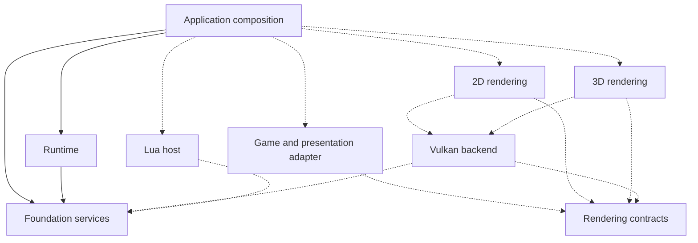

# Engine foundation design

Establish a reusable Haskell engine with Vulkan rendering and Lua scripting,
using small runnable consumers to verify boundaries. This document combines
the initial architecture diagram with a bounded delivery plan.

Design state: `exploring`

Status legend: `[ ]` unprocessed · `[#N]` linked to issue N · `[no-issue]`
reviewed and deliberately not tracked separately · `[deferred]` blocked on a
concrete precondition

## Processing status

- [ ] EPIC. Establish the engine's first reusable rendering foundation
- [ ] FND-1. Establish scoped runtime resource ownership
- [ ] FND-2. Initialize and dispose a Vulkan device in a console probe
- [ ] FND-3. Render and capture a minimal 3D scene through a public contract
- [ ] FND-4. Add an independent 2D consumer over the same GPU infrastructure
- [ ] FND-5. Host Lua and register application-owned bindings

## Epic contract

- **Goal:** independent 2D and 3D consumers use shared engine services without
  a game dependency or an application-wide environment in reusable libraries.
- **Done when:** both consumers render through explicit interfaces, an application
  can register Lua bindings, and resource failure/teardown behavior is verified.
- **Users:** the owner developing Hetoimasia; future applications including a
  potential Synarchy game adapter.
- **Arc label:** proposed `foundation`; no epic or child issues have been filed.

## Current state and evidence

The directory was empty at the start of the 2026-09-10 bootstrap. The authorized
scaffold creates foundation logging, a runtime entry point, a console consumer,
and focused Hspec tests. It has no Vulkan/Lua/windowing code. Planned package
directories are notes only. The owner selected `coghex/hetoimasia` and authorized
the initial `master` commit. The remote was verified empty with zero issues/PRs;
repeat tracker deduplication before drafting future issues.

Bootstrap verification on 2026-09-10: all packages build, four Hspec examples
pass, and the console smoke prints the expected three log entries. All package
metadata checks exit successfully with the confirmed source-repository metadata.

Synarchy demonstrates useful Vulkan/Haskell integration but combines game managers,
rendering state, and coordination in EngineEnv. Its low-level graphics utilities
use that environment through EngineM. This project starts with independently
constructed services and source/package boundaries. See MEMORY.md for context.

## Desired experience

Build the console without a display or GPU SDK. Grow to a small 3D scene, then
an independent 2D scene before the architecture becomes deeply 3D-specific.
An application supplies game logic and Lua bindings. Rendering consumes explicit
presentation data and never queries the game's managers to discover it.

## Design

The proposed dependencies below point from consumer to dependency. Only the
application → runtime/foundation portion is implemented. Dashed arrows and
all rendering/scripting boxes represent planned boundaries.

Each active package has its own source root and declared dependencies. Application
composition knows concrete implementations; lower libraries do not import the
application, adapters, or game types. No complete rendering interface is frozen
by the directory names; define its smallest useful surface with FND-3.

| Owner | State/lifetime | Public relationship |
|---|---|---|
| Application | process composition; game session selection | creates and connects services |
| Logging sink | caller-owned handle or sink resource | borrowed synchronous Logger |
| Runtime | future scoped lifecycle and scheduling | runs supplied application actions |
| Game session | world/rules; game-owned save and load | presentation and explicit commands |
| Vulkan backend | device, GPU allocations, completion and disposal | opaque resources and submission |
| Render target/frame | resize lifetime and per-frame reuse | confined to rendering owners |
| Lua host | one VM owner and registered functions | application-supplied binding interfaces |

A CPU scope ending does not prove GPU work completed. Resource APIs must specify
when submissions are retired before memory is reclaimed. Cross-thread state
must define atomic publication, ownership, and cancellation rather than expose
arbitrary mutable references. Concurrency is introduced for measured needs.

The initial Logger uses an injectable sink and no global state. The runtime
runner logs start and successful completion, returns the action's result, and
propagates exceptions. It owns no resource scope yet. Standard IO is sufficient
for this baseline. A scoped continuation facade is selected for later resource
implementation in [the resource design](resource_ownership_design.md); the
application-wide monad remains undecided. That document also preserves subsystem
boundaries, future GPU lifetimes, and the Synarchy decisions to retain.

## Decisions

### D-1. Build a fresh modular Haskell/Vulkan/Lua engine

Accepted by the owner. Synarchy remains a separate working project and a source
of experience. This bootstrap does not port its game or replace its engine.

### D-2. Support separate 2D and 3D modules over shared infrastructure

Accepted direction. A small 2D consumer arrives early to exercise the same
foundation, with game-specific compatibility implemented in an adapter.

### D-3. Use Kanban's existing interactive issue/PR workflows

Accepted by the owner. Keep required docs/evidence with code in each PR.
Initial scaffolding/publication is directly authorized. Kanban's per-repository
issue-approval and PR-drainer jobs were installed on 2026-09-10 and await an
explicit start. The owner also approved direct publication of the tested
documentation-landing integration as a bootstrap exception.

### D-4. License the project under GNU GPLv3

Requested explicitly by the owner. Cabal records `GPL-3.0-only`; each package
includes the full GNU GPL version 3 license text.

### D-5. Prefer Hspec for testing

Requested explicitly by the owner. Use Hspec for pure and effectful tests,
including resource failure/cancellation and integrations wherever possible.
Python probes are a fallback when Hspec cannot reasonably exercise the boundary.

### D-6. Publish the initial baseline on master

The owner selected the public repository `coghex/hetoimasia`, requested remote
setup and an initial commit, and specified `master`. The owner corrected the
original repository-name typo during setup; local/package names already match.

### D-7. Process the dedicated logging and resource designs

On 2026-09-10 the owner requested readiness of the reviewed
[logging](logging_design.md) and [resource](resource_ownership_design.md) designs.
They provide three LOG slices and four RES slices. The resource design's D-1
records the explicitly approved failure policy; its scoped continuation facade
keeps allocation convenience independent of an application environment.
Logging LOG-3 is the resource implementation gate. FND-1 delegates to the RES
arc; reuse its tracker artifacts rather than create duplicate implementation.
This broader rendering/Lua design remains exploring because Q-3 is still open.

## Proposals

- Use the current console/services scaffold as the first runnable checkpoint.
- Start with explicit IO and narrowly passed services. Introduce a local monad
  only when resource handling or another concrete requirement benefits.
- Keep standard Prelude with Unicode type syntax initially; reconsider a custom
  vocabulary separately from component design.
- Choose the smallest Vulkan/windowing/rendering contract needed for the first
  offscreen scene, then prove reuse with a second consumer.
- Migrate Synarchy via captured scenes and then a bounded live scenario after
  the engine can serve them; full game compatibility is a later design arc.

## Open questions

### Q-1. Workflow service setup

CI and Kanban per-repository service setup remain open. The publication target
is settled in D-6. Recheck tracker overlap before readiness is granted.

### Q-2. Resource scope and continuation model

Resolved for FND-1 by D-7 and the dedicated resource design: a small scoped CPS
facade composes resource lifetimes over the failure-safe primitive. An
application-wide monad remains a separate future choice.

### Q-3. First Vulkan scene and platform baseline

Select the Vulkan feature baseline, device/window library integration, initial
offscreen target, scene, and evidence before FND-2/FND-3 are implementation-ready.
Procedural test geometry is a proposal; imported or generated artwork requires
an explicit source and asset plan. No production art is currently required.

## Verification strategy

- Compile each component against only its declared dependencies.
- Run the console without GPU, window, Lua, or external engine dependencies.
- Use Hspec with injected sinks to test filtering and observable runtime failures.
- With resource scopes, test partial initialization, action exceptions, and
  exactly-once cleanup; document cancellation and ownership explicitly.
- With graphics, use Vulkan validation and offscreen pixels, plus a representative
  workload measuring CPU preparation, uploads, and GPU time separately.
- Keep saves and game-specific determinism outside this foundation. Any later
  Synarchy migration must preserve or explicitly migrate its game contracts.

## Delivery plan

### FND-1. Establish scoped runtime resource ownership

- **Outcome:** a resource-owning service cleans up on success and failure.
- **Scope:** supplied by RES-1 through RES-4 in
  [resource_ownership_design.md](resource_ownership_design.md). Process that
  document first; link/reuse its epic here rather than draft another resource
  implementation. This entry remains unprocessed until its tracker link exists.
- **Phase:** foundation/runtime; **Depends on:** none; **Ordering:** critical path.
- **External implementation gate:** logging LOG-3 merged.
- **Relevant decisions:** D-1, D-3, D-7.
- **Acceptance signals:** initialization/action failures preserve cleanup and
  exceptions; lower services cannot access unrelated application state.
- **Out of scope:** Vulkan, job systems, a global environment.
- **Open questions:** none; Q-2 is resolved by D-7.

### FND-2. Initialize and dispose a Vulkan device in a console probe

- **Outcome:** identify a supported GPU and cleanly release initialized resources.
- **Scope:** backend package, capabilities, initialization, failure/teardown.
- **Phase:** GPU; **Depends on:** FND-1; **Ordering:** critical path.
- **Relevant decisions:** D-1, D-2.
- **Acceptance signals:** bounded console probe, useful failures, validation and
  cleanup evidence; no game, Lua, or application-state dependency.
- **Out of scope:** scene rendering and game migration.
- **Open questions:** Q-3; split further if selected platform work makes this large.

### FND-3. Render and capture a minimal 3D scene through a public contract

- **Outcome:** an independent sample produces a verifiable offscreen 3D image.
- **Scope:** smallest render contract, depth-tested geometry, camera, capture.
- **Phase:** rendering; **Depends on:** FND-2; **Ordering:** critical path.
- **Relevant decisions:** D-1, D-2.
- **Acceptance signals:** correct occlusion and camera changes, captured pixels,
  clean validation; the sample uses public interfaces.
- **Out of scope:** PBR, animation, shadows, general model import.
- **Open questions:** Q-3; revise scope before tracker drafting.

### FND-4. Add an independent 2D consumer over the same GPU infrastructure

- **Outcome:** a second sample draws ordered textured sprites through a 2D module.
- **Scope:** minimal 2D package, shared texture/resource use, ordering and capture.
- **Phase:** reuse; **Depends on:** FND-3; **Ordering:** critical path.
- **Relevant decisions:** D-2.
- **Acceptance signals:** correct sprite overlap and camera behavior, evidence
  that 2D does not require initializing the 3D scene renderer.
- **Out of scope:** complete UI/font stack and Synarchy compatibility.
- **Open questions:** test texture/source choice during slice refinement.

### FND-5. Host Lua and register application-owned bindings

- **Outcome:** a sample registers and invokes its own Lua function.
- **Scope:** VM ownership, registration, error propagation, bounded consumer.
- **Phase:** scripting; **Depends on:** FND-1; **Ordering:** independent.
- **Relevant decisions:** D-1, D-3.
- **Acceptance signals:** script errors are observable, VM teardown is scoped,
  and no concrete game types or namespaces are compiled into the host.
- **Out of scope:** async scripting workers and full gameplay APIs.
- **Open questions:** binding-library/version selection and execution policy.
