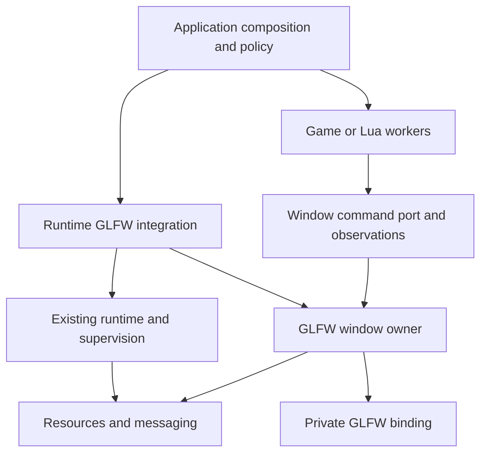
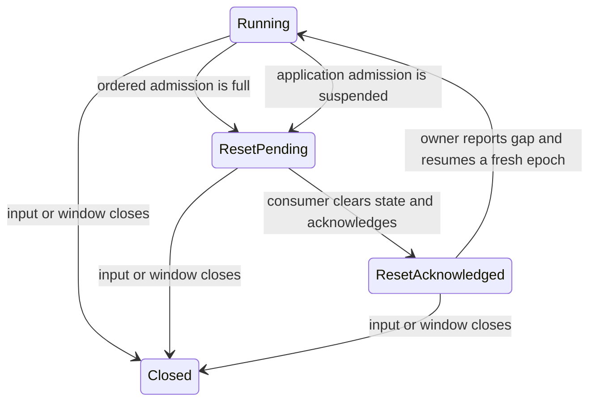

# GLFW integration design

Design a durable, component-owned window system before adding Vulkan. Preserve
Synarchy's useful GLFW interactions while composing with Hetoimasia's resource
scopes, failure evidence, supervision, and messaging.

Design state: `ready for issue processing`

Owner: `coghex/hetoimasia`. Source inspection: 2026-09-13 local session,
Hetoimasia `16cab027436640ff7d0d7a8381a8690ff73ea875`, Synarchy
`fe225c5621b2fc9e86d09d841af2b2efdf10cabf`. This document specifies intended
implementation, not delivered behavior. No windows were launched during design
work.

Owner decisions D-9 through D-16 were recorded on 2026-09-14. Final review on
2026-09-14 incorporated the linking, CI identity and prerequisite clarifications.
The owner authorized readiness after that review; its checks passed. Ownership,
input-reset, pre-drain and delivery contracts are ready for issue processing.
The owner approved the cross-issue amendments on 2026-09-14 after backlog
review. D-17 through D-20 record the refined contracts; the fourteen slices and
their dependency order remain unchanged. Readiness of the design is distinct
from fresh canonical approval of the five amended issue bodies.

Status legend: `[ ]` unprocessed · `[#N]` linked to issue N · `[no-issue]`
reviewed and deliberately not tracked separately · `[deferred]` blocked on a
concrete precondition

## Processing status

- [x] EPIC. Establish scoped GLFW window ownership and runtime integration — [#86]
- [x] GLFW-10. Add an owner-thread scoped resource collection with early release — [#87]
- [x] GLFW-14. Supply the cached native toolchain and reusable Linux CI image — [#88]
- [x] GLFW-1. Establish the native binding and main-thread session boundary — [#89]
- [x] GLFW-2. Own scoped windows and publish coherent observations — [#90]
- [x] GLFW-13. Establish bounded window command admission and completion — [#91]
- [x] GLFW-4. Quiesce application services before supervised worker drain — [#92]
- [x] GLFW-7. Establish the shared native Hspec fixture and platform gates — [#93]
- [x] GLFW-3. Integrate bounded window commands and the supervised event loop — [#94]
- [x] GLFW-9. Support independent dynamic window lifetimes — [#95]
- [x] GLFW-5. Implement ordinary window manipulation with honest outcomes — [#96]
- [x] GLFW-11. Publish monitor inventory with disconnect-safe identities — [#97]
- [x] GLFW-6. Implement monitor-aware mode transitions and safe fallback — [#98]
- [x] GLFW-8. Implement bounded input feeds and acknowledged resets — [#99]
- [x] GLFW-12. Connect native input callbacks to window feeds — [#100]

The first three slice IDs retain their identity from the initial draft.
Additional IDs follow them numerically, but this ledger follows dependency
order. All eleven owner policy questions are resolved. GLFW-14 owns native
provisioning independently of its distribution mechanism; D-16 selects a public
GHCR image for Linux and a cached local prefix for macOS. The binding stays in
GLFW-1.
Dynamic independent windows are selected by D-10; P-12 and GLFW-10 specify their
resource prerequisite separately from native integration.

## Epic contract

- **Goal:** applications own, observe, and manipulate GLFW windows through
  narrow capabilities while preserving the runtime's failure and lifetime rules.
- **Done when:** the selected window-count and manipulation scope works on the
  selected native platforms; lifecycle and overload behavior have executable
  evidence; accepted operations have defined outcomes; shutdown cannot strand
  workers waiting for the window service; native resources outlive borrowers.
- **Users and operators:** engine consumers, future game/Lua adapters, and the
  owner developing and testing this solo project.
- **Arc label:** proposed `glfw`, color `0B7285`, description: "GLFW bindings,
  window ownership, input capture, and platform integration". Create it during
  approved epic processing, then apply it to this arc's children. Reuse the
  existing component labels named in the delivery plan where ownership crosses
  into resources, runtime, or tests.
- **Delivery:** each implementation PR includes its contracts, tests, build and
  validation declarations, and required native evidence before final review.
  This standalone design uses the docs lane; implementation documentation does not.

## Current state and evidence

### Hetoimasia

The messaging arc (#74–#79, PRs #80–#85) is merged. There is no implemented
GLFW package. Read current production sources from master, not the older
docs-worktree HEAD.

| Existing surface | Consequence for this design |
|---|---|
| `Hetoimasia.Foundation.Resource` | `withResource`, `Scoped`, and composites protect acquisition and retain cleanup failures. Releases run uninterruptibly. Do not put event loops, joins, waits for a consumer, or logging sinks in these releases. |
| `Hetoimasia.Runtime.Application.runScopedApplication` | Constructs dependencies, enters supervision, runs startup and action on its caller, drains workers, then releases dependencies. This preserves main-thread execution, but offers no explicit application quiescence callback before worker drain. |
| `Hetoimasia.Runtime.Supervision` | `checkRuntime` and `awaitSupervised` settle worker outcomes. Arbitrary native blocking calls are not supervised waits. |
| `Messaging.Payload`, `Channel`, and `Snapshot` | Producer-side deep preparation, explicit Full/Closed admission, distinct close/abort, coherent observations, and checked snapshot cursors are already available. |
| `Hetoimasia.Runtime.Inbox` | Owns a background worker's inbox. Its worker execution model does not give it GLFW main-thread authority. Do not put GLFW operations in an inbox handler. |
| `docs/test_architecture_design.md`, epic #49 | TEST-1 (#50) is complete. TEST-2 is linked to GLFW-7/#93 through the separately approved existing-issue disposition; implementation still waits for GLFW-1/GLFW-2 and native evidence. |
| `tools/validation/catalog.json` | Existing mandatory floor, affected non-optional tests, and PR-requested groups remain authoritative. Optional groups stay optional when affected. |

The current workflow has no display provisioning and routes four CPU groups
through two workers. `tools/validation/plan.py` accepts only `runner: cpu`.
GLFW-14 supplies the native build dependency before GLFW-1;
GLFW-7 owns the display runner
classification and execution wiring, with regression tests for the existing
selection, evidence reuse and aggregate behavior.

The earlier `docs/vulkan_backend_design.md` reserves a separate GLFW owner.
Its narrow triangle-era scope is historical context for that rendering milestone,
not a decision against the broader window manipulation now requested. Rendering
work and its proposed GLFW/Vulkan interop remain deferred.

Initial tracker deduplication preceded processing. Epic #86 and all fourteen
children (#87–#100) now exist, as the ledger records. The 2026-09-14 backlog
review verified the completed CI, resource and messaging children and closed
their epics (#8, #22, #73) with owner approval. TEST-1's completed checkbox
under #49 is also synchronized. Keep TEST-2/#93 unchecked until its
implementation and native evidence land; do not file a duplicate fixture.

### Synarchy: preserve these decisions deliberately

All paths below are in Synarchy at the inspected commit, not Hetoimasia.

| Evidence | Keep | Change at the boundary |
|---|---|---|
| `src/Engine/Graphics/Window/GLFW.hs` | NoAPI windows, explicit construction/cleanup, separate logical/framebuffer sizes, hidden and non-focusing test configuration, sampling actual geometry after creation. | One process session must outlive all windows. Remove EngineM, render-capability, Lua-queue, and Vulkan imports from the GLFW owner. |
| `src/Engine/Core/State.hs`: `WindowState`, `applyWindowCreation`, `applyWindowModeTransition` | Applied mode is distinct from requested video configuration. Save live decorated-window geometry before leaving it; preserve it across fullscreen/borderless transitions; redundant requests are inert. Seed restoration geometry even when booting directly into another mode. | Keep this state with its window. Use one mode sum rather than two independent fullscreen/borderless booleans. Model unsupported observations explicitly. |
| `src/Engine/Scripting/Lua/Message/Video.hs` | Process mode changes on the owner thread and republish observed geometry afterward. Preserve usable windowed operation when a monitor/mode is unavailable. | Game settings and Lua registration become consumers. Use selected-monitor geometry rather than assuming the primary monitor begins at (0,0). Validate and observe native errors; IO returning unit is not proof the window manager honored the request. |
| `src/Engine/Input/Callback.hs` | Short callbacks capture typed input; key and text paths are distinct; setup has matching teardown; user-intent delivery is gated separately from window-state synchronization. | No EngineLifecycle dependency. Bound engine-owned buffering, keep scancodes, handle callback failure, and avoid calling game handlers from native callbacks. |
| `src/Engine/Loop.hs`, `src/Engine/Loop/Mode.hs` | The owner thread polls native events and controls frame/loop work. Headless execution has a separate path. | Integrate existing supervised checkpoints and explicit turn budgets. Do not import the game loop into the GLFW package. |
| `test/Spec.hs`, `test/Test/Engine/Graphics/Window/GLFW.hs` | Keep a session alive across compatible native examples. Test production constructors and nondegenerate framebuffer observations. | Preserve real OS-thread affinity during examples as well as setup. Listing and CPU tests must not initialize GLFW. Run selected Linux native tests, not merely compile them. |
| `test-headless/Test/Headless/Graphics/WindowMode.hs` | Pure transition tests cover repeated requests, restoration geometry, and long chains of mode changes. | Extend the model with failure, monitor removal, and platform restrictions. |

This is a behavior and ownership migration, not a wholesale copy. If later PRs
copy isolated code, retain applicable attribution and license notices.

### Binding evidence changes the implementation choice

CI provisioning was also rechecked in Synarchy at the same commit on 2026-09-14.
`.github/ci/Dockerfile` installs GHC/Cabal and system development dependencies;
it does not explicitly build GLFW. `.github/workflows/ci-image.yml` derives a
registry tag from the Dockerfile and image workflow, builds only on a confirmed
miss, validates the toolchain before publishing, and serializes publication per
tag. `.github/workflows/ci.yml` additionally restores the Cabal store and project
build tree. Retain this separation of stable environment and incremental builds.
P-14 avoids the per-run image-builder dependency for ordinary PRs,
covering every image input, and using the resolved image digest as evidence.

The locally cached `GLFW-b-3.3.9.1` source, used by Synarchy's dependency
family, has an additional private callback queue:

- `Graphics/UI/GLFW.hs:380–428`: a process-global pair of unbounded lists holds
  scheduled `IO ()`; `executeScheduled` drains until empty.
- Lines 435–443: even the error callback is scheduled.
- Lines 1347–1363: poll/wait functions invoke that drain after the native call.
- Lines 868–891: window destruction frees callback wrappers stored by the binding.

Therefore an engine channel placed downstream does not bound that earlier
buffer, and callback timing differs from raw GLFW. Do not assume an exception
caught in an engine callback necessarily describes a failure of the immediately
preceding native command.

The cached `bindings-GLFW-3.3.9.3` Cabal file defaults to bundled GLFW, selects
X11/Wayland with build flags, and requires `glfw3 == 3.3.*` in system mode.
The current Cabal index pin does not by itself pin a system C library. This
evidence is about inspected versions, not a claim that every future binding has
the same behavior.

## Desired experience

The application chooses configuration and assembles the runtime, a window host,
and any workers. Workers and future Lua code receive a narrow command port and
read-only observations. They never receive native window pointers.

A settings action requests a size or mode change. Admission and execution have
separate outcomes; the UI can show the requested setting while displaying the
actual observed state. An unsupported request leaves the application usable and
reports a meaningful reason. A programming error retains a precise origin.

Dragging, minimizing, restoring, changing monitor scale, and closing a window
keep the runtime responsive at its next checkpoint. Window close is an event
for application policy: a game may need to save or ask about unsaved work.
A callback never destroys a window or runs that policy.

The engine starts without requiring Vulkan, an OpenGL context, a renderer, Lua,
fonts, game state, custom icons, or other art.

## Scope

### In scope

- Process session, scoped windows, callbacks, opaque identities and endpoint
  lifetimes, typed native failures, and thread enforcement.
- Coherent window/monitor observations; separate units and missing observations.
- Bounded command admission and explicit execution outcomes.
- A small integration with existing supervision and application shutdown.
- The full ordinary window controls and monitor-aware mode changes in D-7.
- Keyboard, Unicode text, mouse button, cursor, scrolling, focus and related
  window events, with explicit input-reset recovery under D-12/P-13.
- Component-owned tests, real native fixtures, and selected platform evidence.
- Multiple independently controlled windows, created during execution and
  closed in any order (D-6/D-10), using P-12's scoped ownership extension.

### Out of scope

Vulkan surfaces, swapchains, vsync and presentation modes, GPU completion,
rendering, game actions/keybindings, Lua registration, game pause policy,
save-format migration, deterministic replay, broadcast subscriptions, a generic
RPC framework, a global scheduler, embedding in an externally initialized GLFW
host, Windows verification, and verified Wayland support in this arc (D-8).

Clipboard, file-drop payloads, joystick/gamepad support, IME composition,
custom cursor images, window icons, native menus, transparency, embedding native
handles, and platform-specific window effects are later extensions. There are
no missing art assets in the proposed scope. Basic text input is not a claim of
complete text-editing/IME support.

## Design proposals

P-N entries elaborate the design; the D-N entries identify owner decisions.
Details not covered by a decision remain proposals. Names illustrate narrow
responsibilities; they are not final Haskell signatures.

### P-1. Keep the native owner separate from runtime policy

Proposed packages:

- `hetoimasia-glfw`, under `packages/glfw/`: owns window types, the minimal
  native adapter, session/window resources, callbacks, observations, and command
  execution. Depends on foundation, not the generic runtime.
- `hetoimasia-runtime-glfw`, under `packages/runtime-glfw/`: composes the GLFW
  owner with RuntimeControl and application lifecycle. Depends on both packages.
  A separate Cabal library component with its own source root is an equivalent
  packaging choice if it enforces the same dependency graph.

No future game or Lua code is imported by either package. Do not introduce a
universal window-backend interface until a second implementation justifies it.



The native owner's capabilities are separate from its cross-thread client
capabilities. Ordinary clients cannot close the session, destroy windows,
replace callback storage, or retarget a handle through record update/coerce.
Do not expose raw foundation send endpoints where admission needs additional
component bookkeeping.

### P-2. Own the native binding boundary

Selected by D-9: a small private Haskell binding to GLFW 3.4's C API, binding
only operations this arc actually uses. Keep GLFW itself upstream; this is not
a fork of its platform implementations. Use the installed headers for constants
and ABI declarations, not hand-copied numeric enums.

GLFW 3.4 provides runtime platform selection. Select X11 explicitly for this
arc and reserve a separately verified Wayland integration for later.
[GLFW initialization and platform selection](https://www.glfw.org/docs/3.4/intro_guide.html#platform)

The owner selected this instead of maintaining a patched GLFW-b dependency.
Unmodified GLFW-b 3.3.9.1 cannot provide the proposed bounded capture path
through its public callback interface. Preserve useful Synarchy behavior above
the binding rather than importing that hidden queue or adding a second callback
owner. The choice does not authorize broad native API coverage beyond this arc.

Record the selected C release/build configuration and source/checksum in native
validation evidence. Preserve the Hackage pin; declare native build inputs,
library discovery, local-package warning policy, and source-distribution inputs.
A native-library replacement is a validation input, not docs-only evidence.

Build only the static GLFW archive, with position-independent code, into a
private prefix with `CMAKE_INSTALL_LIBDIR=lib`. The binding declares
`pkgconfig-depends: glfw3 == 3.4.*`; the preparation helper prepends the prefix's
`lib/pkgconfig` to `PKG_CONFIG_PATH`. Check that pkg-config resolves that exact
prefix and the recorded manifest, not merely a version-compatible system copy.
An absent prefix or a system 3.3 library is a configuration failure. Installing
only the archive avoids a runtime search path for a private GLFW shared library;
OS libraries/frameworks remain normal runtime dependencies.

GLFW-14 derives and records the required native link flags from the generated
`glfw3.pc` using `pkg-config --libs --static glfw3`, checks the selected prefix,
and proves the result with a native link check. GLFW-1 carries the needed flags
into its platform-specific ordinary-link Cabal declarations and asserts agreement
with that manifest. Do not freeze a guessed Linux library list in this design;
changes in generated requirements must be detected, not silently discarded.
Include and verify any thread linkage required by the native toolchain and the
selected GHC threaded build.

For macOS, declare `frameworks: Cocoa, IOKit, CoreFoundation` and verify those
against the pinned build's generated private flags. Do not require fully static
Haskell executables just to link the GLFW archive. Upstream puts platform flags
in `Libs.private`; Cabal 3.16 does query `--libs --static`, but that does not
make every private flag available to an ordinary executable link, and its static
metadata extraction does not retain `-framework` options. Prove a real Haskell
consumer links/runs on both platforms with no GLFW library-path overrides.
[GLFW link requirements](https://github.com/glfw/glfw/blob/3.4/src/CMakeLists.txt),
[Cabal 3.16 pkg-config handling](https://github.com/haskell/cabal/blob/Cabal-v3.16.1.0/Cabal/src/Distribution/Simple/Configure.hs).

Do not assert `-lX11` must occur just because X11 is selected: upstream GLFW 3.4
loads Xlib itself at runtime. The generated link metadata and actual link check
decide archive linkage; provisioning must separately supply the X11 runtime
libraries and development headers. Static GLFW does not remove those runtime
dependencies. [GLFW Xlib loading](https://github.com/glfw/glfw/blob/3.4/src/x11_init.c).

Document CMake and `pkg-config` as developer prerequisites and fail clearly if
either is missing. The macOS preparation instructions name
`brew install cmake pkgconf`; Homebrew's `pkgconf` supplies the `pkg-config`
command. Linux image provisioning supplies both tools too. Installing them
does not select a system GLFW library.
[Homebrew pkgconf](https://formulae.brew.sh/formula/pkgconf).

Selected by D-13: the managed build uses the same tracked
recipe locally and in CI, with a pinned upstream archive URL and SHA-256,
out-of-tree build and private install prefix. Cabal resolves matching headers
and library from that prefix; do not silently fall back to whichever GLFW a
package manager currently supplies. Cache keys cover source checksum, recipe,
target OS/architecture, C compiler identity, selected SDK identity, deployment
target, and effective build options. Record these in the native manifest and
verify them before accepting a cached local prefix. Restored Haskell
build products that link GLFW must also be invalidated when this native identity
changes. A local prefix miss or a dedicated builder's cache miss costs a build;
mismatched artifacts cannot be accepted as evidence of the selected dependency.

P-14 distributes the Linux result inside a prebuilt GHCR image, rather
than rebuilding it on Actions-cache misses. The same pinned source recipe builds
the local Cocoa prefix once per native configuration; a Linux container is not
macOS native evidence. Source-build provenance does not imply per-PR compilation.

Use X11 with Wayland disabled on Linux, and Cocoa on macOS. Disable upstream
examples, test applications and documentation in the dependency build. System
packages may supply CMake and platform development dependencies; they do not
choose the GLFW version. These are supported upstream build options.
[GLFW 3.4 build configuration](https://www.glfw.org/docs/3.4/compile.html)

The package-manager mismatch is real: Ubuntu 24.04's package page lists
3.3.10, while Homebrew's live formula now lists a release newer than 3.4.
Do not use an assumed `ubuntu-latest` package version or an unversioned
`brew install glfw` as the agreed baseline.
[Ubuntu package](https://packages.ubuntu.com/en/noble/libs/libglfw3),
[Homebrew formula](https://formulae.brew.sh/formula/glfw).

Call imports that may invoke Haskell callbacks must use a callback-safe FFI
declaration. Native waiting must allow other Haskell workers to run. Test these
properties with the actual GHC 9.12.2 threaded runtime.
[GHC FFI rules](https://downloads.haskell.org/ghc/9.12.2/docs/users_guide/exts/ffi.html)

A small private C shim is allowed where needed for thread checks or exception-safe
bounded capture; it must not contain game handlers or an unbounded event queue.
If callbacks record native facts without entering Haskell, preparation happens
on the owner thread when those facts become Haskell payloads, before publication.
The P-13 loss protocol includes overflow in that capture layer.

When a native constructor returns a live pointer, register its cleanup before
raising a captured callback/error failure or sampling additional properties.
A checked constructor that throws after receiving the pointer but before its
Assembly part is protected would leak it. Construction and callback-error
reporting must share that protected acquisition boundary.

Do not start a second binding's global callback owner beside this one.

### P-3. One process-main-thread session with explicit authority

The application enters the window integration directly from executable main.
Being a bound worker is insufficient: ownership is the OS thread that entered
the process main function. Check that platform condition at session entry and
check owner-thread use before native mutation. Check callback OS-thread identity
separately from Haskell ThreadId; a foreign callback need not have the same
Haskell thread identity as the loop.

GLFW limits initialization, window lifecycle, and event processing to the main
thread. Callbacks also impose reentrancy restrictions; the native error callback
can run on other threads.
[GLFW thread and callback contract](https://www.glfw.org/docs/3.4/intro_guide.html#thread_safety)

One scoped session owns initialization, callback bookkeeping, windows, and final
termination. Nested/concurrent acquisition fails with typed misuse before
changing native state. Sequential sessions can run after complete successful
teardown. If enforcing exclusivity needs a process-global guard, it stores only
this native library's occupancy/poison state, never engine services or game data.
Its ownership and failure behavior are documented like any other state.

Reset creation hints before every window; set NoAPI explicitly. Hidden test
windows also disable focus and focus-on-show. Session configuration must not
silently change the application's working directory. Partial setup unwinds only
acquired resources, with original failure and cleanup evidence preserved.

The error callback copies needed native data while valid and records bounded
evidence without invoking a sink. Ordinary operations inspect errors on the
same native thread and attach component/operation/window/request identifiers
at the Haskell boundary. Handle initialization errors before polling is possible.
Do not attribute an asynchronous callback error to whichever command happens
to be current when it is eventually observed.

Release-time native errors are checked after the native call returns, without
logging or pumping events in the release. Retain them through the resource
failure contract; a callback fault must not disappear because normal loop
processing has already ended.

### P-4. Make ownership and lifetime inspectable

| State | Owner and mutation thread | Readers and lifetime end |
|---|---|---|
| Session and native error/callback storage | Window host; native owner thread, with a thread-safe error capture boundary | Host-only authority. Storage remains valid through final native use. |
| Native window and its callback wrappers | Per-window owner on the main thread | No raw pointer in public messages. Detach/destroy in documented dependency order after borrowers finish. |
| Window identity and phase | Window owner; opaque session identity plus non-reused local identity | Retained client handles become terminal; a later window cannot inherit an old handle's authority. |
| Observed geometry, attributes and input state | Window owner publishes prepared immutable samples | Read-only snapshot clients; final state retained after closure. |
| Command queue and outstanding outcomes | Host command service; admission is STM, execution is main-thread IO | Client ports/tickets carry no native ownership; close resolves pending callers before joins. |
| Saved windowed placement and applied mode | That window's controller | Read-only public view if useful; discarded when that window lifetime ends. |
| Monitor inventory and identity mapping | Session owner, refreshed at safe loop boundaries | Clients hold copied descriptions and opaque IDs, not monitor pointers. IDs expire on disconnect. |

Start with existing Scoped window constructors. A lexical window may report a
close request without immediately ending its resource scope. Destruction follows
the owner's close protocol and the end of all borrowing scopes.

Dynamic create/destroy is selected by D-10. Current Scoped is not a detachable
resource registry: returning a native handle from a completed continuation does
not transfer its release. P-12 introduces a scoped owner for dynamically acquired
members; GLFW-10 implements that mechanism, and GLFW-9 uses it for windows.
Do not retain an ever-growing chain of dead windows or expose release closures.

Future Vulkan interop will borrow a live window through a separate scoped seam.
It must prove surface/GPU dependents have ended before permitting destruction.
This arc offers no unrestricted raw-handle escape as a placeholder.

### P-5. Publish observed state, not a fictional desktop

Represent logical extent, framebuffer pixel extent, content scale, and desktop
placement separately. Validate requested dimensions before C conversion.
Allow a zero framebuffer extent as a nondrawable observation; do not wait inside
a callback for restoration.

Publish one immutable window observation with an identity, monotone revision,
lifecycle phase, and the supported observed attributes. Native getters sampled
together are an engine observation, not an atomic snapshot of the OS. Sample at
a defined owner boundary and reconcile later callbacks; never mix a requested
size into a field claiming to be observed framebuffer size.

Use explicit unavailable/unknown fields where the platform cannot observe a
property. Wayland cannot provide global window positioning and does not expose
iconification state through GLFW as a reliable true/false observation. Focus is
a request the compositor may decline. Capability descriptions can explain known
restrictions; each operation still returns its actual outcome.
[GLFW window operation restrictions](https://www.glfw.org/docs/3.4/group__window.html)

Geometry and cursor observations can coalesce to their latest values. Ordered
input, focus transitions, close intent, and command results are separate
contracts; a snapshot does not preserve their history. Use observation revisions
or epochs where clients need to relate an event to the relevant state.

### P-6. Separate command admission, execution, and observation

Use a component-specific command port over prepared immutable commands (D-11).
Immediate submission reports Full or Closed without waiting. On acceptance it
returns an opaque completion ticket. This is a concrete window-service
protocol, not new generic request/reply machinery in foundation.

An accepted command has one execution disposition: performed/requested from the
window system, rejected with a typed reason, not executed because shutdown won,
or interrupted with effects potentially already applied. It never merely
disappears. A native call completing is not a promise of eventual focus,
placement, or dimensions; observations report what followed.

Completion is persistent and non-consuming. Awaiting it does not run a command
or automatically retry one. A consumer cannot cancel an admitted native effect
merely by dropping or cancelling its ticket wait. Complete queued requests
without executing them when the host closes admission.

Bound outstanding bookkeeping by admitted queue capacity plus active work.
If completion cells require a private map, reserve/remove them atomically with
admission/settlement; complete before removing. Never put IO actions, borrowed
pointers, or mutable completion cells inside a supposedly prepared immutable
message. Do not build an unbounded result queue or session-long request history.

Preserve the submission site and caller-supplied diagnostic context as prepared
request metadata, alongside window/request identity. Native failure origin stays
at the operation that failed; submission context is additional evidence, not a
fabricated native call stack. Crossing a queue must not erase where a request
came from.

Owner-thread callers use a direct checked execution operation or advance the
loop; they cannot synchronously await work only that same loop can execute.
Worker waits compose completion with stop and supervision as appropriate.
Define FIFO execution by committed admission order, not racing producer intent.
Any partial effect is reported without replay; rollback requires a proved safe
operation-specific path.

Workers must not await main-loop command completion during their startup
acknowledgement: startSupervised is then occupying the owner thread, before the
event loop can serve that request. Create required startup windows in owner
setup, or let acknowledged run actions request them once the loop is running.
No public blocking window operation may conceal this dependency.

Prepare ordinary completion data before publication too. Native operation
failures can carry copied typed code/description data; arbitrary caught Haskell
exceptions retain their full context on the runtime failure path, rather than
being lazily serialized into a ticket. An interrupted ticket records uncertainty
and the request identity; it is not a replacement for supervised failure evidence.

A create-window result also hands out the new opaque client capabilities. That
is an explicit, protected handle handoff, like inbox startup, rather than a
claim that NFData can validate mutable endpoint internals. Prepare its ordinary
description/outcome data separately. Publish the handles only after native
construction, resource registration, and initial observations are complete;
clients still acquire no native ownership or destruction authority.

### P-7. Keep callbacks short and preserve native lifetime

Use engine-owned bounded capture with no preceding unbounded binding queue.
A native callback copies fixed payload data, applies the selected preparation
contract, records an observation/event or failure latch, and returns. It does
not call application handlers, log through arbitrary sinks, wait for capacity,
join workers, poll recursively, or destroy native objects.

Callback wrappers are protected resources. No Haskell exception may unwind
through C. Capture synchronous faults with context and rethrow at the next safe
Haskell boundary; cancellation remains cancellation, not an optional feature
failure. The implementation must prove its masking/exception containment at the
foreign trampoline, not merely wrap the eventual message consumer in catch.

Check failure/control latches before normal dispatch. A callback caused during
a setter belongs to the same capture discipline as one caused during polling.
Do not assume callbacks occur only inside pollEvents.

Window-state synchronization remains active during startup and closing.
Gameplay input admission has its own explicit state: initially closed, opened
only after the application is ready, and closed before stopping its consumers.
Focus loss invalidates held-state assumptions; game policy decides how that
affects actions or pausing.

Under D-12, ordered-input overflow starts an explicit reset with a fresh epoch;
P-13 specifies the acknowledgement and resumption protocol. Silent loss, blocking
in a callback, and pretending a current key-state sample can reconstruct lost
text or clicks are rejected. Close intent and fault reporting remain observable
even when ordinary input capacity is exhausted.

### P-8. Integrate the event loop with checkpoints and bounded work

The main thread drives native events and window commands; background jobs use
the existing runtime. The adapter uses checkRuntime at turn entry, after native
event processing, and between bounded dispatch work. It does not fork the main
action or classify worker outcomes itself.

Proposed turn: control/failure check; native event processing; callback/state
reconciliation; bounded command work; bounded application event work; an
application-owned update opportunity; another control check. Service control
must remain reachable under continuously full input and command queues.
Budgets count attempted dispatches, including rejected commands.

GLFW-9 adds fair scheduling when it introduces per-window ports. Preserve FIFO
within each port and one bounded total command budget across the host and all
window ports. A continuously replenished port cannot starve another eligible
port. Document a finite service bound in turns for the finite live-port set,
assuming turns continue and individual dispatches return. Keep scheduler state
bounded by live ports through creation/closure; do not promise cross-port FIFO
or a wall-clock deadline. This is separate from checkpoint reachability.

A dispatch-count budget cannot bound one handler or a native OS operation.
Applications keep long work in workers and do not wait for worker completion
while withholding the owner operations that worker needs.

Initially use pollEvents for active work and a finite, configured
waitEventsTimeout while idle. The finite wait allows checkpoints even without
native input. It is not a hard shutdown deadline. Do not use indefinite native
waits without a proved wake protocol. Handle an empty window set without a
busy loop. A future postEmptyEvent optimization needs a live-session lease and
a proven termination race; raw wake calls from arbitrary retained ports are
not part of the first proposal.

### P-9. Quiesce before worker drain; dispose after it

This is the concrete additional runtime seam suggested by GLFW.

Existing runScopedApplication drains its worker group before releasing
dependencies. Closing a window command port only in the dependency release is
too late if a worker is awaiting a reply from an event loop that has returned.

Construct the window host as a Scoped application dependency, before entering
supervision. The host includes its owned session/windows and command bookkeeping;
it is not a service returned by the startup callback. The dependency-local hook
therefore has the host even when startup fails, and the existing outer dependency
scope keeps native resources alive until supervision has drained. Dependency
construction failure uses ordinary scoped rollback before any workers exist.
Workers receive only the relevant client capabilities from that already-owned
host; startup does not transfer native ownership to a worker.

Add an opt-in, narrow pre-drain action to application composition. Preserve the
existing runner and its behavior for callers that do not need it. The action
runs on every exit from the supervised application region: startup failure,
startup checkpoint failure, action return/failure/cancellation, and final
checkpoint failure. Installing it only inside the action misses startup exits.

The pre-drain action closes command/input admission and resolves pending outcomes.
Input feeds become terminal, while window lifecycle observations remain publishable
through disposal so they can record its actual result. It runs before withSupervision
starts its boundary drain. It does not destroy windows, wait for workers, execute
queued commands, pump native events, flush logs, or invoke game callbacks.

Concrete API proposal: an additive runScopedApplicationWithQuiescence takes the
same arguments as runScopedApplication plus a dependency-local
`dependencies → STM ()` quiescence action. The original runner delegates with
a no-op action. Install the inner resource guard immediately upon entry to the
supervised application region, before its first checkpoint. It is not installed
if dependency construction fails before any worker group exists.

The action's contract is finite, non-retrying component bookkeeping. STM keeps
native IO and sink callbacks out of this phase; neither the signature nor the
runtime can make arbitrary user-provided STM non-retrying. Treat retrying or
faulting shutdown bookkeeping as an implementation defect, not a supported
application waiting strategy. Combine all host port closures in one transaction
where practical, and exercise the real GLFW hook under full-capacity conditions.

Use the existing failure-preserving resource boundary around the whole
startup/action/checkpoint region inside supervision. Its release discipline
means this hook must be finite and non-retrying; GLFW's implementation should be
pure component bookkeeping in STM, with immutable data prepared beforehand.
Do not alter the semantics of all Scoped releases.

This is a boundary-ordering guarantee, matching the revised #92. Settling a
fatal worker outcome may request stops before a checkpoint propagates and the
guard runs. Abandoned or cancelled managed startup drains that individual
worker before propagating to this guard. Preserve both contracts; quiescence
does not precede or unblock those earlier drains.

Ordinary boundary shutdown order:

```text
reject new work and settle pending callers
    -> existing supervision requests stop and drains workers
    -> release any window borrowers/dependents
    -> detach callbacks and destroy owned windows
    -> terminate GLFW and release callback storage
    -> existing terminal reporting / logging lifetime completes
```

Worker startup and cleanup, including rollback and finalizers, cannot require
completion of a main-thread command: the owner may already be synchronously
starting or draining that worker. This restriction also applies before
quiescence. Such an ownership dependency must be redesigned before implementation. Retain
the existing protected wait if a worker cannot stop; do not detach it and
destroy its borrowed resources. Native driver/OS calls have their own latency;
there is no new hard-deadline promise.

The same principle applies to an individually closing window under D-10:
stop that window's admission before waiting for its dependents.
Public send/read operations on retained closed handles access terminal Haskell
state and never a freed pointer.

### P-10. Preserve mode restoration and make fallback explicit

Use a single requested mode value: Windowed, Borderless on a selected monitor,
or Fullscreen with monitor/video-mode preference. Keep requested, last native
application outcome, and observed state distinct. A successful request may need
later observation; do not invent synchronous window-manager acknowledgement.

Seed saved windowed geometry from the actual decorated window before a startup
mode transition. Cache it when leaving a successfully observed windowed state;
do not overwrite it on return or on fullscreen-to-borderless changes. Repeated
requests must not restore stale geometry over a window the user just moved.

Retain monitor positions, work areas, current modes, and scale as separate
information. Re-resolve the selected opaque monitor identity immediately before
use; a disconnect invalidates the native handle. Copied monitor information can
remain useful after invalidation.
[GLFW monitor lifetime](https://www.glfw.org/docs/3.4/monitor_guide.html)

Borderless desktop windows and GLFW fullscreen are different operations.
Use the selected monitor's location where supported. On a platform that cannot
place such a desktop window, return unsupported or take an explicitly allowed
fallback; do not silently rename fullscreen as borderless.

Validate size limits and aspect constraints together before mutation. For a
multi-step mode change, record which native steps happened, inspect failures,
and reconcile observed state before deciding whether restoration/fallback is
safe. A failed transition must not update the cache as if the target succeeded.

The session owns at most one fullscreen claimant per monitor connection
identity. Reserve the destination before transition mutation and return typed
MonitorBusy for another window without native effects. Keep the claim while
iconified. Release it after confirmed departure from fullscreen, successful
disposal, or disconnect; uncertain native effects keep the claim unavailable
until reconciliation proves release safe. Switching monitors reserves the
destination before mutation and releases the source after confirmed departure.
Different monitors remain independently claimable; borderless desktop windows
claim no video mode. Bookkeeping is bounded by current monitors/active
transitions. This is session state, not a generic foundation locking service.

GLFW-6 defines ordinary-command eligibility after its mode transitions exist:

| Applied mode | Ordinary controls |
|---|---|
| Windowed | Preserve GLFW-5's controls and validation. |
| Borderless | Reject ordinary size, position, constraints, and maximize that break controller-owned placement. Title, visibility, focus/attention, minimize and restoration from minimize remain eligible where supported. |
| Fullscreen | Reject ordinary size, position, constraints, show/hide, and maximize. Title, focus/attention, minimize and restore remain eligible where supported and consistent with the monitor claim. |

During a transition ordinary manipulation remains rejected. Ineligible commands
receive typed mode-specific rejection before native mutation. Geometry and
video-mode changes in borderless/fullscreen go through the mode controller;
an ordinary resize cannot silently change the fullscreen video mode.

Preserve known windowed constraints separately. Only windowed ordinary commands
change them; mode transitions may suspend native limits/aspect constraints for
their own geometry, then reapply the preserved set on return. Validate the
geometry and constraints together before mutation. A partial application keeps
GLFW-5's indeterminate-state rule; never claim successful restoration or silent
constraint relaxation. If no reachable compatible fallback placement exists,
report finite recovery exhaustion honestly and preserve the saved placement.

Validate every native numeric conversion, including positions and video-mode
preferences; negative desktop coordinates are valid where supported. Window
titles are copied UTF-8 text without embedded NUL. A rejected configuration
must not reach a C setter with truncated text or an overflowed integer.

Recommend configurable finite fallback to usable Windowed operation when a
monitor disappears or the requested mode is unavailable. Optional rejected
requests remain local outcomes; a required startup mode follows the existing
required-service policy. Retry only a known safe operation under the existing
bounded recovery contract; cleanup failure stops automatic recovery.

Minimize/maximize, temporary focus loss, and zero framebuffer size are ordinary
observations, not automatic engine failures. The application chooses pause and
rendering policy.

### P-11. Let the application decide close behavior

A native close request latches intent independently of the ordinary event queue.
It never directly exits the process or destroys a window. Give the request an
identity so rejecting an earlier close cannot erase a newer request.

The application can reject that request (for example after cancelling a save
dialog), or begin its owned close protocol. Once actual closing begins, reject
ordinary mutation requests and settle queued callers. The actual destruction
point follows the borrow/lifetime contract.

Closing the last window does not implicitly kill all runtime jobs. The
application chooses whether this ends the process; a convenience default can
be supplied explicitly. OS-forced process termination is outside this protocol.

### P-12. Add a scoped collection for independent native lifetimes

This is a small foundation resource mechanism, implemented without GLFW imports
in a resource-owned module. It reuses the existing composite assembly and
cleanup-evidence implementation internally; it does not expose Scoped's
constructor, a release action, or a detached continuation. The native window
package remains responsible for window behavior and native thread checks.

The collection itself is allocated under Scoped and owns all live members until
they retire or that scope ends. Its lifetime cannot escape that scope. It has a
validated positive live-member limit, a fresh identity, one owning Haskell
thread, a monotone member identity counter, and a private live-member ledger.
Member operations from a different thread fail before acquisition or release.
GLFW additionally enforces its OS-main-thread requirement.

Reject mutation/access reentry into the same collection while it is acquiring,
retiring, or closing, before further effects. A user-supplied Assembly or release
can otherwise reenter on the owner thread, defeat a pre-acquisition capacity
check, or mutate the final drain's ledger. Ordinary scoped borrowing is a
separate state: its callback may borrow other live independent members, with
the per-member in-use rule below protecting retirement.

Proposed operations are construction, acquisition from an Assembly, scoped
access to a member's value, and early retirement. A member token is opaque and
nominal; it is an identity/access capability, not an exported resource value or
mutable record. The collection owns release metadata. A retained retired token
can report terminal state without retaining the entire collection or keeping
the native resource alive.

Acquisition rules:

1. Validate identity, owner thread, open phase, capacity, and all metadata before
   effects. Choose the member identity before acquiring native objects.
2. Run the supplied Assembly under the existing staged-acquisition protection.
   If construction fails, roll back its acquired parts and preserve its primary
   failure and ordered cleanup evidence. Do not register a partial member.
   Cleanup failure during rollback poisons the collection just as retirement
   failure does; a clean construction failure alone does not.
3. Transfer the successfully assembled authoritative release into the collection
   while still masked, with no interruptible gap before registration. This is
   an internal ownership operation; it is not implemented by returning a handle
   from withScoped/withComposite after their cleanup has run.
4. Publish the member token only after registration. A failing acquisition does
   not consume live capacity or publish a window/command success.

Access and retirement rules:

- Scoped access checks identity and liveness, records a temporary borrow, runs
  the owner-thread action with the caller's masking state, and drops that borrow
  on every exit. Values borrowed by the callback must not escape it, following
  the existing Resource borrowing contract. No claim of linear typing is made.
- Retirement while that member is borrowed returns a typed in-use outcome;
  it never waits reentrantly for its own callback to finish. The caller can
  schedule closure after the borrowing scope returns. Ordinary GLFW callbacks
  cannot acquire, borrow, or retire collection members.
- Early retirement claims the release exactly once, makes access terminal, and
  attempts all composite parts in their declared order using existing evidence
  handling. A repeated retirement of a successfully retired member is inert.
  A failed retirement retains a distinct failed terminal state: repeated attempts
  report the stored failure without calling its release again. Tokens
  from another collection are typed misuse, never pointer/ID reinterpretation.
- Successful retirement removes its ledger entry and owned payload. Bookkeeping
  retained by the owner is proportional to live members, not historical opens.
  Client-retained terminal tokens/tickets remain the client's memory responsibility.
- Any release failure poisons further collection acquisition. Retain it as a
  latched failure so catching an early retirement exception cannot make final
  collection exit report success. Do not retry the already attempted release.
  Attempt the remaining independent members at final exit and preserve all
  evidence alongside the body's original failure, following Resource's matrix.
- With a successful body, the first latched collection failure becomes primary
  at final exit. With a failing/cancelled body, that body's original exception
  remains primary and prior collection/cleanup evidence is retained alongside it.
  Preserve exception types, contexts, and cleanup identities; do not replace
  them with a textual collection exception or manufacture duplicate attempts.
- Final exit closes admission and releases remaining members in reverse
  registration order. Composite ranks govern order within each member. Members
  must be independent; shared dependencies belong outside the collection's scope,
  and a dependency between members requires a composite or another explicit owner.

The native window constructor supplies one Assembly for its pointer, callback
storage, and other native parts, used by both lexical and collection-backed
construction. Do not implement separate acquisition/cleanup paths for them.
Release actions remain bounded and non-retrying; joins and event pumping happen
earlier in the window close protocol. Where a native release failure leaves
callback reachability uncertain, retain storage rather than freeing it beneath
native code, poison the session, and propagate the failure. A release-order rank
alone does not prove that freeing a dependency after a failed destructor is safe.

The GLFW host exposes create/close through its main-thread command protocol.
Every window gets its own ports, observation/input state, mode restoration cache,
and terminal identity. Closing one settles its queued callers and stops its
admission without stopping the session or another window. A separate host-wide
shutdown closes all ports before the application worker group drains.

Keep a bounded owner inventory of live window identities. Dropping a creation
ticket does not destroy or relinquish the resulting window; the host still owns
it, can enumerate it, and will dispose it. Per-window client ports do not gain
the host's creation authority merely because the host supports creation.

Distinguish Live, Closing, successful disposal, and failed disposal in lifecycle
observations. Terminal client admission alone is not evidence of native
destruction. Publish the final known disposal outcome before closing the window
snapshot, using bounded engine-owned data; retained readers can inspect it.
No release evaluates arbitrary client payloads or formats/logs exceptions to
construct that final state. Full exception evidence stays on the failure path.

This primitive counts CPU borrowing scopes, not GPU work. No current cross-thread
window client borrows the native pointer. Future surface/render ownership must
explicitly extend the window's lifetime through surface disposal and GPU
completion before early retirement is allowed; this arc does not prebuild that
interop or claim the borrow counter solves it.

### P-13. Recover overflow through an acknowledged input reset

Each window has one ordered input feed and one logical consumer. The application
may route its consumed events onward, but the feed is not broadcast. Copying a
Haskell handle does not create another independently acknowledged reader.
Concurrent handlers over that one feed require application coordination; the
reset protocol assumes the logical consumer completes its current handler before
acknowledging a reset. No callback invokes that handler.

An opaque InputReader exposes reads/waits and reset acknowledgement. Keep its
underlying channel endpoints private so reads cannot bypass reset/terminal
precedence or keep consuming a retired generation. Each delivered ordinary
event carries the window identity and a non-wrapping input epoch. The reset token
is opaque, bound to that window/feed and epoch, and cannot be forged or retargeted
by record update or coerce.

Model input phase separately from whether application input is enabled and the
window currently has focus:



The normal ordered path uses a bounded foundation Channel. A producer prepares
the immutable event in IO before admission; no payload evaluation, native call,
logger, or consumer handler runs in STM. Independent windows have independent
overflow episodes and capacity. Any additional native capture buffer must also
be bounded and feed the same reset protocol; bounding only the final channel
does not satisfy this design.

Application admission is reusable after initial readiness. Temporarily disabling
it after it has been enabled atomically closes ordinary admission and begins
the same acknowledged reset: abort the backlog with honest discard accounting,
clear the producer's held-state baseline, reserve a fresh epoch, and notify the
consumer with reason AdmissionSuspended. Initial pre-readiness disablement does
not need a reset. The consumer finishes/abandons in-flight handlers and clears
held/gesture state before acknowledging. Re-enable only opens the application
gate; it does not bypass acknowledgement, owner resumption, focus, or closure.
Repeated toggles during a pending/acknowledged episode neither replace its token
nor advance its epoch, and cannot erase an existing overflow warning obligation.
Intentional suspension alone schedules no overflow warning and needs no warning
attempt before resumption. Terminal closure remains immediate without an ack.

On detecting the first overflow of a running generation:

1. Atomically abort the old channel, record its discarded count from the depth
   counter, reserve the next epoch, clear the adapter's interpreted held-state
   baseline, and install a ResetPending token outside the channel. Record the
   overflowing unadmitted event separately from accepted-but-discarded backlog.
   Foundation telemetry retains its original meanings.
2. Suppress further ordinary input until resumption. Keep cumulative suppression
   counters, not a list of suppressed events. Repeated callbacks during this
   episode do not allocate channels, advance epochs, replace the reset token,
   or generate additional warnings. Window observations and independent control
   latches continue to update.
3. The next input read/wait observes ResetRequired before any ordinary input.
   The token remains observable until acknowledged; reading it does not consume
   or acknowledge it. A consumer stalled or cancelled before acknowledging
   cannot accidentally reopen admission.

If a private native capture buffer overflows while a native call is in progress,
its loss latch must survive that buffer being full. At the next safe owner
boundary, handle it before publishing any more captured input: discard the
ambiguous captured batch and start the same reset, including any queued engine
backlog. Do not replay an earlier captured prefix and pretend the gap happened
after it. This makes no guarantee that Haskell consumers are interrupted inside
a native OS call. Native dropped-count saturation, if used, must be explicit;
do not report an approximate native loss count as exact foundation telemetry.

The consumer finishes or abandons its current handler, clears its own held keys,
buttons and derived drag/gesture state, then acknowledges that exact token.
No external effect already performed by an old event is undone or retried by
the transport. Events dequeued before the reset's transaction are in-flight;
their processing is the consumer's responsibility. Epoch tagging also allows
application adapters to discard stale work that they previously staged elsewhere.

Acknowledgement is a non-retrying STM control operation independent of command
queue capacity. It marks ResetAcknowledged; it does not allocate a channel, run
a handler, or claim that input is already resumed. Duplicate acknowledgement of
the same completed reset is inert. A stale same-feed token cannot acknowledge a
newer reset; return a Stale result. A token from another feed is typed misuse
checked before readiness or terminal state. Closing the feed wins over a valid
acknowledgement and returns Closed without reopening anything.

After acknowledgement, ordinary input reads/waits see no input until the owner
resumes; they do not repeatedly demand the same reset. The owner loop needs no
acknowledgement to process close, supervision, other windows, or ordinary window
commands. If the consumer never acknowledges, the affected feed remains paused
with bounded state. There is no timeout that silently resumes ambiguous input.

At a safe owner boundary, claim and attempt one structured Warning for an
overflow episode using the injected logger outside callbacks, STM, and resource
release. Retain the claim separately from the current queue so neither a quick
acknowledgement nor further callbacks can lose it. Resumption requires the
consumer acknowledgement and completion of any required overflow-warning
attempt; intentional admission suspension has no such diagnostic obligation. A failed
diagnostic follows the existing logging/runtime failure policy; do not keep
retrying a sink. Cancellation or terminal shutdown can prevent a pending attempt;
retain the episode/counters in final observations rather than promise a log that
was never written. Do not warn for every suppressed input event.

To resume, the owner allocates one fresh channel in IO and atomically installs
it only if the same reset remains acknowledged, the feed/window/host are live,
and application/focus admission permits input. That transaction marks the new
epoch Running. A changed condition leaves the candidate unpublished; closure
never loses a race to resumption. The old aborted channel is released from the
feed's state. Final snapshots retain a bounded last-reset summary and cumulative
counts, not an unbounded history of epochs or channels.

The new epoch starts with no interpreted held keys or buttons. A physical key
that remained held must not become a fresh press through polling or a repeat
callback: only a newly admitted press establishes held state in that epoch.
Suppress repeats without such a press; a release cannot invent a matching press.
Use the bounded native key/button domain for held-state bookkeeping, not an
unbounded map indexed by arbitrary scancodes. Preserve scancodes in delivered
events for application interpretation. Unknown keys do not gain invented state.

Focus transitions keep their native ordering in the ordinary event feed when
capacity permits. Focus loss clears held interpretation at its defined consumer
boundary; native synthetic release callbacks must not synthesize new presses.
If a focus transition cannot be admitted, use the same explicit reset. The
separate focus observation/admission gate stays current while reset is pending.
Latest cursor position, geometry and scale may still coalesce, but scroll, text,
button/key transitions and focus history must not be silently coalesced.

Preserve Synarchy's event-time click coordinates: a button event includes the
cursor position and modifiers captured for that event, rather than consulting
the latest cursor snapshot when the consumer eventually handles it. An audited
owner-thread getter may obtain those coordinates outside STM at capture time.
Keep both scroll axes, physical key/scancode information, and Unicode character
events distinct; a key callback is not a text-input decoder.

Feed closure terminates reads and freezes final state even during a reset.
The consumer clears held interpretation on closure too; closure does not need
to deliver an obsolete ResetRequired first. Quiescence closes feeds without
waiting for acknowledgements or running reset handlers. This is input recovery,
not automatic retry of a game command or worker restart.

### P-14. Reuse a published Linux build environment and separate build caches

The owner wants stable dependencies kept out of the ordinary CI critical path,
as in Synarchy. D-16 selects one public GHCR image
containing the pinned GHC/Cabal toolchain, C build prerequisites, and compiled
GLFW 3.4. Keep project source, project build output and captures out of it.
GLFW-7 later adds the display packages it actually needs to the image recipe
and owns starting/stopping Xvfb and the window manager. Do not preload a future
Vulkan SDK, renderer, asset pipeline or unused native stack.

Use three distinct reuse layers:

| Layer | Reused content | Invalidation boundary |
|---|---|---|
| Published Linux image | Toolchain, system prerequisites and compiled GLFW | Native/toolchain pins, base image, build recipe and all consumed helper/configuration files; never ordinary engine source or PR number. |
| Cabal store | Compiled external Haskell packages | Image/platform/toolchain identity and dependency configuration; compatible restores may let Cabal reuse individual packages. |
| Project build tree | Incremental local-package compilation | Same environment boundary plus source/build inputs; Cabal must re-evaluate changed inputs. |

Retain the current Hackage index pin. Maintain a default-branch dependency cache
that PRs can actually restore; a cache created only for one PR is not a shared
seed for every other PR. Populate that seed when dependencies change, without
forcing a clean project rebuild for every source change. Record cache scope and
hit/miss results so a successful but cold pipeline is visible.
Master pushes start the workflow, but its reuse step can skip every build worker;
that alone does not prove the default-branch store was populated. GLFW-14 must
seed a missing dependency cache on dependency changes even when test evidence
is reusable, without forcing those tests to execute again.
[GitHub cache scope and eviction](https://docs.github.com/en/actions/reference/workflows-and-actions/dependency-caching)

Normal PRs read a tracked image descriptor and pull its exact digest; they do
not run apt, reinstall GHC or invoke the GLFW source builder. The lightweight
planner can read that descriptor without pulling the image. Documentation-only
updates and fully reusable test plans must retain their no-build fast path.
Start eligible workers in parallel; no image-publication lock belongs on a
normal cache-hit path. Hosted runners may still need to download image layers.

The descriptor contains the registry reference and digest, complete recipe-input
fingerprint, native-manifest hash, target platform/architecture, and GHC/Cabal
versions. Keep its generated output out of the recipe fingerprint and image
build context: committing the returned digest must not change the inputs whose
fingerprint it records. Keep source/version pins in the separate recipe inputs.

The dedicated builder accepts a candidate revision through dispatch or a
same-repository image-input PR trigger. It does not require an existing valid
descriptor; that is how the first image and later upgrades are bootstrapped.
It computes the fingerprint and looks for its published tag. On a confirmed
miss, serialize publication for that fingerprint, recheck, build, validate,
and publish once. A hit returns the existing validated digest. Registry errors
are not misses and cannot authorize overwriting a tag. Embed the fingerprint
and native-manifest hash in the image metadata, and report those plus the digest
as a descriptor artifact and job output. Ordinary source PRs do not start this
builder.

The author commits that returned descriptor in the same implementation PR,
using the ordinary branch push that starts its verifying workflow. No bot
commit or recursive workflow trigger is required. Before execution, the normal
workflow checks the descriptor against the recomputed recipe fingerprint,
workflow GHC/Cabal pins, and metadata of the image addressed by its exact digest.
Verify the actual compiler versions and native manifest inside execution workers
as well. A stale/mismatched descriptor fails with the builder/update instruction;
it does not select an older image. Checks then run in the candidate environment
before merge. Reuse can retain evidence for that same verified immutable image;
a docs-only reuse does not require pulling it again.

Publication alone is not validation, and building the new environment for the
first time after merge is insufficient. Input hashes alone cannot promise
byte-identical rebuilds when upstream system-package repositories change.
[GitHub Container registry digest references](https://docs.github.com/en/packages/working-with-a-github-packages-registry/working-with-the-container-registry)

Pin the base image and GLFW source; retain a resolved package/toolchain manifest.
Fingerprint every recipe input, including copied scripts and pin files, rather
than copying Synarchy's two-file hash into a larger build context. Preserve
published digests referenced by active work and validation evidence. Missing
images and registry errors are explicit setup failures, not reasons to use a
different environment or secretly rebuild during an ordinary PR run. The
dedicated builder is the recovery path. Publication permissions belong there;
ordinary test workers only pull. A candidate that cannot be published needs to
be validated in that candidate locally or staged by an authorized publisher;
checks in an older fallback image do not validate the changed environment.

Make the image package public and verify an anonymous pull by digest as part of
GLFW-14's initial setup. A public repository does not automatically make its new
GHCR package public. Ordinary `container:` workers need no registry credentials
or `packages: read` grant for that public pull. Only the dedicated publisher has
`packages: write`, authenticating with its scoped workflow token; it does not
grant ordinary tests publication rights. Package visibility and repository
association are completion criteria, not a post-merge manual follow-up.
[GHCR visibility and authentication](https://docs.github.com/en/packages/working-with-a-github-packages-registry/working-with-the-container-registry).

Add `ci-image` (digest) and `native-manifest` (hash) to the existing toolchain
name-to-version map in the plan and receipts. Keep `ghc` and `cabal`; the planner
fails before execution if the descriptor's versions disagree with the workflow
pins. Use that same map in receipt compatibility and cache environment keys,
rather than adding another compatibility field. All Linux execution workers
reporting `ci-image` must actually run that image; the lightweight planner and
aggregate remain outside it. Expect prior receipts lacking the new identity
to invalidate once. Local Cocoa runs record their actual native manifest and
compiler identities without claiming the Linux image digest.

The planner, although outside the image, explicitly declares `ci-image` and
`native-manifest` from the checked descriptor: its map describes the planned
worker environment, not the planner host. Each worker reads the same descriptor
and declares the identical map after verifying its execution environment. Bind
the job's `container.image` reference to that descriptor's exact digest; the
container runtime's digest-addressed launch establishes which image runs, and
the worker checks its embedded recipe fingerprint, actual native manifest and
compiler versions. A locally launched Linux container must enforce that same
digest at launch. Merely echoing a descriptor-derived environment variable is
not verification of the executing image. No image must embed its own final
digest, which would introduce another self-reference. Planner and worker maps
must compare equal in their entirety, including these new entries.

Pin `CABAL_DIR=/opt/hetoimasia/cabal` and an explicit
`store-dir: /opt/hetoimasia/cabal/store` inside the image. Install GHC/Cabal at
fixed absolute toolchain paths on PATH. Image provisioning, runtime jobs and
cache restore/save steps must use those same writable locations, independent of
the hosted runner's or container step's HOME. Assert the resolved store path in
the environment check; do not copy a cache recipe targeting a different home.
These container locations do not change the developer's macOS home/configuration.

Reject old local link products across native ABI/configuration changes, including broad cache
fallbacks that would cross that environment boundary. The Linux image and Cocoa
local prefix have distinct identities. These are cache correctness rules, not
permission to reuse test passes merely because compiled objects are available.

GLFW-14 owns this bounded infrastructure prerequisite; GLFW-1 owns the Haskell
binding. Its PR must show a cold environment build, a second ordinary source
change that does not rebuild/install native dependencies, correct invalidation,
and preservation of the docs-only path. Capture image-pull, cache restore/save,
build and test durations separately. No speedup or zero-setup-time claim follows
without measurements; cache transfer can cost more than the work it avoids.

## Decisions

### D-1. Infrastructure before Vulkan

The owner wants methodical runtime and GLFW development before rendering.
A triangle is not this arc's completion criterion.

### D-2. Preserve Synarchy's useful behavior and modular boundaries

Inspect and retain its valuable GLFW flow and window-state decisions.
GLFW and Vulkan are separate components. Keep game policy and Lua registration
outside them; do not recreate EngineEnv.

### D-3. Verify macOS locally and Linux remotely

Both platforms are in the baseline. Remote CI runs Linux only; macOS evidence
is local. Hspec is preferred, with Python probes only where Hspec cannot
reasonably exercise the boundary. D-8 selects X11 for this arc.

### D-4. Preserve the accepted runtime failure policy

Recover within an explicit finite safe policy. Optional inability can warn and
leave a feature unavailable; unrecoverable required services stop cleanly.
Cancellation stays cancellation, failures retain origin/context, and cleanup
failures preclude automatic recovery without an explicitly safe path.

### D-5. Reuse the completed messaging contracts

Publication uses deeply prepared immutable payloads. Immediate Full is distinct
from an explicitly chosen wait. Close and abort remain distinct. Snapshots
provide coherent latest values and do not replace ordered event history.

### D-6. Deliver multiple independently controlled windows

The owner selected multiple windows in this arc. Do not hard-code a primary
window into public commands, observations, input routing, or lifetime state.
D-10 additionally selects dynamic creation and independently ended lifetimes.

### D-7. Include the full window-management scope

The owner selected title, logical size/position and constraints, visibility,
focus requests, minimize/maximize/restore, and windowed/borderless/fullscreen
transitions with monitor selection. Platform constraints still produce honest
outcomes; this does not require emulating capabilities GLFW cannot provide.

### D-8. Verify X11 first; gate Wayland until a later arc

Remote native Linux tests explicitly select X11. Local Cocoa verification is
unchanged. Do not claim Wayland support from an XWayland run or a library compiled
with Wayland enabled. Requesting the gated backend must produce a clear
unsupported-backend result before creating windows; do not select it silently.
Keep unavailable observations and capability-aware commands so later Wayland
support can be added without fictional positions or iconification state.

### D-9. Own a small private Haskell binding to upstream GLFW 3.4

The owner selected a private binding, with Hetoimasia controlling callback
buffering and lifetime directly. GLFW's native implementation stays upstream.
Bind only used operations, keep native types private, and declare the C library
version/build inputs. Do not maintain a patched GLFW-b dependency for this arc.

### D-10. Deliver dynamic independent window lifetimes now

Applications can create windows during execution and close them independently
in any order. This arc includes the explicit scoped collection needed to own
those resources; lexical startup-only windows do not fulfill the requirement.
Preserve Scoped's existing borrowing semantics and failure guarantees.

### D-11. Adopt command completion and application-owned shutdown

Accepted commands return persistent completion tickets. Applications decide
whether to accept native close requests. A small runtime lifecycle hook closes
admission and settles pending commands before supervised worker drain, while
native windows remain alive until their borrowers have finished. The owner
accepted P-6/P-9/P-11's behavior; their detailed APIs and delivery boundaries are
part of this ready design.

### D-12. Recover input overflow with an explicit reset

The owner selected continued window operation with a visible input reset.
Discard the ambiguous backlog, clear interpreted held keys/buttons, notify the
consumer of the gap, and warn once for that episode. Resume through a fresh
input epoch after the consumer resets its derived state. Do not reconstruct or
replay lost text/clicks, and do not fail the window solely because input was full.

### D-13. Use a pinned, cached upstream GLFW source build

The owner accepted the recommended private binding after clarifying its
distinction from GLFW-b. Use a project-managed build of upstream GLFW 3.4 for
the underlying C dependency, shared by local macOS development and Linux CI.
Track the archive URL, SHA-256 and build recipe; keep fetched source, build
products and the private install prefix outside tracked source. The provisioning
prerequisite supplies the helper, documented prerequisites and discovery before
the binding needs them; it does not wait for the native fixture or silently use
an arbitrary system GLFW. GLFW-14 is the provisioning slice regardless of the
distribution mechanism; GLFW-1 consumes its contract. D-16 settles how Linux
receives its result.

P-2 specifies cache and build-input requirements. Preserve the upstream source
and license; our private binding does not reimplement GLFW's platform code or
vendor that code into Cabal. The agreed baseline is 3.4, not a moving latest
release. Subsequent upgrades are explicit dependency changes with validation.

### D-14. GLFW-7 fulfills TEST-2's first concrete shared fixture

The owner selected GLFW-7 as the one implementation of TEST-2 under epic #49.
The native suite uses an executable-main-thread owner/dispatcher and a controlled
Hspec assertion worker, with shared compatible roots and private lifecycle tests.
Q-1 in the test architecture design is settled for GLFW. Neither this fixture
nor this arc creates Vulkan instances/devices or submits GPU work; Vulkan fixture
sharing and actual GPU completion remain requirements of the later Vulkan arc.
There is no dummy GPU wait in a GLFW-only fixture.

The test design records this model in D-7 and resolves Q-1. A separate approved
`process-design-doc` existing-issue disposition linked TEST-2 to GLFW-7/#93 in
the test ledger and epic #49. Do not file a duplicate. TEST-2 remains unchecked
in the epic until implementation and evidence exist. The owner subsequently
approved checking completed TEST-1 as separate backlog housekeeping.
GLFW-1/GLFW-2 remain implementation prerequisites, not unresolved decisions.

### D-15. Require a small native group when affected

The owner selected a non-optional native Hspec group, automatically required
when its inputs change and runnable on request. It is outside the mandatory
floor. Remote execution is isolated Linux X11; local macOS evidence uses Cocoa.
GLFW-7 owns the display setup, catalog/worker/aggregate integration and tests of
that wiring. A failed or unavailable required display blocks the check rather
than passing, retrying until green, or changing the group to optional.

Interactive desktop and lengthy probes remain optional and requested/periodic.
Choose the native group's small stable lifecycle/thread/window assertions so
that desktop variability is kept out of its contract. Preserve existing
unchanged-input evidence reuse and docs-only green behavior.

### D-16. Adopt the public GHCR image and author-committed descriptor

The owner selected the public GHCR image for Linux CI, with a dedicated builder
publishing the candidate and the author committing its verified digest. P-14
defines bootstrap, metadata verification, permissions, identity and fixed paths.
GLFW-14 owns provisioning whichever distribution mechanism is used; the selected
Linux mechanism is the image. macOS retains its local cached native build.

### D-17. Preserve the boundary-only quiescence guarantee

Approved by the owner on 2026-09-14 after backlog review. GLFW-3/#94 follows
the revised GLFW-4/#92 contract: its hook precedes supervision's boundary drain,
while fatal-latch stops and startup-local drains may precede the hook. Worker
startup/cleanup cannot require a main-thread command completion. P-9 and the
two slices' acceptance record these limits without changing worker semantics.

### D-18. Arbitrate fullscreen monitors and mode-specific controls

Approved by the owner on 2026-09-14. GLFW-6/#98 owns the session's one-claimant
fullscreen rule, retained through iconification, and the operation matrix and
windowed-constraint preservation in P-10. Competing windows get MonitorBusy;
uncertain native effects cannot make a monitor falsely available. This refines
the existing mode slice, with no new generic locking abstraction.

### D-19. Reset on temporary application input suspension

Approved by the owner on 2026-09-14. GLFW-8/#99 supports reusable admission
through P-13's acknowledged reset and fresh epoch. Initial unreadiness differs
from temporary suspension; AdmissionSuspended schedules no overflow warning,
and repeated toggles cannot bypass acknowledgement or terminal precedence.
An unchecked reusable Boolean and a one-way-only gate were not selected.

### D-20. Make dynamic command dispatch fair and handoffs explicit

Approved by the owner on 2026-09-14. GLFW-9/#95 preserves FIFO within each
port, fairly services the host and live-window ports under one total turn
budget, and proves progress independently of checkpoint reachability. Creation
prepares ordinary completion data separately from the protected opaque handle
handoff in P-6; NFData does not validate mutable endpoint internals.

## Open questions

### Q-1. How many windows does this arc deliver?

Resolved by D-6: multiple independently controlled windows.

### Q-2. Which manipulation controls are included now?

Resolved by D-7: include the full window-management scope.

### Q-3. Which Linux native platforms must pass?

Resolved by D-8: verify X11 now and gate Wayland until later. Cocoa remains
locally verified.

### Q-4. Accept the private native binding proposal?

Resolved by D-9: use a small private Haskell binding to upstream GLFW 3.4.
No dependency replacement or implementation has been made yet.

### Q-5. Are dynamic, independently ended window lifetimes required now?

Resolved by D-10: support dynamic creation and independent closure now.
P-12 specifies the collection contract; GLFW-10 and GLFW-9 separate the resource
mechanism from native integration.

### Q-6. Accept completion tickets, application-owned close policy, and pre-drain integration?

Resolved by D-11: adopt persistent completion, application-owned close policy,
and pre-drain quiescence. P-9 specifies the proposed additive lifecycle API.

### Q-7. How should ordered input recover after overflow?

Resolved by D-12: recover through an explicit input reset. P-13 defines bounded
notification, acknowledgement, suppression, and resumption ordering.

### Q-8. How is the GLFW 3.4 C library supplied?

Resolved by D-13: one project-managed, checksum-pinned source build with a
reusable local/CI build. GLFW-14 provisions it before GLFW-1, since ordinary
builds need the C dependency before GLFW-7 exists. D-16 selects the Linux image.

### Q-9. Does GLFW-7 fulfill TEST-2?

Resolved by D-14: GLFW-7/#93 fulfills TEST-2. The separately approved adoption
linked the same issue in the related design and epic #49.
Vulkan fixtures and GPU-completion checks belong to the later Vulkan arc.

### Q-10. Is the isolated X11 native group automatically required when affected?

Resolved by D-15: required when affected or explicitly requested, outside the
mandatory floor. GLFW-7 owns Xvfb/window-manager setup and the new native group's
catalog, worker, receipt and aggregate wiring. Desktop/lengthy probes stay optional.

### Q-11. Use a prebuilt GHCR image for ordinary Linux CI?

Resolved by D-16: use the public GHCR image with a dedicated builder and an
author-committed verified descriptor. A prefix-only Actions cache was considered;
the image keeps more stable provisioning work off ordinary PRs. GLFW-14 would
still own provisioning if that distribution choice changes in a later design.

Q-1 through Q-11 are resolved. The owner-authorized final readiness review passed;
there is no remaining design gate on these slices beyond their declared
implementation dependencies. The separate tracker adoption in D-14 is complete.
D-17 through D-20 record the subsequently approved backlog refinements without
new open policy questions; amended issue bodies still require fresh canonical
readiness review before solving.

## Verification strategy

### Separate pure, native, and desktop evidence

Keep existing engine tests headless. Add component-owned window model and
adapter tests using a small private native test seam, with real exception and
STM behavior. Do not duplicate the model in a fake. Prove:

- wrong-thread/nested-session rejection before native mutation;
- construction rollback, callback detachment, exactly-once destruction and
  terminal retained handles, including failures and cancellation;
- coherent observation units/revisions and unsupported-field representation;
- command Full/Closed behavior, outcome settlement, FIFO, interrupted effects,
  and bookkeeping bounds;
- quiescence before the boundary drain on startup/action/checkpoint exits,
  while fatal-latch stops and abandoned-startup drains retain their earlier order;
- no late native use by cancelled/stopped workers;
- mode-cache preservation, repeated requests, missing/disconnected monitors,
  partial native failures, and safe/unsafe fallback distinctions;
- close requests and callback faults remain observable under queue saturation;
- foreign callback exceptions do not escape into C;
- reset acknowledgement cannot unblock a newer/different feed, a paused input
  consumer cannot block window close, and a click retains its captured location
  after later cursor motion;
- turn fairness across the host and per-window ports under sustained load;
- competing fullscreen claims, iconification, conservative release after
  uncertain effects, per-mode control eligibility and constraint restoration;
- press/disable/suppressed-release/re-enable requiring acknowledged reset,
  including repeated toggles, existing overflow, and terminal races;
- local native cache invalidation on compiler/SDK/deployment/options changes.

Use explicit coordination rather than sleeps as correctness assertions.

Compile opacity clients outside each package. Keep constructors, endpoint
mutation, native handles, and bookkeeping private.

### Reuse native fixtures without moving GLFW off its thread

GLFW-7 fulfills TEST-2 under epic #49, as selected in D-14. This is the first
concrete native fixture; later Vulkan fixtures have their own implementation
and GPU-completion evidence. It is not partial completion of an additional,
unfiled TEST-2 issue.
Use a separate native suite/source root, composed under a GLFW supermodule.
Build/list/filter the spec tree before acquisition; dry runs acquire nothing;
unexpectedly empty execution fails.

Selected harness: executable main owns the production session and pumps owner
operations; Hspec runs assertions from a controlled worker and invokes native
operations through a test-only main-thread dispatcher. Thread-check setup,
example operations, and teardown with native thread evidence. Merely wrapping
hspec in a session scope or using sequential examples is insufficient proof.

Compatible examples share one session. Borrow a common ordinary window only
where reset/isolation is demonstrated; mutation, failure, and lifetime examples
use private windows. No example terminates the shared session. A cancelled or
failed assertion cannot strand the main dispatcher waiting for a reply, and a
native owner failure cannot leave the Hspec worker waiting indefinitely.

This is a test adapter, not a second production worker supervisor or a broad
TestEnv. Each feature PR adds its native examples when the shared fixture exists.
GLFW-1/GLFW-2 must still carry a small real native lifecycle check before that
shared fixture lands.

### CI and local evidence

Selected policy: required-when-affected window model tests and a small native
GLFW group in an isolated Linux display; local Cocoa native evidence; optional desktop
interaction checks where automation cannot exercise the actual behavior.

GLFW-7 owns the new groups, the minimal display-runner catalog support, and
Linux display provisioning. Reuse the existing planner and receipt protocol;
add the native worker to planning/applicability, reuse decisions, execution,
artifact collection and the `build-test` aggregate together. A missing native
receipt or failed setup must not be hidden by another worker's success. Run
native work alongside independent CPU/workflow jobs; do not put display setup
on their execution path. The native library itself remains a build prerequisite
where a Cabal component requires it, supplied by GLFW-14.

Add `display` alongside `cpu` in the planner's accepted runner classes. Give
planning the candidate's explicit worker classifications and group assignments;
do not infer display capability from a worker name. Reject a display group
assigned to a CPU worker before producing an executable plan. Execution must
also reject a group whose required class the executing worker does not declare.
Reuse routing and aggregate accounting consume the validated assignments so a
second unchecked copy cannot silently send native work to the CPU path. This is
a small extension of the existing worker wiring, not a general scheduler.

Keep model coverage in a separate headless suite/group. A native Hspec group can
use one portable identity and select the explicitly supported platform for its
recorded runner OS: X11 on Linux, Cocoa for local macOS. Receipts from one OS do
not satisfy the other. D-15 makes that group non-optional; it does not change
the mandatory floor or make desktop probes mandatory.

Use Xvfb with an appropriate window manager for X11. Test the selected protocol,
not an accidental backend fallback. No missing display may silently pass a
requested native group. A dummy/null platform does not prove X11 or Cocoa.
Wayland native verification is deferred by D-8.

Do not require Xvfb to simulate physical monitor removal or a zero-monitor
desktop. Prove empty inventory, disconnect/reconnect, stale selection and pointer
reuse through deterministic model tests. Native X11 checks prove the inventory
the server actually exposes and normal callback/thread/lifetime behavior.
GLFW 3.4 enumerates connected RandR outputs with active CRTCs, not RandR 1.5
virtual-monitor objects, so `xrandr --setmonitor` alone is not multi-monitor GLFW
evidence. A proposed virtual setup must demonstrate multiple monitors through
GLFW itself before it counts. Local Cocoa evidence covers real inventory and
physical attach/detach with the available display hardware; record the exercised
topology and any unavailable native scenario explicitly. The empty-inventory
contract is model-tested and does not require physically disconnecting every
display from a Mac.
[GLFW 3.4 X11 enumeration](https://github.com/glfw/glfw/blob/3.4/src/x11_monitor.c).

Affected non-optional groups run automatically; optional desktop/probe groups
remain requested/periodic. Keep macOS off remote CI. Native dependency versions,
fixture code, driver/compositor setup and build flags belong in evidence inputs.
A no-op or unavailable observation is not evidence a window manipulation worked.

Interactive desktop tests are explicitly launched, not part of the default
console smoke or CPU test command. They cover live DPI/monitor movement,
focus/minimize behavior and any operations whose real platform cannot be
represented by the isolated CI display. Retain required evidence with the
implementing PR; do not leave it for a later docs landing.

## Delivery plan

Each slice includes its own contract and meaningful tests. Independent resource,
native, monitor and input work can proceed where the dependency graph permits.
A later fixture slice does not excuse unverified native code. GLFW-13 separates
the CPU-testable command protocol from GLFW-3's runtime/event-loop integration;
neither slice prebuilds the subsequent manipulation or dynamic-creation commands.
Global readiness is recorded above, not repeated as an open question in otherwise
settled child contracts.

### GLFW-10. Add an owner-thread scoped resource collection with early release

- **Outcome:** one scoped owner safely acquires, borrows, and retires independent
  resources dynamically, retaining failures at final exit.
- **Scope:** P-12's bounded collection, opaque member tokens, protected Assembly
  registration, borrow/retirement rules, final drain and latched cleanup failure.
  Reuse resource internals without exposing them or altering existing Scoped.
- **Phase:** resource prerequisite.
- **Related labels:** existing `resources`.
- **Depends on:** none.
- **Ordering:** independent of native binding work; prerequisite for GLFW-9.
- **Relevant decisions:** D-4, D-10.
- **Acceptance signals:** Hspec proves acquisition rollback, registration protection,
  non-LIFO early release, repeated retirement, wrong-thread/foreign-token rejection,
  retirement during a borrow, closed handles, bounded retained ledger, and the
  cleanup-failure matrix including a caught early release failure.
- **Out of scope:** GLFW imports, concurrent resource operations, cross-member
  dependency graphs, detached ownership, GPU completion and retirement.
- **Open questions:** none.

### GLFW-14. Supply the cached native toolchain and reusable Linux CI image

- **Outcome:** routine Linux checks reuse a published build environment with
  compiled GLFW; local macOS reuses a matching Cocoa source-build prefix.
- **Scope:** P-2's checksum-pinned native recipe and discovery contract; P-14's
  image descriptor, dedicated build/validation/publication path, read-only normal
  consumption, cache/environment identities, usable dependency-cache seeding,
  workflow regression coverage and build/refresh instructions. Provision only
  currently needed native dependencies, before adding the Haskell binding.
- **Phase:** native build infrastructure.
- **Related labels:** existing `ci`.
- **Depends on:** none.
- **Ordering:** independent of resources and runtime; prerequisite for GLFW-1.
- **Relevant decisions:** D-3, D-13, D-16.
- **Acceptance signals:** cold source/image builds and a warm ordinary source
  change with no GLFW/GHC rebuild or apt installation; reused Cabal dependencies
  across compatible PRs; wrong image/recipe/native identity rejected; dependency
  changes validate their candidate environment before merge; docs-only checks
  launch no image; timing evidence distinguishes pull/restore/build/test costs.
  Prove the first build needs no digest, descriptor commits do not invalidate
  the recipe fingerprint, image metadata/pins agree with the descriptor and
  plan, an anonymous digest pull works, and the actual Cabal store matches the
  fixed cache path. Reject system-prefix substitution and prove static native
  linkage without a GLFW library-path override on Linux and macOS. Derive the
  platform link requirements from the generated pkg-config metadata and detect
  declaration drift. Document and check CMake/pkg-config availability. Verify
  equality of the planner/worker toolchain maps, with digest-bound worker launch
  and independent native-manifest/compiler checks.
  Local-cache cases change only the compiler, SDK, deployment target or build
  options and reject incompatible prefixes, linked products and evidence;
  identical complete configurations remain reusable.
  Hspec covers workflow contracts; native compiler/link/version checks need no
  display. The PR includes the initial validated image descriptor and evidence.
- **Out of scope:** Haskell GLFW API, Xvfb runtime setup, Vulkan packages,
  repository/game code baked into the image, generic CI rewrites or cache daemons.
- **Open questions:** none.

### GLFW-1. Establish the native binding and main-thread session boundary

- **Outcome:** a separate GLFW package enters/exits one native session safely.
- **Scope:** minimal ABI declarations, Cabal integration with GLFW-14's native
  discovery contract, exclusive session, owner-thread check, bounded error
  capture, rollback, NoAPI creation seam. Reuse the provisioned library;
  display-test infrastructure belongs to GLFW-7.
- **Phase:** native ownership.
- **Depends on:** GLFW-14.
- **Ordering:** critical path.
- **Relevant decisions:** D-1, D-2, D-3, D-4, D-8, D-9, D-13.
- **Acceptance signals:** actual supported-platform session checks; wrong-thread
  and duplicate entry rejected; startup errors work before polling; no display
  opened by CPU tests or console smoke. A clean checkout can prepare the pinned
  library and build on both platforms. Record the binding's exact build/check
  commands and native environment identity in the PR's documentation and native
  evidence; do not reimplement provisioning or image publication here.
- **Out of scope:** window management controls, rendering, broad FFI coverage.
- **Open questions:** none.

### GLFW-2. Own scoped windows and publish coherent observations

- **Outcome:** scoped windows retain callback/native ownership and expose
  read-only coherent state.
- **Scope:** creation configuration, identities, initial/live/terminal snapshots,
  geometry/scale/focus/close capture, wrapper lifetime, safe callback failures.
- **Phase:** native ownership.
- **Depends on:** GLFW-1.
- **Ordering:** critical path.
- **Relevant decisions:** D-2, D-4, D-5, D-6, D-9, D-11.
- **Acceptance signals:** native creation and teardown; hint isolation; no
  use-after-close through public handles; shared session survives window release;
  callback failure reaches a safe Haskell boundary.
- **Out of scope:** input event history, dynamic lifetime collection, mode changes.
- **Open questions:** none. Native callback containment is an acceptance requirement.

### GLFW-13. Establish bounded window command admission and completion

- **Outcome:** window clients can submit prepared requests and observe persistent
  completion, with bounded owner bookkeeping and explicit terminal behavior.
- **Scope:** P-6's component-specific ports, atomic admission/settlement, opaque
  tickets, prepared origin metadata and completion data, FIFO claim, and a
  finite non-retrying STM closure operation. Implement in the GLFW component
  over foundation messaging; add an observation request as the concrete first
  command. Exercise the same protocol through a private test executor.
- **Phase:** window command protocol.
- **Depends on:** GLFW-2.
- **Ordering:** independent of the runtime hook and shared native fixture;
  prerequisite for GLFW-3.
- **Relevant decisions:** D-2, D-4, D-5, D-11.
- **Acceptance signals:** Hspec proves Full/Closed, admission FIFO, repeated and
  cancelled ticket waits, accepted-work settlement on closure, interrupted
  execution without replay, bounded pending bookkeeping, and preserved prepared
  metadata. Opacity clients cannot forge tickets or acquire native authority.
- **Out of scope:** runtime imports, polling/waiting on GLFW, supervised dispatch,
  dynamic-window handoffs, manipulation commands, or generic request/reply APIs.
- **Open questions:** none.

### GLFW-4. Quiesce application services before supervised worker drain

- **Outcome:** application composition can close service admission before the
  supervision boundary drain without releasing workers' dependencies.
- **Scope:** one additive lifecycle seam using existing failure-preserving
  scopes; original runner behavior preserved; every exit path covered.
- **Phase:** runtime integration.
- **Related labels:** existing `runtime`.
- **Depends on:** none.
- **Ordering:** independent.
- **Relevant decisions:** D-1, D-4, D-11, D-17.
- **Acceptance signals:** deterministic Hspec worker-awaiting-service example;
  startup/final checkpoint failure and cancellation cannot bypass quiescence;
  release/report/flush ordering and original exception context remain intact.
  Fatal-latch stops and startup-local drains retain their earlier ordering.
- **Out of scope:** GLFW imports in runtime, native destruction, generic scheduler.
- **Open questions:** none.

### GLFW-7. Establish the shared native Hspec fixture and platform gates

- **Outcome:** selected GLFW examples reuse real ownership safely on each chosen
  platform without making CPU tests display-dependent.
- **Scope:** main-thread dispatcher fixture, selection/dry-run behavior, Xvfb
  and window-manager setup, new catalog groups and inputs, parallel native worker
  routing, receipt/reuse and required aggregate wiring. Reuse GLFW-14's library
  provisioning; this slice owns the display setup, not CI epic #8. Coordinate
  TEST-2 under #49 using D-14. The separate test-design existing-issue run owns
  that second epic/ledger link; this slice creates only one implementation issue.
- **Phase:** verification infrastructure.
- **Related labels:** existing `tests`, `ci`.
- **Depends on:** GLFW-1, GLFW-2.
- **Ordering:** critical path.
- **Relevant decisions:** D-2, D-3, D-8, D-14, D-15.
- **Acceptance signals:** shared acquisition counts, per-example reset/isolation,
  native thread identity, bidirectional failure/cancellation settlement;
  requested unavailable environment fails explicitly. Planner/aggregate coverage
  proves affected native work is required, unchanged evidence is reusable,
  optional probes stay optional, missing receipts fail, and docs-only updates
  remain green without launching a display. Planning and execution both refuse
  a `display` group routed to a CPU-only worker.
- **Out of scope:** Vulkan fixture, generic test framework, test/autotest adapter.
- **Open questions:** none.

### GLFW-3. Integrate bounded window commands and the supervised event loop

- **Outcome:** producers request owner-thread work while native events and
  supervision continue to receive turns.
- **Scope:** introduce the runtime-GLFW component; construct the host as a Scoped
  dependency before supervision; connect GLFW-13's observation command to the
  checked native owner; bounded turns, finite idle waits, close-intent policy and
  GLFW's concrete pre-drain hook using GLFW-4 and GLFW-13. Reuse GLFW-2's close
  capture rather than adding a second callback owner.
- **Phase:** runtime integration.
- **Related labels:** existing `runtime`.
- **Depends on:** GLFW-13, GLFW-4, GLFW-7.
- **Ordering:** critical path.
- **Relevant decisions:** D-1, D-4, D-5, D-6, D-11, D-17.
- **Acceptance signals:** saturated queues do not starve checkpoints; queued
  callers settle before the boundary drain; no owner waiting on itself; actual
  background workers progress during native waits. Abandoned startup drains
  with cleanup independent of main-thread replies before quiescence runs.
- **Out of scope:** every manipulation command, input interpretation, rendering.
- **Open questions:** none.

### GLFW-9. Support independent dynamic window lifetimes

- **Outcome:** applications repeatedly create and close independent windows
  through the owned main-thread protocol.
- **Scope:** use GLFW-10's collection with GLFW-2's native assembly; create/close
  commands, per-window admission and pending outcomes, lifecycle observations,
  capacity rejection, failed-creation rollback, host-wide shutdown, fair port
  scheduling and protected capability handoff separate from prepared data.
- **Phase:** dynamic window ownership.
- **Depends on:** GLFW-3, GLFW-10.
- **Ordering:** critical path.
- **Relevant decisions:** D-2, D-4, D-6, D-10, D-11, D-20.
- **Acceptance signals:** native and model tests close windows in different orders,
  leave unrelated windows usable, reject stale ports, settle pending callers,
  preserve cleanup evidence, and retain bounded owner bookkeeping across repeated
  creation/closure with a fixed live-window limit. Sustained traffic cannot
  starve another window or the host port, including rejected requests and
  window churn; FIFO within ports and the total turn budget both hold.
- **Out of scope:** reimplementing the collection, generic GPU retirement, raw
  native pointers in worker messages, and future surface ownership.
- **Open questions:** none.

### GLFW-5. Implement ordinary window manipulation with honest outcomes

- **Outcome:** ordinary controls change windows through the owned command path.
- **Scope:** title, logical size/position, coherent constraints, show/hide,
  focus/attention requests, minimize/maximize/restore, observed results.
- **Phase:** manipulation.
- **Depends on:** GLFW-9.
- **Ordering:** critical path.
- **Relevant decisions:** D-2, D-3, D-4, D-6, D-7, D-8, D-10, D-11.
- **Acceptance signals:** controls act on the intended window; unsupported
  operations do not fake success; constraints validated before native calls;
  observations distinguish requests from actual state.
- **Out of scope:** fullscreen/borderless transitions, renderer configuration.
- **Open questions:** none.

### GLFW-11. Publish monitor inventory with disconnect-safe identities

- **Outcome:** applications observe copied monitor descriptions and select live
  monitors through opaque identities that expire on disconnect.
- **Scope:** scoped monitor callback, inventory snapshots, native-pointer lifetime,
  current modes/work areas/positions/scale, identity invalidation and re-resolution.
- **Phase:** monitor integration.
- **Depends on:** GLFW-2, GLFW-7.
- **Ordering:** independent of command and input delivery after native fixtures.
- **Relevant decisions:** D-2, D-3, D-7, D-8, D-9.
- **Acceptance signals:** zero/multiple monitors, nonzero and negative desktop
  origins, copied descriptions surviving disconnect, pointer reuse receiving a
  fresh identity, and callback/storage teardown. Empty-inventory and disconnect
  edge cases have deterministic model coverage. Native X11 proves the server's
  actual inventory; real hotplug evidence belongs to local Cocoa with its
  hardware/topology recorded. Do not require zero monitors or physical hotplug
  on Xvfb, or count RandR virtual-monitor objects as GLFW monitors without proof.
- **Out of scope:** window mode switching, persisted monitor identities and Vulkan.
- **Open questions:** none.

### GLFW-6. Implement monitor-aware mode transitions and safe fallback

- **Outcome:** selected mode changes preserve/restorable windowed placement and
  continue safely across supported monitor changes.
- **Scope:** consume GLFW-11's monitor inventory; selected-monitor placement,
  mode state machine, startup seeding, finite recovery and honest partial results;
  session-owned fullscreen claims, per-mode ordinary-command eligibility and
  windowed-constraint suspension/restoration.
- **Phase:** manipulation.
- **Depends on:** GLFW-5, GLFW-11.
- **Ordering:** critical path.
- **Relevant decisions:** D-2, D-3, D-4, D-7, D-8, D-18.
- **Acceptance signals:** Synarchy's restoration cases plus hotplug, unsupported
  positioning, repeated requests and partial failures; native mode evidence.
  Competing windows cannot steal a fullscreen monitor, including during
  iconification or uncertain teardown. Ordinary resize cannot change a
  fullscreen video mode; constraint restoration and failure stay honest.
- **Out of scope:** Vulkan presentation settings, persistent monitor/save schema.
- **Open questions:** none. Discovery is delivered independently in GLFW-11.

### GLFW-8. Implement bounded input feeds and acknowledged resets

- **Outcome:** one logical consumer receives prepared input with a visible,
  acknowledged reset after overflow or temporary application suspension.
- **Scope:** P-13's opaque feed/epoch/reset tokens; phase and admission model;
  channel abort and accounting; acknowledgement; warning claim/resumption;
  focus/held-state rules; reusable admission, distinct reset reasons, terminal
  behavior and component-owned model tests.
- **Phase:** input protocol.
- **Depends on:** GLFW-9.
- **Ordering:** independent of manipulation after dynamic window ownership.
- **Relevant decisions:** D-2, D-4, D-5, D-6, D-10, D-12, D-19.
- **Acceptance signals:** one stable reset token per episode, no old backlog
  delivered after reset detection, no new-epoch input before acknowledgement,
  exact queue discard accounting, bounded suppressed-event state, stale/foreign
  acknowledgement handling, duplicate acknowledgements, a stalled/cancelled
  consumer, resumption racing closure, warning failure/cancellation, and no
  synthetic press from an already held key. Disabling between press/release
  cannot leave held/gesture state stuck; re-enable requires acknowledged reset
  and a fresh epoch, repeated toggles preserve an existing episode, and
  intentional suspension schedules no overflow warning.
- **Out of scope:** native keyboard/mouse callback registration, game actions,
  Lua routing, IME, replay, clipboard/drop and automatic worker restart.
- **Open questions:** none. Native sources are connected separately in GLFW-12.

### GLFW-12. Connect native input callbacks to window feeds

- **Outcome:** real keyboard/text/mouse input follows the bounded feed and reset
  contract on X11 and Cocoa without blocking native callbacks.
- **Scope:** key/scancode/text/button/scroll capture, cursor observations,
  focus/admission wiring, any bounded native staging and its loss latch,
  callback-wrapper ownership, and runtime warning/control integration.
- **Phase:** native input integration.
- **Depends on:** GLFW-8.
- **Ordering:** independent of manipulation after the input protocol.
- **Relevant decisions:** D-2, D-3, D-5, D-8, D-9, D-10, D-12.
- **Acceptance signals:** actual callback entry points deliver correctly tagged
  input; saturating either native staging or the engine channel invokes the same
  reset; one overflowing window leaves others usable; close/failure signals
  remain visible; exceptions cannot cross C; all registered callbacks are removed
  before their storage can become invalid.
- **Out of scope:** game interpretation, cursor capture/raw relative motion,
  clipboard/drop, controllers, IME, rendering and test/autotest integration.
- **Open questions:** none.
