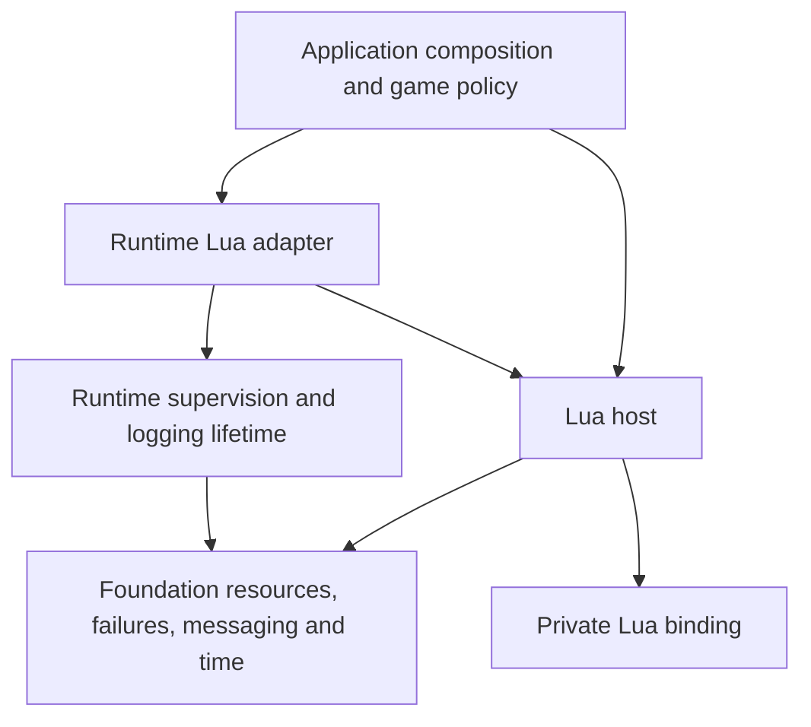
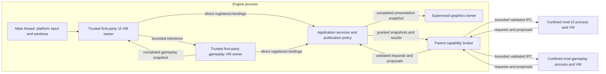

# Lua scripting runtime design

Give Lua its own scheduled execution domains so expensive gameplay does not put
UI scripts, input feedback, and engine communication behind the same callback.
Keep Lua central to authoring a game while Haskell owns execution, transport,
failure evidence, and lifetime. This is the canonical continuation of
`lua_runtime_architecture_notes.md` and the design conversation of 2026-09-16.

Design state: `exploring`

Owner: `coghex/hetoimasia`. Epic #145 and children #146–#149 have been
created; those children are merged. The owner accepted the two-domain direction,
required untrusted-mod isolation in the first arc, selected isolation per mod
and execution domain,
restricted capabilities and enforced limits, and chose to stop an unsafe failed
gameplay session while UI reports its state. Signed bundled macOS helpers may
be evaluated with headless command-line operation preserved (D-10).
The owner approved readiness on 2026-09-16 with separate Linux and macOS
feasibility slices (D-11). Q-3 is deliberately owned by LUA-1; Q-5 is deliberately
owned by LUA-14/LUA-15. Both successful platform proofs gate process-branch
drafting. That initial signoff permitted the preliminary proof/model work; it
did not pre-approve a confinement deployment policy.

Post-merge reconciliation, 2026-09-19, at code `master@38388f8`: LUA-1/#146
has established the binding boundary and LUA-4/#149 has delivered the pure
protocol model. LUA-14/#147 and LUA-15/#148 both delivered **inconclusive**
confinement verdicts. D-11 therefore returns this document to `exploring`.
LUA-9 through LUA-13 and their dependent integration slices remain blocked;
closing the proof issues did not prove supported confinement. D-13 now permits
trusted delivery independently of Q-5 after renewed readiness; the process
branch still requires Q-5's successful verdicts. The
[review ledger](project_review/ledger.md) also records implementation
follow-ups; processing completion is not a clean implementation verdict. The
[binding review](project_review/173.md) records stale source comments, and the
[protocol review](project_review/179.md) recorded failure-settlement and bounded
failure-detail defects. Those repairs (#193/#194) are closed at the 2026-09-22
review baseline. PR #241 subsequently corrected the binding comments. Neither
those repairs nor closed proof issues clear Q-5's confinement gate.

Owner reconciliation, 2026-09-24: D-13 permits independent trusted delivery;
D-14 fixes binding exposure for both paths. Q-8 is resolved. LUA-5 through
LUA-8 deliver trusted execution and reusable machinery; LUA-16/LUA-17 retain
confined integration and adversarial acceptance behind Q-5. This decision
approval does not renew design readiness. The document remains `exploring`.

Status legend: `[ ]` unprocessed · `[#N]` linked to issue N · `[no-issue]`
reviewed and deliberately not tracked separately · `[deferred]` blocked on a
concrete precondition

## Processing status

- [x] EPIC. Establish isolated UI and gameplay Lua execution — [#145]
- [x] LUA-1. Establish the Lua binding and foreign-call boundary — [#146]
- [x] LUA-14. Prove Linux confinement and resource-limit feasibility — [#147]
- [x] LUA-15. Prove macOS confinement and resource-limit feasibility — [#148]
- [ ] LUA-2. Own the VM through a protected IO lifetime
- [ ] LUA-3. Add application-owned modules and bounded value bindings
- [x] LUA-4. Model bounded script tasks and execution protocols — [#149]
- [ ] LUA-5. Integrate trusted VM owners with runtime supervision
- [ ] LUA-6. Schedule cooperative tasks with bounded service turns
- [ ] LUA-7. Add bounded asynchronous requests and owned subscriptions
- [ ] LUA-8. Prove independent trusted UI and gameplay execution headlessly
- [ ] LUA-9. Add bounded child-process transport and owned process lifetime
- [ ] LUA-10. Establish Linux mod-process confinement
- [ ] LUA-11. Establish macOS mod-process confinement
- [ ] LUA-12. Enforce parent-owned execution and resource budgets
- [ ] LUA-13. Broker scoped mod capabilities in the parent
- [ ] LUA-16. Integrate confined mod owners with the runtime
- [ ] LUA-17. Prove confined execution and adversarial isolation headlessly

The ledger records processing, not implementation. Keep it synchronized with
the delivery plan; do not infer issue numbers from these local slice IDs.
LUA-2's former #146 merge prerequisite is satisfied; its unchecked entry still
means no issue has been processed. Renewed readiness gates trusted processing;
Q-5 additionally gates the process branch under D-11/D-13.

Dependency reconciliation, 2026-09-18: the owner selected the shared-toolchain
qualification VK-1/#157 before LUA-1/#146. The amended and reapproved #146 and
its tracker comment linking #157 are authoritative. Consume its merged exact
GHC/Cabal/index baseline; do not perform a competing upgrade. This is a shared
build prerequisite, not a dependency on Vulkan rendering or native proof. The
source observations below remain historical.

## Epic contract

- **Goal:** a reusable Lua host and runtime adapter run trusted first-party UI
  and gameplay on independent in-process VM owners, with untrusted execution
  confined per mod and domain in separate sandboxed processes, without a window,
  renderer, or concrete game.
- **Done when:** a headless consumer loads application-owned Lua behavior in
  both domains; UI handles input against the last completed gameplay snapshot
  while gameplay is busy; cooperative tasks yield/wait/resume; overload is
  bounded and explicit; malicious/failed children cannot bypass capability
  checks or configured resource limits; failure and cancellation preserve
  parent-owned resource lifetime. Linux CI and local macOS verify both the
  binding and actual confinement, including denied-access tests.
  LUA-8 establishes the trusted milestone; LUA-17 establishes confined system
  acceptance. Both are required to complete the epic.
- **Users and operators:** authors of Lua-driven games/tools, engine component
  authors registering capabilities, and agents maintaining focused tests.
- **Arc label:** propose `scripting`, description “Lua hosting, execution, and
  application scripting integration”, color `7057FF`. Creation belongs to later
  issue processing, not this document edit.

## Current state and evidence

Historical inspection of Hetoimasia at `master@007c285` on 2026-09-16. These
observations describe the pre-implementation baseline. The post-merge handoff
above and the recorded Q-3/Q-5 results describe the current state.

- `packages/scripting-lua/README.md` reserves a host for VM lifetime, calls,
  errors, and registration. It requires one execution owner per VM and keeps
  game namespaces out of the host. There is no active Lua Cabal component or
  HsLua dependency in `cabal.project`.
- `Foundation.Worker` owns startup, stop, cancellation, and terminal outcomes.
  It retains borrowed dependencies until every worker and cancellation helper
  finishes. A stuck worker is not detached. It promises no OS-thread affinity.
- `Runtime.Supervision` classifies required/optional services and finite jobs.
  `RuntimeControl` belongs to the application thread. `awaitSupervised` handles
  any pending worker outcome before committing the supplied STM transaction;
  a fatal outcome is latched. Ordinary IO is not automatically supervised.
- `Runtime.Inbox` handles one message at a time. An escaping handler exception
  ends the service. Its context is built in `Scoped` startup and its handoff
  precedes the worker startup acknowledgement. It is not a Lua scheduler or a
  general protected-IO constructor for an interpreter.
- `Foundation.Resource` runs ordinary releases under `uninterruptibleMask_`.
  Arbitrary script finalization or worker joins do not meet its controlled
  blocking contract. Worker draining already uses its own protected IO boundary.
- Foundation messaging supplies prepared payloads, bounded FIFO admission,
  close/abort, and latest-value snapshots with checked cursors. `Prepared`
  forces values; it neither copies referenced mutable state nor extends a
  borrowed resource's lifetime.
- Those worker/messaging APIs are in-process mechanisms. The repository has no
  scripting sandbox, bounded Lua IPC protocol, or isolated mod-process owner.
  OS containment and process supervision below are new work, not existing
  guarantees conferred by using `Worker` or separate Lua states.
- [Runtime scheduling](runtime_scheduling_design.md) owns monotonic time,
  deadlines, fixed-step pacing, and native wake. It does not own Lua tasks.
  [Window/graphics lifetime](window_graphics_lifetime_design.md) owns graphics
  retirement. Neither requires Lua as a dependency.
- [Test architecture](test_architecture_design.md) specifies package-owned
  suites. New Lua suites should start in their package; they need not wait for
  the migration of existing central tests.
- Open tracker items at inspection were #123, #124, #86, and #49; none is a Lua
  arc. The original foundation plan's FND-5 overlapped host construction.
  Its [current boundary overview](engine_foundation_design.md) now delegates
  scripting to this arc; do not resurrect the historical slice or create a
  second host epic.
  Readiness recheck on 2026-09-16 found the same open items and no overlapping
  Lua umbrella.

### Synarchy lessons to retain

Read Synarchy at `064a255f06b59e2b1f8e881dcf4c747d52967a36`; these are references
for a deliberate adaptation, not a promise to import its implementation.

| Source under Synarchy's `src/Engine/` | Retain | Change here |
| --- | --- | --- |
| `Scripting/Lua/Script.hs` | Protected module calls, explicit missing-callback behavior, stack-balance discipline, attributable diagnostics | Do not turn every callback failure into “warn and continue” after unknown mutations |
| `Scripting/Lua/Thread/Scheduler.hs` | Bounded message/update/console service opportunities, gates checked between callbacks, bounded idle wait | Separate UI and gameplay owners; a fair queue cannot preempt one long callback |
| `Scripting/Lua/TickPolicy.hs` | Validate update intervals; exclude inactive/event-only work from timer demand | Reuse Hetoimasia's clock boundary and configurable policies; do not inherit tuning constants blindly |
| `Scripting/Lua/Thread.hs` and `Core/Thread.hs` | Stop clients/producers before disposing interpreter dependencies | Retain Hetoimasia's protected drain; do not assume `forkIOWithUnmask` establishes OS affinity |
| `Scripting/Lua/Message.hs` | Batch only semantically compatible operations; reject stale session work | Component-owned epochs and explicit admission instead of indiscriminate live-queue flushing |
| `Scripting/Lua/API.hs` and `Types.hs` | Application-defined namespaces and useful call shapes | Remove `EngineEnv`, game-manager imports, native state exposure, and unrelated mutable fields from the reusable host |

## Desired experience and scope

A Lua-authored UI can react to input, update a progress indicator, or report a
script fault while a costly gameplay operation is still running. It sees a
coherent completed view of gameplay and sends intentions for later admission.
Gameplay can slow down without making UI animation depend on a simulation tick.
The renderer remains free to display the last available presentation state.

The application can describe thousands of logical tasks using shared behavior,
small state records, deadlines/events, and explicit continuation cursors. It
does not need one VM or thread per entity. The author deliberately makes long
operations resumable; the engine supplies scheduling and diagnostics.

**In scope:** independent UI/gameplay VM owners, per-mod/domain process
confinement on Linux/macOS, private binding mechanics,
application-registered capabilities, bounded copied values, task state and
cooperative service policies, component-local asynchronous request/subscription
protocols, parent-validated capabilities, bounded IPC, execution/resource
enforcement, errors, cancellation, cleanup, focused telemetry, and a headless
two-domain consumer. Plain direct host use is for trusted code only and may
remain possible without supervision; it is never an untrusted fallback.

**Out of scope:** a replacement Lua language/bytecode VM; an optimizing compiler;
automatic arbitrary-loop splitting; hard real-time or absolute immunity to
OS/interpreter vulnerabilities;
one VM per entity; multiple gameplay shards; a game-state schema, ECS, UI toolkit,
render commands, asset system, save/load implementation, hot reload, console
server, global event bus, or general broadcast/RPC framework. Vulkan and GLFW
integration is application work after the headless boundary is established.
Third-party native extensions, arbitrary filesystem/network grants, mod
marketplace/distribution, and a general permission UI are also outside this arc.

## Decisions

### D-1. Independent UI and gameplay execution is the first system milestone

The owner accepted the two-domain recommendation on 2026-09-16. Each domain
has an independently created VM and exactly one execution owner. Coroutines
inside a VM multiplex tasks; they are not the separation between UI and gameplay.
Base host tests may use one VM, but the arc does not end at a single-owner demo.

### D-2. Keep Lua central without coupling the engine to a game

The owner wants a packaged Lua runtime that can interact consistently with
engine services. The application assembles permitted capabilities. Engine
packages do not import concrete game namespaces or gain a universal environment.
Authoritative gameplay state may live in Lua or Haskell; ownership and publication
rules apply to both. This design does not force game logic into Haskell.

### D-3. Schedule explicit work and preserve UI independence

The owner accepted a host-managed task/state-machine approach, cooperative
segments, service classes, and bounded work. UI consumes completed snapshots and
emits intentions without synchronously waiting for gameplay. Numerical OS
priority is not the correctness mechanism. Arbitrary automatic script splitting
and optimization remain future investigations.

### D-4. Reuse runtime contracts and develop alongside graphics

The owner wants this work available in parallel with Vulkan. Reuse errors,
recovery, workers, supervision, messaging, logging, and clock contracts. Native
window ownership stays on the main thread. Prove scripting headlessly, with
Hspec and package-owned tests, Linux remote CI, and local macOS evidence.

### D-5. Preserve the design beyond the conversation

The owner authorized converting the exploratory notes into this canonical
document and handing it to another session. Retain deferred ideas with their
prerequisites, distinguish proposals from decisions, and do not manufacture a
ready state or tracker approval from that authorization.

### D-6. Include untrusted-mod isolation from the start

Owner selected this explicitly on 2026-09-16. Containment is first-arc work,
not a deferred trust-model footnote. Untrusted Lua does not execute in the
engine process. A child process supplies fault separation in this design;
OS sandbox policy, bounded IPC, parent-side authorization, and resource
enforcement supply the rest. If containment cannot be installed, admission fails
closed rather than quietly using the trusted host path.

### D-7. Stop gameplay whose authoritative state cannot safely recover

Owner selected this explicitly on 2026-09-16. A script failure after possibly
partial authoritative mutation stops the affected gameplay session. UI remains
available to report the failure and last good snapshot. Optional UI tasks can
be disabled only when their effects are safely isolated. This is not a promise
to preserve the application after an unrelated fatal host/cleanup failure.

### D-8. Isolate each mod and execution domain

Owner selected separate sandboxed processes per mod and UI/gameplay domain,
with configurable admission caps. One malicious mod cannot share another mod's
interpreter heap or stop its process. A mod using both roles needs two owners;
one using only gameplay needs one. Tasks/entities still share their owning
domain's VM. Reject/defer excess domain admission explicitly; do not silently
pool mutually untrusted domains into a shared interpreter or process.

### D-9. Restrict capabilities and enforce execution/resource limits

Owner selected only explicitly granted engine capabilities: no direct
filesystem, network, process launching, or native modules. Exceeding enforced
execution or memory limits stops that mod process. The trusted parent owns
the limits and enforcement; a script-controlled hook or heartbeat is not
sufficient. This permits terminating a confined child, not detaching an
in-process worker that still borrows engine resources.

### D-10. Allow evaluation of signed bundled macOS helpers

Owner selected this explicitly on 2026-09-16. The macOS feasibility work may
evaluate a signed app bundle with sandboxed helpers while preserving headless
command-line operation. Bare Cabal executables are not a packaging requirement
for that evaluation. This permits investigating supported platform packaging;
it does not select XPC or a signing identity, establish a paid-account or
privileged-installation requirement, or prove containment. Q-5 still requires
evidence for per-mod/domain isolation, whole-process memory enforcement, and
owned lifetime before selecting the backend. D-6/D-8/D-9 remain in force.

### D-11. Gate process delivery on two preliminary platform proofs

Owner accepted this delivery change and readiness on 2026-09-16. LUA-14 and
LUA-15 follow LUA-1 and independently deliver Linux and macOS feasibility
evidence. Both must demonstrate a viable profile satisfying Q-5 before drafting
LUA-9 through LUA-13 or their dependent integration slices. Q-5 is deliberately
open for those proofs; it is no longer a prerequisite to processing the epic,
binding proof, or feasibility slices themselves.

Each proof is one PR containing its probe, tests, retained evidence, and platform
verdict. The initial gate returned the design to `exploring` on a failed or
inconclusive verdict. D-13 supersedes that document-wide pause: such verdicts
continue to stop process-branch drafting while separately approved trusted
delivery can proceed. They cannot weaken the accepted isolation or limit
contracts. Any required change to scope, trust boundary, supported deployment,
or public lifetime contract returns to the owner for a design decision and
renewed readiness. Routine mechanism selection within the accepted contracts
is the proof's responsibility.

### D-12. Run first-party scripts trusted and in-process

Owner selected this explicitly on 2026-09-22. The game's own first-party
scripts are trusted code. They run in-process in the application's UI and
gameplay VM owners (D-1) and call application-registered bindings directly,
without IPC serialization. Untrusted mods keep the confined-process pipeline of
D-6, D-8 and D-9 unchanged. Both paths share one module and capability
registration layer: a binding is defined once, and each path exposes the subset
its trust level permits. The trusted path is never a fallback for a mod whose
confinement cannot be installed. D-13/D-14 resolve the delivery and binding
exposure questions recorded in Q-8.

### D-13. Deliver trusted execution independently of confinement qualification

Owner approved this explicitly on 2026-09-24. LUA-2, LUA-3, and the trusted
in-process portions of LUA-5 through LUA-8 may proceed before Q-5 is resolved,
after their design/dependencies are reconciled and readiness is explicitly
renewed. LUA-5 through LUA-8 deliver the trusted path and reusable machinery;
LUA-16/LUA-17 preserve confined runtime integration and adversarial system
acceptance as required later slices.

Q-5 still blocks LUA-9 through LUA-13, LUA-16, and LUA-17 until both platform
verdicts are successful. Required mod isolation remains in this epic; trusted
completion neither completes the epic nor permits mod admission. A failed
confinement setup never selects the trusted path. This supersedes the earlier
document-wide processing pause without weakening D-6, D-8, or D-9.

Trusted scripts can hang or exhaust application memory. Cooperative service
budgets are not hard execution or memory limits. Protected teardown retains
dependencies until the VM actually finishes; a stuck owner cannot be detached.
Direct bindings preserve service ownership, coherent snapshots, and bounded
intentions; they do not permit synchronous calls into another VM owner.

### D-14. Register once with explicit exposure for each execution path

Owner approved this explicitly on 2026-09-24. Both paths share one binding
definition with explicit eligibility for each execution path. Registration
defaults to no mod exposure. A confined binding requires an explicit grant
and supported bounded transport semantics; not every direct binding needs an
IPC equivalent. P-4 records the permitted behavior by binding kind.

On the confined path, snapshot queries read granted local snapshots. Owned state operations mutate
only child-owned state; changes to parent state use validated commands.
Commands and UI intentions use bounded authorized requests, asynchronous
native requests use brokered admission and result delivery, and lifecycle
operations request permitted transitions while the parent retains authority.

## Design

P-1 through P-13 record the accepted contracts, with proof and delivery gates
scoped by D-13. Q-3 is resolved; Q-5 gates the confined process branch.
Symbol and component names below are descriptive until their owning slice fixes
the API.

### P-1. Package and ownership boundaries

Use `packages/scripting-lua/` for a `hetoimasia-scripting-lua` package:

- A host library owns interpreter mechanics, values, modules, capabilities, and
  local task contracts. It depends on foundation and the selected binding, with
  no dependency on runtime, GLFW, Vulkan, or game packages.
- A `runtime-lua` sublibrary, in a separate source directory, depends on the
  host and runtime. It composes trusted VM worker ownership and, once qualified,
  confined parent worker/process ownership, readiness,
  transport, and task service. Keeping integration in the same package avoids
  a package dependency cycle when tests exercise both layers, a lesson from GLFW.
- Host and adapter suites have separate source directories and targets. Pure
  model tests need no interpreter initialization; integration tests explicitly
  acquire VMs. Production libraries do not depend on test suites or examples.
- Applications register their own namespaces through a bounded capability
  interface. The host does not perform global service discovery.
- A headless child executable hosts one confined mod/domain. Its Lua-facing
  engine bindings encode requests to the parent; they do not import or borrow
  live engine services, native window handles, or graphics resources. Keep its
  trusted bootstrap small and its wire schema independent of game implementation.
  Platform confinement/launch code belongs in private platform modules with
  separate tests, not in the generic foundation worker API.

The dependency diagram is also the intended direction of imports:

LUA-1 selected `lua-2.3.4`, its bundled Lua 5.4.8, and the private C/Haskell
bridge documented in the [package contract](../packages/scripting-lua/README.md).
Use that qualified boundary and the binding settings in `cabal.project.common`;
`lua` is the HsLua project's raw binding layer; its higher-level `hslua-core`
layer was evaluated and not selected. Binding selection is complete. Q-3 records
the supported FFI, callback, cancellation and close contracts. A need for a different
execution or trust model returns to design; it is not an incidental solver choice.

### P-2. Two owners and coherent application boundaries

Graphics consumes application-published presentation data on its separate owner;
the GLFW process main thread owns platform events and windows. This does not
make rendering a dependency of the headless Lua milestone: fake capability and
presentation consumers establish the same boundary there. Simulation and the
commit policy remain application-owned. This follows the accepted
[V-5 ownership boundary](vision.md#v-5-bounded-communication-and-responsive-ownership).

The trusted owners use direct application-registered bindings under D-12/D-14;
this does not allow a callback to access another owner's mutable state or call
its VM synchronously. UI reads completed snapshots and submits bounded intentions.
The confined branch illustrates one mod's two roles; repeat the child boundaries
per admitted mod/domain. No mod shares a first-party VM. All cross-mod
communication is brokered by the parent. A child
report is untrusted input, not authority to commit a game step or allocate an
unbounded presentation tree. The parent validates schema, quota, identity,
permissions, and the application's commit rule before publication.

This is data flow, not permission to call another VM or the window system.
Each independent VM is created, used, and closed by its owner. Native modules
with process-global state or thread affinity require a separate audit; separate
Lua heaps do not isolate such modules. Initially expose only audited bindings.

The UI captures a completed gameplay snapshot for each execution segment and
retains a coherent view throughout it. It may use a newer version at the next
segment. UI actions include relevant session/version/entity identity; gameplay
revalidates them when admitted. A stale view does not authorize a stale action.
Publishing a newer view does not drop ordered clicks or accepted commands.

Simulation/session status is separate from its last good data. After a failure,
the UI can show the last good world together with an explicit failed status;
it must not misrepresent that world as continuing to advance.

### P-3. Protected VM lifetime and component readiness

The host offers a bracket-shaped **IO lifetime**, not an ordinary
`allocResource` release wrapping unrestricted `lua_close`. Short bounded native
resources underneath it may still use the existing resource primitives.

The following is the **local VM boundary**, inside the confined child or a
trusted embedding. A trusted supervised worker owns its local VM lifetime.
For confined execution, the engine's supervised worker owns the child process
and its IPC, as specified in P-13; it never owns an untrusted Lua heap.
The local execution owner covers the complete managed VM lifetime:

1. Initial construction creates only bounded control/transport resources.
2. The execution action constructs the VM, registers permitted bindings, and loads
   initial modules inside its protected IO lifetime.
3. It publishes one component-ready result before admitting application work.
   The adapter exposes the endpoint only after observing that result.
4. On every exit, it closes admission before destroying callable state,
   invalidates task/request epochs, and settles or explicitly discards pending
   work. It stops callback producers and retains their required dependencies.
5. It unwinds task references and closes the VM on the execution owner; callback
   trampolines, userdata support, and diagnostic storage stay alive through
   any finalizers that can use them. Only after closure does it release those
   dependencies and reports normal interpreter completion. A forced child exit
   follows P-13 instead and never claims that finalizers ran.

The worker startup acknowledgement means its `Scoped` construction finished;
it does **not** mean the interpreter is ready or, for a child, confined.
`startSupervised`
does not accept a caller-composed startup wait. The adapter therefore needs one
explicit component-readiness wait through `awaitSupervised`, composing readiness
with terminal completion so a failed initializer cannot leave a hanging waiter.
An untrusted child's “ready” frame alone cannot attest confinement: trusted
launch/bootstrap evidence and parent-owned permissions/limits are prerequisites.
This is intentionally different from `Runtime.Inbox`'s already-initialized
startup handoff; do not hide a second wait inside that adapter or weaken its
contract. At handoff, check that admission is still live. If the owner abandons
the wait, request stop/cancellation as appropriate; the existing worker group
still owns and drains the worker. No detached initialization helper is allowed.

Startup failure, body failure, cancellation, and close failure retain their
original context and secondary cleanup evidence. In a trusted embedding, a
cleanup failure must remain visible as cleanup to supervision, including when
cancellation was primary;
simply throwing a new script error could incorrectly classify it as a normal
stop. LUA-2 must identify the public evidence-composition seam or supply a
minimal additive foundation seam with tests; it must not import hidden resource
internals or duplicate incompatible failure precedence.
Across IPC, send a bounded diagnostic record instead of serializing exception
objects. Preserve the distinction between child-reported failure and trusted
parent exit/enforcement observations as specified in P-8/P-13.

Repeated cancellation must not abandon a live VM or free callback dependencies
under it. The protected boundary records pending cancellation and propagates it
only after safe teardown. It must not retry a possibly half-completed native
close. Establish exactly where cancellation can be delivered without corrupting
interpreter state, including Haskell callbacks and partial initialization. This
is a mandatory LUA-1/LUA-2 proof, not “put `mask_` around it and assume”. If safe
completion cannot be established in a trusted in-process embedding, retain
dependencies and wait under the existing worker policy. In-process detachment
is not recovery. For an untrusted child, the parent may terminate and reap it
under P-13's enforced policy, because no borrowed parent address/resource is
released by abandoning the child's finalizers. Parent workers still obey the
existing protected-drain rule.

The library/finalizer allowlist and shutdown phase prevent finalizers from
starting new asynchronous work, waiting for another stopping service, or
reentering the scheduler. Trusted scripts can still fail or fail to terminate;
cooperative finalization alone is not a termination guarantee. The parent
enforces the child's shutdown deadline independently. Diagnostic callbacks use
bounded capture, not arbitrary sink IO under a native callback.

### P-4. Cross-language errors, values, and capabilities

No public endpoint exports a raw Lua state, stack index, registry reference,
coroutine, closure, or native address. Host-local handles carry/check VM identity
and lifetime; calls are owner-only. Cross-domain values are bounded copies with
explicit schemas, then prepared on the producer before publication. Define
byte/depth/element limits, integer/number rules, byte strings versus UTF-8 text,
and rejection of cycles/unsupported values. Validation must itself stop at its
limits. `NFData` alone is not an immutability or authority proof.

Engine identities crossing Lua are opaque application capabilities with checked
type, lifetime/generation, and session as appropriate. Every operation validates
them at use. Identifiers never acquire native ownership by being copied.

Classify each registered binding:

| Binding kind | Permitted behavior |
| --- | --- |
| Snapshot query | Read the segment's immutable, versioned view |
| Owned state operation | Mutate only the domain's documented state; make fault consequences explicit |
| Command or UI intention | Validate and admit to a bounded owner queue; return acceptance/rejection |
| Asynchronous native request | Reserve bounded result capacity, enqueue, return a request identity |
| Lifecycle operation | Request a controlled boundary transition; no recursive scheduler entry |

D-14 adds explicit execution-path eligibility to that shared definition.
Registration defaults to no mod exposure. Direct bindings need no IPC
equivalent; exposure to a mod requires both a supported bounded representation
and an explicit grant. LUA-3 defines this metadata and the trusted bindings;
LUA-13 implements broker enforcement and transport exposure.

| Binding kind | Confined-path behavior |
| --- | --- |
| Snapshot query | Read a granted, bounded local snapshot; no synchronous parent query |
| Owned state operation | Mutate child-owned state only; parent state changes require validated commands |
| Command or UI intention | Submit a bounded, authorized request |
| Asynchronous native request | Use brokered admission and result delivery |
| Lifecycle operation | Request a permitted transition; the parent retains authority |

The parent authorizes every wire request using its launch-bound mod/domain
identity and explicit grants; a fabricated child-side handle grants nothing.
Untrusted Lua gets application-approved sources/data and a small standard-library
allowlist. Do not call `openlibs` and subsequently hide a few names: no unrestricted
`io`, `os`, `debug`, native module searcher/loader, arbitrary path loading, or
unvalidated precompiled bytecode. A package resolver serves only that mod's
approved source bundle or explicitly granted shared modules. P-13 adds OS
enforcement to these language-level restrictions.

Registration carries only the capabilities that binding needs. No synchronous
cross-worker queries, nested VM execution from a callback, or blocking engine
operations are part of the ordinary callback contract. Work that can be slow
must be segmented or submitted asynchronously.

Loading/calling produces an explicit result: successful value(s), an optional
function being absent, or a fault. Missing required entry points are faults.
Fault evidence includes domain/session, behavior/module and version, task,
operation/binding, source/traceback when available, and whether recovery is safe.
Bounded fallback formatting handles non-string errors and failed error handlers;
diagnostic rendering must not depend on running another arbitrary Lua method.

Protected Lua calls and Haskell callback trampolines contain each language's
exceptions on its own side of the C boundary. Unexpected Haskell exceptions and
asynchronous cancellation are not converted into ordinary recoverable Lua errors
that `pcall` can silently swallow. The bridge records them and returns control
to a safe host boundary for propagation with evidence. Prove stack/ref cleanup
on every supported path; stack restoration itself may execute closing behavior.
Do not assume arbitrary C unwinding through Haskell is safe.

### P-5. Tasks and explicit service policies

A logical task consists of identity, session epoch, shared behavior identity,
application state/cursor, service class, readiness/deadline, and optional pending
request/subscription. Its state is `Ready`, `Running`, `Waiting`, `Paused`, or a
terminal `Completed`, `Cancelled`, or `Failed`. Waiting records its exact cause.
There is one owner for each transition and one terminal outcome; invalid/stale
resumes cannot run it again. Task admission reserves terminal-result storage.

Author-facing work supports explicit segments such as
`runBatch(context, cursor, limit) -> Completed | Yielded cursor | Waiting request`.
Lua coroutines can implement transient sequences inside the VM. Authoritative
long-lived progress uses explicit state; no promise is made to serialize or
migrate coroutine stacks. Shared code is reused across many small task records.

Start with fixed service classes and configurable finite quanta, rather than an
unrestricted priority-number API: control/events, ordinary ready tasks, and
background tasks. Lifecycle stop is checked between segments and before waits;
user-generated “high priority” work cannot bypass quotas. Each live class gets a
bounded opportunity when its tasks and peers yield. Within a class, stable FIFO
or round-robin order plus a monotonic insertion ordinal breaks ties. A yielded
task joins behind ready peers, not at the head forever.

Bound active tasks, queued admissions, registered subscriptions, outstanding
requests, payload size, and retained terminal results. Define when an observed
terminal result releases its quota; do not create an unbounded ticket history.
External retained immutable results are caller-owned memory, not an engine cache.

### P-6. Time, budgets, and actual concurrency

UI deadlines use monotonic elapsed time. “Wall time” in the exploratory note
means real elapsed time, not civil/calendar time. Gameplay logical step numbers
and granted durations come from the application. A scheduler slice does not
advance simulation time simply because its wall budget expired.

Clock identities remain local to their owner/process. IPC carries logical
grants and validated durations, not raw clock samples to compare across origins.
The parent computes enforcement deadlines from its own clock; child timestamps
and claimed elapsed time cannot relax a limit.

Reuse TIME-1's clock/duration/deadline boundary. LUA-6 is gated on its implemented
API; do not create a second foundational clock to remove that dependency.
LUA-1 through LUA-4, LUA-9 through LUA-11, and LUA-13 through LUA-15 can proceed
before it; the enforced parent limits in LUA-12 also need TIME-1. TIME-2 remains an optional
application pacing policy: dropping unissued wall-clock catch-up debt must not
pretend an already admitted gameplay step completed or discard its accepted
effects. The first example permits only a bounded number of outstanding grants
(one is sufficient), publishes a completed snapshot only at its explicit commit
boundary, and keeps UI outside that barrier.

Per-turn segment/message quotas are deterministic service bounds. Elapsed-time
budgets stop starting another segment after a deadline; they cannot preempt the
one already running. Long callbacks need author-chosen safe yields/batches.
Measure overruns by domain/behavior. Instruction hooks may support diagnostics
or a separately validated abort policy, but are not automatic semantic splitting
or a hard CPU limit. No slice promises hook-driven arbitrary preemption.

Deadline/event waiting composes stop, new work, response readiness, and the next
deadline. Use a cancellable STM-compatible timer adapter with owned lifetime;
no polling spin, unbounded timer creation, or blocking cross-domain read. Fake
time drives model tests. GHC timer granularity/overflow handling belongs in the
adapter; it is not a new clock definition.

Native execution capable of running Lua must use binding/FFI paths that allow
other owners and Haskell work to progress with the threaded RTS. Audit long
`unsafe` calls, callbacks, garbage collection interactions, and process-global
locks. Two `forkIO`s or an RTS capability count alone are not proof. A bound OS
thread is needed only if an adopted dependency requires that affinity; do not
silently replace the existing worker owner with an untracked helper thread.

### P-7. Transport, subscriptions, and overload

Use foundation FIFOs for ordered intentions/events and snapshots for replaceable
state. Ordinary send reports `Full` or `Closed`; the UI never blocks waiting for
gameplay admission. The application may show a rejected/busy action or retry an
explicitly unaccepted intention later. It must not resend an accepted action
because completion is slow. Snapshot versions allow coalescing stale views, not
ordered effects. Input gaps follow the input component's reset contract rather
than silently dropping clicks.

Asynchronous requests are a component-local protocol, not a new engine RPC bus.
Reserve a bounded single-assignment result slot before accepting a request.
Responses fill that slot without waiting for the requesting worker to drain a
shared result queue. Quotas include ready but unconsumed results. Notification
may coalesce because the authoritative slot remains readable. This avoids the
deadlock where a worker blocks publishing a full result queue while its owner
waits for that worker to finish.

Carry session/domain/request identity and generation. Each admitted request
settles once with result, failure, or cancellation; duplicate/late/stale replies
cannot overwrite it. Cancellation revokes interest and settles the local waiter,
but it is not proof that native work ended. Any borrowed dependencies remain
owned until that operation's actual completion. Native providers must state and
prove their own stop/join protocol; the Lua runtime does not free their resources.

Subscriptions are owned records with bounded delivery, unsubscribe, and task/
session invalidation. Producers never directly invoke a Lua closure on their
threads. The VM owner looks up the still-live callback when servicing an event.
Specify ordered-event overload versus replaceable-state coalescing per endpoint;
there is no universal lossy event stream. This arc supplies mechanics with fake
providers; it does not implement every engine service or broadcast subscriptions
in foundation messaging.

### P-8. Fault containment and authority

Distinguish an expected script/task result from a broken host or worker.
Handled task failures remain inside the component, with one attributable report
at the policy boundary. An exception escaping a worker follows existing
supervision rules; a required failure latches fatal shutdown for the group.
Do not claim UI survives such a fatal failure by ignoring `checkRuntime`.

D-7's policy: an unsafe authoritative gameplay failure moves its session
to a terminal failed state, closes mutation admission, invalidates pending work,
and publishes failure alongside the last good snapshot. The VM-owning service
may remain alive in a quiescent failed-session state to report and await stop;
the fault is deliberately handled before it becomes a fatal worker outcome.
There is no implicit retry, restart, or continuation of partially mutated state.
For confined execution, the parent records that session failure after the child
reports it or is terminated. It can keep its supervision service alive to expose
status without keeping the failed interpreter alive. Parent host invariants and
parent cleanup failures still reach supervision. Child-originated error/cleanup
text is bounded untrusted evidence; it cannot impersonate a parent Haskell
exception or clear an enforcement violation. A child crash, limit violation, or
invalid protocol ends that domain; gameplay follows D-7 without automatic replay.

Optional UI tasks may be disabled only when their state/effects are isolated
and retaining the previous presentation is a proven safe fallback. Lua module
globals/upvalues may be shared by tasks: separate coroutines alone provide no
such proof. Unknown damage to shared UI state requires failing/reconstructing
that domain according to an explicit application policy, not blanket logging.
Recoverable validation/admission failures may be returned to scripts as data.

Withholding a new snapshot is not rollback of Lua tables, Haskell state, or an
already-issued native side effect. A consumer that wants recoverable gameplay
failure must stage effects or establish a real rollback boundary. The first
example stages its small output batch before commit; the reusable runtime does
not promise transactions for arbitrary registered bindings.

### P-9. Closing and session invalidation

Ordinary stop closes admission and aborts queued work, then unwinds the in-flight
segment when it returns or cancellation can safely reach it. It does not claim
accepted work drained. The exit record retains task/request dispositions and
discard counts separately from worker cleanup evidence. No in-flight effect is
automatically retried. A cooperative scheduling deadline is distinct from the
parent's enforced execution/shutdown limit, which may terminate the child.

Do not add a general “finish all scripts” operation: an event subscription or
infinite coroutine may never finish. Finite task completion is observable; an
application needing a graceful session boundary stops admitting new grants and
awaits its explicit outstanding batch while providers are still available,
then requests worker stop. This finite protocol must not wait for an immortal
subscription to disappear by itself.

Epoch change invalidates tasks, callbacks, pending requests, and queued old
work before a replacement domain can publish. Check identity at consumption as
well as admission because native responses race invalidation. For this arc a
replacement can mean constructing a new domain; live reload and save migration
are deferred. Checked snapshot cursors remain tied to their originating snapshot.

### P-10. Determinism and future simulation scaling

Guarantee the scheduler's documented local ordering for a given sequence of
admitted inputs and explicit grants. Do not claim replay across racing producers,
worker counts, machines, or Lua versions. The application decides canonical
admission/commit order and randomness if it needs that stronger promise.
UI randomness must not consume gameplay's stream.

For a later sharded simulation, preserve these prerequisites from the notes:

- Stable logical shard identity separate from physical VM/worker placement;
  exactly one mutable owner for an entity at a time.
- Fixed phase membership/inputs, staged cross-owner effects, explicit commit
  order such as epoch/step/phase/source/sequence, and ownership transfer only
  at a completed boundary. A sorted command list alone does not undo partial
  local mutations after failure.
- No shard coupling through accidental VM globals/upvalues, shared native
  state, iteration-order assumptions, or a schedule-dependent random stream.
  Application-owned explicit random streams and task schemas need a contract.
- First prove logical shards on one gameplay owner, then compare with multiple
  owners under a selected determinism policy. Do not build a worker pool before
  there is a workload and an authority/commit design that justify it.

Persistence stores versioned gameplay/task data and behavior identity; VMs,
coroutines, transport, clocks, and subscriptions are reconstructed. Save/load,
schema migrations, hot reload, and in-flight-effect reconciliation need a later
application design. This arc avoids making VM internals a public persistence API.

### P-11. Useful optimizations and diagnostic evidence

Start with event/deadline wakeups, shared behavior plus compact task records,
bounded batches across the language boundary, and replaceable snapshots. Cache
queries only against an explicit immutable snapshot/version and capability set.
Coalesce only operations whose contract permits replacement. Do not rewrite
arbitrary script loops or memoize effectful callbacks based on apparent repetition.

Expose bounded counters/gauges for admitted/rejected work, queue/task high-water,
completed/yielded/waiting/failed/cancelled work, stale replies, discarded work,
and segment overruns. Attribute failures and measured cost to domain/behavior;
measure UI progress separately from gameplay throughput. Aggregate or sample
costs; no mandatory timestamp allocation/log line for every task or ever-growing
per-task history. Detailed latency/GC/memory profiling is opt-in evidence, not a
new CI timing threshold. Choose shipping budgets from measurements later.

### P-12. Tests, build delivery, and parallel work

Use separate package-owned Hspec host and runtime-adapter suites, with pure
protocol/scheduler models independent of native VM fixtures. The host's repeated
construction/failure cases get fresh VMs; compatible examples may share an
explicit fixture only where it preserves isolation and owner affinity. Never
share one mutable VM across concurrently executing Hspec examples.

Add CPU validation groups for the new Lua suites, non-optional and required when
affected. Their input maps include native/binding/build inputs, host/adapter
dependencies, and test support. Preserve the existing mandatory floor and its
evidence rules. Define small correctness checks in those groups; repeated stress
and performance measurements are optional. Package targets must be runnable
independently; integration duplication in root tests is unnecessary. Python is
only for a boundary Hspec cannot reasonably exercise, with a stated reason.

Use the project's pinned build environment. LUA-1 records whether the binding
supplies Lua or needs provisioning, cache identity, and clean-build behavior.
Do not add a second native library from the developer's PATH accidentally or
unconditionally rebuild Lua on every CI job. Changes to the existing CI image,
if required, must preserve its pinned descriptor/toolchain identity contract.
No macOS remote CI is introduced.

All first-arc acceptance is headless and needs no desktop interaction. If a later
integration test opens windows or changes focus/display state, ask for the human
user's explicit approval before that local session (superseded on 2026-09-26: the owner gave standing approval for desktop-disrupting native runs an issue or pull request needs; see [AGENTS.md](../AGENTS.md)). No Vulkan API or graphics
completion token belongs in these Lua tests.

### P-13. Untrusted processes, permissions, and enforced limits

**Threat boundary.** Treat mod source, its generated values, Lua errors, logs,
and every child protocol frame as untrusted. Protect the engine process, host
files/network/credentials, other mods' state, and bounded parent resource use.
Confinement does not prove that a mod granted gameplay authority behaves fairly
or implements correct game rules. It also does not promise protection against
every kernel/hardware vulnerability or side channel.

Each admitted `(mod identity, execution domain, session generation)` receives a
fresh confined process and an independent VM. Nothing enters the engine through
a shared address, raw engine pointer, inherited game file descriptor, arbitrary
FFI, or direct native callback. Trusted, bounded IPC connects it to a parent
broker. Shared mutable memory is outside this arc. A successful sandbox launch
is a prerequisite to loading **any** untrusted module, including initialization
and dependency imports; time/memory limits cover that phase too.

**Platform policy.** Q-5 must select mechanisms that really work in Linux CI and
local macOS, including distribution/launch requirements. Linux likely needs a
restricted filesystem/namespace view plus syscall restrictions and enforceable
resource limits; seccomp alone is not a sandbox. macOS needs a supported,
verified helper confinement/signing arrangement. Do not assume sandbox
inheritance from an unrestricted engine works, or that an App Sandbox container
shared by all helper instances isolates mods from each other. Runtime-loader
access needed by the trusted executable must not become mod access to user data.
No ambient home directory, credentials, uncontrolled inherited descriptors,
network access, or ability to launch arbitrary executables is granted. A private
disposable working area, if the runtime requires one, contains no game/host data
and has bounded storage. No direct mod filesystem API is exposed.

Launch reports a typed unsupported/confinement failure if prerequisites are
missing; it never falls back to a plain child process. A container used for CI
is not proof that the same application launch is confined on a user's machine.
Native probes must attempt forbidden access from the helper, not merely check
that Lua's `io` global is absent. Record the supported OS/deployment baseline and
known residual limits before the untrusted entry point can ship.

**Parent-owned wire boundary.** Use private inherited IPC endpoints with explicit
framing, protocol version, maximum frame/collection/string sizes, and launch-bound
identity. Validate length before allocation, bound incremental parsing, and
handle partial frames, EOF, malformed data, and inconsistent ordinals as explicit
domain failures. Child-supplied identity is not trusted to select another mod's
capabilities. Do not expose a listening network port or use executable Haskell
serialization. Bound queued frames and diagnostic output; slow consumers cannot
cause unlimited parent memory or block unrelated domain service. Close/interrupt
owned readers/writers during exit and drain their helpers before returning.

Module sources/data are supplied from application-approved bundles through this
boundary with finite size limits and normalized module names. A child's `require`
request cannot choose an arbitrary host path or traverse outside its bundle.
Engine capability requests are checked independently in the parent for mod,
role, session, handle generation, schema, quota, and operation permission. Grant
only narrow snapshot fields/resources. The parent never supplies its full
environment or a general “run IO” handler. Revocation applies to queued and
in-flight requests at their next permitted effect boundary; already committed
effects are not undone by deleting a token.

**Limits.** Configuration distinguishes cooperative turn budgets from enforced
startup, granted execution, and shutdown limits. The parent uses monotonic time
and OS enforcement/observations; a malicious child cannot extend a deadline by
emitting heartbeats or repeatedly claiming tiny yields. Legitimate asynchronous
waiting is a parent-recorded state: it does not give unlimited running CPU while
waiting. Limit active processes, total admitted memory/CPU load, per-child memory,
Lua heap, outstanding requests, IPC/log output, and parent-side broker work.
Lua allocator accounting supplements whole-process limits; it does not cover the
Haskell RTS, C buffers, stacks, or OS allocations by itself. A periodically sampled
RSS warning is not an enforced memory cap. Verify what each selected OS limit
actually measures, including RTS virtual-memory reservations and inherited limits.
Q-5 blocks process-branch drafting until LUA-14/LUA-15 demonstrate viable
profiles on both platforms; D-11 permits processing the preliminary proofs.

On violation, reject further effects, mark the domain failed, terminate its
owned process through the platform's escalation path, and reap it. Parent quota
releases follow observed termination, not a successful signal-send. Preserve exit
status, the parent's enforcement reason, and bounded child diagnostics. Bound
restart policy is explicit; first arc does not automatically restart or replay
work. A process that cannot yet be reaped retains its bookkeeping and parent
leases; no deadline licenses unsafe disposal or PID-reuse-based signaling.

**Parent resource lifetime.** Process death frees the child's address space; it
does not undo commands already accepted by engine services or prove GPU/native
completion. The broker owns every parent-side lease/request created for a mod,
invalidates admission before cleanup, then cancels interest and waits for each
actual provider completion/retirement contract before release. No engine resource
depends on an untrusted Lua finalizer for essential cleanup. This preserves the
resource/graphics policy without inventing GPU waits in the Lua host.

The parent supervised worker's run action owns this process/IPC lifetime. A
worker-group stop requests child shutdown, then escalates at its configured
limit and reaps; it drains local IPC helpers and retained provider obligations
before its own terminal completion. Owner cancellation cannot skip that cleanup.
Untrusted child termination is an expected component outcome with D-7's authority
consequences; failure of trusted parent cleanup still follows runtime supervision.

This is a larger first arc than a trusted in-process host. The platform
confinement proof and adversarial tests are mandatory, not optional performance
probes. A future sandbox relaxation or native-mod API needs a new design review.

## Open questions and gates

### Q-1. Trust scope of the first runtime

Resolved by D-6: untrusted-mod isolation is required in this arc. P-13 records
the added process/OS boundary. Do not reduce this to separate in-process VMs or
defer it while claiming the first arc is complete. Q-5 remains a real technical
gate for meeting this choice on both supported platforms.

### Q-2. Unsafe authoritative gameplay failure

Resolved by D-7: stop the affected gameplay session while UI reports its last
good state. There is no implied transactional rollback. Isolate optional UI
failures only with proven safe effects; parent invariants and cleanup retain
normal supervision semantics.

### Q-3. Binding feasibility and exact supported execution boundary

Resolved by LUA-1/#146, merged in PR #173, on the shared #157 toolchain:
`lua-2.3.4` with bundled Lua 5.4.8 and the project's private C/Haskell bridge.
The [package contract](../packages/scripting-lua/README.md) records safe FFI
paths, registry/stack ownership, callback transport, close/finalizer behavior,
and the selected flags. `hslua-core` was evaluated and not selected.

The owner-approved cancellation boundary targets the VM execution owner; an
internal foreign-export callback thread is not a cancellation endpoint and
trusted callbacks must not publish its identity. Arbitrary running Lua still
needs a consulted hook or the later process boundary for enforced limits.
Carry this qualified contract into LUA-2/LUA-3; do not infer broader callback
cancellation or confinement guarantees from the binding proof.

### Q-4. Clock prerequisite and delivery coordination

LUA-6 and LUA-12 require TIME-1/#133, which is merged. Use the existing
[foundation monotonic time boundary](time.md) and link that prerequisite when
drafting either slice. Do not absorb TIME-1 into this epic or make Vulkan,
GLFW scheduling, or a completed game loop artificial prerequisites.

### Q-5. Verified platform confinement and resource-enforcement profile

**Result reconciled 2026-09-23:** both preliminary proofs are merged and
`inconclusive`; no production deployment profile is selected.

- [Linux verdict](lua_linux_confinement_verdict.md), LUA-14/#147, PR #177:
  the candidate enforces the tested boundary where unprivileged user
  namespaces are usable. Stock Ubuntu 24.04 restrictions and the current CI
  container prevent that setup. The successful reference experiment required
  an administrative restriction change; this is not an approved deployment
  requirement. [Retained runs](lua_linux_confinement_evidence.md) distinguish
  all three environments/outcomes.
- [macOS verdict](macos_confinement_verdict.md), LUA-15/#148, PR #176:
  the candidate uses unsupported confinement and memory-limit interfaces.
  Its named residual limits and missing Lua-side network-denial evidence
  remain part of the result. The [#176 review](project_review/176.md) also
  identified an optimization defect in the intended native-buffer growth.
  #228/PR #243 repaired it and refreshed the retained evidence on 2026-09-22;
  the corrected workload checks distinct native buffers after a major
  collection. That repair does not establish a supported deployment baseline,
  which the owner has not selected.

Return the concrete deployment obstacles to the owner under D-11. Further
mechanism experiments may preserve the existing requirements; any material
change to the trust boundary, required privileges, supported platforms, or
isolation/limit contract needs an explicit design decision. No weaker fallback
has been selected by this reconciliation.

Q-5 remains an open technical gate after LUA-14 (Linux) and LUA-15 (macOS).
Before processing the process branch, select the exact Linux and macOS
confinement, process launch/signing, memory
enforcement, and parent watchdog mechanisms against the supported deployment
baseline. Explain how each enforces P-13 and how it runs unprivileged in local
development and the existing Linux CI environment. A cgroup mechanism requiring
delegation is not automatically available in hosted/container jobs; a macOS
entitlement or documented limit is not automatically effective for a standalone
CLI helper. Follow-up experiments and verdicts must resolve the concrete
obstacles above under D-11; merged preliminary proofs are not a reason to
repeat their completed scope.
No solver should invent a weakened fallback to make acceptance green. If no
viable profile meets D-6/D-8/D-9, bring the constraint back to the owner before
implementation; do not reclassify memory exhaustion as an optional probe.

This gate affects LUA-9 through LUA-13 and their dependent integration slices.
LUA-1's binding proof can inform it, but native-mod support, a WebAssembly
interpreter backend, or requiring an externally managed VM/container would be
material alternatives requiring a new recorded decision.

#### Q-5 feasibility follow-up, 2026-09-16

**Verified evidence, not a selected backend:**

- The repository's `.github/workflows/validation.yml` runs Haskell validation
  inside the pinned image with `options: --init`; it declares no cgroup
  delegation or per-mod controller setup. This establishes no usable delegated
  memory controller, but does not prove the runner cannot provide one.
- Linux documents `memory.max` as a cgroup memory limit, with possible temporary
  overshoot and allocation-specific failure behavior. Delegation needs explicit
  permissions. A proposed backend must describe swap and accounting scope too;
  a configured value is not an absolute instantaneous RSS ceiling. See the
  [kernel's cgroup v2 contract](https://docs.kernel.org/admin-guide/cgroup-v2.html).
- On the inspected macOS 26.6 host (build `25G5065a`), the active SDK's
  `usr/include/sandbox.h` marks `sandbox_init` as “No longer supported” and warns
  that the header may be removed. Its availability is not a supported deployment
  contract. This inspection neither selects a minimum macOS version nor proves
  that the API fails on this host.
- Apple documents [sandbox inheritance](https://developer.apple.com/library/archive/documentation/Miscellaneous/Reference/EntitlementKeyReference/Chapters/EnablingAppSandbox.html)
  and separately sandboxed [XPC services](https://developer.apple.com/library/archive/documentation/MacOSX/Conceptual/BPSystemStartup/Chapters/CreatingXPCServices.html).
  Inference: XPC is a candidate to investigate, not a drop-in implementation of
  P-13. Its system-managed lifetime and possible restart need reconciliation
  with explicit domain generations, no replay, and observed termination. The
  cited documentation does not establish separate storage and process identity
  for every dynamic mod/domain instance.
- Apple's published [XNU resource-limit implementation](https://github.com/apple-oss-distributions/xnu/blob/f6217f891ac0bb64f3d375211650a4c1ff8ca1ea/bsd/kern/kern_resource.c#L1560)
  routes `RLIMIT_AS` through `vm_map_set_size_limit`; an accepted numeric limit
  alone therefore cannot settle its useful coverage or compatibility here.
  This source revision is not proof of the running kernel's behavior. Test
  the supported OS and actual threaded Haskell child, including existing virtual
  reservations, instead of assuming either Linux-equivalent semantics or that
  macOS has no enforcement mechanism.

**Accepted bounded feasibility work:** D-10 permits evaluating signed bundled
macOS helpers with headless command-line operation. Evaluate a minimal helper
and identify remaining signing/setup requirements before committing the process
branch's public launch/transport API. Keep this evidence with its eventual code PR;
this design-only follow-up ran no native sandbox or exhaustion experiment.

| Proof | Required result before selecting the platform profile |
| --- | --- |
| Launch and isolation | Two simultaneous mod/domain instances have distinct owners; neither can access the other's test sentinel, IPC, or state. Deny fixture filesystem/network/process operations from native helper code before loading mod source. |
| Whole-process memory | Under a small, externally bounded experiment, account for Lua, native allocations, and the RTS; demonstrate enforced allocation failure or termination and explain how a violation becomes terminal. Failure to install the limit refuses admission. |
| Lifetime and identity | Initialization failure, cancellation, and forced exit leave no live admitted owner; observed termination governs quota release. An XPC candidate must map system-managed exit to this contract without pretending the parent can `waitpid` a process it did not spawn. |
| Deployment and CI | Reproduce from the ordinary local launch and Linux CI worker, recording OS/kernel, signing, controller permissions, and required setup. Missing prerequisites produce the documented refusal. |

An XPC candidate that cannot satisfy per-domain instance isolation, bounded
transport allocation, or explicit lifetime observation is rejected under the
existing decisions; adapting P-13 would require a recorded design change.
Likewise, namespace/syscall restrictions plus cgroups remain a Linux candidate,
not an assertion that the current CI container supports nested confinement.

**Packaging choice: Resolved by D-10.** Signed bundled macOS helpers may be
evaluated while preserving headless command-line operation. Q-5 remains open
for backend selection and verified enforcement. Record any required signing
account, installation privilege, or CI host setup before accepting that platform
profile; the packaging answer alone does not establish those requirements.

#### Readiness and processing gates after D-13

Q-3's binding selection and Q-4's external clock prerequisite are recorded
above. Q-5 remains open under D-11: LUA-14/LUA-15 delivered evidence, but both
verdicts are inconclusive. There are seventeen slices and no accepted production
confinement profile. The document is exploring; issue processing cannot resume
until the owner renews readiness. D-13 permits readiness for trusted delivery
with Q-5 deliberately open and the process branch explicitly blocked.

Once readiness is renewed, resume the existing ledger one child per invocation.
Keep the completed preliminary issues linked and scope any follow-up proof to
its remaining obstacle. Do not draft LUA-9 through LUA-13 or dependent
integration/acceptance slices LUA-16/LUA-17 until both platform verdicts are
successful and recorded here with their evidence references. Completing or closing a feasibility issue
alone is not a successful verdict. If either proof fails or remains inconclusive,
keep process drafting blocked and return the concrete obstacle to the owner.
That does not revoke separately approved trusted readiness. A material change
to the design returns it to `exploring`; do not silently defer required
containment or weaken D-6/D-8/D-9. A successful
mechanism selection within the agreed contract resolves Q-5 without reopening
settled preferences; a material design change requires fresh readiness signoff.

### Q-6. Mod isolation granularity

Resolved by D-8: separate processes per mod and UI/gameplay domain, with bounded
admission. Do not pool different mods into one process to save memory silently.

### Q-7. Permissions and enforcement policy

Resolved by D-9: explicitly granted engine capabilities only, no direct
filesystem/network/process/native-module access, and terminate the offending
mod process on enforced execution or memory limit violations. Q-5 chooses the
verified mechanisms; P-13 distinguishes child termination from parent cleanup.

### Q-8. Reconciling the trusted in-process path

Resolved by D-13 and D-14, explicitly approved on 2026-09-24. Trusted delivery
(LUA-2, LUA-3, LUA-5 through LUA-8) may proceed independently of Q-5 after
renewed readiness. LUA-9 through LUA-13 and confined integration/acceptance
(LUA-16/LUA-17) remain gated on both successful platform verdicts. P-2 now
shows first-party VM owners as well as separate mod processes. P-4 records
binding eligibility and the confined subset, with no mod exposure by default.
Required confinement remains part of epic completion. Approval of these choices
does not itself renew readiness or approve issue processing.

## Verification strategy

The design requires observable contracts rather than one happy-path Lua call:

LUA-8 proves the trusted milestone using the applicable binding, protocol,
failure, and two-domain checks below. LUA-17 adds confined system and
adversarial acceptance after Q-5; trusted evidence cannot satisfy containment.
Both milestones are required for epic completion.

1. **Binding/lifetime:** creation and partial-initialization faults; repeated
   loading/calling without stack/ref growth; callback exceptions in both
   directions; non-string/formatting faults; cancellation around native calls;
   body-plus-close failure precedence; finalizers invoking permitted callbacks;
   no callback/dependency use after terminal completion; repeated cancellation
   cannot abandon live interpreter state.
2. **Task/transport models:** capacity boundaries, stable fair opportunities,
   exact fake-clock deadlines, no inactive-task spin, stale/duplicate responses,
   terminal storage quotas, invalid handles, unsubscribing in flight, cancellation
   versus completion races, and full result storage without a join deadlock.
3. **Failure authority:** a staged batch commits once; a failing gameplay task
   publishes no false completion; a partial mutation cannot be retried merely
   because no snapshot was published; failed-session/UI behavior follows Q-2;
   unexpected host or cleanup failures retain runtime fatal behavior.
4. **Two-domain system:** actual independent VMs, no accidental shared globals;
   UI progress before busy gameplay completes; coherent old/new snapshots;
   accepted intentions handled once; pause/overload/stop remain explicit.
5. **Containment:** malicious source and hostile protocol fixtures attempt
   filesystem/network/process/native-loader access, another mod's capability,
   oversized/partial/flooded frames, infinite execution, allocation exhaustion,
   forged identity/readiness/completion, diagnostic floods, and hanging close.
   Verify denied access and enforced termination on Linux/macOS, no parent
   memory growth beyond quota, unaffected UI/other-domain progress, and correct
   parent lease retirement after child death. Test missing sandbox prerequisites
   and require a typed refusal, never unconfined fallback.

Concurrency correctness uses handshakes and controlled barriers, not timing
sleeps. A barrier in a deliberately safe test callback proves ownership/wait
isolation but does **not** alone prove CPU-bound Lua responsiveness. Also run
both real interpreters with substantial finite Lua work and verify UI progress
before the gameplay work is allowed to report completion. A binding-level
instruction-hook latch can establish overlap for that test, but may itself
change progress; retain a separate no-hook CPU-work experiment when assessing
latency. Use generous outer test timeouts only as deadlock guards and put
performance distributions in optional probes, not fragile millisecond CI gates.
Record threaded-RTS flags, binding/version, workload, and what each check proves.

If an adversarial bridge/teardown test can hang or crash the process, run that
case in a controlled child process from Hspec and retain its exit/evidence. It
must not wedge the whole suite or execute an unkillable foreign loop in-process.
No stress experiment establishes hard real-time behavior or proves absence of
security vulnerabilities. Containment claims must state the enforced boundary
and verified policy, with adversarial regression coverage.

## Delivery plan

### LUA-1. Establish the Lua binding and foreign-call boundary

- **Outcome:** a pinned, buildable private bridge with evidence for the selected
  interpreter/callback/concurrency contract.
- **Scope:** P-1/P-4/P-6 binding mechanics; package skeleton and a focused host
  Hspec target; safe call/error trampolines; reproducible native inputs and its
  initial affected CI group. Record supported/rejected paths and resolve Q-3.
- **Phase:** binding foundation.
- **Depends on:** external VK-1/#157 merged with the shared-toolchain
  qualification required by #146.
- **Ordering:** critical path after that qualification; independent of Vulkan
  rendering/native proof and TIME-1.
- **Relevant decisions:** D-1, D-2, D-4, D-6, D-9.
- **Acceptance signals:** pinned Linux/macOS builds; callback/error evidence;
  independent interpreter execution; verified cancellation/close assumptions.
- **Out of scope:** public module API, supervisor, task scheduler, game bindings.
- **Open questions:** Q-3 is this slice's explicit outcome; D-6/D-9 constrain
  library exposure. Q-5 remains required for the process branch.

### LUA-14. Prove Linux confinement and resource-limit feasibility

- **Outcome:** a reproducible Linux platform verdict establishes whether the
  accepted containment contract is viable before production process APIs exist.
- **Scope:** one minimal private headless probe using LUA-1's selected Lua and
  threaded RTS; native denied-access and two-instance isolation checks; bounded
  whole-process memory and execution-limit experiments; launch, forced exit,
  and termination observation. Exercise the ordinary local launch and actual
  Linux CI environment. Retain commands, environment/setup requirements,
  evidence, and verdict with the probe/tests in the same PR.
- **Phase:** platform feasibility.
- **Depends on:** LUA-1.
- **Ordering:** critical path; can run alongside LUA-15 and host/model work.
- **Relevant decisions:** D-4, D-6, D-8, D-9, D-11.
- **Acceptance signals:** a supported profile passes Q-5's proof matrix,
  including missing-prerequisite refusal and accounting/limit semantics, or a
  reproducible failed/inconclusive verdict identifies the concrete obstacle.
  Only a successful verdict opens the platform's gate; both platforms must pass.
- **Out of scope:** production transport/broker/scheduler, public untrusted
  admission, a replacement foundational clock, and changes to the trust model.
  Test timeouts bound experiments; production deadlines still belong to TIME-1.
- **Open questions:** deliberately resolves Q-5's Linux portion. A failure,
  inconclusive result, or required material contract/deployment change stops
  dependent drafting and returns to design under D-11.

### LUA-15. Prove macOS confinement and resource-limit feasibility

- **Outcome:** a reproducible local macOS platform verdict establishes whether
  the accepted containment contract is viable with headless operation.
- **Scope:** one minimal private signed helper/bundle candidate under D-10 using
  LUA-1's selected Lua and threaded RTS; native denied-access, two-instance
  storage/process isolation, bounded whole-process memory and execution-limit
  experiments, and observed termination without restart/replay. Record the OS
  baseline, signing/setup requirements, ordinary CLI launch, and any XPC lifetime
  mapping. Keep probe, Hspec checks, retained evidence, and verdict in one PR.
- **Phase:** platform feasibility.
- **Depends on:** LUA-1.
- **Ordering:** critical path; can run alongside LUA-14 and host/model work.
- **Relevant decisions:** D-4, D-6, D-8, D-9, D-10, D-11.
- **Acceptance signals:** the candidate passes Q-5's proof matrix with actual
  native denial and enforced limits, or a reproducible failed/inconclusive
  verdict identifies the obstacle. A bundle or entitlement alone is not a pass;
  both successful platform verdicts are required before process-branch drafting.
- **Out of scope:** remote macOS CI, production transport/broker/scheduler,
  public untrusted admission, and an assumed paid signing account or privileged
  installation. Test timeouts do not replace TIME-1's production clock boundary.
- **Open questions:** deliberately resolves Q-5's macOS portion. A failure,
  inconclusive result, or required material contract/deployment change stops
  dependent drafting and returns to design under D-11.

### LUA-2. Own the VM through a protected IO lifetime

> The former Q-3/#146 prerequisite is satisfied. Reuse the selected binding's
> package contract rather than repeating its proof. D-13 permits this slice
> independently of Q-5 after renewed readiness. LUA-4 has already been
> processed and implemented independently.

- **Outcome:** one owner constructs, uses, and closes a VM while preserving
  primary/cleanup evidence and callback dependencies on every supported exit.
- **Scope:** P-3 host boundary, partial construction, protected cancellation,
  finalizer allowlist/phase, opaque ownership, and any minimal evidence seam
  proven necessary in foundation. Include its contract and focused tests.
- **Phase:** host ownership.
- **Depends on:** LUA-1.
- **Ordering:** critical path after readiness resumes; the independent LUA-4 model is already delivered.
- **Relevant decisions:** D-1, D-2, D-4, D-12, D-13.
- **Acceptance signals:** failure/cancellation matrix including close callbacks;
  no ordinary uninterruptible Lua release; no leaked/public native handles;
  cleanup evidence still classifiable by runtime.
- **Out of scope:** module namespaces, worker adapter, scheduler, hard deadlines.
- **Open questions:** Q-3 is resolved; renewed document readiness remains the
  processing gate. Q-5 does not gate this trusted slice.

### LUA-3. Add application-owned modules and bounded value bindings

- **Outcome:** an application registers a narrow capability, loads its own
  module, and calls it through bounded values and attributable results.
- **Scope:** P-4 public API, required/optional entry points, stack/ref discipline,
  marshalling limits and invalid handles, module identity, error formatting, and
  per-domain namespace/library policy. Define shared registration with explicit
  execution-path eligibility and no mod exposure by default (D-14); implement
  trusted direct bindings here. Tests live beside the host.
- **Phase:** host consumer boundary.
- **Depends on:** LUA-2.
- **Ordering:** trusted critical path after LUA-2; LUA-4 is already delivered.
- **Relevant decisions:** D-1, D-2, D-4, D-6, D-9, D-12, D-13, D-14.
- **Acceptance signals:** independent module state; no concrete game imports;
  bounded validation/copying; missing versus failed calls distinct; no reentrant
  native owner access or leaked stack/registry references; default registration
  exposes nothing to mods and a direct binding need not have an IPC equivalent.
- **Out of scope:** asynchronous providers, live reload, coroutine scheduler,
  IPC implementation and mod admission (LUA-13/LUA-16).
- **Open questions:** None; Q-8 is resolved. Renewed readiness still gates processing.

### LUA-4. Model bounded script tasks and execution protocols

- **Outcome:** a pure, independently testable task/admission/disposition model
  fixes the contract that adapter and scheduler implementations consume.
- **Scope:** P-5/P-7/P-8/P-9 identity, transitions, epochs, quotas, terminal-result
  ownership, segment outcomes, and session failure; no timer or interpreter IO.
- **Phase:** protocol model.
- **Depends on:** LUA-1 (package boundary only).
- **Ordering:** independent of LUA-2/LUA-3; can run alongside them.
- **Relevant decisions:** D-1, D-2, D-3, D-4, D-7, D-8.
- **Acceptance signals:** exhaustive representative transition/overload cases;
  no stale resume or duplicate terminal; no implied rollback/replay; bounded
  storage even when completed results are not promptly observed.
- **Out of scope:** ready-queue selection policy, VM workers, native providers.
- **Open questions:** None; D-7 fixes failure policy and D-8 scopes identities.

### LUA-5. Integrate trusted VM owners with runtime supervision

- **Outcome:** a supervised in-process owner exposes a ready trusted Lua endpoint
  and retains VM/callback dependencies through close without a new supervisor.
- **Scope:** public runtime sublibrary integration and its Hspec/CI target;
  P-3 component readiness, bounded admission, P-8 failure composition, and P-9
  shutdown evidence. Readiness includes registration and VM initialization.
  Reuse LUA-4's protocol model with explicit first-party owner identity; identity
  alone must never confer trust or grants. Start with finite call dispatch.
- **Phase:** trusted runtime ownership.
- **Depends on:** LUA-3, LUA-4.
- **Ordering:** trusted critical path, independent of Q-5.
- **Relevant decisions:** D-1, D-2, D-3, D-4, D-7, D-12, D-13, D-14.
- **Acceptance signals:** readiness cannot hang on dead initialization;
  abandoned startup remains owned; full backlog then stop; original failure and
  cleanup preserved; fatal host failures follow normal supervision;
  a stuck VM retains its dependencies; VM ready
  is not confused with the worker's earlier startup acknowledgement.
- **Out of scope:** deadline scheduling, request/subscription providers, UI/game
  composition, confined process integration (LUA-16), replacement of
  Runtime.Inbox or the application runner.
- **Open questions:** None once predecessor gates are satisfied.

### LUA-6. Schedule cooperative tasks with bounded service turns

- **Outcome:** one trusted VM owner services resumable tasks fairly, wakes for
  events/deadlines, and reports real budget overruns without fake preemption.
- **Scope:** P-5/P-6 ready classes, finite quanta, coroutine/explicit-segment
  integration, owned cancellable timer adapter, injected-clock tests, and P-11
  aggregate scheduling diagnostics. Keep existing task/disposition contracts
  and reusable scheduling machinery independent of process transport.
- **Phase:** execution policy.
- **Depends on:** LUA-5; external TIME-1 (Q-4).
- **Ordering:** critical path; can run alongside LUA-7 with disjoint modules.
- **Relevant decisions:** D-1, D-3, D-4, D-12, D-13.
- **Acceptance signals:** peers get bounded opportunities at safe yields;
  paused/event-only work does not spin; stop wakes waits; logical time advances
  only on explicit completion; elapsed budget cannot be sold as a hard limit.
- **Out of scope:** automatic code rewriting, arbitrary priority API, simulation
  coordinator, CPU affinity/niceness tuning, performance pass/fail thresholds.
- **Open questions:** Q-4 before processing.

### LUA-7. Add bounded asynchronous requests and owned subscriptions

- **Outcome:** scripts can wait for an engine operation or event without
  blocking the owner or invoking Lua from a producer thread.
- **Scope:** P-7 reserved result slots, admission/status protocol, subscription
  ownership, epoch invalidation, bounded overload, and fake providers; expose
  readiness/resumption through LUA-4's protocol for LUA-6 to consume. Deliver
  trusted in-process dispatch and reusable provider bookkeeping here;
  LUA-13/LUA-16 supply broker enforcement and confined integration.
- **Phase:** component integration protocol.
- **Depends on:** LUA-5.
- **Ordering:** independent of LUA-6 and Q-5; no clock prerequisite. Parallel
  modules share LUA-4's model and LUA-3's registration contract.
- **Relevant decisions:** D-1, D-2, D-3, D-4, D-12, D-13, D-14.
- **Acceptance signals:** full output paths never block provider completion;
  duplicate/late results harmless; unsubscribe and stop races settle once;
  provider dependency lifetime extends to actual completion, not cancellation
  of interest; callbacks execute only on their VM owner.
- **Out of scope:** actual pathfinding/assets/graphics services, general RPC or
  broadcast, automatic restart, mandatory draining of infinite subscriptions.
- **Open questions:** None once predecessor gates are satisfied.

### LUA-8. Prove independent trusted UI and gameplay execution headlessly

- **Outcome:** the trusted system milestone demonstrates responsive first-party
  Lua UI during busy finite gameplay, with independent in-process VMs, coherent
  state, and protected VM/dependency lifetime.
- **Scope:** a small application-owned consumer with two domains, intentions,
  explicit gameplay grants and staged snapshot commit; P-2/P-8 policy and P-12
  real-interpreter acceptance; reproduction commands and bounded optional
  profiling workloads delivered in the same PR.
- **Phase:** trusted integrated acceptance.
- **Depends on:** LUA-6, LUA-7.
- **Ordering:** after LUA-6/LUA-7, independent of Q-5; no Vulkan or GLFW dependency.
- **Relevant decisions:** D-1, D-2, D-3, D-4, D-7, D-12, D-13, D-14.
- **Acceptance signals:** UI makes progress before gameplay completes; no shared
  VM/global state; coherent old/new views and exactly-once accepted intentions;
  explicit overload, gameplay-session failure, and cleanup evidence. Demonstrate
  direct registration without weakening cross-owner boundaries. Record
  Linux and local macOS execution with the supported threaded RTS/binding.
- **Out of scope:** real game/UI rendering, sharding one gameplay domain, save/load,
  new game architecture, hard latency promises or a broad benchmark framework,
  mod admission and confinement proof (LUA-17). This milestone does not complete
  the epic.
- **Open questions:** None once predecessor gates are satisfied; D-7 fixes
  gameplay failure, not an implicit new transaction or save policy.

### LUA-9. Add bounded child-process transport and owned process lifetime

- **Outcome:** a parent owns a child and bounded private IPC through launch,
  readiness, exit, cancellation, and reaping, with no detached helpers.
- **Scope:** P-13 wire schema/decoder limits, launch-bound identity, restricted
  inherited handles/environment, closeable IO helpers, child executable entry,
  and trusted test peers. Bind protocol task/result types to LUA-4. Document
  normal versus killed exit evidence and parent resource ownership.
  Introduce private process-support modules and their package-owned Hspec
  target/affected CI group; LUA-16 adds the public confined runtime integration.
- **Phase:** process foundation.
- **Depends on:** LUA-3, LUA-4, LUA-14, LUA-15 (both successful verdicts).
- **Ordering:** prerequisite for platform and broker branches.
- **Relevant decisions:** D-1, D-4, D-6, D-8, D-9.
- **Acceptance signals:** malformed/oversized/partial frames terminate a peer
  without excess allocation; EOF/writer failure/abandoned launch leave no
  orphan; process identities cannot be spoofed or confused after PID reuse.
- **Out of scope:** enabling untrusted execution before confinement/enforcement;
  the test launcher is not a public unsandboxed-mod fallback.
- **Open questions:** Q-5 must be resolved by both successful LUA-14/LUA-15
  verdicts before processing; Q-3 must be resolved.

### LUA-10. Establish Linux mod-process confinement

- **Outcome:** the selected Linux backend installs and verifies the restricted
  launch/resource profile before untrusted initialization is possible.
- **Scope:** production integration of LUA-14's proven Linux mechanism,
  native helper/launch policy, required permissions and kernel baseline,
  memory/resource enforcement primitives,
  confinement failure outcomes, and affected headless CI coverage.
- **Phase:** platform boundary.
- **Depends on:** LUA-9.
- **Ordering:** can run alongside LUA-11 and LUA-13 in separate platform modules.
- **Relevant decisions:** D-4, D-6, D-8, D-9.
- **Acceptance signals:** actual forbidden-access and per-process memory-limit
  evidence in the supported local/CI launch environment; no host credentials,
  another domain's files/IPC, or native resource access; unsupported setups refuse.
- **Out of scope:** macOS, root-required deployment as an unapproved assumption,
  treating seccomp or the CI container alone as the whole sandbox.
- **Open questions:** Q-5 must be resolved before processing.

### LUA-11. Establish macOS mod-process confinement

- **Outcome:** the selected macOS helper/deployment arrangement enforces the same
  logical permissions and resource profile on local supported macOS.
- **Scope:** production integration of LUA-15's proven signing, launch, and
  confinement mechanism, deployment instructions, memory/resource enforcement
  primitives, refusal outcomes, and
  local headless Hspec evidence. Verify separation between helper instances.
- **Phase:** platform boundary.
- **Depends on:** LUA-9.
- **Ordering:** can run alongside LUA-10 and LUA-13 in separate platform modules.
- **Relevant decisions:** D-4, D-6, D-8, D-9, D-10.
- **Acceptance signals:** installed helper actually denies forbidden access
  and enforces memory limits; different mods do not gain a shared data store;
  launching from the ordinary engine remains confined; missing prerequisites
  refuse execution. Include evidence before PR review/merge.
- **Out of scope:** remote macOS CI, undocumented fallback to an unrestricted
  helper, shipping a deprecated mechanism without resolving its support contract.
- **Open questions:** Q-5 must be resolved before processing.

### LUA-12. Enforce parent-owned execution and resource budgets

- **Outcome:** a child cannot evade configured admission/execution/shutdown
  limits by ignoring yields, forging heartbeats, or flooding the parent.
- **Scope:** P-13 watchdog/limit state, finite total process/resource admission,
  integration with platform memory/CPU controls, termination/reaping, bounded
  logs/IPC/broker demand, and attributed parent-observed failure evidence.
- **Phase:** containment policy.
- **Depends on:** LUA-10, LUA-11; external TIME-1 (Q-4).
- **Ordering:** joins platform branches; can run alongside LUA-13.
- **Relevant decisions:** D-4, D-6, D-7, D-8, D-9.
- **Acceptance signals:** limits cover startup/run/finalization; fabricated
  progress cannot extend them; killed children are reaped before quota release;
  parent remains responsive; no Lua allocator-only or sampled-RSS memory claim.
- **Out of scope:** forced disposal of outstanding parent provider/GPU resources,
  hard real-time guarantees, automatic restart/replay.
- **Open questions:** Q-4/Q-5 must be resolved before processing.

### LUA-13. Broker scoped mod capabilities in the parent

- **Outcome:** even a malicious child can invoke only its explicitly granted,
  bounded application operations and receive only its allowed views.
- **Scope:** P-4/P-13 launch-bound grant set, checked handles and epochs, bounded
  bundle/module resolution, parent validation of proposed output, and ownership
  of provider requests/leases through revocation and child death. Use fake
  application providers; do not implement game rules in the engine. Enforce
  LUA-3's shared registration eligibility and D-14's binding subset; expose
  only explicitly granted bindings with supported bounded transport semantics.
- **Phase:** authorization boundary.
- **Depends on:** LUA-9.
- **Ordering:** can run alongside both platform branches and LUA-12.
- **Relevant decisions:** D-2, D-4, D-6, D-7, D-8, D-9, D-14.
- **Acceptance signals:** forged/stale/cross-mod capabilities and traversal
  requests rejected; quotas before allocation/effect; authoritative commit
  requires application validation; leases survive child exit until actual
  provider completion; every outcome retains the originating mod/domain;
  a direct-only binding cannot be reached by a forged wire request.
- **Out of scope:** global game environment, general permission UI, filesystem/
  network permission grants, arbitrary native callbacks into the parent.
- **Open questions:** Q-5's threat boundary must be resolved before processing.

### LUA-16. Integrate confined mod owners with the runtime

- **Outcome:** a supervised parent owner exposes a ready confined Lua endpoint
  and retains process/provider dependencies through exit without a new supervisor.
- **Scope:** extend the runtime adapter with P-13 process ownership, bounded
  transport, parent-verified confinement/limits/grants, and component readiness.
  Connect LUA-6's reusable task service and LUA-7's request/subscription protocol
  to the confined child and LUA-13's broker. Reuse registration under D-14.
  Include package-owned integration tests and the public lifetime contract.
- **Phase:** confined runtime integration.
- **Depends on:** LUA-6, LUA-7, LUA-12, LUA-13.
- **Ordering:** joins the shared runtime and qualified process branches.
- **Relevant decisions:** D-1, D-4, D-6, D-7, D-8, D-9, D-12, D-13, D-14.
- **Acceptance signals:** child readiness alone cannot admit work; failed or
  abandoned initialization remains owned; missing confinement refuses admission
  without trusted fallback; attributed child faults and parent cleanup evidence
  remain distinct; forced exit is observed before process quota release, while
  provider dependencies remain live until actual provider completion; no new
  work enters during stop and no helper or borrowed resource is abandoned.
- **Out of scope:** new sandbox mechanisms, a replacement supervisor, real game
  services, and the full adversarial system acceptance (LUA-17).
- **Open questions:** Q-5 must be resolved by both successful platform verdicts
  before processing; predecessor gates and renewed readiness also apply.

### LUA-17. Prove confined execution and adversarial isolation headlessly

- **Outcome:** the confined system milestone demonstrates independent mod/domain
  execution alongside trusted first-party owners, with enforced permissions and
  limits, coherent publication, and safe parent resource retirement.
- **Scope:** extend LUA-8's headless consumer with confined mod roles and P-13
  adversarial acceptance. Retain reproducible Linux and local macOS evidence,
  supported deployment prerequisites, contracts, and verdicts in this code PR.
- **Phase:** confined integrated acceptance and epic completion evidence.
- **Depends on:** LUA-8, LUA-16.
- **Ordering:** after both system branches; no Vulkan or GLFW dependency.
- **Relevant decisions:** D-1, D-4, D-6, D-7, D-8, D-9, D-12, D-13, D-14.
- **Acceptance signals:** forbidden access and forged/stale/cross-mod requests
  are refused; malformed/oversized/flooded transport stays bounded; execution,
  memory, and hanging-close violations terminate the offending child; other
  mod/domain and trusted UI owners continue making progress; output is committed
  only after parent validation; missing prerequisites refuse admission; no mod
  shares a first-party VM or gains a direct-only binding; parent cleanup and
  provider retirement preserve their distinct completion evidence.
- **Out of scope:** real game/UI rendering, broader mod permissions, automatic
  restart/replay, hard latency guarantees, or treating child death as completion
  of outstanding parent provider/GPU work.
- **Open questions:** Q-5 must be resolved before processing. Completion requires
  successful evidence on both platforms; passing trusted tests is insufficient.

## Deferred extensions and next-session handoff

The trusted dependency order is LUA-2 after the delivered LUA-1; LUA-3 after
LUA-2; LUA-5 after LUA-3 and the delivered LUA-4; LUA-6 and LUA-7 in parallel;
then LUA-8. LUA-6 retains external TIME-1; LUA-7 has no clock prerequisite.
The shared VK-1 toolchain prerequisite remains satisfied.

The confined branch remains LUA-9 after LUA-3/LUA-4 and both successful
platform proofs; LUA-10, LUA-11, and LUA-13 in parallel; LUA-12 after both
platform slices and TIME-1; LUA-16 after LUA-6/LUA-7/LUA-12/LUA-13; then
LUA-17 after LUA-8/LUA-16. Stable IDs are preserved, with LUA-16/LUA-17
retaining the confined integration and acceptance removed from LUA-5/LUA-8.
There are seventeen delivery slices. All of this can run alongside
graphics implementation. Coordinate the shared Cabal project, CI
catalog/workflow, and any narrow foundation evidence change; parallel work
does not authorize conflicting edits or duplicate platform infrastructure.

Q-8 is resolved by D-13/D-14. The next checkpoint is explicit readiness
signoff for this reconciled design, with Q-5 deliberately open and the confined
branch blocked. Decision approval alone does not authorize issue processing.
Once readiness is approved, resume the existing epic/ledger one child per
invocation, starting with LUA-2; do not recreate #145 or #146–#149.
Resolve Q-5's deployment obstacles and record both successful platform verdicts
before drafting LUA-9 through LUA-13 or LUA-16/LUA-17. Neither trusted delivery
nor completed feasibility issues discharge that gate. Required untrusted-mod
isolation remains part of epic completion; D-6 through D-9 still apply.

Further arcs require their own evidence and scope: a sharded authoritative
simulation; durable saves/hot reload; broader mod permissions/distribution;
generalized script transforms; concrete engine bindings; and measured
worker-count/GC tuning. Preserve these possibilities without implementing their
machinery now. Untrusted-mod containment itself is required in this first arc.

## Technical references

The [Lua 5.4 manual](https://www.lua.org/manual/5.4/manual.html) documents that
coroutines are cooperative; `lua_newthread` shares a VM's global environment;
independent VMs need independent states. `lua_close` can execute finalizers.
Instruction hooks run during Lua execution, and yielding across native call
boundaries has restrictions. Protected calls report errors rather than rolling
back mutations. These facts motivate the proposed ownership and failure rules;
recheck them against LUA-1's selected version.

The [qualified GHC toolchain](toolchain.md) and its
[FFI guide](https://downloads.haskell.org/ghc/9.14.1/docs/users_guide/exts/ffi.html#multi-threading-and-the-ffi)
describe threaded-RTS concurrency, safe versus unsafe foreign calls, callback
behavior, and bound-thread affinity. Long unsafe calls can impede progress and
garbage collection. The bridge audit must inspect actual dependency imports;
adding threads in Haskell does not repair an unsuitable foreign-call boundary.

Repository source and Synarchy observations above are revision-specific. The
next processor rechecks current code and the tracker before creating artifacts.

The Linux kernel's [seccomp documentation](https://kernel.org/doc/html/latest/userspace-api/seccomp_filter.html)
explicitly distinguishes syscall filtering from a complete sandbox. Its
[cgroup v2 documentation](https://www.kernel.org/doc/html/latest/admin-guide/cgroup-v2.html)
describes memory/CPU controls and delegation; availability must be verified in
the actual launch environment. Apple's
[App Sandbox entitlements documentation](https://developer.apple.com/library/archive/documentation/Miscellaneous/Reference/EntitlementKeyReference/Chapters/EnablingAppSandbox.html)
describes entitlement-based restrictions and child inheritance. These are
research starting points for Q-5, not evidence that this project's helper is
already confined or that either platform profile has been selected.
