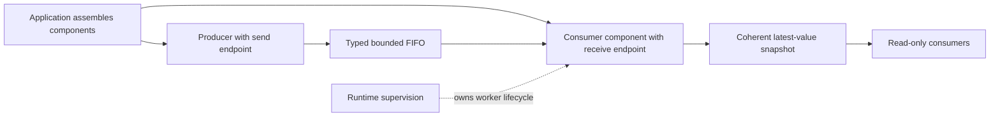

# Messaging and shared snapshots

Give components a small, typed way to hand work to an owner and publish coherent
state, before GLFW, Lua, or graphics depend on a transport convention. Preserve
Synarchy's owner-directed flow while building on Hetoimasia's completed resource,
worker, failure, and supervision contracts.

Design state: `ready for issue processing`

Owner: `coghex/hetoimasia`; publication target: `master`.
Started 2026-09-13 against Hetoimasia `8979877` and Synarchy `fe225c5`.
The owner granted readiness on 2026-09-13 after the review corrections in D-12.
The six-slice design was subsequently processed and implemented as issues
#74–#79 through PRs #80–#85. Epic #73 is closed. The retained ready state records
the approved design; it does not mean another implementation should be filed.
Current behavior is documented in [messaging.md](messaging.md).

Status legend: `[ ]` unprocessed · `[#N]` linked to issue N · `[no-issue]`
reviewed and deliberately not tracked separately · `[deferred]` blocked on a
concrete precondition

## Processing status

- [x] EPIC. Establish typed component messaging and coherent snapshots — [#73]
- [x] MSG-1. Prepare immutable payloads before publication — [#74]
- [x] MSG-2. Preserve structured failure origins inside STM — [#75]
- [x] MSG-3. Add bounded FIFO channels with terminal state and telemetry — [#76]
- [x] MSG-4. Publish coherent snapshots with checked cursors — [#77]
- [x] MSG-5. Own supervised inbox startup and stopping — [#78]
- [x] MSG-6. Finish inbox services through an acknowledged drain — [#79]

The owner approved the behavioral choices in D-4 through D-11 and granted
readiness to the corrected specification in D-12. All eight design questions are
resolved. The six delivery slices below mirror the completed processing ledger.
All six children have merged; do not refile them.

## Epic contract

The behavioral choices are approved in D-4 through D-11. D-12 records readiness
for the corrected specification and six-slice delivery plan below.

- **Goal:** a component can accept bounded work, publish current state, and
  stop without leaving a caller blocked on a channel whose consumer has gone.
- **Done when:** the selected primitives have opaque public handles, explicit
  admission and terminal outcomes, documented ownership and evaluation rules,
  and Hspec evidence of their composition with the actual worker and supervision
  APIs. No window, GPU, or Lua VM is needed to prove those contracts.
- **Users:** component authors and the application assembling their services.
- **Arc label:** `messaging` (created during processing).

The complete arc includes producer preparation, origin-aware STM failures,
FIFO channels, snapshots, and the optional supervised inbox-service adapter.
Individual slices must document only the behavior they actually deliver; the
adapter's graceful-finish guarantee is complete only when MSG-6 lands.

## Verified design baseline

Hetoimasia's runtime arc #52 is complete, including repairs #69 and #70. The
reviewed baseline passes 298 engine and 262 workflow Hspec examples, both smoke
modes, and the original evidence-loss reproductions. Remote CI is Linux-only;
macOS verification remains local.

- `packages/foundation/src/Hetoimasia/Foundation/Resource.hs` provides scoped
  acquisition and composition. Controlled releases must not wait on arbitrary
  callbacks or child termination.
- `packages/foundation/src/Hetoimasia/Foundation/Worker.hs` provides raw worker
  ownership, `StopToken`, STM stop/completion observations, and a protected drain.
- `packages/runtime/src/Hetoimasia/Runtime/Supervision.hs` provides calling-thread
  checkpoints and `awaitSupervised`. Any pending worker outcome, or a latched
  fatal disposition, takes precedence over caller work in the same transaction.
  Nonfatal outcomes are settled before the wait loops; fatal outcomes propagate
  without committing caller work. Workers observe their stop tokens instead of
  calling the application thread's supervisor.
- `packages/runtime/src/Hetoimasia/Runtime/Application.hs` composes application-owned
  dependencies and services. Worker draining precedes dependency disposal.
- `Hetoimasia.Runtime.Resources.resourceSmoke`, in the runtime package, uses an
  in-memory `Channel` as an example resource. It is not a production messaging
  API. There is no reusable channel/snapshot module yet.
- GHC 9.12.2 supplies `stm-2.5.3.1`; its installed Haddock documents an abstract,
  bounded FIFO `TBQueue`. Its write retries when full. The proposed wrapper adds
  endpoint authority, lifecycle, ordinary admission results, and observability.
- The complete all-state issue listing on 2026-09-13 contains no existing
  messaging arc. Runtime #52 explicitly excludes messaging transport. Final
  per-child deduplication belongs to processing after design approval.

## What Synarchy contributes

Read-only inspection of `~/work/synarchy` at `fe225c5` found these useful choices
and the reasons to keep their intent. No source has been copied or changed.

| Evidence | Lesson for Hetoimasia |
|---|---|
| `src/Engine/Core/Queue.hs`: typed `Queue a`, blocking/nonblocking reads, transactional timeout, counters, atomic statistics | Keep typed transport, composable waiting, and consistent observations. Separate transaction work from IO effects and payload evaluation. |
| `src/Engine/Core/State.hs`: separate input, Lua, world, unit, building, combat, and simulation queues | Give each destination its own protocol and mutation owner. Create endpoints in component construction instead of collecting all queues in an engine-wide environment. |
| `src/Engine/Scripting/Lua/Types.hs`: `LuaToEngineMsg` versus `LuaMsg` | Preserve directional protocols. Their concrete graphics, UI, input, and gameplay imports also show why the generic transport must not own the message sum. |
| `src/Engine/Scripting/Lua/Thread/Scheduler.hs`: bounded engine/console rounds, timer opportunities, admission rechecks | Bound work per turn. Continuous traffic must not starve timers or stop checks; count work actually taken, including entries that are subsequently rejected. |
| `src/Engine/Scripting/Lua/Message.hs`: contiguous texture-load batches under the same sampler policy | Batch where the consumer understands equivalence and ordering. A generic queue must not reorder or coalesce commands by guessing their meaning. |
| `src/Engine/Input/Thread/Dispatch.hs`: publishes processed input state before later event dispatch | State and related notifications need an explicit publication order. A coherent snapshot alone does not establish the relationship between separate state and event streams. |
| `test-headless/Test/Headless/Lua/MessageStrictness.hs` | Force/validate messages at a deliberate producer boundary so a producer error does not first surface in the consuming worker. Strict fields and deep evaluation are different guarantees. |
| `src/Engine/Core/State.hs`: `queueZoomAtlasUpload` replaces pending work for a particular page | Some traffic represents replaceable state. Model that separately from commands that must remain ordered. Its resource-retirement policy stays with graphics. |
| `docs/engine_contracts.md`, save/load cutover; `src/World/Load/Publish.hs` and Lua scheduler carry handling | Emptying a queue cannot retract a message already held by a consumer. Session replacement requires a real cutover; an old queue must not silently become a new session's queue. |
| `src/Engine/Scripting/Lua/Thread.hs`: `drainDebugQueue` terminalizes pending console requests | A future request/reply layer must resolve pending requests when its consumer ends. Merely dropping a request with a reply cell can strand its caller. |

Synarchy's generic `Queue` is currently unbounded and has no close/abort state;
its module explicitly leaves admission policy for later. Its queue module also
exports its representation. These are facts about the existing boundary, not
claims that every current consumer is broken. Hetoimasia can establish stronger
boundaries before consumers accumulate around it.

## Decisions

### D-1. Establish infrastructure before graphics

The owner selected methodical messaging, lifecycle, threading, and independent
GLFW work before Vulkan. This arc tests infrastructure without a triangle app.

### D-2. Keep component ownership and application assembly

The application assembles narrow services. Components own their protocols,
private state, and lifetimes; foundation owns reusable mechanisms and runtime
owns application policy. No universal `EngineEnv`, registry, or application monad.

### D-3. Prefer Hspec and preserve platform policy

Use Hspec for these CPU contracts, with explicit concurrency coordination and
no timing sleeps as correctness assertions. Linux CI runs remotely; macOS
validation runs locally. Python probes need a boundary Hspec cannot reasonably
exercise; none is presently identified here.

### D-4. Include FIFO channels and snapshots in the first arc

The owner explicitly selected bounded FIFO channels for commands/events plus
latest-value snapshots for state, deferring broadcast subscriptions and
request/reply. This resolves Q-1's scope choice. Both primitives belong in this
arc. D-7 and D-8 subsequently settle payload evaluation and snapshot observation.

### D-5. Report full admission immediately; waiting is explicit

The owner explicitly selected an immediate `Full` outcome for ordinary sends
and a separate operation for callers choosing a cancellable wait. This resolves
Q-2. Saturation does not silently discard a value or implicitly park its producer;
the sender retains responsibility for work that was not accepted.

### D-6. Preserve queued work on close; discard through explicit abort

The owner explicitly selected close that rejects new messages and preserves
the backlog for draining, plus a separate abort that discards pending messages.
Neither operation runs message handlers. This resolves Q-3's primitive choice;
D-10 subsequently settles the standard inbox service's finish/stop policy.

### D-7. Require producer-side deep preparation before publication

The owner explicitly selected an opaque payload prepared to normal form through
`NFData` on the producer's thread before FIFO or snapshot publication. This
resolves Q-4. Publication cannot accept an unprepared value through the initial
public interface; no weak-head-only bypass is included. Evaluation runs outside
STM, and a preparation failure publishes nothing. The guarantee depends on
lawful `NFData` instances, and the producer pays the preparation cost.

### D-8. Give snapshots an initial value and checked independent cursors

The owner explicitly selected an initial snapshot value, independent opaque
reader cursors tied to that snapshot, and retention of the final value after
close. Update waiters observe an unseen final publication before end-of-stream;
using another snapshot's cursor raises a clear typed misuse error. This resolves
Q-6. A reader advances its own cursor; reading never acknowledges for other
readers, and closing does not invalidate inspection of the last value.

### D-9. Begin with atomic counters; defer timestamps and age

The owner explicitly selected depth/capacity, high-water, accepted, dequeued,
and discarded counts for initial messaging telemetry, deferring per-message
timestamps and queue-age measurement. This resolves Q-7. Counter changes must
commit with the queue operation they describe; no clock read or per-message
diagnostic is added to the transport path.

### D-10. Make graceful finish explicit; ordinary stop aborts backlog

The owner explicitly selected graceful finish that closes admission, completes
accepted work, acknowledges drain, then requests stop and awaits cleanup.
Ordinary stop aborts pending work. In-flight effects are never automatically
retried. This resolves Q-5 and preserves the existing service classification:
draining alone does not authorize a service to return before its stop request.

### D-11. Include the reusable runtime inbox-service adapter

The owner explicitly selected a small optional runtime adapter for supervised
inbox services, including worker-owned inbox startup, safe endpoint handoff,
closure on failure, and the finish/stop protocol. Foundation channels and
snapshots remain usable independently. This resolves Q-8; a second supervisor,
global dispatcher, or general actor framework is outside this adapter's scope.

### D-12. Accept the review corrections and grant processing readiness

On 2026-09-13 the owner requested the final two review corrections and directed
that the document then be marked ready. The adapter does not isolate thrown
handler failures per message: an escaping synchronous exception fails the worker
and reaches the existing supervisor after inbox abort and cleanup. A handler
that can safely recover must do so explicitly before the exception escapes.
MSG-5 delivers only cumulative discards in its opaque ordinary-stop exit record;
MSG-6 adds drain evidence with the actual finish protocol. The corrected public
contracts and six-slice plan are approved for issue processing. This signoff
creates no tracker artifact and does not publish or implement the design.

## Design

D-4 through D-11 approve the behavioral choices identified above. The P-N sections
retain their stable identifiers from the proposal conversation and spell out the
implementation contract accepted for processing in D-12.

### P-1. Two distinct primitives

1. **Bounded FIFO channel:** ordered commands or events directed to one logical
   consumer. Many producers may hold its send endpoint. Each committed dequeue
   removes one entry; accepted entries are neither silently dropped nor merged.
2. **Latest-value snapshot:** one logical publisher, many readers, and one
   coherent current value. Readers may miss intermediate versions intentionally;
   reads do not consume another reader's state. A reader can wait for a newer
   publication using its own revision observation.

Examples: an asset-load request belongs in a FIFO; a complete current scene or
framebuffer extent can be a snapshot. Key transitions, text input, scroll deltas,
and resource-disposal commands cannot be replaced just because a later value
arrived. Input events must carry the state they need, or use an explicitly
ordered publication protocol; independently coalescing cursor state can change
what a click means.

Broadcast/subscriptions and request/reply are deferred by D-4. Other first-arc
exclusions are durable delivery, automatic retries, worker pools, a general
scheduler, and a central event dispatcher. Those can use these primitives when
a real consumer establishes their semantics. In particular, this channel does
not promise that every subscriber receives an event.

These are new process-local APIs. This arc migrates no Synarchy component and
establishes no serialized protocol, game save format, cross-process transport,
or deterministic replay guarantee. Component protocols can evolve independently
of the generic transport; public ownership and lifecycle contracts must be
documented with each implementation PR.

### P-2. Keep transport below protocols and supervision

Place generic primitives in the existing foundation package, under a small
`Hetoimasia.Foundation.Messaging` module family. They may use STM and foundation
contracts but cannot import runtime, GLFW, Vulkan, Lua, or a game. Runtime
integration and application examples demonstrate lifecycle composition; no
second supervisor is introduced.

Expose separate abstract send, receive, owner-control, and snapshot read/write
handles, with ordinary accessor functions rather than public record selectors
that can replace private state. No raw `TBQueue` or `TVar` escapes. Component
construction grants capabilities; ordinary producers cannot close the channel
or steal messages, and readers cannot replace a snapshot.

One logical consumer/publisher is an ownership convention and construction
contract. Ordinary Haskell handles remain shareable: hiding constructors is not
a claim that the type system enforces linear use or a particular OS thread.

### P-3. Make capacity and waiting explicit

Each FIFO is created in IO with a validated positive capacity chosen by its
owning component. Invalid capacity raises a typed construction failure through
the existing IO origin helper before a usable channel exists; no clamping
or zero-capacity rendezvous behavior is implicit. There is no arbitrary
engine-wide default. This bounds queued entries, not payload bytes, blocked
producer count, or work already held by
consumers; those remain separate admission budgets where needed.

Ordinary send outcomes distinguish `Accepted`, `Full`, and `Closed`. `Full`
leaves the queue unchanged and the caller retains responsibility for its value.
It is not a warning or fatal exception by itself. The boundary deciding to
reject, defer, or disable work owns that policy and any diagnostic.
Terminal state takes precedence over fullness: a full closed channel reports
`Closed`. A waiting send returns closure rather than retrying forever once
admission ends. An immediate receive distinguishes an item, open-but-empty,
and terminal state; a waiting receive retries only while open and empty.
FIFO operations have no additional typed misuse failure inside STM in this arc;
MSG-3 therefore needs MSG-1, not MSG-2.

Both send operations deliberately collapse normal close and abort to `Closed`.
A send endpoint does not reveal why its owner stopped accepting work. A producer
that needs that reason must receive separate read-only service/status observation
from its component, or use that component's protocol. Do not grant stop/abort
authority merely to let a producer inspect availability.

A separate send operation waits for capacity, and the core receive/send
operations compose in STM. Application-thread waits go through
`awaitSupervised`; worker waits combine channel operations with their own stop
token and, where necessary, the destination's completion. A timer, when needed,
is established outside STM and raced inside the transaction. No clock, logger,
payload handler, or `unsafeIOToSTM` runs in transport transactions.

Nonblocking admission is the approved default (D-5): window callbacks and two
workers exchanging commands must not acquire implicit circular waits. An opt-in
blocking send is cancellable but that alone does not make a dependency cycle
deadlock-free. Each consumer protocol must document where waiting is safe.

FIFO means order of committed insertions. Concurrent producers have no promised
wall-clock order, deterministic replay, or scheduler fairness. Multi-input loops
need an explicit service order; a permanently ready left branch of `orElse`
is not a round-robin scheduler.

### P-4. Separate close from abort

Channel lifetime direction approved by D-6:

- **Open:** accepts messages while capacity permits.
- **Closed with backlog:** rejects all new sends; readers can drain accepted
  messages in FIFO order.
- **Closed and empty:** receives report end-of-stream without blocking.
- **Abort:** closes admission and discards whatever remains queued, reporting
  the discard count. It cannot recall a message already dequeued.

Close and abort are idempotent STM operations. Closing wakes blocked senders
and empty-channel readers; the closed flag participates in the same transaction
as admission/dequeue. An immediate read distinguishes an open-but-empty channel
from a terminal channel. An abort never invokes payload callbacks or destructors.
The channel never reopens. A replacement component/session creates fresh state
and endpoints; stale endpoints still address the closed old lifetime.

Terminal reads distinguish normal closure from abort. Abort can strengthen a
previous close and discard its remaining backlog; a later close cannot weaken
abort. Each abort returns only the number it actually discards, so a repeated
abort of an empty channel reports zero and changes no cumulative count. A prior
successful receive or completed drain cannot be retroactively undone by abort.

Abort reads the existing atomic depth counter, drops the queued references,
sets depth to zero, and adds the saved depth to discarded in one transaction.
Never count discarded entries by traversing a flushed list. With `TBQueue`,
`flushTBQueue` returns a lazy `xs ++ reverse ys`; discard that result without
forcing its spine or payloads. Close and abort must never execute STM `retry`
or wait for another participant: abort is also used by a controlled release.
Normal transaction conflict restarts are distinct from explicitly waiting with
`retry`; this contract does not claim a contention-independent time bound.

Custom consumers select their closing policy; the standard adapter follows
D-10's explicit finish and abort-on-stop contract. Transport alone promises
neither handler completion nor automatic replay. Cancellation can arrive after a dequeue
commits; business-level acknowledgement and retry require a separate protocol.

### P-5. Fit closing into the existing worker contract

A worker-backed component must close its input when startup fails or its
consuming worker terminates, including an optional worker becoming unavailable.
Producers must not keep successfully submitting to an abandoned queue. Admission
closure must precede teardown of the worker's startup-owned component resources
and be reachable before any join that depends on it. A safeguard that closes
only after those resources have been released is too late for the adapter.

Do not rely only on an outer resource release: `runScopedApplication` drains
workers before releasing its dependencies, so a worker waiting for that later
release to close its channel would deadlock shutdown. Component coordination
needs an earlier close/abort transition; an idempotent outer release is a final
safeguard. No handler execution or worker join belongs in that controlled release.

Service completion also needs deliberate ordering: closing a mailbox does not
by itself make a service's return expected under supervision. The component's
stop protocol must record the stop request and coordinate the consumer's exit;
a finite consumer may instead be a `Job`. The integration contract must cover
this race. P-8 specifies it for the reusable `Service` adapter selected in D-11;
custom consumers must provide the corresponding contract for their own loops.

Use bounded dispatch turns, preserving Synarchy's scheduler lesson. Check
control/admission between dispatches and allow other work classes a turn. A
message-count budget gives opportunities to run; it cannot bound one arbitrary
handler's wall-clock duration. Do not introduce a global scheduling service in
this arc or automatically replay a partially handled command.

### P-6. Publish snapshots as one value

A snapshot is a complete immutable value and revision, published together.
Readers see one publication, never a mix of individually updated fields. Reads
leave it available to other readers. Waiting readers retain their own cursor;
there is no shared "last seen" field that lets one reader acknowledge for all.

Approved by D-8: construction supplies a prepared initial value; close freezes
the last value for inspection and wakes update waiters, which can observe a final
unseen publication before reporting end-of-stream. A new lifetime is a new cell, not
a revision reset on an old one. An opaque observation pairs the value with a
cursor identifying that snapshot and a non-wrapping local revision. Identity
must remain distinct across live and retained old handles; comparing a hash or
revision alone is insufficient. Waiting with another snapshot's cursor throws
a typed API-misuse failure before inspecting update/terminal readiness or
waiting, using P-9's STM origin helper. Each reader advances its own cursor
after observing a publication. Reusing an older cursor may return the current
value again; the transport does not keep a mutable acknowledgement per reader.
Q-6 is resolved by D-8. Neither a snapshot nor a FIFO grants lifetime
ownership over foreign pointers, a Lua VM, or GPU resources contained in a value.

Each committed publication advances the revision, including publication of an
equal value; no `Eq` constraint or content comparison is required. Publishing
after close returns a normal closed outcome without changing value or revision.
A current read remains available after close. Waiting with a valid cursor
returns the newest unseen publication and its cursor, or end-of-stream if
closed with nothing newer. Before close, that latter case retries. An STM
rollback advances neither the value nor the revision.

### P-7. Establish payload evaluation and telemetry deliberately

Retain Synarchy's producer-side validation/evaluation intent. Do not deep-force
a message or a captured backlog in STM. D-7 requires preparing payloads in
IO before publication. Use strict protocol records alongside an opaque
prepared-value handle whose supported constructor evaluates the
payload to normal form through `NFData`, outside STM. Both FIFO publication and
snapshot publication accept this handle; preparing once allows explicit admission
retries without repeating evaluation. The ordinary send's immediate result refers
to admission of an already prepared value, not a bound on arbitrary preparation.

This strengthens Synarchy's outer/strict-field boundary: a throwing thunk nested
inside a list or other lazy field should fail in preparation before anything is
queued. The guarantee relies on lawful component-owned `NFData` instances; the
transport cannot prove an arbitrary instance correct. Deep preparation can cost
more for large structures, so packed representations and measured workload costs
matter. D-7 excludes a weak-head-only bypass from the initial public interface.
The implementing slice must declare the `deepseq` dependency that provides
`NFData` in both foundation and the root `hetoimasia-tests` suite, whose test
payloads define their own instances, along with the public preparation contract
and its tests. Register new test modules in the root Cabal `other-modules` list
and compose their spec in `Test.Engine.Spec`. Explicit package lists used by
external-client tests must include `deepseq` when their clients import it.
The prepared handle has a private constructor and no record-update, coercion,
mapping, or other supported shortcut that can replace its checked payload.
Read-only extraction for consumers is permitted. Native evaluation failures
retain their type and existing context under the producer's operation boundary;
cancellation propagates as cancellation. Payload preparation logs nothing itself.

Successful FIFO receives return `Prepared a`; snapshot observations pair a
`Prepared a` with their opaque cursor. Provide a pure read-only accessor from
`Prepared a` to `a` for handling or inspection. Forwarding an unchanged payload
to another FIFO or snapshot needs no second preparation or `NFData` constraint
at the forwarding operation. Transforming it produces a new raw value that must
be prepared again in producer IO before publication. Runtime handlers receive
the prepared handle too, so the adapter does not erase this forwarding ability.

Queued values should be ordinary owned immutable data or identifiers whose
consumer establishes validity. Queuing an IO closure or borrowed native handle
does not extend its resource scope. Generic messaging will not call arbitrary
release functions on discard. Resource ownership transfer and GPU retirement
need their own contracts.

Keep inexpensive telemetry in the transaction that changes queue state: depth,
capacity, high-water depth, accepted, dequeued, and discarded counts. The
invariant is `accepted = dequeued + discarded + depth`; cumulative counts use
non-wrapping nonnegative integers. Depth and high-water stay within the declared
positive capacity, with any representation limit checked during construction.
High-water never decreases during that channel's lifetime. An STM retry or failed
admission must not count as accepted work. Statistics expose no mutable internals
or payloads, and do not log per message.

Approved by D-9: start with counters, defer per-entry timestamps. Synarchy samples
enqueue time outside STM; once writes can block for capacity, a timestamp sampled
before waiting can include producer delay rather than queue residence. Adding
that measurement needs an honest definition and measured value, not unsafe clock
IO in STM or a claim of negligible cost without evidence.

### P-8. A narrow runtime adapter for inbox-backed services

D-11 includes one reusable adapter in runtime for a supervised `Service` with
one FIFO inbox and a component-owned handler/context. The foundation primitives
remain independently usable on the application thread, by finite jobs, and by
components with custom loops. This adapter is optional; a mailbox does not
automatically require a worker. It reuses `startSupervised` and the existing
worker scope rather than introducing another runner, thread registry, restart
policy, request/reply layer, or timer scheduler.

**Startup and ownership:** construct the component context and its owned resources
inside the worker's `Scoped` startup first. Then allocate the inbox and register
its abort release as the innermost allocation, so reverse scope order closes
admission before component teardown. Perform no further component-resource
allocation after that guard. If construction requires a different allocation
order, a composite must explicitly rank inbox abort ahead of those releases;
do not leave an inbox allocated first with its only guard running last.

The last startup step writes the endpoint bundle into a private one-shot handoff,
after all construction and cleanup registration succeed. That step completes
before `runChild` writes its startup acknowledgement. The handoff has one writer
and is never emptied. `startSupervised` owns its acknowledgement/fatal wait and
provides no hook to combine the cell read with that transaction. After it returns
`WorkerStarted`, inspect the already-full cell with a non-retrying read such as
`tryReadTMVar`. An empty cell is an internal adapter failure, raised in IO through
the existing origin helper; it must never start a second readiness wait. Any
duplicate write is likewise an invariant failure, not a reason to block.

A failed, cancelled, rejected, or unavailable start exposes no usable service
endpoint. A worker that ends immediately after successful acknowledgement still
closes its inbox before component teardown and terminal completion; startup never
promises that the service will remain alive indefinitely. Invariant failure or
owner cancellation during post-start handoff propagates through the existing
owning group boundary so the already-started worker is still stopped and drained.

The worker's scope owns the abort safeguard even if cancellation lands before
the run loop begins. Every exit from the consuming run therefore closes admission
and drops pending references before releasing its startup-owned component resources
and before publishing terminal completion. This release runs under
`uninterruptibleMask_`: its STM abort must never `retry`, wait on an empty cell,
invoke handlers, log, or join a worker. P-4's counter-based discard avoids walking
the backlog. Other borrowed dependencies remain protected by the existing group
drain, and cleanup failures retain the existing resource evidence.

The application owns the service control handle; ordinary producers receive only
its send endpoint. Keep constructors and representation-changing access private,
including any underlying managed worker. The adapter uses the `Service` role
and the owner's required/optional disposition and failure classifier. Management
and supervised waits run on the application thread; the worker receives its own
`StopToken` and component context, never the application's `RuntimeControl`.

**Handler failures:** a synchronous exception escaping a message handler fails
the worker's run action. The abort safeguard closes admission and discards the
remaining backlog before component teardown; the original exception and cleanup
evidence then reach the existing supervisor. With successful cleanup, a recognized
failure of an optional service becomes unavailable; required or unrecognized
failure is fatal. Retained cleanup failure is fatal under the existing policy.
The adapter adds no per-message isolation, catch-and-continue loop, warning-and-skip
policy, or automatic replay of the failed command.

To survive a bad command, the component's handler must handle a recognized
command failure itself, or use the existing bounded `recover` around an explicitly
safe owned operation before the exception escapes. It must handle the recovery
outcome deliberately, preserve cancellation and cleanup failures, and establish
safe replay before choosing a retry. This does not authorize replay of arbitrary
in-flight command effects. An exception that still escapes terminates the service.

**Finish/stop distinction approved by D-10:**

1. An explicit **graceful finish** closes admission while the worker is running.
   The worker finishes its current handler and then processes accepted backlog
   in FIFO order. It acknowledges `Drained` only after those handlers returned
   and it observed the normally closed, empty inbox. Empty queue depth alone is
   not an acknowledgement: one removed message may still be executing.
2. After acknowledging drain, the service waits for its stop token rather than
   returning unexpectedly. The owner observes drain through a supervised wait,
   calls `stopSupervised`, and awaits terminal completion. The stop request thus
   precedes the service's return and preserves the existing classification rule.
3. An ordinary **stop request** takes priority over selecting another message,
   aborts pending work, and lets the service return. This is also how the adapter
   responds to the group/supervisor's cooperative stop. It does not automatically
   execute backlog during a fatal shutdown. Cancellation or failure uses the same
   abort safeguard while preserving its original failure and cleanup evidence.
4. A message already selected by a committed receive is in flight. Stop cannot
   retract its effects, and the adapter cannot preempt arbitrary handler IO by
   polling. Cancellation follows the existing worker API; no handler is retried.
5. Finish waits observe both drain acknowledgement and worker completion. A stop
   or abort before drain yields an explicit unfinished/aborted result. Recognized
   optional failure yields unavailable with its retained evidence and the existing
   supervisor's single warning; required, unrecognized, and cleanup failures
   propagate through supervision with their original evidence. No waiter assumes
   that discarded backlog was processed, or waits forever for a marker a dead worker
   can no longer publish. Cleanup failure prevents reporting successful finish.

At the dispatch boundary, check stop, select the next receive outcome, and
record a normal empty-channel drain acknowledgement in one STM decision.
A cached end-of-stream observation must not become `Drained` after stop or
abort has already won that decision. A cooperative stop is handled at the next
stop check; setting the token alone does not promise immediate admission closure
while an arbitrary handler is stuck. Explicit graceful finish closes admission
before waiting, and every actual worker exit closes it before public completion.

Successful finish requires a genuine drain acknowledgement, a normal
`Succeeded InboxExit` recording that drain and zero discards, successful cleanup,
and the existing expected-stop classification. Waiting only for drain,
or mapping every terminal worker to success, is insufficient. Cancellation after
drain retains the acknowledgement and cancelled completion but is not a normal
successful finish, even when supervision correctly classifies it as an expected
stop. A raw completion
observation must not bypass supervision's pending dispositions and fatal latch.
If owner cancellation interrupts finish, the existing group boundary still
stops/drains the worker with its dependencies alive before propagating it.

The terminal channel result must distinguish ordinary closure from abort, and
the adapter must retain a real drain acknowledgement. A later abort cannot undo
an already completed handler or invalidate an acknowledgement of completed drain.
Close/abort never reopen admission. Repeated finish/stop observations must not
re-run handlers or consume another observer's completion evidence.

**Ordinary stop accounting:** the adapter's run action returns a small immutable
`InboxExit` whose constructor is private and whose observations are ordinary
accessor functions. MSG-5 stores only the strict cumulative discarded-entry count
after the channel's terminal transition. MSG-6 adds strict drain-acknowledgement
state and its accessor when the real finish protocol exists; the existing discard
accessor stays compatible. On ordinary stop the adapter aborts first, then captures
the result from committed state before returning. The final abort safeguard is idempotent
and cannot increase that count once admission is closed and the queue is empty.
Use the cumulative counter, not the latest abort call's delta: a repeated abort
reports zero without erasing earlier discards. The count covers queued entries
discarded, never the success or effect count of an in-flight handler.

Expose read-only typed completion observation through the service handle so a
normal `Succeeded InboxExit` is retained after cleanup, including when the group
requests ordinary stop because the application action returned. MSG-5 has no
drain field, accessor, or handshake. MSG-6 adds the real acknowledgement and
captures it in the extended exit record when checking finish. Repeated
observations retain the same value and do not consume it.

Do not catch failure or cancellation merely to manufacture `InboxExit`.
`WorkerStopped` alone is insufficient: the worker may have been cancelled after
an owner request. Cancellation or synchronous failure retains the existing
`Completion` failure evidence, and cleanup failure can replace a successful run
result, so those paths need not contain an exit record. Finish uses both the
actual completion and the settled supervisor disposition; the record is not a
cleanup-success flag. Channel counters remain separately observable where the
owner retained that capability. Group summaries erase run-result payloads, so
the record is available through a retained typed service handle, not automatically
in the generic `GroupReport`. Automatic warning, archival, and process-durable
shutdown accounting are outside this addition.

Applications that require graceful completion request it while prerequisite
services are still available, before leaving the application action. Cross-service
drain ordering belongs to the application's dependency protocol; this adapter
does not promise to resolve cyclic service dependencies. A stuck handler retains
its resources under the already approved runtime policy; no hard deadline or
detachment is added here.

Dispatch remains one message at a time, with a stop check in the same STM choice
as each receive and handlers outside STM. The adapter owns only its single inbox;
it has no competing timer or console work class to schedule. Custom multi-input
loops retain P-5's bounded-turn responsibility. Include a coordinated public-API
example that demonstrates finite per-input budgets without adding a general
batch scheduler API before a production consumer needs one.

### P-9. Reuse structured failure origins inside STM

`Hetoimasia.Foundation.Failure.throwFailure` currently requires `MonadIO`; STM
cannot call it. Cursor validation must raise a typed failure transactionally,
with the same engine-origin annotation: component, operation, identifiers, and
source information from `HasCallStack`. Add a small `throwFailureSTM` companion
in that existing module, sharing its private origin representation and pure
evidence construction. Do not introduce a messaging error wrapper or copy the
private annotation into another module.

The companion preserves the original exception type/value and prior context,
and leaves asynchronous causes unannotated as the IO helper does. It performs
no IO, logging, recovery, payload evaluation, or unsafe STM escape. Existing
IO failure and operation-boundary behavior stays unchanged. This is a focused
prerequisite, not a general STM recovery or transaction framework.

This shares the engine-origin contract, not every annotation generated by the
underlying throw primitive. On GHC 9.12.2, `throwIO` can collect a backtrace;
`throwSTM` does not collect that IO-generated backtrace, and `collectBacktraces`
requires IO. Preserve annotations already supplied to the STM helper and record
the engine's own source annotation without unsafe IO. Acceptance compares typed
matching, engine evidence, and preservation of supplied annotations, not whole
IO-versus-STM context equality or identical rendered backtraces.

GHC 9.12.2's installed `GHC.Internal.Conc.Sync` and
`GHC.Internal.Exception.Type` sources confirm that `throwSTM`/`catchSTM` and
`ExceptionWithContext` can carry the existing exception context while preserving
typed matching. Verify that through public APIs in MSG-2. An exception escaping
`atomically` rolls back the transaction; a caller that deliberately catches inside
STM gets the ordinary `catchSTM` rollback scope, not a promise that earlier
unprotected writes disappear. Cursor misuse adds no committed transport change.

## State ownership

| State | Owner | Writers / readers | Lifetime and disposal |
|---|---|---|---|
| FIFO entries, capacity, terminal flag | Destination component | Granted producers and logical consumer through STM; close/abort authority held by component | One component/session invocation; terminal once, never reopened; queued references may be explicitly discarded |
| FIFO counters | Same channel | Transport operations only; read-only observers | Same invocation; changes commit with queue state |
| Snapshot value, revision, terminal flag | Publishing component | One logical publisher; many read-only consumers | One invocation; terminal publication retained for inspection |
| A reader's last revision | That reader | That reader only | Its subscription-by-cursor to this particular snapshot; never shared implicitly |
| Dispatch progress/budget | Consuming loop | Owning thread | One turn; no shared scheduler state in transport |
| Service handoff | Runtime inbox adapter | Worker startup publishes once; application reads after acknowledged startup | One start; never an independently published readiness signal |
| Drain acknowledgement | Same adapter | Worker publishes after successful drain; owner/finish observers read | One service; stable evidence, distinct from queue depth and worker completion |
| Ordinary stop exit record | Same adapter | Run action captures cumulative discards in MSG-5, adding drain state in MSG-6; typed completion observers read | Immutable ordinary result, retained by the service handle on successful cleanup; failure/cancellation keeps its own completion evidence instead |

## Open questions

### Q-1. First-arc scope

Resolved by D-4. The owner selected both primitives and deferred broadcast and
request/reply. FIFO-only was not selected; this keeps queued work and current
state distinct from the first arc.

### Q-2. Ordinary admission behavior

Resolved by D-5. Ordinary admission reports `Full` immediately; a caller must
explicitly select waiting. Blocking by default was not selected.

### Q-3. Terminal operations

Resolved by D-6. Close preserves queued work for draining; explicit abort
discards pending messages. Omitting abort and discarding on every close were
not selected. Component shutdown policy is separate from this primitive contract.

### Q-4. Payload preparation contract

Resolved by D-7. FIFO and snapshot publication require an opaque payload prepared
to normal form through `NFData` in producer IO. Documented conventions alone and
weak-head-only preparation were not selected. The extra producer-side evaluation
cost is accepted; no preparation runs inside the publication transaction.

### Q-5. Complete the component lifetime and dispatch contracts

Resolved by D-10. Explicit graceful finish closes admission, completes accepted
work, acknowledges drain, and then requests stop and awaits cleanup. Ordinary
stop aborts pending work; in-flight effects are never automatically retried.
Always draining on stop and omitting graceful finish from the arc were not
selected. Snapshot and telemetry choices originally grouped here are resolved
separately by Q-6/D-8 and Q-7/D-9; D-11 selects the reusable adapter.

### Q-6. Snapshot cursors and closing

Resolved by D-8. Construction supplies an initial value; independent opaque
cursors identify their snapshot; close retains the last value and wakes waiters.
An unseen final publication precedes end-of-stream. A cursor from another
snapshot raises a clear typed API-misuse error instead of comparing unrelated
revision numbers or waiting indefinitely.

### Q-7. Initial telemetry scope

Resolved by D-9. Keep atomic depth/capacity, high-water, accepted, dequeued, and
discarded counts. Defer per-message timestamps and queue-age measurement.
Specify non-wrapping cumulative counts so the conservation invariant remains
exact. Queue-age measurement would need a separate definition once producers
can wait for capacity.

### Q-8. Reusable runtime adapter or example-only integration

Resolved by D-11. Include P-8's reusable runtime adapter for supervised inbox
services, owning startup handoff, abort safeguard, and finish/stop. An example-only
integration was not selected. Foundation transport remains independent, and
main-thread/custom-loop consumers do not need the adapter. This introduces no
global scheduling or actor framework.

## Verification strategy

Prefer a `Test.Engine.Messaging` group composed by `Test.Engine.Spec`, with
integration assertions in `Runtime` or `Workers` where those contracts are the
subject. Reuse the CPU coordination helpers in
`Test.Engine.Runtime.Supervision.Support` and the external-client harness in
`Test.Engine.Resources.Opacity`, following `Test.Engine.Runtime.Opacity` for
runtime clients. Exercise the production public scope and worker APIs. Epic #49
is still open; its shared graphics-fixture slice is deferred and is not a
prerequisite or an existing fixture for this arc.

The acceptance matrix covers:

- FIFO and concurrent producer behavior, capacity, invalid capacity, and
  ordinary admission results; no timing-based ordering assertions.
- Send/receive versus close/abort races: every committed admission is accounted
  for, blocked operations wake, and discarded work cannot reappear.
- Actual `awaitSupervised` races with ready receives and full-channel sends:
  any pending outcome is settled before caller work. An unrelated job completion
  or optional failure resumes the wait after settlement without losing or
  duplicating work; a fatal outcome prevents the caller operation from committing.
- Worker stop/failure and failed startup with blocked producers/consumers;
  closure precedes dependent joins and no live consumer loses its dependencies.
- Close versus service return is classified under the accepted worker policy;
  no accidental `UnexpectedServiceExit` in the supported orderly-stop path.
- For the adapter: failed startup exposes no endpoints; every terminal
  consumer closes its inbox; graceful finish accounts for the last in-flight
  handler; ordinary stop with backlog does not manufacture `Drained`; finish
  notices interruption through terminal evidence; cleanup failure prevents success.
- Handoff is already populated when acknowledged startup returns; post-start
  observation cannot block. Component releases observe an already-closed inbox,
  including failure/cancellation paths. Abort accounts from depth without
  traversing the flushed backlog or waiting for another participant.
- Normal stop retains a typed exit record with the actual cumulative discards;
  group-triggered ordinary stop has the same accounting. A missing record after
  cancellation or cleanup failure never becomes fabricated success. Tests of
  generic group summaries do not expect them to retain typed run results.
- Recognized optional failure is unavailable, with one existing supervision
  warning; required/unrecognized failure remains fatal. Cancellation retains
  its type and cleanup evidence through startup, handling, and finish.
- An escaping synchronous handler exception stops dispatch, aborts queued work,
  and follows that supervision policy with its original evidence. The next queued
  handler is not invoked. Only explicit safe recovery inside a component handler
  can turn a bad command into a normal return and allow later dispatch.
- Multiple snapshot readers, coherent publication, skipped revisions, initial
  value, terminal waits, and stale/cross-lifetime cursors under the chosen policy.
- Producer evaluation failures attributed to the producer, with no queue/stat
  change and no expensive payload work forced by a transaction.
- Prepared handles survive receive and snapshot observation; unchanged values
  can be forwarded without another `NFData` evaluation. Changed values require
  fresh producer preparation.
- STM-raised typed misuse retains structured origin and prior context, supports
  typed catches inside and outside STM, and follows ordinary rollback semantics.
- Bounded dispatch opportunities under continuously ready traffic; any discarded
  or rejected dequeued entry still costs its service opportunity.
- External clients cannot construct, rewrite, or extract private transport
  state; positive clients can use every supported endpoint operation.
- Statistics remain consistent under rollback, failed admission, drain, and
  abort. Future performance claims require measurements; these tests establish
  correctness and bounded behavior, not a throughput target.

No new probe or separate remote platform job is proposed. Use the existing
validation planner; implementation documentation and any catalog changes belong
in the corresponding code PR. Verify counter-based abort by code inspection as
well as Hspec accounting assertions; timing thresholds do not prove that a
transaction avoids traversing its flushed list.

## Delivery plan

Six one-PR slices, approved for processing in D-12. MSG-1 and MSG-2 can proceed
independently. MSG-3 needs only MSG-1; MSG-4
needs both MSG-1 and MSG-2. The inbox path is MSG-1 → MSG-3 → MSG-5 → MSG-6,
while MSG-4 also gates MSG-6's combined verification. MSG-5 can begin after MSG-3
while snapshot work continues. MSG-6 completes the lifecycle and verifies the
two primitives together. Shared Cabal,
test-composition, and contract-document edits need ordinary merge coordination;
parallel work is not a promise of disjoint files.

Each slice includes public Haddock, its relevant `docs/messaging.md` or existing
failure/runtime contract updates, module-authoring/logging conventions, Hspec
coverage, and validation-catalog changes if required. Keep those changes in the
implementation PR. Use the existing platform and selective-CI policy. Do not
reopen the completed runtime/resource decisions or file implementation issues
from this design pass.

### MSG-1. Prepare immutable payloads before publication

- **Outcome:** producers can obtain an opaque prepared payload only after its
  `NFData` evaluation has completed in IO.
- **Scope:** a small foundation messaging payload module, an abstract `Prepared a`
  handle and pure read-only consumer access, bounded `deepseq` dependencies in
  foundation and `hetoimasia-tests`, and the `Test.Engine.Messaging` composition
  point with its root Cabal `other-modules` entries. Preserve native exceptions and
  cancellation through the existing producer operation context. Establish
  ownership and evaluation contracts without introducing transport state.
- **Phase:** 1, preparation.
- **Depends on:** none within this arc; use the reviewed foundation baseline.
- **Ordering:** can land first; independent of MSG-2.
- **Relevant decisions:** D-2, D-3, D-7.
- **Acceptance signals:** nested lazy-field failures surface during preparation;
  successful preparation can be reused without evaluation at admission; typed
  failure/cancellation and existing context survive. External clients can prepare
  and inspect values but cannot construct or rewrite a prepared payload through
  record updates, coercion, or mapping shortcuts. The new test group composes
  through `Test.Engine.Spec` and follows the existing nonempty-selection contract.
- **Out of scope:** FIFO/snapshot storage, weak-head-only bypass, logging from
  preparation, transport-level validation of arbitrary `NFData` instances.
- **Open questions:** None.

### MSG-2. Preserve structured failure origins inside STM

- **Outcome:** a typed failure raised inside STM retains the same structured
  origin and original exception as the IO failure API.
- **Scope:** P-9's additive `throwFailureSTM` companion in Foundation.Failure,
  sharing its private evidence contract. Update `docs/failures.md` and the
  owning Failures Hspec group. Keep existing IO behavior and exports compatible.
- **Phase:** 1, transactional failure boundary.
- **Depends on:** none within this arc; use the merged failure contract.
- **Ordering:** can land first; independent of MSG-1.
- **Relevant decisions:** D-2, D-3, D-8; preserves the completed runtime arc's
  native typed-failure and cancellation decisions.
- **Acceptance signals:** typed catches inside STM and outside `atomically`
  still match; origin, prior annotations, and operation contexts are retained;
  asynchronous causes remain unchanged. An escaping failure rolls back test TVar
  writes; caught failures obey ordinary `catchSTM` scope. Existing IO failure
  tests still pass, and raising/inspection introduce no logging or IO in STM.
  Compare the engine-origin annotation and retained supplied context, without
  requiring `throwIO` and `throwSTM` to generate identical backtraces.
- **Out of scope:** a central error sum, messaging-specific evidence copies,
  general STM recovery, or changes to the existing IO operation-boundary policy.
- **Open questions:** None.

### MSG-3. Add bounded FIFO channels with terminal state and telemetry

- **Outcome:** a component can accept prepared values into a bounded ordered
  inbox, observe admission, and close or abort without stranding transport waits.
- **Scope:** abstract send/receive/control handles, validated positive capacity,
  immediate send/read results carrying `Prepared a` on receive, explicit STM
  waits, close and abort with distinct
  terminal observations, and atomic non-wrapping telemetry. Add read-only
  statistics and the P-3/P-4/P-7 contracts under foundation messaging.
- **Phase:** 2, independent transports.
- **Depends on:** MSG-1.
- **Ordering:** critical path for the adapter; can run alongside MSG-4.
- **Relevant decisions:** D-2, D-3, D-4, D-5, D-6, D-7, D-9.
- **Acceptance signals:** Hspec proves FIFO order, capacity and invalid input,
  terminal-before-full precedence, wakeup on close/abort, and transactional
  admission/accounting under contention and rollback. Repeated abort reports
  only newly discarded entries, using depth without traversing a flushed list;
  counters conserve all accepted work. Close/abort never wait with STM `retry`.
  Public `awaitSupervised` tests show pending outcomes are settled first and
  pending fatal failure prevents a ready receive or newly possible send from
  committing. Prepared values can be forwarded unchanged. External-client tests enforce endpoint
  authority and allow every supported operation. No transaction forces payloads
  or invokes IO callbacks.
- **Out of scope:** runtime service construction, batching/coalescing, timers,
  per-message age, producer fairness, handler acknowledgement, and automatic retry.
- **Open questions:** None.

### MSG-4. Publish coherent snapshots with checked cursors

- **Outcome:** a publisher replaces one coherent prepared value while independent
  readers can inspect or wait for changes, including the final retained value.
- **Scope:** opaque publication/read handles and observations/cursors, prepared
  initial value, fresh snapshot identity, non-wrapping revision, transactional
  publication, and terminal behavior. Observations retain `Prepared a` for
  forwarding without preparation. Raise a typed cursor-mismatch failure
  through MSG-2 before waiting or accepting a foreign observation.
- **Phase:** 2, independent transports.
- **Depends on:** MSG-1, MSG-2.
- **Ordering:** independent of MSG-3; required by the final combined example.
- **Relevant decisions:** D-2, D-3, D-4, D-7, D-8.
- **Acceptance signals:** multiple readers never acknowledge for one another;
  initial and equal-value publications behave as specified; concurrent reads
  cannot mix fields or revisions. Unseen final publication precedes end-of-stream;
  current reads remain available after close; rejected publication and rollback
  change no value/revision. Same-revision cursors from another lifetime fail with
  their typed origin even when the target is closed. External clients cannot
  forge cursors or gain publication authority from a read endpoint.
- **Out of scope:** retained history, shared reader registry, broadcast delivery,
  event coalescing, cross-stream ordering policy, or native-resource ownership.
- **Open questions:** None.

### MSG-5. Own supervised inbox startup and stopping

- **Outcome:** an application can start an inbox-backed service, safely obtain
  its producer endpoint, and stop it with the inbox closed before completion.
- **Scope:** P-8's optional runtime adapter with worker-owned inbox construction,
  private startup handoff, component-scoped context/resources, single-message
  dispatch of prepared values, abort-on-stop/failure, and the ordinary-stop
  opaque `InboxExit` result containing only cumulative discards, with an ordinary
  read-only accessor and typed completion observation. Use the real startup acknowledgement,
  `StopToken`, and existing required/optional service supervision. Keep component
  protocols and handlers outside runtime. Expose only the control/observation
  operations needed for this lifecycle.
- **Phase:** 3, owned service integration.
- **Depends on:** MSG-3.
- **Ordering:** critical path for MSG-6; can run alongside MSG-4.
- **Relevant decisions:** D-2, D-3, D-5, D-6, D-10, D-11, D-12.
- **Acceptance signals:** coordinated public-API tests cover startup failure,
  rejected/unavailable start, cancellation before the run body, immediate worker
  exit after acknowledgement, and stop/failure with a full inbox. The final
  startup step fills the handoff before acknowledgement; its post-start read never
  waits, and internal handoff failures use the existing IO origin helper.
  No failed start exposes endpoints; component releases observe an already-closed
  inbox with backlog discarded, including on failure/cancellation. The abort
  safeguard never waits with STM `retry` or traverses the flushed list.
  Stop wins a simultaneously ready receive, and a committed receive is never
  retried automatically. Ordinary and group-triggered stops retain an
  `InboxExit` with the cumulative discarded count;
  repeated observation does not erase it. Failure/cancellation/cleanup failure
  follows actual completion semantics, not a manufactured ordinary exit.
  A synchronous handler exception stops dispatch and aborts the backlog before
  component teardown, preserving its original type/context: optional recognized
  failure becomes unavailable with the existing single warning; required or
  unrecognized failure is fatal, and cleanup evidence remains intact. A following
  queued message is not handled unless the component explicitly recovers inside
  its handler and returns normally. Dependencies stay alive through worker cleanup.
  External-client opacity tests prevent replacing any private managed worker or
  handoff state, or constructing/updating the private exit-record representation.
- **Out of scope:** public graceful finish, drain acknowledgement, and any drain
  field or accessor on `InboxExit` (MSG-6),
  snapshot publication policy, custom multi-input scheduling, and worker restart.
  Do not claim accepted backlog is processed on stop in this intermediate slice
  or prebuild unreachable graceful-finish machinery merely for the later PR.
- **Open questions:** None.

### MSG-6. Finish inbox services through an acknowledged drain

- **Outcome:** an application can explicitly finish accepted work, distinguish
  completion from aborted/unavailable work, and await cleanup safely.
- **Scope:** add the normal-close/drain-acknowledgement/stop/completion protocol
  to MSG-5. Wait for both drain and terminal evidence through `awaitSupervised`;
  successful drain leaves a `Service` waiting for stop, preserving its role.
  Add drain state and its read-only accessor to the private `InboxExit`
  representation, populate it from that acknowledgement, and preserve MSG-5's
  discard accessor. Check the actual typed completion together with the supervisor disposition.
  Include a small application-owned command protocol whose scoped worker publishes
  snapshots, closes its publication endpoint during teardown, and leaves the last
  value readable. Include P-8's bounded-turn custom-loop Hspec example without
  adding a general scheduling API.
- **Phase:** 4, completed component lifecycle.
- **Depends on:** MSG-4, MSG-5.
- **Ordering:** completes the arc after both transports and owned startup land.
- **Relevant decisions:** D-2, D-3, D-4, D-6, D-8, D-10, D-11, D-12.
- **Acceptance signals:** finish includes the last in-flight handler and FIFO
  backlog, records a real drain acknowledgement, requests stop before service
  return, and reports success only after successful cleanup. Stop/abort before
  drain yields unfinished/aborted; recognized optional failure yields unavailable;
  required/unrecognized/cleanup failure propagates through existing supervision.
  Finish never waits only on a marker a terminal worker can no longer produce.
  The drain-acknowledgement decision is atomic with the stop/terminal checks.
  Unrelated job completion or optional-worker unavailability is settled before
  the wait resumes; it cannot consume drain evidence or trigger a false finish.
  A normal graceful exit retains acknowledged drain and zero discards; ordinary
  stop retains its real count. MSG-5 clients using the discard accessor remain
  valid without naming the private extended representation. Cancellation after acknowledged drain is not a
  normal successful finish even if its settled status is `WorkerStopped`;
  cleanup failure remains fatal under the existing policy.
  Repeated finish/stop observations do not repeat effects or consume evidence;
  owner cancellation still drains with dependencies alive. The combined example
  proves final snapshot retention and command/state publication order, while
  explicit multi-input budgets provide service opportunities under ready traffic.
- **Out of scope:** per-message request/reply or business acknowledgements,
  automatic retry, cyclic dependency resolution, hard shutdown deadlines,
  detached workers, or any GLFW/Vulkan/Lua implementation.
- **Open questions:** None.
