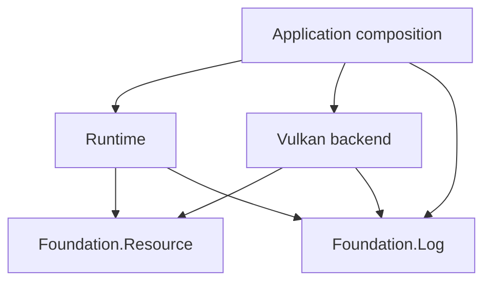

# Resource ownership design

Establish safe CPU ownership before implementing Vulkan. This is the detailed
delivery plan for FND-1 in the [foundation design](engine_foundation_design.md).

Design state: `ready for issue processing`

Owner: `coghex/hetoimasia`; publication target: `master`.
Readiness approved by the owner on 2026-09-10 following the Synarchy review and
explicit approval of the failure policy. Reviewed against `2062f8a`.
The owner requested publication to `master` on 2026-09-10. None of its APIs exists yet.

Status legend: `[ ]` unprocessed · `[#N]` linked to issue N · `[no-issue]`
reviewed and deliberately not tracked separately · `[deferred]` blocked on a
concrete precondition

## Processing status

- [ ] EPIC. Establish safe resource ownership and scoped composition
- [ ] RES-1. Implement failure-preserving CPU resource scopes
- [ ] RES-2. Protect composite resource construction and cleanup ordering
- [ ] RES-3. Add allocResource and nested continuation scopes
- [ ] RES-4. Exercise owned resources through the console runtime

## Epic contract

- **Goal:** callers compose resource lifetimes without application-wide state,
  unprotected successful acquisitions, or lost cleanup failures.
- **Done when:** the four slices pass Hspec, a console consumer exercises normal
  and failing lifetimes, and the public contract documents ownership and errors.
- **Users:** engine/game developers and future Vulkan/Lua component owners.
- **Arc label:** `resources` (proposed).
- **In scope:** CPU scope primitives, structured cleanup-failure evidence,
  exception-safe composite construction, a small CPS facade, integration/docs.
- **Out of scope:** Vulkan/Lua calls, workers/job systems, GPU retirement queues,
  asset stores, generational handles, public early-release/ownership-transfer
  APIs, region/linear types, and an application-wide monad. Their relationship
  is documented below so this foundation does not preclude them.
- **Verification baseline:** GHC 9.12.2, Cabal 3.16.1.0, existing Hspec suite;
  no GPU or Python probes are required.

## Tracker relationship and sequencing

Readiness recheck on 2026-09-10: no issues or open PRs in the target repository.
Recheck before filing. FND-1 delegates to this arc: when the broad foundation
design is processed, reuse this epic and its children instead of filing a second
resource implementation. FND-2/FND-5 retain their FND-1 prerequisite.

Process [logging](logging_design.md) first. Its LOG-3 merge is an external
implementation gate for this arc, honoring the owner's logging-first workflow;
it is not a dependency of the generic Resource module on the Log module.
The resource epic/children may be drafted before that merge. During issue
processing, resolve the logging epic/LOG-3 to real tracker references and record
the gate before any resource child is approved for implementation. Internal
`Depends on` fields below name only entries in this document.

## Decisions

## Accepted policy

### D-1. Preserve the primary failure and retain cleanup failures

Explicitly approved by the owner on 2026-09-10:

| Action | Cleanup | Outcome |
|---|---|---|
| Succeeds | Succeeds | Return the result |
| Fails | Succeeds | Preserve the original failure |
| Succeeds | Fails | Report cleanup failure |
| Fails | Fails | Preserve the original failure and retain cleanup failures as secondary evidence |

Attempt remaining eligible cleanup; cancellation remains a failure, and a broken
logger must not erase the outcome. Preserve the original exception's type/value
and existing context, with inspectable, ordered secondary cleanup failures.
When only cleanup fails, its first observed exception is primary; retain every
cleanup failure with its operation label. Successful cleanup is never reported
for an action that threw or was interrupted.

### D-2. Keep generic ownership independent of application services

The finalized design uses `Hetoimasia.Foundation.Resource` in the existing
foundation package. It imports no Logger, runtime environment, Vulkan, or game
module. Acquisition/release effects use IO exceptions; a returned application
`Either` remains ordinary data. No EngineM/MonadError adapter is shipped here.

### D-3. Keep scoped allocation over the lower primitive

The finalized direction retains `allocResource` and `locally` through an opaque
continuation wrapper after the lower primitive and composite ownership are
proven. Hide the constructor and arbitrary continuation resumption. The scope
callback borrows handles; the initial API does not enforce regions statically.

### D-4. Complete the CPU foundation before dynamic GPU ownership

The first deliverable is the bounded CPU arc above. Composite constructors own
partial rollback and final cleanup order. Do not port delayed cleanup
registration or loose manual closures. Public ownership transfer and GPU
retirement require their concrete backend/asset lifetime design later.

### D-5. Apply the established testing and delivery workflow

Use Hspec for success, failures, and cancellation, with coordinated threads and
temporary resources. Every code PR includes its required contract/docs/evidence.
Complete the logging implementation gate before solving this arc.

## Synarchy concepts worth retaining

Source inspection on 2026-09-10 at Synarchy
`36090b94a39a773f65a7e9dc236efd971b38269d`; the inspected resource, buffer, command,
image, worker, and texture-release files had no local changes. Paths below are
relative to `~/work/synarchy`. This was source review, not execution of Vulkan
failure paths, and Synarchy was not modified.

| Evidence | Concept to keep |
|---|---|
| `src/Engine/Core/Resource.hs`: `allocResource` | Acquire/release pairing composed through continuation-based `do` notation |
| `src/Engine/Graphics/Vulkan/BufferUtils.hs`: `createVulkanBuffer` | Deliberate cleanup order independent of acquisition order |
| `src/Engine/Graphics/Vulkan/Texture.hs`: `createTextureFromRGBABytes`; `src/Engine/Graphics/Vulkan/Command.hs`: `runCommandsOnce` | Short upload scopes plus an explicit normal-path GPU completion wait |
| `src/Engine/Graphics/Vulkan/Image.hs`; `src/Engine/Graphics/Vulkan/Sync.hs` | Replaceable resources have lifetimes shorter than application exit |
| `src/Engine/Graphics/Vulkan/Texture/Release.hs`: `planTextureRelease` | Pure alias invalidation and unique-slot release decisions, testable without a GPU |
| `src/Engine/Core/Workers.hs`; `src/Engine/Core/Thread.hs`; `test-headless/Test/Headless/Core/WorkerLifecycle.hs` | Named worker dependencies, confirmed joins, and failure tests with throwing diagnostics |

Preserve these concepts independently of their current game-specific types and
environment. In particular, the resource result type parameter in `EngineM` is
useful CPS machinery; its fixed EngineEnv/EngineState dependencies are separate
choices. Explicit completion in an upload helper is valuable, but cancellation
and failed waits still need a separate GPU-safety contract.

## Fate of the allocResource functions

| Existing helper | Actual semantics | Hetoimasia direction |
|---|---|---|
| `allocResource` | Runs release when the rest of its enclosing continuation exits | Retain as a thin scoped-allocation convenience over the new failure-safe primitive |
| `locally` | Runs a nested continuation to completion, releasing its scoped resources before the caller continues | Retain the nested-scope concept, especially for staging/upload work |
| `allocResource'` | Returns an action that installs cleanup around the *remaining continuation when called*; it does not free immediately | Replace its use with protected composite construction in RES-2; no public delayed-registration helper |
| `allocResource'IO` | Returns a plain release closure; acquisition installs no automatic scope cleanup | Deferred to a future dynamic-owner API with protected transfer and duplicate-release protection; no loose public closure in this arc |

The CPS facade follows this shape; exact private representation remains an
implementation detail constrained by D-1/D-3:

```haskell
newtype Scoped a = Scoped
  { withScoped ∷ forall r. (a → IO r) → IO r }

allocResource ∷ (a → IO ()) → IO a → Scoped a
allocResource release acquire =
  Scoped (withResource acquire release)
```

Here `withResource` is the lower primitive to implement in RES-1, including
acquisition/release exception protection. It is not an alias for plain `bracket`.
The usual continuation-based Monad composition would keep allocation in `do`
notation; neither the lower primitive nor this wrapper needs EngineEnv or Logger.
Hide the constructor and provide no arbitrary continuation resumption API.
The code above describes the planned layering, not an implemented module.

A scoped callback borrows its values. Do not return borrowed resources out of
`locally`; return ordinary results. The type above does not statically prevent
escaping handles, and this arc provides no escape/transfer operation. A future
dynamic owner's release capability must prevent repeated native destruction,
report failure, and respect GPU completion.

### Specific hazards to avoid when adapting the implementation

- `Resource.hs` lines 24–26 place `finally` around the continuation after
  allocation. The helper itself does not mask the acquisition-to-handler gap.
  The new primitive must protect that transition.
- `allocResource'` installs nothing until the returned action runs. In
  `BufferUtils.hs` lines 30–48, buffer creation precedes requirements lookup,
  memory-type selection, and memory allocation; `freeBufferLater` comes after
  them. A failure in that interval has no buffer cleanup installed by this
  helper. Preserve ordering without this registration gap.
- The `EngineM` error channel is a returned `Either`, distinct from an IO
  exception. The finalizer's returned `Left` in `allocResource` is ignored by
  `finally`; `allocResource'IO` instead reports it through the logger. Neither
  establishes D-1. Define any future typed-error adapter explicitly.
- `Image.hs` returns manual image/memory cleanup only after multiple acquisition
  steps, and sequences `cleanupImage >> cleanupMemory`. Returning a closure
  does not protect partial construction, and a throwing first cleanup skips the
  second. `Types/Cleanup.hs` likewise runs its fields as an ordinary sequence.

For a future Vulkan buffer, use one owned allocation constructor that protects
each partially built state, exposes a usable allocation after successful binding,
and explicitly orders destruction and backing-allocation release. RES-2 proves
this pattern with fake CPU resources, without inventing Vulkan types. A future
transfer to another scope/store must leave exactly one cleanup owner throughout;
do not unregister rollback protection and then hope publication succeeds.

## Placement and relationship to logging

Module placement within the existing package boundaries (backend/game rows
remain future context outside this arc):

| Component | Responsibility |
|---|---|
| `Hetoimasia.Foundation.Resource` | Small exception-safe scope primitives; no Logger, Vulkan, game state, or service registry |
| `Hetoimasia.Foundation.Log` | Independent diagnostics through a borrowed sink |
| Runtime | Application lifecycle and eventual worker supervision using narrow services |
| Vulkan backend | Native allocation dependencies, submission ownership, completion, and deferred disposal |
| Game/asset owners | Session state and explicit asset leases; GPU allocations remain backend-owned |

The arrows show the intended imports/service dependencies. Backend nodes remain
future work. Only the current logging/runtime bootstrap modules are implemented.



Logging and generic scope primitives are peers. A scope runs cleanup and exposes
its outcome even if no logger exists or its sink is broken. Owning subsystems
and application boundaries decide which diagnostics to emit. Resource failures
must not survive only as a message that may never reach the sink.

Keep the application's sink alive while its consumers shut down: stop/join
workers, release subsystem resources, then flush and close an owned log handle.
Borrowed stderr or another caller-owned handle remains that caller's property.
No logger call belongs in the gap between acquiring a resource and establishing
its cleanup protection.

RES-1 establishes the lower `with...` convention using standard exception
primitives and D-1. RES-2 exercises partial construction and deliberate cleanup
order. RES-3 adds continuation composition over the same primitive, with tests
that establish identical lifetime/error behavior.

Implement the accepted D-1 policy using an exception/report representation that
preserves intended catch behavior. Plain `bracket` alone does not implement that
whole policy when both the body and release throw.

## Future subsystem owners and lifetime boundaries

One subsystem owns each resource's mutation and destruction. Consumers receive
operations or opaque handles. Private IORefs and mutable arrays are legitimate
implementation choices; exposing them through an application-wide environment
makes the owner and allowed lifetime difficult to enforce.

| Owner | Owns | Ends or resets when |
|---|---|---|
| Application | Service composition | Process shutdown |
| Vulkan backend | Device, allocation machinery, completion tracking | All children and submitted uses have been retired |
| Swapchain generation | Its targets, views, and related state | Replacement is ready and old graphics/presentation uses have completed |
| Frame slot | Command pools, upload slices, transient descriptors | That slot's previous GPU uses have completed |
| Asset store | Shared CPU assets and GPU residency records | Explicit leases are released, then outstanding GPU uses complete |
| Game session | World state, session workers, asset leases | Session exit or load/restart |
| Lua host | VM and its registered bindings | Host scope ends after its users stop |

The asset store knows assets, references, and GPU residency. The game decides
which assets a world needs. A game object holds a mesh/texture identifier or
lease, not a Vulkan pointer. Generational handles can detect stale identifiers;
they do not by themselves establish ownership or keep GPU allocations alive.

Ordinary game state is Haskell data and is reclaimed normally when unreachable.
Foreign allocations, file handles, workers, and GPU resources need explicit
lifetime management. Ending a session cancels and joins its workers before
releasing the services they borrow.

## CPU acquisition and failure contract

Start with subsystem `with...` functions built on `bracket`. A constructor that
performs several allocations must unwind its own partial initialization. Register
each successful acquisition's cleanup before cancellation can strand it. Keep
each native dependency order inside the subsystem that understands it.
See [Control.Exception](https://hackage.haskell.org/package/base-4.21.0.0/docs/Control-Exception.html#v:bracket)
for acquisition/release masking and its interruption limits.

Illustrative composition, with names that are still proposals:

```haskell
withGpu logger gpuConfig $ \gpu →
  withAssetStore logger gpu $ \assets →
    withGameSession gameConfig assets $ \session →
      runGame session
```

The future subsystem callbacks above borrow their arguments. These ordinary types do not statically
prevent a handle from escaping; document borrowing and keep constructors/raw
handles private. Consider region types only if practical misuse warrants them.
Each service gets only its actual dependencies. `withGpu` must quiesce its GPU
work before native destruction; nested callbacks alone do not establish that.

Implement and test D-1 when cleanup itself fails. Remaining cleanup must still
be attempted, diagnostics must not obstruct it, and failures must stay observable.
An attempt is not proof of successful release: native owners must account for
unsafe dependent destruction after a failed GPU wait or failed child release.
Do not put unbounded GPU waits inside `uninterruptibleMask`.

## Future GPU retirement — outside this arc

CPU scope exit and GPU completion are separate events. Vulkan requires pending
uses to complete before destruction, and destroying referenced resources also
affects recorded command buffers. See the specification's
[object lifetime rules](https://docs.vulkan.org/spec/latest/chapters/fundamentals.html#fundamentals-objectmodel-lifetime)
and [command buffer lifecycle](https://docs.vulkan.org/spec/latest/chapters/cmdbuffers.html#commandbuffers-lifecycle).

For a dynamic texture, the proposed sequence is:

1. Release its last application lease; prevent new recording/submission from
   acquiring it, and invalidate or rebuild cached recordings that reference it.
2. Transfer its native cleanup to the backend's retirement queue, retaining
   the completion points covering every outstanding use.
3. Run cleanup and recycle allocations/descriptor slots only after those points
   complete. Releasing an application handle is not an immediate Vulkan free.

Publication, submission, and retirement need one defined synchronization owner
so a new use cannot race the last-use decision. Start with a single submission
owner and queue if the first scene permits it. Multiple independent queues need
completion evidence for each; their timeline values are not interchangeable.
Presentation lifetime also needs its own completion reasoning.

For the first device/offscreen probe, an explicit idle wait at teardown is a
reasonable starting point. Introduce deferred retirement when dynamic lifetimes
require it. Do not wait for device idle on every frame or allocation.

## Error representation and verification contract

RES-1 must expose structured cleanup failures containing an operation label and
the underlying exception/context, not just rendered strings. Provide a documented
way to inspect secondary failures without a working logger, while a typed catch
still recognizes the original primary exception. GHC's exception-context support
is one available mechanism; the particular representation is an implementation
choice subject to these observable requirements. Preserve nested secondary
failures as outer scopes unwind, without losing or duplicating entries.

Use IO exceptions for acquisition/release failures. Do not silently discard a
returned cleanup `Left`: release callbacks have type `IO ()`. A future typed-error
adapter needs its own contract. A failed composite acquisition cleans up its
partial state; the outer owner must not release a nonexistent completed result.

After successful acquisition, establish cleanup protection before user code,
logging, or cancellation can strand the resource. Restore the caller's masking
state during normal use. Invoke each registered cleanup at most once per scope
exit and attempt remaining eligible actions after a throwing/interrupted cleanup.
Report failed attempts; do not retry a possibly half-completed native destructor
automatically. This is not a guarantee against process termination, repeated
external interruption, or indefinitely blocking destructors.

Hspec covers every row of D-1, multiple/nested cleanup failures, typed catch
behavior, metadata inspection, acquisition failure at each composite stage,
normal and exceptional cleanup order, and controlled asynchronous cancellation.
Coordinate with MVars or equivalent signals; timeouts only bound stuck tests.
Run the same behavior through the direct and CPS APIs. Real-handle checks use
temporary files without modifying personal configuration. No tests need Vulkan.

## Resolved questions and implementation latitude

### Q-1. Failure policy and representation

Policy resolved by D-1. Representation is chosen in RES-1 within the explicit
typed-catch and structured-inspection requirements above. Reject an
implementation that preserves only the message or requires logging to retain
secondary failures; changing those requirements returns to design review.

### Q-2. Continuation approach and primed helpers

Resolved by D-3/D-4. Deliver the thin opaque CPS facade and protected composite
constructors. A public early-release/transfer API and GPU disposal remain deferred
to their own concrete lifetime work; they are not blockers for this CPU arc.

### Q-3. Relationship to logging and the foundation plan

Resolved by D-5 and the tracker relationship above. Drafting is allowed now;
implementation waits for the logging gate. FND-1 reuses this arc.

No blocking design questions remain. Exact private types, module subdivision,
and diagnostic labels are implementation details. Do not add an application
environment, a second error channel, or a global finalizer registry.

## Delivery plan

### RES-1. Implement failure-preserving CPU resource scopes

- **Outcome:** a generic scope pairs successful acquisition with cleanup and
  implements every D-1 outcome with inspectable secondary failures.
- **Scope:** Resource facade, lower `withResource` primitive, labeled cleanup
  sequencing where needed, exception/report representation, Hspec, contract docs.
- **Phase:** primitive; **Depends on:** none; **Ordering:** critical path.
- **External implementation gate:** logging LOG-3 merged.
- **Relevant decisions:** D-1/D-2/D-5; **Open questions:** none.
- **Acceptance signals:** success returns the value; failed acquisition never
  calls release for an absent value; action failure/cancellation retains typed
  identity; cleanup-only and combined failures retain all ordered evidence;
  remaining eligible cleanup runs. Demonstrate acquisition/handler masking and
  restoration using coordinated tests. No logging dependency.
- **Out of scope:** CPS facade, composite constructor, GPU, ownership transfer.

### RES-2. Protect composite resource construction and cleanup ordering

- **Outcome:** one composite owner safely constructs and releases dependent parts,
  including a release order different from acquisition order.
- **Scope:** smallest reusable support needed by that constructor, a fake
  buffer/backing-allocation fixture with injected steps, Hspec, ownership docs.
  Keep fixture types in test/support code; do not ship a fake graphics API.
- **Phase:** composition; **Depends on:** RES-1; **Ordering:** critical path.
- **Relevant decisions:** D-1/D-2/D-4/D-5; **Open questions:** none.
- **Acceptance signals:** failure before/after each acquisition and at the
  binding/publication step releases exactly the successfully acquired parts;
  normal release uses the declared dependency order; cleanup failures obey D-1.
  No delayed-registration gap, double release, or leaked result on failure.
- **Out of scope:** Vulkan bindings, general dependency-graph scheduler, public
  early-release tokens, moving resources across live owners.

### RES-3. Add allocResource and nested continuation scopes

- **Outcome:** opaque `Scoped` supports allocation in `do` notation with the
  lifetime/failure behavior of the lower primitive.
- **Scope:** `allocResource`, nested `locally`, scoped runner/borrowing contract,
  required composition instances, Hspec, public examples.
- **Phase:** facade; **Depends on:** RES-2; **Ordering:** critical path.
- **Relevant decisions:** D-1/D-2/D-3/D-5; **Open questions:** none.
- **Acceptance signals:** nested cleanup finishes before outer continuation;
  ordinary results survive `locally`; resources unwind in expected order on
  success, failure, and cancellation. Direct/CPS paths preserve the same primary
  and secondary failures. A failed earlier action never runs later acquisition.
  The examples keep borrowed handles within their scopes.
- **Out of scope:** EngineM/Reader/State/MonadError integration, exposed
  continuation constructors, general resumption, primed compatibility helpers.

### RES-4. Exercise owned resources through the console runtime

- **Outcome:** a small console consumer demonstrates resource lifetimes using
  the finalized logging conventions and public resource APIs.
- **Scope:** add a bounded `--resource-smoke` path, Hspec integration coverage,
  runtime composition as needed, README/usage and lifecycle-guide updates.
- **Phase:** integration; **Depends on:** RES-3; **Ordering:** critical path.
- **Relevant decisions:** D-1/D-2/D-3/D-4/D-5; **Open questions:** none.
- **Acceptance signals:** build, existing smoke, new resource smoke, and focused
  Hspec pass. Tests inject action/cleanup/logger failures and verify resources
  are still attempted and the approved primary/secondary outcome is inspectable.
  Cleanup completes before final sink disposal; no false success is logged.
  Ordinary runtime use retains its existing result/failure semantics.
- **Out of scope:** rendering, permanent files, threads/services started just to
  demonstrate ownership, a game or asset-store implementation.

## Processing handoff

Resolve `docs-wip` by branch in `coghex/hetoimasia`. Use
`kanban:process-design-doc` on this document: epic first, then exactly one child
per invocation, with separate artifact approvals. Recheck the tracker and resolve
the external logging gate before implementation approval. Reuse the resource
epic when processing FND-1 in the broader foundation design.

Readiness does not publish this design or create issues/PRs. Follow the selected
publication lane; every implementation's required docs and evidence stay in its
code PR. The old `resource_ownership.md` path is a navigation stub, not another
processing ledger.
