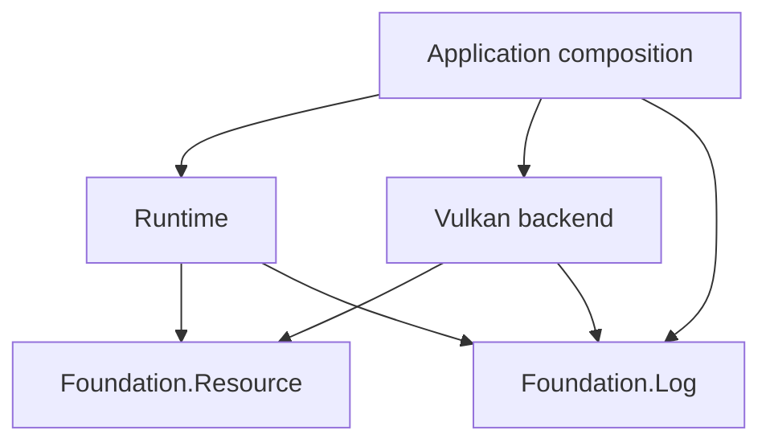

# Resource ownership design

Establish safe CPU ownership before implementing Vulkan. This is the detailed
delivery plan for FND-1 in the [foundation design](engine_foundation_design.md).

Design state: `ready for issue processing`

Owner: `coghex/hetoimasia`; publication target: `master`.
Readiness was first approved by the owner on 2026-09-10 following the Synarchy
review and explicit approval of the failure policy, reviewed against `2062f8a`,
and published to `master` the same day. On 2026-09-11 the owner accepted a
review against `b4ef301` that refreshed the tracker evidence and added D-6
through D-9, then granted fresh readiness after approving each recommendation
and the RES-4 catalog choice. The same day the owner relayed the document
author's review and approved its four corrections: D-7's verified rethrow
behavior, D-6's release boundary and GPU completion on exceptional exits, D-9's
protected acquisition step, and the RES-2 to RES-3 dependency. None of its
APIs exists yet.
The owner then requested the final logical corrections to D-6 and D-7 and
continued readiness. Those corrections are incorporated below; the four-slice
plan remains ready for issue processing. The revised document is unpublished.

Status legend: `[ ]` unprocessed · `[#N]` linked to issue N · `[no-issue]`
reviewed and deliberately not tracked separately · `[deferred]` blocked on a
concrete precondition

## Processing status

- [x] EPIC. Establish safe resource ownership and scoped composition — [#22]
- [x] RES-1. Implement failure-preserving CPU resource scopes — [#25]
- [x] RES-2. Protect composite resource construction and cleanup ordering — [#28]
- [x] RES-3. Add allocResource and nested continuation scopes — [#29]
- [x] RES-4. Exercise owned resources through the console runtime — [#30]

## Epic contract

- **Goal:** callers compose resource lifetimes without application-wide state,
  unprotected successful acquisitions, or lost cleanup failures.
- **Done when:** the four slices pass Hspec, a console consumer exercises normal
  and failing lifetimes, and the public contract documents ownership and errors.
- **Users:** engine/game developers and future Vulkan/Lua component owners.
- **Arc label:** `resources` (proposed).
- **In scope:** CPU scope primitives, structured cleanup-failure evidence,
  exception-safe composite construction, a small CPS facade, integration/docs.
- **Out of scope:** Vulkan/Lua calls, workers/job systems, GPU retirement queues,
  asset stores, generational handles, public early-release/ownership-transfer
  APIs, region/linear types, and an application-wide monad. Their relationship
  is documented below so this foundation does not preclude them.
- **Verification baseline:** GHC 9.12.2 with base 4.21, Cabal 3.16.1.0, and the
  `hetoimasia-tests` Hspec suite, which the validation catalog runs as the floor
  group `test.engine`; no GPU or Python probes are required.

## Tracker relationship and sequencing

Tracker recheck on 2026-09-11 at `b4ef301`: the target has thirteen issues and
no resource issue or epic. The [logging](logging_design.md) arc is complete:
epic [#1](https://github.com/coghex/hetoimasia/issues/1) with LOG-1 through
LOG-3 as [#2](https://github.com/coghex/hetoimasia/issues/2),
[#3](https://github.com/coghex/hetoimasia/issues/3), and
[#4](https://github.com/coghex/hetoimasia/issues/4), merged through pull
requests 5, 6, and 7; [#9](https://github.com/coghex/hetoimasia/issues/9) then
settled the worker reporting-boundary example. The CI epic
[#8](https://github.com/coghex/hetoimasia/issues/8) owns validation selection
and evidence; its open children #11 through #13 do not overlap this arc.
Recheck before filing. FND-1 delegates to this arc: when the broad foundation
design is processed, reuse this epic and its children instead of filing a second
resource implementation. FND-2/FND-5 retain their FND-1 prerequisite.

The logging implementation gate is satisfied: LOG-3 (#4) merged in `cb2a25d`.
The gate honored the owner's logging-first workflow; it was never a dependency
of the generic Resource module on the Log module. Solving follows the owner's
rollout order: the open CI children #11 through #13 land first, then this arc's
slices, each once its issue is approved. That order is workflow sequencing, not
a code dependency. Internal `Depends on` fields below name only entries in this
document.

Two contracts landed since the first review bind this arc's pull requests:

- The [validation catalog](validation.md) declares every check. Resource tests
  added to `hetoimasia-tests` are covered by the floor group `test.engine`
  without a catalog change. A new console path needs an explicit catalog
  decision, recorded in RES-4. Catalog edits are policy inputs and widen
  selection, so make one only with the slice that needs it. A pull request
  requests extra groups through its `validation-request` block.
- The test architecture design (`docs/test_architecture_design.md`, local to
  `docs-wip` until published) groups engine tests by component. Its TEST-1
  waits for RES-1 through RES-4 to merge, and its D-6 lets resource tests adopt
  the `Test/Engine/Resources` grouping immediately. Add resource examples to
  the existing suite under that grouping; do not restructure the suite here.

## Decisions

### D-1. Preserve the primary failure and retain cleanup failures

Explicitly approved by the owner on 2026-09-10:

| Action | Cleanup | Outcome |
|---|---|---|
| Succeeds | Succeeds | Return the result |
| Fails | Succeeds | Preserve the original failure |
| Succeeds | Fails | Fail with the cleanup failure; the action's result is discarded |
| Fails | Fails | Preserve the original failure and retain cleanup failures as secondary evidence |

Attempt remaining eligible cleanup; cancellation remains a failure, and a broken
logger must not erase the outcome. Preserve the original exception's type/value
and existing context, with inspectable, ordered secondary cleanup failures.
When only cleanup fails, the operation fails: its first observed exception is
primary, the action's result is not returned, and every cleanup failure is
retained with its operation label. Successful cleanup is never reported for an
action that threw or was interrupted. Under D-6, asynchronous cancellation
delivery from other threads is deferred during cleanup. An exception explicitly
raised by a release callback is still a cleanup failure governed by this table,
including one whose type belongs to the asynchronous-exception hierarchy.

### D-2. Keep generic ownership independent of application services

The finalized design uses `Hetoimasia.Foundation.Resource` in the existing
foundation package. It imports no Logger, runtime environment, Vulkan, or game
module. Acquisition/release effects use IO exceptions; a returned application
`Either` remains ordinary data. No EngineM/MonadError adapter is shipped here.

### D-3. Keep scoped allocation over the lower primitive

The finalized direction retains `allocResource` and `locally` through an opaque
continuation wrapper after the lower primitive and composite ownership are
proven. Hide the constructor and arbitrary continuation resumption. The scope
callback borrows handles; the initial API does not enforce regions statically.

### D-4. Complete the CPU foundation before dynamic GPU ownership

The first deliverable is the bounded CPU arc above. Composite constructors own
partial rollback and final cleanup order. Do not port delayed cleanup
registration or loose manual closures. Public ownership transfer and GPU
retirement require their concrete backend/asset lifetime design later.

### D-5. Apply the established testing and delivery workflow

Use Hspec for success, failures, and cancellation, with coordinated threads and
temporary resources. Every code PR includes its required contract/docs/evidence
and the validation the catalog selects for it. The logging implementation gate
is complete.

The owner accepted D-6 through D-9 on 2026-09-11, after the review against
`b4ef301`, choosing the recommended option of each over its named alternative.
Verified behavior cited in them was probed on this machine's GHC 9.12.2, not
taken from documentation.

### D-6. Mask discipline: interruptible acquisition, uninterruptible release

Run acquisition under `mask`, as `bracket` does, so a blocking acquisition can
still be cancelled unless the caller already imposed an uninterruptible mask.
The handoff from a successful acquisition to its cleanup protection has no
unmasked gap. Run the body with the caller's masking state restored.

Keep cleanup orchestration masked, with no interruptible gaps between release
attempts, and run each release action under `uninterruptibleMask`. This defers
asynchronous exception delivery from other threads during cleanup. It does not
suppress exceptions raised by release code itself; those must be caught and
retained under D-1 while the remaining releases are attempted.

Consequences:

- Once a scope unwinds, each registered release is attempted exactly once,
  provided earlier release actions return or throw within the bounded-release
  contract below. A throwing release is an attempted release, not a successful
  one; it is never retried automatically.
- Asynchronous cancellation requested during cleanup remains pending until
  masking permits delivery again. Do not swallow it. Cleanup can still throw
  explicitly, including `throwIO ThreadKilled`; D-1 handles that failure without
  inventing an interruption of the masked computation by another thread.
- Release actions must have a controlled blocking duration, which is the
  condition GHC's own documentation sets for
  [`uninterruptibleMask`](https://hackage.haskell.org/package/base-4.21.0.0/docs/Control-Exception.html#v:uninterruptibleMask).
  The owner must establish this property for the actual operation and its
  synchronization: the name "close", "free", or "destroy" is not proof.
  Closing an exclusively owned file handle, freeing host memory, or destroying
  a Vulkan object are candidates once their blocking behavior is controlled
  and, for Vulkan, outstanding GPU uses are known to be complete.
  No fence, queue, or device wait belongs inside a release action in this arc,
  even with a timeout. A timeout does not establish completion or authorize
  destruction. A release that blocks indefinitely hangs its thread
  uninterruptibly; the contract documents this rather than prevents it.
- This arc guarantees that release runs; it does not establish GPU completion.
  A wait placed in the normal body protects nothing when the body throws or is
  cancelled before reaching it. The future backend contract (FND-2) must
  establish completion on exceptional exits as well, outside the
  uninterruptible release: for example an interruptible completion phase that
  runs before release on every exit, or transfer of the native cleanup to the
  retirement queue. It must also define what a failed or timed-out wait means
  for dependent destruction. That design is out of scope here and must not be
  solved by making release interruptible.
- RES-1 demonstrates the discipline with coordinated tests: an acquisition
  blocked on an `MVar` is cancellable and runs no release; cancellation
  delivered after acquisition still runs release; and a `throwTo` aimed at a
  thread that is inside a release is delivered only after that release and the
  remaining releases complete. Also verify that explicitly throwing release
  code is recorded under D-1 and does not prevent later release attempts.

### D-7. Evidence retention through rethrow

Verified on GHC 9.12.2 with base 4.21 and checked with focused Hspec examples.
Recognizing an exception by type and retaining its attached context are separate
properties:

| Catching path | Context available to the caller |
|---|---|
| `try @SomeException` | The returned `SomeException` retains its context, accessible through `someExceptionContext`. |
| Plain `try @IOException` or `try @AsyncException` | The concrete exception value retains its type/value but does not carry the original attached context. |
| `tryWithContext` or `catchNoPropagate` | An explicit `ExceptionWithContext` carries both the exception and its original context, including for typed catches. |

Inside the Resource module, prefer `tryWithContext` or `catchNoPropagate` to
capture the primary exception together with its context, add structured cleanup
evidence to that context, and use `rethrowIO` to propagate the result. Another
preserving path is `throwIO (ExceptionWithContext (someExceptionContext e) e)`
when `e` is a `SomeException` that still holds its original context. Wrapping a
bare typed exception after its context has been discarded cannot recover it.
See GHC's [rethrow contract](https://hackage.haskell.org/package/base-4.21.0.0/docs/Control-Exception.html#v:rethrowIO)
and [context-aware catch](https://hackage.haskell.org/package/base-4.21.0.0/docs/Control-Exception.html#v:catchNoPropagate).

An ordinary `catch` handler that calls `throwIO` on the received bare value,
typed or `SomeException`, leaves the original context only nested inside a
`WhileHandling` annotation. `try` followed by plain `throwIO` on the bare result
loses that original context. `WhileHandling` comes from ordinary `catch`'s
handler annotation; `catchNoPropagate` with `rethrowIO` preserves context without
adding that nesting. Do not use incidental handler nesting as the Resource
module's own evidence-storage mechanism.

These rules apply to RES-1:

- Inside the Resource module, every rethrow of a caught exception uses the
  explicit preserving path. Plain `throwIO` on a caught value is forbidden
  whether the value is typed or `SomeException`. Base's `onException`,
  `bracket`, and `finally` preserve the primary context when their cleanup
  succeeds; by themselves they do not implement D-1 when cleanup also throws.
- Nested scopes append their own evidence to what they receive and never
  rebuild the primary exception, so no entry is lost or duplicated as outer
  scopes unwind. Entries are ordered by observation during unwinding. The
  preserving path may add a second `Backtraces` entry; that is not a duplicate
  of evidence.
- The inspection function that returns cleanup failures also searches
  `WhileHandling` nesting, so a caller's `catch` handler that rethrows plainly
  still yields the evidence. Do not count the same failure twice if it appears
  both directly and through nesting; distinct failures with equal messages
  remain distinct. A caller that discards the context, including through
  `try` followed by plain `throwIO`, loses its evidence. The public contract
  documents this limit and names the preserving path.
- RES-1 tests each of its internal rethrow sites by attaching an annotation
  below a scope and asserting it is directly reachable above it. Cover typed
  context-aware catches, ordered nested cleanup failures, and inspection through
  `WhileHandling` without duplicated occurrences. Document the bare typed `try`
  and `try`-then-`throwIO` losses with tests of their own.
- If RES-1 instead keeps evidence outside the exception, such as in a report
  the scope hands to its caller, the rules above still govern the primary
  exception, and the report must be reachable from the place a typed catch runs.

### D-8. Facade signatures and argument order

Adopt the signatures shown under the fate of the allocResource functions:
`withResource` and `allocResource` both take the acquisition first and the
release second, matching `bracket`. Synarchy's release-first order is not
carried over; there is no compatibility promise at this stage. `withScoped` is
the only runner and `locally` is the only early-release operation.

### D-9. Staged composite construction

RES-2's reusable support is one staged constructor, not a dependency scheduler.
It runs under `mask`. Each stage acquires a native handle and installs that
handle's rollback as one protected step with no restore between them; this is
the same handoff `withResource` protects, and the gap `allocResource'` left
open. The caller's masking state may be restored only around work whose every
resource already has cleanup protection, such as querying memory requirements
or binding, exactly as `bracket` restores it around the body; never around an
acquisition. After every successful stage the constructor replaces its one
authoritative release action. On any failure it runs the current release
action, so exactly the parts acquired so far are released. On success it hands
the finished value and its final release action to the enclosing scope, which
owns them under D-6 and D-1.

The constructor declares the final release order, because the correct order is
a property of the native API rather than of acquisition order. The buffer
fixture proves this: the buffer is created before its memory, and the correct
release is destroy the buffer, then free the memory, which is acquisition order
rather than the reverse. There is no moment at which a part is acquired but
unprotected, no release is unregistered before its replacement is installed,
and no delayed-registration helper is needed.

## Synarchy concepts worth retaining

Source inspection on 2026-09-10 at Synarchy
`36090b94a39a773f65a7e9dc236efd971b38269d`; the inspected resource, buffer, command,
image, worker, and texture-release files had no local changes. Paths below are
relative to `~/work/synarchy`. This was source review, not execution of Vulkan
failure paths, and Synarchy was not modified. Reverified on 2026-09-11:
`36090b94` is an ancestor of Synarchy's current `13bd01b`, and none of the
cited files changed between them.

| Evidence | Concept to keep |
|---|---|
| `src/Engine/Core/Resource.hs`: `allocResource` | Acquire/release pairing composed through continuation-based `do` notation |
| `src/Engine/Graphics/Vulkan/BufferUtils.hs`: `createVulkanBuffer` | Deliberate cleanup order independent of acquisition order |
| `src/Engine/Graphics/Vulkan/Texture.hs`: `createTextureFromRGBABytes`; `src/Engine/Graphics/Vulkan/Command.hs`: `runCommandsOnce` | Short upload scopes plus an explicit normal-path GPU completion wait |
| `src/Engine/Graphics/Vulkan/Image.hs`; `src/Engine/Graphics/Vulkan/Sync.hs` | Replaceable resources have lifetimes shorter than application exit |
| `src/Engine/Graphics/Vulkan/Texture/Release.hs`: `planTextureRelease` | Pure alias invalidation and unique-slot release decisions, testable without a GPU |
| `src/Engine/Core/Workers.hs`; `src/Engine/Core/Thread.hs`; `test-headless/Test/Headless/Core/WorkerLifecycle.hs` | Named worker dependencies, confirmed joins, and failure tests with throwing diagnostics |

Preserve these concepts independently of their current game-specific types and
environment. In particular, the resource result type parameter in `EngineM` is
useful CPS machinery; its fixed EngineEnv/EngineState dependencies are separate
choices. Explicit completion in an upload helper is valuable, but cancellation
and failed waits still need a separate GPU-safety contract.

## Fate of the allocResource functions

| Existing helper | Actual semantics | Hetoimasia direction |
|---|---|---|
| `allocResource` | Runs release when the rest of its enclosing continuation exits | Retain as a thin scoped-allocation convenience over the new failure-safe primitive |
| `locally` | Runs a nested continuation to completion, releasing its scoped resources before the caller continues | Retain the nested-scope concept, especially for staging/upload work |
| `allocResource'` | Returns an action that installs cleanup around the *remaining continuation when called*; it does not free immediately | Replace its use with protected composite construction in RES-2; no public delayed-registration helper |
| `allocResource'IO` | Returns a plain release closure; acquisition installs no automatic scope cleanup | Deferred to a future dynamic-owner API with protected transfer and duplicate-release protection; no loose public closure in this arc |

The CPS facade follows this shape; exact private representation remains an
implementation detail constrained by D-1/D-3 and D-8:

```haskell
-- RES-1: the lower primitive. Argument order follows 'bracket'.
withResource ∷ IO a → (a → IO ()) → (a → IO r) → IO r

-- RES-3: the facade over it.
newtype Scoped a = Scoped
  { withScoped ∷ forall r. (a → IO r) → IO r }

allocResource ∷ IO a → (a → IO ()) → Scoped a
allocResource acquire release = Scoped (withResource acquire release)

locally ∷ Scoped a → Scoped a
locally inner = Scoped (\continue → withScoped inner pure >>= continue)
```

Here `withResource` is the lower primitive to implement in RES-1, including
acquisition/release exception protection under D-6 and D-7. It is not an alias
for plain `bracket`. `Scoped` gets `Functor`, `Applicative`, `Monad`, and
`MonadIO` instances so allocation composes in `do` notation; neither the lower
primitive nor this wrapper needs EngineEnv or Logger. Hide the constructor and
provide no arbitrary continuation resumption API; `withScoped` is the only
runner. The code above describes the planned layering, not an implemented module.

Facade contract, documented with RES-3:

- **Cleanup point.** A resource allocated with `allocResource` is released when
  the enclosing `withScoped` continuation returns or throws, not at the end of
  the `do` block that allocated it. This is the property Synarchy's
  `allocResource'` existed to work around; `locally` is the supported way to
  end a group of lifetimes early.
- **Order.** One scope releases its resources in reverse allocation order. A
  different order needs a composite constructor (RES-2, D-9), not a
  positioning trick.
- **`locally`.** Runs the inner scope to completion, releases everything it
  allocated, then continues with its ordinary result. Its cleanup failures
  propagate into the outer scope under D-1 and are retained under D-7.
- **Documented misuse.** `withScoped scope pure` returns a handle whose cleanup
  has already run. The type does not prevent this; the contract and the
  examples forbid it.

A scoped callback borrows its values. Do not return borrowed resources out of
`locally` or `withScoped`; return ordinary results. This arc provides no
escape/transfer operation. A future dynamic owner's release capability must
prevent repeated native destruction, report failure, and respect GPU completion.

### Specific hazards to avoid when adapting the implementation

- `Resource.hs` lines 24–26 place `finally` around the continuation after
  allocation. The helper itself does not mask the acquisition-to-handler gap.
  The new primitive must protect that transition.
- `allocResource'` installs nothing until the returned action runs. In
  `BufferUtils.hs` lines 30–48, buffer creation precedes requirements lookup,
  memory-type selection, and memory allocation; `freeBufferLater` comes after
  them. A failure in that interval has no buffer cleanup installed by this
  helper. Preserve ordering without this registration gap.
- The `EngineM` error channel is a returned `Either`, distinct from an IO
  exception. The finalizer's returned `Left` in `allocResource` is ignored by
  `finally`; `allocResource'IO` instead reports it through the logger. Neither
  establishes D-1. Define any future typed-error adapter explicitly.
- `Image.hs` returns manual image/memory cleanup only after multiple acquisition
  steps, and sequences `cleanupImage >> cleanupMemory`. Returning a closure
  does not protect partial construction, and a throwing first cleanup skips the
  second. `Types/Cleanup.hs` likewise runs its fields as an ordinary sequence.

For a future Vulkan buffer, use one owned allocation constructor that protects
each partially built state, exposes a usable allocation after successful binding,
and explicitly orders destruction and backing-allocation release. RES-2 proves
this pattern with fake CPU resources, without inventing Vulkan types. A future
transfer to another scope/store must leave exactly one cleanup owner throughout;
do not unregister rollback protection and then hope publication succeeds.

## Placement and relationship to logging

Module placement within the existing package boundaries (backend/game rows
remain future context outside this arc):

| Component | Responsibility |
|---|---|
| `Hetoimasia.Foundation.Resource` | Small exception-safe scope primitives; no Logger, Vulkan, game state, or service registry |
| `Hetoimasia.Foundation.Log` | Independent diagnostics through a borrowed sink |
| Runtime | Application lifecycle and eventual worker supervision using narrow services |
| Vulkan backend | Native allocation dependencies, submission ownership, completion, and deferred disposal |
| Game/asset owners | Session state and explicit asset leases; GPU allocations remain backend-owned |

The arrows show the intended imports/service dependencies. Backend nodes remain
future work. At `b4ef301` only `Hetoimasia.Foundation.Log` and
`Hetoimasia.Runtime` are implemented.



Logging and generic scope primitives are peers. A scope runs cleanup and exposes
its outcome even if no logger exists or its sink is broken. Owning subsystems
and application boundaries decide which diagnostics to emit. Resource failures
must not survive only as a message that may never reach the sink.

Shutdown order is the one the logging contract already establishes in
[Ownership and failures](logging.md#ownership-and-failures): stop and join
producers, finish subsystem cleanup, then flush and close a handle the
application owns. Borrowed stderr or another caller-owned handle remains that
caller's property. A boundary that turns a resource failure into a diagnostic
follows the worker reporting-boundary example in the
[module authoring guide](logging.md#module-authoring-guide): classify any
`SomeAsyncException` as cancellation and let it escape unreported, report an
ordinary failure once, and keep the original failure when the report itself
fails. No logger call belongs in the gap between acquiring a resource and
establishing its cleanup protection.

RES-1 establishes the lower `with...` convention using standard exception
primitives and D-1. RES-2 exercises partial construction and deliberate cleanup
order. RES-3 adds continuation composition over the same primitive, with tests
that establish identical lifetime/error behavior.

Implement the accepted D-1 policy using an exception/report representation that
preserves intended catch behavior. Plain `bracket` alone does not implement that
whole policy when both the body and release throw.

## Future subsystem owners and lifetime boundaries

One subsystem owns each resource's mutation and destruction. Consumers receive
operations or opaque handles. Private IORefs and mutable arrays are legitimate
implementation choices; exposing them through an application-wide environment
makes the owner and allowed lifetime difficult to enforce.

| Owner | Owns | Ends or resets when |
|---|---|---|
| Application | Service composition | Process shutdown |
| Vulkan backend | Device, allocation machinery, completion tracking | All children and submitted uses have been retired |
| Swapchain generation | Its targets, views, and related state | Replacement is ready and old graphics/presentation uses have completed |
| Frame slot | Command pools, upload slices, transient descriptors | That slot's previous GPU uses have completed |
| Asset store | Shared CPU assets and GPU residency records | Explicit leases are released, then outstanding GPU uses complete |
| Game session | World state, session workers, asset leases | Session exit or load/restart |
| Lua host | VM and its registered bindings | Host scope ends after its users stop |

The asset store knows assets, references, and GPU residency. The game decides
which assets a world needs. A game object holds a mesh/texture identifier or
lease, not a Vulkan pointer. Generational handles can detect stale identifiers;
they do not by themselves establish ownership or keep GPU allocations alive.

Ordinary game state is Haskell data and is reclaimed normally when unreachable.
Foreign allocations, file handles, workers, and GPU resources need explicit
lifetime management. Ending a session cancels and joins its workers before
releasing the services they borrow.

## CPU acquisition and failure contract

Start with subsystem `with...` functions built on the RES-1 primitive, which
applies the mask discipline in D-6. A constructor that performs several
allocations must unwind its own partial initialization (D-9). Register
each successful acquisition's cleanup before cancellation can strand it. Keep
each native dependency order inside the subsystem that understands it.
See [Control.Exception](https://hackage.haskell.org/package/base-4.21.0.0/docs/Control-Exception.html#v:bracket)
for acquisition/release masking and its interruption limits.

Illustrative composition, with names that are still proposals:

```haskell
withGpu logger gpuConfig $ \gpu →
  withAssetStore logger gpu $ \assets →
    withGameSession gameConfig assets $ \session →
      runGame session
```

The future subsystem callbacks above borrow their arguments. These ordinary types do not statically
prevent a handle from escaping; document borrowing and keep constructors/raw
handles private. Consider region types only if practical misuse warrants them.
Each service gets only its actual dependencies. `withGpu` must quiesce its GPU
work before native destruction; nested callbacks alone do not establish that.

Implement and test D-1 when cleanup itself fails. Remaining cleanup must still
be attempted, diagnostics must not obstruct it, and failures must stay observable.
An attempt is not proof of successful release: native owners must account for
unsafe dependent destruction after a failed GPU wait or failed child release.
Do not put unbounded GPU waits inside `uninterruptibleMask`.

## Future GPU retirement — outside this arc

CPU scope exit and GPU completion are separate events. Vulkan requires pending
uses to complete before destruction, and destroying referenced resources also
affects recorded command buffers. See the specification's
[object lifetime rules](https://docs.vulkan.org/spec/latest/chapters/fundamentals.html#fundamentals-objectmodel-lifetime)
and [command buffer lifecycle](https://docs.vulkan.org/spec/latest/chapters/cmdbuffers.html#commandbuffers-lifecycle).

For a dynamic texture, the proposed sequence is:

1. Release its last application lease; prevent new recording/submission from
   acquiring it, and invalidate or rebuild cached recordings that reference it.
2. Transfer its native cleanup to the backend's retirement queue, retaining
   the completion points covering every outstanding use.
3. Run cleanup and recycle allocations/descriptor slots only after those points
   complete. Releasing an application handle is not an immediate Vulkan free.

Publication, submission, and retirement need one defined synchronization owner
so a new use cannot race the last-use decision. Start with a single submission
owner and queue if the first scene permits it. Multiple independent queues need
completion evidence for each; their timeline values are not interchangeable.
Presentation lifetime also needs its own completion reasoning.

For the first device/offscreen probe, an explicit idle wait at teardown is a
reasonable starting point. Introduce deferred retirement when dynamic lifetimes
require it. Do not wait for device idle on every frame or allocation.

## Error representation and verification contract

RES-1 must expose structured cleanup failures containing an operation label and
the underlying exception/context, not just rendered strings. Provide a documented
way to inspect secondary failures without a working logger, while a typed catch
still recognizes the original primary exception. GHC's exception-context support
([Control.Exception.Context](https://hackage.haskell.org/package/base-4.21.0.0/docs/Control-Exception-Context.html))
is one available mechanism; the particular representation is an implementation
choice subject to these observable requirements and to the retention rules in
D-7. Preserve nested secondary failures as outer scopes unwind, in the order
they were observed, without losing or duplicating entries.

Use IO exceptions for acquisition/release failures. Do not silently discard a
returned cleanup `Left`: release callbacks have type `IO ()`. A future typed-error
adapter needs its own contract. A failed composite acquisition cleans up its
partial state; the outer owner must not release a nonexistent completed result.

After successful acquisition, establish cleanup protection before user code,
logging, or cancellation can strand the resource. Restore the caller's masking
state during normal use and run every release as D-6 specifies. Invoke each
registered cleanup exactly once per scope exit and attempt the remaining
actions after a throwing cleanup. Report failed attempts; do not retry a
possibly half-completed native destructor automatically. This is not a
guarantee against process termination, or against a release action that
blocks indefinitely.

Hspec covers every row of D-1, multiple/nested cleanup failures, typed catch
behavior, metadata inspection, the D-6 cancellation cases, the D-7 retention
paths, acquisition failure at each composite stage, normal and exceptional
cleanup order, and controlled asynchronous cancellation.
Coordinate with MVars or equivalent signals; timeouts only bound stuck tests.
Run the same behavior through the direct and CPS APIs. Real-handle checks use
temporary files without modifying personal configuration. No tests need Vulkan.

## Questions and implementation latitude

### Q-1. Failure policy and representation

Policy resolved by D-1. Representation is chosen in RES-1 within the explicit
typed-catch and structured-inspection requirements above. Reject an
implementation that preserves only the message or requires logging to retain
secondary failures; changing those requirements returns to design review.

### Q-2. Continuation approach and primed helpers

Resolved by D-3/D-4. Deliver the thin opaque CPS facade and protected composite
constructors. A public early-release/transfer API and GPU disposal remain deferred
to their own concrete lifetime work; they are not blockers for this CPU arc.

### Q-3. Relationship to logging and the foundation plan

Resolved by D-5 and the tracker relationship above. The logging gate is
satisfied as of `cb2a25d`. FND-1 reuses this arc.

### Q-4. Mask discipline, evidence retention, facade order, and composites

Resolved on 2026-09-11 by D-6 through D-9, accepted verbatim. The rejected
alternatives were: release under plain `mask` with an interrupted-cleanup row
in D-1; an explicit cleanup-failure observer argument instead of exception
annotations; Synarchy's release-first argument order for `allocResource`; and
hand-written staging in every composite constructor. The owner also declined a
separate `smoke.resource` catalog group for RES-4.

No blocking design questions remain. Exact private types, module subdivision,
and diagnostic labels are implementation details. Do not add an application
environment, a second error channel, or a global finalizer registry.

## Delivery plan

### RES-1. Implement failure-preserving CPU resource scopes

- **Outcome:** a generic scope pairs successful acquisition with cleanup and
  implements every D-1 outcome with inspectable secondary failures.
- **Scope:** Resource facade, lower `withResource` primitive, labeled cleanup
  sequencing where needed, exception/report representation, Hspec examples
  under the `Test/Engine/Resources` grouping of `hetoimasia-tests`, contract docs.
- **Phase:** primitive; **Depends on:** none; **Ordering:** critical path.
- **External implementation gate:** logging LOG-3 (#4) merged in `cb2a25d`;
  satisfied.
- **Relevant decisions:** D-1/D-2/D-5, D-6/D-7/D-8; **Open questions:** none.
- **Acceptance signals:** success returns the value; failed acquisition never
  calls release for an absent value; action failure/cancellation retains typed
  identity; cleanup-only failure discards the result and fails; cleanup-only
  and combined failures retain all ordered evidence; every registered release
  runs. Coordinated tests demonstrate the three D-6 cancellation cases and the
  D-7 preserving and losing rethrow paths. No logging dependency.
- **Out of scope:** CPS facade, composite constructor, GPU, ownership transfer.

### RES-2. Protect composite resource construction and cleanup ordering

- **Outcome:** one composite owner safely constructs and releases dependent parts,
  including a release order different from acquisition order.
- **Scope:** the staged constructor of D-9, a fake buffer/backing-allocation
  fixture with injected steps, Hspec, ownership docs. Keep fixture types in
  test/support code; do not ship a fake graphics API.
- **Phase:** composition; **Depends on:** RES-1; **Ordering:** critical path.
- **Relevant decisions:** D-1/D-2/D-4/D-5, D-6/D-9; **Open questions:** none.
- **Acceptance signals:** failure before/after each acquisition and at the
  binding/publication step releases exactly the successfully acquired parts;
  normal release uses the declared order, and the buffer fixture shows that
  order is acquisition order rather than the reverse; cleanup failures obey
  D-1. No delayed-registration gap, double release, or leaked result on
  failure. Coordinated tests show the constructor is never unprotected between
  stages.
- **Out of scope:** Vulkan bindings, general dependency-graph scheduler, public
  early-release tokens, moving resources across live owners.

### RES-3. Add allocResource and nested continuation scopes

- **Outcome:** opaque `Scoped` supports allocation in `do` notation with the
  lifetime/failure behavior of the lower primitive.
- **Scope:** `allocResource`, nested `locally`, the facade contract above,
  `Functor`/`Applicative`/`Monad`/`MonadIO` instances, Hspec, public examples.
- **Phase:** facade; **Depends on:** RES-2; **Ordering:** critical path. The
  facade needs only RES-1's primitive, but D-3 proves composite ownership
  first and both slices edit the same module and suite.
- **Relevant decisions:** D-1/D-2/D-3/D-5, D-7/D-8; **Open questions:** none.
- **Acceptance signals:** nested cleanup finishes before outer continuation;
  ordinary results survive `locally`; resources unwind in reverse allocation
  order on success, failure, and cancellation. Direct/CPS paths preserve the
  same primary and secondary failures. A failed earlier action never runs later
  acquisition. The public docs state the cleanup point and the documented
  misuse, and the examples keep borrowed handles within their scopes.
- **Out of scope:** EngineM/Reader/State/MonadError integration, exposed
  continuation constructors, general resumption, primed compatibility helpers.

### RES-4. Exercise owned resources through the console runtime

- **Outcome:** a small console consumer demonstrates resource lifetimes using
  the finalized logging conventions and public resource APIs.
- **Scope:** add a bounded `--resource-smoke` path, Hspec integration coverage
  that runs it as a child process beside the existing console-startup examples,
  runtime composition as needed, README usage with expected output, and
  lifecycle-guide updates. No new catalog group: the path is covered by
  `test.engine`, and `smoke.console` keeps its `--smoke` command. The owner
  declined a separate `smoke.resource` floor group on 2026-09-11 (Q-4).
- **Phase:** integration; **Depends on:** RES-3; **Ordering:** critical path.
- **Relevant decisions:** D-1/D-2/D-3/D-4/D-5; **Open questions:** none.
- **Acceptance signals:** build, existing smoke, new resource smoke, and focused
  Hspec pass. Tests inject action/cleanup/logger failures and verify resources
  are still attempted and the approved primary/secondary outcome is inspectable.
  Cleanup completes before final sink disposal, shown with a temporary file
  handle the test owns, since borrowed stderr cannot show it; no false success
  is logged. The diagnostic boundary follows the logging worker example.
  Ordinary runtime use retains its existing result/failure semantics.
- **Out of scope:** rendering, permanent files, threads/services started just to
  demonstrate ownership, a game or asset-store implementation.

## Processing handoff

Resolve `docs-wip` by branch in `coghex/hetoimasia`. Use
`kanban:process-design-doc` on this document: epic first, then exactly one child
per invocation, with separate artifact approvals. The logging gate is satisfied;
recheck the tracker at each step. Reuse the resource epic when processing FND-1
in the broader foundation design.

Readiness does not publish this design or create issues/PRs. Follow the selected
publication lane; every implementation's required docs and evidence stay in its
code PR. The old `resource_ownership.md` path is a navigation stub, not another
processing ledger.
