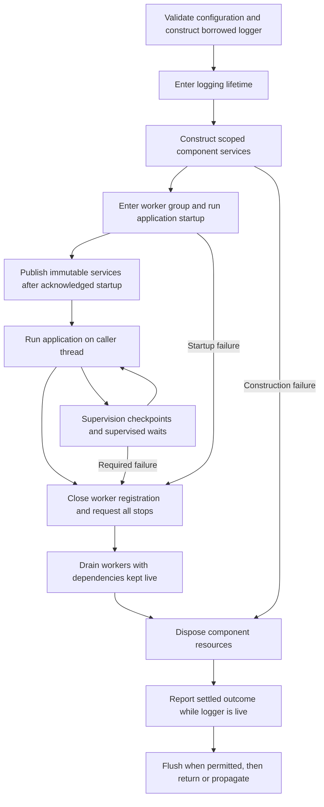

# Runtime foundation: errors and application composition

Define how components fail, recover, initialize, and share services before
messaging, worker, and GLFW implementations depend on those conventions.
Epic #52 and all eight children (#53 through #60) are filed. The arc covers
errors, recovery, contexts, state ownership, initialization, and worker lifecycle.
D-13 through D-16 settle the safety and supervision choices raised by the
review of the processor's additions: retain worker dependencies until completion,
recover construction inside its owning scope, supervise through checkpoints,
and distinguish services from finite jobs. P-10 through P-12 specify the complete
contracts. D-17 records owner approval of those contracts; D-18 records the
approved supervision split and operator-escape clarification. Supervision belongs
to RT-8 and application integration to RT-6. All eight implementation children
and the two supervision repairs (#69 and #70) are merged and verified at
`89798772ec637d82b32da9cf2a603acd28443f9d` on 2026-09-13.

Design state: `ready for issue processing`

Owner: `coghex/hetoimasia`; publication target: `master`.
Started 2026-09-12 against Hetoimasia
`7e92e73d5eed7e564e9752ee49cce0eb5ba150c2`.
The earlier readiness covered EPIC and RT-1 through RT-3, which are now linked
and unaffected by later design work. Q-5 through Q-7 now have concrete resolutions
under D-13 through D-18 and P-10 through P-13. The owner granted fresh readiness
for the complete revised design. Processing is complete as of 2026-09-13;
all eight child issues were approved and subsequently closed by merged PRs
#61 through #68. Their review amendments remain part of the implementation
specifications. The completion review found two supervision defects, repaired
by #69 / PR #71 and #70 / PR #72; both repairs passed the follow-up review.
The retained design-state and processing ledger describe the approved design
and tracker creation; implementation completion is recorded separately below.

Status legend: `[ ]` unprocessed · `[#N]` linked to issue N · `[no-issue]`
reviewed and deliberately not tracked separately · `[deferred]` blocked on a
concrete precondition

## Processing status

- [x] EPIC. Establish reusable runtime failure and composition contracts — [#52]
- [x] RT-1. Preserve typed failures with structured origin and operation context — [#53]
- [x] RT-2. Add bounded recovery around complete owned operations — [#54]
- [x] RT-3. Report recovery and terminal outcomes through the existing logger — [#55]
- [x] RT-4. Compose component contexts and scoped initialization — [#56]
- [x] RT-5. Establish scoped worker startup, cancellation, and joining — [#57]
- [x] RT-7. Own borrowed logging lifetime and final flush — [#58]
- [x] RT-8. Supervise worker outcomes through checkpoints and supervised waits — [#59]
- [x] RT-6. Integrate application startup, availability, and shutdown — [#60]

EPIC and all eight child slices are filed; none remains to be processed.
The checked ledger records tracker creation, not merged implementation.
RT-7 separates logging lifetime from RT-4's construction work without renumbering
existing IDs, and RT-8 separates supervision from RT-6's application integration.
There are no remaining composition design gates. Completion covers the full
runtime arc, including construction, workers, logging lifetime, supervision,
and application integration.

## Implementation completion

Epic #52's eight children (#53–#60) and the two review follow-ups (#69–#70)
are closed by merged PRs. The owner requested completion housekeeping on
2026-09-13; the epic's eight implementation checkboxes are now checked and
epic #52 is closed as completed. Review at `8979877` verified both repairs: retained
failure evidence composes across supervision invocations, and public record
updates cannot separate a supervised worker from its management state.

Local macOS verification passed a warning-clean build, 298 engine Hspec
examples, 262 workflow examples, both console/resource smoke modes, and the
two original evidence-loss reproductions. The validation planner covered every
changed input and selected all four existing groups. The corresponding
[Linux CI run](https://github.com/coghex/hetoimasia/actions/runs/34789937761)
passed, including its permitted evidence reuse. No further blocking repair was
identified; messaging and independent GLFW design remain separate arcs.

## Epic contract

- **Goal:** components can initialize, perform work, and fail under explicit
  ownership and error contracts, with narrow dependencies and preserved evidence.
- **Done when:** the owner-approved contracts have implementation and Hspec
  evidence for ordinary results, typed failures, cleanup failures, cancellation,
  scoped recovery, and the initialization/lifecycle composition settled by
  D-10 through D-16 and P-10 through P-12. Those contracts must be implemented
  before this epic can close; the initial error phase alone is insufficient.
- **Users and operators:** engine developers and applications composing services.
- **Arc label:** `runtime` (created during processing).

## Current state and evidence

Hetoimasia already implements:

- `Scoped`, exported by the single module `Hetoimasia.Foundation.Resource`: a
  closed continuation representation with `Functor`, `Applicative`, `Monad`,
  and `MonadIO`; `withScoped` is its runner.
- `allocResource`, `allocComposite`, and `locally`: lifetime composition over
  the implemented scope and composite-construction contracts.
- Exception propagation that preserves the primary type, payload, and context;
  cleanup failures retained as separately inspectable evidence; cancellation
  unwinding under the accepted mask discipline. See [resources.md](resources.md).
- `Hetoimasia.Runtime.Resources.resourceSmoke`: a specific composition of
  resource scopes, injected work, and the existing reporting policy. It is an
  example consumer, not a generic runtime error boundary or message transport.

`Scoped` has no `MonadError`, `MonadCatch`, or environment/state instance. An
exception thrown by `liftIO` already unwinds its scopes; these absent instances
do not mean failure handling is absent. `runApplication` currently logs around
an `IO` action, without constructing an environment or supervising workers.

Read-only Synarchy inspection at
`91fec430ea5596f497d76eb720de9940aeeb6c39`:

| Source | Relevant behavior |
|---|---|
| `src/Engine/Core/Monad.hs` | `EngineM` carries `Either EngineException a` through a continuation. `throwError` skips subsequent binds; `catchError` handles that explicit error value. `liftIO` does not translate native exceptions into it. |
| `src/Engine/Core/Error/Exception.hs` | Structured domain constructors, a human-readable message, and call-stack context. Its central sum imports an asset identifier; that dependency pattern should be evaluated when separating error owners here. |
| `app/App/Exception.hs` | `guardNativeExceptions` supplies another boundary for native exceptions, translating them into an engine error. This demonstrates the integration work needed when two failure channels coexist. |
| `src/Engine/Core/Log.hs`, `test-headless/Test/Headless/Core/LogMonad.hs` | Public logging wrappers preserve caller attribution rather than exposing a helper's location. Keep that discipline for failure origins; avoid relying on `logAndThrow` successfully logging before it throws. |
| `src/Engine/Audio/Thread.hs` | Optional audio records disabled/unavailable state before best-effort diagnostics. Synchronous diagnostic failures do not prevent that transition; cancellation is excluded from ordinary recovery. |
| `src/Engine/Graphics/Window/GLFW.hs` | Missing monitor/mode information can fall back to a plain window. The resulting mode and live geometry describe what was actually created. |
| `src/Engine/Core/Thread.hs` | A required worker failure requests engine cleanup before attempting diagnostics. Preserve shutdown intent independently of logger success; design worker joining separately under Q-3. |
| `src/Engine/Core/Init.hs` | `initializeEngineWith` assembles queues, references, and subsystems into EngineEnv. Preserve useful construction flow while defining each new component's own state and dependencies. |

The distinction is also documented by
[mtl's error-channel warning](https://hackage.haskell.org/package/mtl-2.3.2/docs/Control-Monad-Except.html#warning):
an `ExceptT` error is a different mechanism from a thrown `IO` exception.

Readiness tracker check on 2026-09-12 found no overlapping open runtime/error
arc. The open CI, resource, and test-architecture epics (#8, #22, #49) remain
separate. Recheck exact child overlap when processing; do not reopen completed
logging/resource work to implement these additions.

### Small semantic check against the current public API

Two scratch Hspec examples passed against the built foundation at `7e92e73`:

1. A `withScoped` callback returning `Left StartFailure`, followed by a failing
   release, propagates the release exception. The returned value is discarded
   under the existing successful-body/failing-release rule.
2. The same callback throwing typed `StartFailure`, followed by the same failing
   release, propagates `StartFailure` and retains one cleanup failure.

These are observations of the existing contract, not defects or newly added
production tests. They show why a plain `ExceptT e Scoped` result needs a
deliberate policy if its `Left` is intended to be the primary operation failure.
An ordinary `Either` result remains useful when it is intentionally data.

## Decisions already accepted

### D-1. Establish infrastructure before Vulkan

The owner selected methodical work on logging, messaging, runtime composition,
threading, and GLFW before Vulkan. The first eventual graphics milestone remains
a windowed triangle. The [foundation design](engine_foundation_design.md)
provides the broader component boundaries.

### D-2. Preserve the existing resource failure and reporting contracts

The owner previously approved retaining the original action/cancellation
failure, preserving cleanup evidence independently of logging, and attempting
the remaining eligible releases. Typed catch behavior and context survive
propagation. Logging failures must not skip cleanup or replace an existing
ordinary primary failure during a reporting attempt. Cancellation retains the
separate behavior already documented by the resource/reporting contracts.

This design must compose with those guarantees. Changing them requires an
explicit design revision, not a convenience instance on a new monad.

### D-3. Keep ownership modular and test primarily with Hspec

Previously accepted: application composition connects independently owned
services; consumers receive narrow interfaces. No universal EngineEnv or global
service registry. Hspec is the first choice, including effectful failure and
concurrency contracts. Preserve Synarchy's useful flow and decisions deliberately.

### D-4. Use typed exceptions for aborted operations and values for expected outcomes

The owner accepted P-1: resource-owning operations fail through typed IO
exceptions and the existing scope machinery. Expected outcomes remain explicit
component-owned return values. Do not introduce a second CPS/ExceptT failure
channel for the same operations. Native failures, component failures, and
cancellation must compose with D-2. Q-1 is resolved.

### D-5. Make failure origin clear and attempt supported recovery

The owner explicitly requires errors to identify where they came from, and
recovery to be attempted wherever it is possible. Preserve typed causes,
operation/component identity, and available source/context information through
propagation, recovery, and reporting. Recovery must establish a valid outcome;
warning alone does not make failed work successful.

### D-6. Distinguish optional and required services

The owner accepted bounded retry/fallback with warnings. If recovery is
exhausted, an optional feature can be explicitly disabled or its operation
rejected; an unrecoverable required service stops cleanly. Record the resulting
availability/outcome before relying on diagnostic output. Required versus
optional is determined by the caller's operation requirements, not by a global
severity attached to every instance of an exception type.

### D-7. Require a proven safe path after cleanup failure

The owner accepted that failed cleanup stops automatic retry/fallback unless
the component explicitly establishes that recovery is still safe. Attempted
release is not proof of disposal. Generic helpers must default to propagation
and must not infer safety from the exception's name, a timeout, or a warning.

### D-8. Keep the full runtime foundation in this design

The owner chose to keep application context/initialization and worker lifecycle
in the same design as errors, origins, and recovery. Preserve those later
questions and scope here; do not silently narrow the epic to error helpers alone.

### D-9. Process errors first and gate later phases

The owner explicitly permits processing the error/origin/recovery phase while
context, initialization, and worker slices remain blocked on later design
decisions. RT-1 through RT-3 may proceed; RT-4 through RT-6 require Q-3's
corresponding decisions. Q-4 is resolved. A processor must stop at those gates
instead of asking a solver to invent the remaining runtime architecture.

That gate governed the initial error-phase processing. D-10 through D-16 and
P-10 through P-12 now supply the composition choices and mechanics. D-17 records
fresh readiness for the revised composition phase and resolves the remaining gate.

### D-10. Compose components through explicit handles and scoped construction

Accepted by the owner on 2026-09-12 from P-7, which records the full rationale
and rejected alternatives. Components are constructed inside the existing
`Scoped` facade and consumed through explicit opaque handles passed as
arguments; no Reader facade, environment record, capability type class, or
application-wide monad is introduced. Each component owns its pure validated
configuration and its private state behind its handle, and its module carries
one table naming every state's owner, readers and writers, thread, lifetime,
and reset behavior. The original proposal described partial startup as composite
rollback plus the RT-2 boundary; D-14 refines this to a distinct scoped constructor
sharing RT-2's policy. A fallback service is selected during construction and
bound as an immutable availability value, so the consumer runs once against a
live handle and a released handle is never returned. The original RT-4 proposal
used a logging lifetime as its representative required component and a synthetic
optional component to prove fallback; the revised split is recorded below.
Resolves Q-3's RT-4 group.

Review qualification: the original acquisition/flush recipe mismatched #54's
complete-operation API and the existing release rules. D-14/P-10 specify the
distinct construction boundary; P-11 specifies a logging lifetime outside
controlled resource release. The revised plan moves logging lifetime into RT-7
and uses synthetic CPU components to verify RT-4. The owner approved this split
with the completed composition contracts in D-17.

### D-11. Own workers as scoped resources with an explicit stop protocol

**Superseded termination policy:** the original bounded-detachment proposal
below is retained as history only. D-13 replaces it with protected waiting;
do not implement the old release recipe.

Accepted by the owner on 2026-09-12 from P-8. A worker is a resource
allocated in the scope that starts it. Its startup runs on the worker thread
and the starter waits cancellably for an acknowledgement or a typed startup
failure, killing the forked thread if the wait is cancelled. Completion is
recorded once in a transactionally readable slot that is read, never taken.
Ordinary shutdown is an explicit cancellable `stopWorker` before scope exit;
the release callback is a bounded safety net that requests stop, delivers
cancellation, polls for a configured duration, and then retains a typed
cleanup failure naming the worker and leaves the thread detached. A worker
that cannot stop is a cleanup failure under D-7 and is never treated as
stopped. Implementation builds on `base` and the `stm` boot library; `async`
is not adopted. This records the original resolution of Q-3's RT-5 group.

Review qualification: the proposed bounded cancel-and-detach safety net above
is unsafe and is retained here as decision history only. It is not authorized
implementation guidance: cancellation delivery can block, and detaching cannot
permit disposal of resources the worker may still use. Q-5 was reopened and
then resolved by D-13. The supported ownership/startup/completion contract is
developed in P-8.

### D-12. Compose the application as one scope with an immutable services value

Accepted by the owner on 2026-09-12 from P-9. The application is one
`withScoped` continuation whose allocation order is the boot order and whose
reverse is the shutdown order: logging first, components in dependency order,
workers last and stopped first by explicit `stopWorker` calls before scope
exit. Required versus optional is decided per allocation through the RT-2
policy and D-10's select-then-borrow rule. After startup one immutable
services record is passed to the application action; nothing publishes
availability mutably or globally. A new scoped entry point reports a failure
once through the RT-3 adapter and rethrows preservingly; a run whose shutdown
retained cleanup failures is a failed run with a non-zero exit even when the
action succeeded, and cancellation escapes unreported with a non-zero exit.
`runApplication` keeps its signature, behavior, and examples beside the new
entry point, and the console's existing paths keep their output. Resolves
Q-3's RT-6 group.

Review qualification: the services value is owned by the concrete application,
not a fixed record declared by the runtime library. D-13/P-12 require worker
drain before dependency disposal on every exit path; D-15/D-16 specify active
supervision. P-11 places logger lifetime outside the component scope, with final
reporting before flush. These explicit phases replace the original suggestion
that reverse allocation order alone establishes the full lifecycle.

### D-13. Keep worker dependencies alive and wait for completion

The owner selected: keep a stuck worker's resources alive and wait; defer hard
shutdown deadlines. This replaces D-11's cancel/poll/detach termination policy
and resolves Q-5. Neither a deadline nor a cancellation request permits disposal
of resources the worker may still use. No automatic process termination is
introduced in this phase.

Shutdown may wait indefinitely for an in-process worker that cannot finish.
The worker's owning extent must drain it before enclosing dependencies unwind,
including on failed startup, application failure, and owner cancellation.
Keep the primary failure/cancellation and the worker's terminal cleanup evidence
available for propagation after ownership is safe to release. A secondary
cancellation cannot turn that protected wait into detachment or parent disposal.

This is a distinct worker lifetime protocol, not a relaxation of the existing
bounded resource-release contract. Ordinary `waitWorker` observation remains
cancellable; leaving the owning extent cannot finish until the worker is done
with its dependencies. P-8 defines the observable ordering to implement and test.

If protected draining cannot finish, the operator can forcibly terminate the
process through the operating system, forfeiting managed cleanup and final log
flushing. This external escape does not add an engine hard-shutdown deadline or
allow the engine to detach a worker and continue using disposed dependencies.
The engine does not promise that a second Ctrl-C forces exit: GHC's
[RTS shutdown handler](https://github.com/ghc/ghc/blob/ghc-9.12.2-release/rts/posix/Signals.c#L527)
has a conditional forced-exit path, and signal-handler configuration belongs
to the executable or embedding host. D-18 approves this clarification.

### D-14. Recover live construction through a dedicated scoped constructor

The owner selected a dedicated scoped constructor that rolls back failed
attempts, protects the successful handle and its matching release, and runs
the consumer exactly once. Share RT-2's finite policy and typed evidence while
keeping #54's complete-operation, ordinary-value API unchanged. P-10 specifies
the construction boundary; no public ownership-transfer token or general catch
instance on `Scoped` is introduced.

### D-15. Supervise through explicit checkpoints and supervised waits

The owner selected explicit checkpoints and supervised waits on the application
thread. An unrecoverable required-worker failure stops the application at its
next checkpoint; arbitrary blocking IO is not interrupted automatically.
Preserve the future GLFW main-thread owner. Do not add a hidden monitor that
injects exceptions into application code. P-12 defines startup, running, and
shutdown observation, including the final check before accepting a result.

### D-16. Distinguish long-lived services and finite jobs

The owner selected explicit worker roles. A service is expected to remain live
until its owner requests stop; an unexpected normal return is a service failure.
A finite job can complete successfully and its result remains inspectable.
Required/optional disposition is a separate per-worker policy. Cancellation
requested by the owner differs from unexpected child cancellation, and neither
observing a child nor inspecting its outcome cancels the observing thread.

### D-17. Approve the completed composition contracts and revised delivery split

On 2026-09-12 the owner explicitly approved P-10 through P-12 and the revised
delivery split, and authorized marking this document ready for issue processing.
This accepts the scoped-construction ownership handoff, the borrowed logging
lifetime and finalization matrix, and the application startup/supervision/closing
protocol, including their package boundaries and coordinated Hspec acceptance
cases. Exact public names remain refinable within those contracts.

At this approval, seven child slices comprised the arc: RT-1 through RT-3 were
already filed, with RT-4, RT-5, RT-7, then RT-6 remaining. RT-7 separates logging
lifetime from construction; it can proceed alongside RT-4/RT-5 after RT-3.
RT-5 depends on RT-4. D-18 subsequently refines RT-6's scope and dependencies by
introducing RT-8; the accepted behavioral contracts remain intact. Normal
approval of each tracker artifact remains separate.

### D-18. Separate supervision from integration and document forced termination

On 2026-09-12 the owner approved the review recommendation and requested its
implementation in the design and epic #52. RT-8 owns `RuntimeControl`, managed
worker startup, checkpoints, supervised waits, outcome classification, latched
dispositions, and supervision during closing. It depends on RT-5 and RT-7:
optional-worker warnings use the logging lifetime's reporting-attempt tracking.
RT-6 composes those completed services with scoped application startup,
dependency disposal, terminal reporting, and final flushing; it depends on RT-4,
RT-7, and RT-8. P-13 defines the delivery and documentation boundary.

The owner also approved documenting external operator-forced termination and
its loss of managed cleanup/flushing, without promising a portable second-Ctrl-C
escape or adding internal forced shutdown. The approved #52 refresh aligned its
contracts, children, dependencies, and done conditions with this revision without
creating or marking any child implemented. At that decision there were eight
children, three filed and five unfiled; subsequent processing filed the remaining
five in ledger order. D-13 through D-17's behavioral decisions are preserved.

## Desired experience and scope

A developer can identify a failure's owning component, operation, original
cause, and available source location even when logging is disabled. A caller
can perform a supported recovery within a finite policy, observe the actual
resulting availability, and retain evidence of unsuccessful attempts. Required
unrecoverable work propagates its failure for orderly shutdown; an optional
failure can produce an explicit unavailable/rejected result with a warning.

The first phase adds origin/context support, complete-operation recovery, and
reporting integration over the existing foundation and runtime components.
The remaining arc owns narrow application composition, initial state, and
worker lifecycle under D-10 through D-16: explicit handles built in scopes,
workers in an owned group with a protected drain, and application composition
with an immutable services value and explicit supervision. Logging lifetime
encloses component scopes and terminal reporting. No application-wide monad
or universal environment is introduced anywhere in this arc.

Messaging queues, GLFW integration, Vulkan, graphics recovery such as device
loss, and game-level save/transaction policy require their own component
contracts. They are outside this entire runtime arc. No graphics SDK,
new demonstration application, global exception registry, or retry scheduler
is needed to verify these CPU contracts.

## Error-phase design contract

The following behavior develops D-2 through D-7 into verification boundaries.
Exact helper names, signatures, and internal module layout remain implementation
proposals; issue processing may refine them without changing the accepted
failure channel, recovery policy, or ownership boundaries. A change to those
decisions requires returning to the owner.

### P-1. Use typed IO exceptions for failed operations; return expected outcomes

Accepted by D-4; the table describes the selected failure model:

| Situation | Representation and handling |
|---|---|
| Expected operation outcome | Component-owned result type: for example, a deliberately non-blocking send can report capacity/refusal. Pure validation can return `Either ValidationError Config`. The caller handles this as ordinary control flow. |
| An operation aborts | A structured component-owned exception travels through `IO` and the existing `Scoped` machinery. Skip subsequent work and preserve native exceptions under the same resource policy. |
| Cancellation | Propagate through scope cleanup. Ordinary recovery does not turn it into an expected rejection or retry. A future supervisor can observe a child's termination while respecting its own cancellation. |
| Cleanup fails | Use the current retained evidence and primary-failure rules. Do not convert a cleanup failure into a successful expected result. |

Do not make the foundation import every component's error type. Component error
types provide structured codes/payloads and useful display text as real cases
arrive. Generic infrastructure can retain an exception and its context without
knowing every constructor. Preserve foreign/library causes if a boundary later
adds component context; formatting a cause into text is not equivalent to
retaining its typed value.

This keeps Synarchy's structured failures and monadic short-circuiting while
using the failure path that the current resource contract already understands.
An ergonomic throw helper can build on `liftIO . throwIO`; its name and exact
signature are not selected here. Throwing a failure should not depend on first
successfully writing a log entry.

Tradeoff: `IO` does not advertise every possible exception in its return type.
Document failure cases and use typed recovery at named boundaries. The separate
application-error channel was considered and rejected in D-4 because it would
need additional integration with the established scope failure table.

### P-2. Recover around a complete owned operation

A recovery boundary names the operation and resources it covers. For example,
an optional component can be initialized and used within an inner scope; if
that operation fails, its eligible cleanup runs before the caller chooses a
fallback. Enclosing application services can remain live.

Place the actual work inside that boundary's resource continuation. A successful
result leaving a closed scope must be an ordinary value, never a borrowed handle
or a closure/lazy result whose validity needs that handle. A fallback requiring
a replacement live component needs a scoped consumer, not a function returning
a released component.

Do not naively implement a general catch by wrapping the entire CPS invocation
in `catch`. That invocation includes the caller's continuation; the wrapper can
therefore catch a later caller failure as if allocation itself had failed and
can run the continuation again through a fallback. Define and test the intended
recovery extent before exposing an instance or combinator. Handling one ordinary
`IO` operation while holding valid resources is a different extent from aborting
and rebuilding the whole component.

An IO boundary can already retain full evidence with `tryWithContext` and
propagate it with `rethrowIO`, following the
[base API](https://hackage.haskell.org/package/base-4.21.0.0/docs/Control-Exception.html#v:tryWithContext).
Recovery should match only failures it knows how to handle. Unknown exceptions
propagate; a broad ordinary-recovery helper must identify cancellation before
invoking a handler. Classification by the existing async exception hierarchy
is the project's convention, not a claim that an exception's type reveals
every possible delivery mechanism.

Under D-7, failed cleanup prevents automatic fallback or retry by default. The
resource library guarantees that releases were attempted; it cannot prove their
postconditions after a release throws. Component-specific safe recovery despite
cleanup failure needs an explicit contract. The first generic recovery helper
propagates such failures; an exception to that default requires a separate
component contract proving safe postconditions, with verification. This phase
must not provide a generic unchecked override that treats cleanup as complete.

### P-3. Assign error, state, and reporting ownership independently

| Owner | Responsibility |
|---|---|
| Foundation resource code | Lifetimes, masking, and retained exception evidence; no application error taxonomy or logger dependency. |
| Component | Own failure types, expected results, private state invariants, and recovery it can actually perform. |
| Runtime/application boundary | Startup/shutdown policy, supervision, and an appropriate final result/report to its caller or operator. |
| Application composition | Supplies configuration and narrow service contexts; selects which component failure permits fallback. |

Exception recovery does not undo arbitrary IORef writes, consumed messages, or
external side effects. The owning operation must define what remains valid
after failure; a Reader/State facade cannot provide that rollback automatically.
Do not equate resource cleanup with a successful state transaction.

Keep exception context and logger context distinct. They can both carry operation
information, but logger breadcrumbs alone do not retain failure evidence when
logging is disabled or a sink fails. Apply the existing reporting policy at a
chosen boundary; returning or propagating through a helper does not justify
another automatic log entry.

### P-4. Retain origin as exception evidence, independently of logging

Each engine-originated aborted operation supplies stable component and operation
identity, a typed cause, and available caller source information. Capture origin
at the public failure/operation boundary, preserving the caller's module,
file/line, and call stack where available. Propagation may add outer operation
context but must not overwrite that origin with the catch or report location.
Caller-supplied resource/request identifiers are immutable context values, not
references to mutable engine state or borrowed resources.

For a native/library exception, keep the native exception type and payload.
Attach the known engine operation and observation boundary; if the native throw
site is unavailable, say so rather than inventing it. Component context must
not convert every `IOException`, for example, into one textual engine exception.
Inspectors must work when logging is filtered out or a sink is broken.

Use the existing exception-context mechanism rather than a new wrapper that
changes ordinary typed catch behavior. The
[base exception API](https://hackage.haskell.org/package/base-4.21.0.0/docs/Control-Exception.html)
provides `tryWithContext` and `rethrowIO` for preserving evidence; `annotateIO`
adds context to synchronous exceptions only. Do not claim it automatically
annotates cancellation. Preserve cancellation's existing context and the
resource library's separately retained cleanup evidence.

Proposed implementation: small typed origin/operation annotations and inspectors
in foundation, with explicit `HasCallStack` at public helpers and a consistent
caller-attribution policy. Test attribution through an extra helper layer; do
not maintain a list of helper names to ignore. Keep origin distinct from the
logger's reporting-site `src` field. Low-level throwing/annotation functions
must not require a logger or log before raising the failure.

This is runtime diagnostic evidence, not a serialized save schema. Avoid
storing handles or lazy computations needing a closed resource in annotations.
An evaluation failure belongs inside the owned operation when producing its
result requires those resources; no generic helper promises to make arbitrary
lazy return values safe after scope exit.

### P-5. Make recovery finite, classified, and truthful

A recovery policy is supplied for a named operation, not installed globally for
every exception of a type. Its contract identifies the failures it can handle,
the restored/remaining state required for each attempt, and which work may be
replayed. Cleanup does not undo external effects or make an operation idempotent.
An operation with no established safe replay or fallback must propagate its
failure instead of trying it speculatively.

The boundary follows this order:

1. Run one complete owned operation with its caller's normal cancellation
   behavior. An attempt includes any inner scope's release obligations.
2. On failure, finish those cleanup attempts and retain the original exception
   with context. Exclude cancellation and failed cleanup from ordinary recovery
   before invoking the component's recovery classifier.
3. If the failure is recognized, state is safe, and the shared attempt budget
   permits, select a retry or fallback. Any wait is cancellable and occurs
   outside release callbacks. The next attempt cannot start before the failed
   attempt has finished cleanup.
4. On success, return the actual result, including degraded/fallback status when
   applicable. On exhaustion, required work propagates failure; optional work
   returns an explicit unavailable/rejected outcome only where its caller's
   contract permits continuing. Attach the reason and attempted recoveries to
   that outcome. Unknown failures are propagated, not silently downgraded.

One finite budget counts the initial attempt and every retry/fallback. Switching
strategy cannot reset the budget. Validate policy configuration before starting
the owned operation; no default unlimited retry or automatic retry of all IO
exceptions. The operation may need its own deadline or native timeout, but a
finite attempt count does not guarantee a wall-clock bound for a stuck foreign
call. Worker shutdown and stuck-worker policy are settled by D-13 and P-12,
not by this boundary.

Retain unsuccessful attempts as typed, ordered context, bounded by the attempt
budget. If a later attempt fails, that latest active failure is primary and
earlier attempt failures remain inspectable, including their own origin and
cleanup evidence. Do not replace the terminal cause with a generic
`RetriesExhausted` string. Successful recovery and optional rejection retain a
structured account of earlier failures for their caller/reporting owner.

A failure in the classifier or recovery-policy machinery stops recovery; it
must not be fed recursively into the same policy. Preserve the failure being
handled as context of this new failure, following the existing handling/context
conventions. Cancellation during work, classification, waiting, fallback, or
reporting propagates with its own evidence; it is never converted to a retry,
an optional rejection, or the preceding synchronous failure.

The first API operates on complete `IO` operations returning ordinary values
and explicit outcomes. It adds no general `MonadCatch Scoped` instance. Choosing
a replacement live component for the rest of application startup is RT-4's
scoped-initialization design, not an excuse to return a released handle here.

### P-6. Report at the boundary that chooses the disposition

Recovery data does not require logging. A runtime adapter uses the existing
injected logger to explain recovery/degradation and terminal failure, preserving
the level meanings in [logging.md](logging.md) and reporting semantics in
[resources.md](resources.md). Foundation/resource code must not acquire a
logger dependency to support this adapter.

Keep diagnostic effects outside release callbacks and outside any gap between
acquisition and installation of its cleanup protection. A lifecycle diagnostic
failure already marked by the runtime must remain distinguishable from an
operation failure, so the adapter does not try the same broken sink again.

The caller records the selected availability/disposition before relying on a
diagnostic. For example, an exhausted optional initialization produces an
unavailable result; the application records that result before warning. This
preserves Synarchy's audio ordering and its GLFW distinction between requested
mode and achieved mode. A warning never substitutes for changing state or
returning a failure result.

Use Warning for a supported recovery/degradation or optional rejection that
allows the enclosing application to continue, and Error for terminal required
work/unhandled operation failure. Emit one terminal report at the boundary
handling it, not another Error at every propagation hop. Recovery reporting
must be bounded by actual attempts/transitions; a final report may summarize
the chain without duplicating each attempt as another terminal error. Identify
failure origin separately from the reporting location and include the resulting
availability. Do not classify an exception's severity globally.

Synchronous failure while formatting or emitting a failure/recovery diagnostic
must not replace the primary failure, reverse a chosen disposition, skip
cleanup, or cause another operation attempt. Do not recursively report a broken
logger through itself. Cancellation during reporting still propagates under
the existing reporting contract. Ordinary direct logger calls retain their
existing behavior; best-effort handling belongs to this diagnostic boundary.

RT-3 supplies and tests this reusable adapter and a minimal existing runtime
consumer. The first phase does not claim that application availability state,
worker supervision, or orderly engine shutdown has been implemented. Their
actual composition is RT-4 through RT-8.

## Composition-phase design contract

The processor recorded acceptance of these directions on 2026-09-12 as D-10,
D-11, and D-12. The correctness review retains that intent and corrects the
implementation claims below. D-13 through D-16 settle the subsequent owner
choices, and P-10 through P-12 specify the resulting mechanics. D-17 records
owner approval and fresh readiness for the complete revision. Evidence was read
at Hetoimasia `516d86e` and Synarchy `1a5559ce`.

### P-7. Compose components through explicit handles and scoped construction

Answers Q-3's RT-4 group.

**Recommendation.** Components are constructed inside the existing `Scoped`
facade and consumed through explicit, opaque handles passed as ordinary
arguments. No `Reader` facade, environment record, type-class environment, or
application-wide monad is introduced.

- **Explicit arguments.** A component exposes one
  construction function over `allocResource` or `allocComposite` that returns
  an opaque handle, and every consumer takes the handles it needs as
  parameters, exactly as every consumer already takes a `Logger`. `Scoped`
  sequences lifetimes; it does not provide Reader-style dependency access.
  Explicit handles are the selected initial approach. A narrow local Reader
  is not inherently a universal environment, but no Reader or capability
  facade is introduced in this arc. Avoid Synarchy's application-wide
  dependency access without treating a particular monad as the cause.
- **Component-owned configuration and initial state.** Each component defines
  its own pure, validated configuration value, parsed by the application at
  startup the way `resolveLogFilter` already parses logging configuration,
  and creates its own private state inside its constructor. The state lives
  behind the handle. The constructor's module documents every state's owner,
  readers and writers, thread, lifetime, and reset or disposal behavior in
  one table, which is the working agreements' existing rule made checkable.
  The application may assemble configuration for its own use; engine
  components do not depend on a shared application configuration/state record.
- **Partial startup is composite rollback plus the recovery boundary.** A
  multi-part component is built as an `Assembly`, so a failure at any stage
  attempts release of exactly the parts acquired so far and retains failures
  under the resource contract. Whether a service is required or optional is
  chosen at its public composition boundary (D-6); private sub-part invariants
  remain the component's. RT-2 supplies recovery policy for complete operations,
  but does not itself supply the live-service ownership handoff below.
- **Select-then-borrow for a fallback service.** Recovery that yields a live
  replacement service runs inside the scoped constructor's construction phase, never
  around the consumer. The original proposal to wrap raw acquisition in RT-2
  contradicts #54 requirements 1 and 10: that boundary completes its inner
  scopes and returns ordinary values, not a live replacement service. RT-4
  uses D-14's distinct ownership-preserving construction boundary.
  It shares RT-2's policy/evidence, with P-10 specifying partial-attempt rollback,
  cancellation, and the protected handoff of the chosen handle and matching
  release into the owning scope. No restored action, diagnostic, or other
  interruptible gap may intervene before ownership is protected. Do not make
  a released `Assembly` result escape or change #54's contract to achieve this.
  The consumer runs once against a live handle under that boundary.
  The bound value carries its
  availability (`Available` with the handle, or `Unavailable` with the reason
  and attempt history from RT-2) as immutable data, so a consumer of an
  optional service branches on data rather than catching.
- **Logging lifetime, delivered separately in RT-7.** Retain the chosen logging lifetime
  boundary, but distinguish sink draining from resource disposal. An arbitrary
  `flushLogger` callback or borrowed-handle flush can block; it must not be an
  `allocResource` release under `uninterruptibleMask_`. Flush after producers
  have joined, inner subsystem cleanup has finished, and terminal diagnostics
  have been attempted, while the sink remains live. The flush phase is outside
  resource release callbacks and preserves the existing failure/cancellation
  policy. If no earlier failure exists, a flush failure fails the run; a
  synchronous diagnostic failure must not replace an existing primary.
  The console's `stderr` remains borrowed and is never closed or rebuffered.
  P-11 specifies the lifetime API; RT-6 composes its shutdown ordering.
  Synthetic optional components prove fallback without adding a production
  optional service.

**Alternatives not selected.** An application-wide `ReaderT Env IO` or
capability facade is outside D-10's chosen explicit-argument approach. The
architectural restriction is against universal dependency access, not against
every use of Reader or type classes. A global mutable service registry and
returning a released fallback handle violate the accepted ownership boundaries.

**Consequences.** Functions carry more parameters at the current scale; that
is accepted and revisited only with measured pain. Every component gains a
documented state table. RT-4 becomes one PR: the availability value, the
select-then-borrow constructor with its Hspec evidence, and module-authoring
guidance. RT-7 owns the separate logging lifetime and console adoption, allowing
it to proceed alongside construction and worker ownership after RT-3.

### P-8. Own workers as scoped resources with an explicit stop protocol

Answers Q-3's RT-5 group, with termination policy fixed by D-13/Q-5.

**Retained direction.** A worker has one lifetime owner, startup acknowledgement,
an idempotent stop request, cancellable observation, and completion that all
readers can inspect. Its dependencies must stay alive until the worker has
finished using them. The original cancel/poll/detach release does not meet
that contract and must not be implemented.

- **Owner and startup.** Install supervision and terminal publication before
  unmasking user work. Acknowledgement means initialization succeeded and its
  worker-owned resources are still live for the loop; it is separate from
  terminal completion. Cancellation or failure before acknowledgement must
  not let the starter unwind borrowed dependencies while the child still
  runs. Sending a kill is not proof of termination; D-13 requires waiting for
  terminal completion before the starter can release those dependencies.
  Startup on the child thread is useful, but a Haskell thread is not necessarily
  a bound OS thread. This CPU worker API makes no OS-thread-affinity guarantee;
  audio or other FFI owners must select a bound-thread contract separately.
- **Observable completion.** Publish one terminal outcome after the worker's
  own scopes have unwound: success, synchronous failure, or cancellation,
  each with the applicable typed context/cleanup evidence. Cancellation is
  a distinct outcome, never an ordinary service failure and never a missing
  completion record that leaves joiners waiting forever. Publication must be
  protected, non-consuming, and terminal: after it, no worker code or finalizer
  may use a borrowed dependency. The STM view may support waiting on several
  workers. Observing child cancellation must not cancel the observing thread.
- **Stop, cancel, and join are distinct.** Requesting cooperative stop changes
  component-owned control state; cancellation delivery and observing completion
  are separate operations. `waitWorker` can be cancelled without treating the
  worker as stopped. Define races between startup, stop, cancel, and natural
  completion, including repeated requests and exceptions from user startup.
- **Cancellation delivery is potentially blocking.** The
  [base `throwTo` contract](https://hackage.haskell.org/package/base-4.21.0.0/docs/Control-Exception.html#v:throwTo)
  synchronizes delivery with the target and may wait for a foreign call or
  uninterruptible region. A direct `killThread`/`throwTo` inside an
  uninterruptible release can therefore hang before any polling begins.
  Sending from a helper moves the wait but creates another owned thread; it
  neither joins the worker nor solves dependency lifetime. No sink effects,
  unbounded joins, or blocking cancellation sends belong in that release.
- **Keep dependencies live on every path.** A failed worker release does not
  stop the current resource machinery from attempting outer releases. Throwing
  a `WorkerStuck` cleanup error and detaching therefore permits a still-live
  worker to use a disposed parent. D-7 prohibits automatic recovery; it does
  not pin those parents. Protect normal shutdown, startup cancellation, body
  failure, and cancellation during stop with the same dependency-lifetime
  rule. D-13 settles it by keeping the owning extent open until completion;
  ordinary dependency unwind cannot begin while a worker still uses them.
- **Protected drain before dependency unwind.** The worker lifetime boundary
  executes inside the scopes of the dependencies it lends, enclosing both
  child startup and the caller's use of the worker. Ownership is established
  as soon as the fork succeeds, before any cancellable acknowledgement wait.
  Capture the owner's normal result or exception with context inside that
  boundary. On every exit, request stop/cancellation as appropriate and drain
  the child before returning or rethrowing to the enclosing dependency scopes.
  Cancellation of an ordinary observation may escape to this owner, but
  subsequent cancellation during its mandatory drain cannot make that owner
  exit early. Preserve pending failure/cancellation rather than swallowing it;
  once the child is terminal, finish ownership teardown and propagate with
  context and the applicable child cleanup evidence. If the child never
  becomes terminal, keep waiting with its dependencies live.
  This can be an explicit IO callback lifetime boundary; it cannot be built
  by putting a potentially infinite join in `allocResource`'s release. Exact
  names and facade adapters are refined in RT-5 without exposing arbitrary
  `Scoped` construction or changing the existing resource failure table.
- **Dependencies and scope.** Keep the accepted `base` plus `stm` baseline.
  Avoid adopting a scoped combinator whose join behavior conflicts with the
  chosen contract. Using lower-level `async` operations could also implement
  an explicit ownership policy; the package itself is not inherently unsafe,
  and rejecting it does not make a handwritten cancel operation bounded.

**Rejected implementation.** A bounded timeout followed by detachment and outer
resource disposal; an unbounded operation inside a controlled release; and a
promise of exact wall-clock termination for arbitrary in-process work. A
deadline can bound a wait policy, subject to scheduling, but cannot establish
that a worker has stopped using resources.

**Consequences.** D-13 resolves the worker policy. RT-5 implements this protected
drain boundary, completion, cancellation, startup rollback, and retained evidence
as one coherent contract. Validate the actual mask/control-flow implementation
with the coordinated Hspec cases below; no hard shutdown deadline is promised.
Split the reserved slice if that work exceeds one reviewable PR. No production
worker is introduced.

### P-9. Compose the application as one scope with an immutable services value

Answers Q-3's RT-6 group.

**Retained direction.** Application composition owns startup and shutdown order
and lends an immutable services value to its action. Ordinary dependent scopes
nest in lifetime order. Worker draining and final diagnostics require explicit
phases around resource disposal; one reverse-order release stack alone is not
the whole lifecycle. D-13 fixes worker dependency protection; P-10 through P-12
specify construction, logging lifetime, and active supervision.

- **Boot and shutdown ordering.** Logging is allocated first so it outlives
  every borrower, which the logging contract's shutdown order already
  requires; components follow in dependency order. Request stop from all
  producers before joining any, while their dependencies remain live, on both
  normal and exceptional exits. Do not let a failure/cancellation of the first stop skip
  the remaining stop requests. D-13 requires protected waiting and safe release;
  an abnormal unwind cannot fall back to the rejected detach policy. Composite
  resources retain their declared internal release order, which need not be
  reverse allocation order.
- **Required and optional composition.** Required versus optional is decided
  per service by the composition, using the policy/evidence conventions of
  RT-2 and the distinct ownership-preserving construction contract in P-10.
  A required failure attempts cleanup of what was acquired; an optional
  failure may bind `Unavailable` only after safe rollback. Cleanup failure
  and cancellation retain the existing exclusions.
- **Coherent availability publication.** After startup completes, the
  composition assembles one immutable services record holding each handle or
  its availability value, and passes it to the application action. This type
  belongs in that application's composition module, not the runtime library.
  The reusable runner is generic over the composed value; subsystem functions
  receive only their needed handles. Making a record immutable does not make
  passing every subsystem to every consumer modular. Startup availability is
  a snapshot, not a guarantee of perpetual service health; a service that
  degrades after startup exposes that through its own handle under its documented state
  ownership. No global or central mutable availability registry is introduced.
- **Failures while the application is running.** D-15 selects explicit
  checkpoints and supervised STM waits on the application thread. D-16
  distinguishes an unexpected service exit from a successful finite job.
  P-12 specifies required/optional interpretation, observations committed
  before reporting, and final shutdown inspection. Preserve the process main
  thread for the future GLFW owner; do not implicitly fork the application
  action to race it against a monitor or promise interruption of arbitrary IO.
- **Final result.** A new scoped entry point runs the composition and the
  action and returns an ordinary value after the full lifecycle succeeds.
  Stage terminal reporting after inner cleanup but while the logger remains
  live, then flush through the interruptible lifetime phase in P-11. A logger
  that failed construction or whose sink has already failed cannot promise a
  terminal record; propagate with evidence and do not report through that sink.
  A successful action followed by shutdown/flush failure is a failed run.
  Preserve an existing primary and cleanup evidence if a synchronous diagnostic
  attempt also fails; reporting cancellation follows D-2. The reusable runtime
  rethrows preservingly rather than exiting the host process; the executable
  owns non-zero exit mapping. Cancellation is unreported by the runtime. Any
  hard deadline or process termination for a stuck worker is deferred by D-13.
- **Migration and compatibility.** `runApplication ∷ Logger → Text → IO a →
  IO a` keeps its behavior and its examples as the thin non-scoped runner;
  the new entry point is added beside it. The console's `--smoke` and
  `--resource-smoke` paths keep their output; a composed path is added only
  if RT-6's minimal CPU composition needs a visible entry, and it stays
  console-only.

**Rejected alternatives.** A universal service registry, reporting success when
cleanup failed, and changing `runApplication`'s signature in this arc. A
component-owned lifecycle reference with coherent publication is not inherently
unowned or forbidden; its access and lifetime must be explicit under D-3.

**Consequences.** Under D-18, RT-8 delivers the supervision and closing policy
over RT-5's ownership and RT-7's logging lifetime. RT-6 becomes the integration
PR: the generic entry point, application-owned services, and dependency-ordered
startup/cleanup with the completed supervisor and logging lifetime. Its Hspec
cases prove the composition rather than reimplementing RT-8's behavior matrix.
P-12 fixes the behavioral contract; P-13 assigns delivery ownership.

## Detailed construction and lifecycle specification

P-10 through P-12 complete the mechanics behind D-10 through D-16. Public names
below describe API roles and may be refined when processing; the ownership,
failure, and observation behavior is the contract. D-17 records approval of
these completed contracts and readiness for the composition phase.
D-18/P-13 refine their delivery into separate supervision and integration PRs.

The package boundary is part of the approved contract. Foundation owns logger-independent
recovery data, scoped construction, and raw worker-group ownership. The trusted
worker `Scoped` adapter lives in that same Cabal library, where it can use hidden
implementation modules without exposing the `Scoped` constructor. Runtime owns
logging lifetime, service/job interpretation, supervision, and application
composition. It imports only foundation's public API. Neither component imports
a concrete application. Private implementation sharing must not become an exposed
internal module merely to cross a Cabal boundary.

### P-10. Recover construction while the scope retains release ownership

The new constructor implements D-14. Its inputs are named `Assembly a`
construction alternatives, a component-supplied failure classifier, one finite
attempt budget, and required/optional disposition. Its result is a
`Scoped (Availability a)`, where an available value carries the live handle,
selected alternative, and typed attempt history. An unavailable value carries
no handle. `a` is borrowed only inside the resulting scope's continuation.

Every attempt starts with a fresh private part ledger. Run that attempt's
assembly with the existing masked acquisition/registration and `restoredStep`
rules. If construction fails, attempt rollback of every registered part in its
declared order, preserving the construction failure and cleanup evidence.
Only after rollback may a supported classifier select another attempt.
Cancellation, unknown failures, and failed cleanup retain RT-2's exclusions;
strategy changes cannot reset the budget. An unavailable outcome is valid only
after safe rollback and the caller's explicit optional policy.

On successful construction, retain the same authoritative part ledger under
the scope's ownership. Install the consumer-failure handler while masked before
restoring the caller's state and invoking the consumer. There is no interval
where a live handle lacks its release, and no public token that lets a caller
detach or duplicate that release. Force metadata needed for safe teardown at
the same protected stages as the existing composite constructor.

The retry loop catches construction failures only. On successful selection,
the scope invokes the consumer once, then attempts its release once. Failed or
cancelled construction never invokes the consumer; cancellation at the protected
handoff may preempt the consumer's first effect and still releases acquired parts.
A consumer
failure, lazy result evaluation that occurs in the consumer, or final release
failure cannot trigger another construction attempt. A result escaping the
scope must still satisfy the ordinary borrowing rules. Failures in policy
evaluation stop recovery and retain the handled failure, as in RT-2.

Reuse RT-2's classification, budget, disposition, and evidence definitions;
do not call its complete-operation runner with an acquisition returning a live
handle. Each runner owns its different lifetime extent. A hidden foundation
implementation module may share the `Scoped` representation and composite
ledger machinery between the existing resource API and this constructor.
Public `Scoped`/`Assembly` constructors, arbitrary CPS adapters, release tokens,
and catch instances remain unavailable. Existing opacity checks must continue
to pass after any internal move.

Components continue to expose narrow constructors and opaque handles. The
application chooses configurations and supported alternatives; the component
owns its private sub-part invariants. Test with a multi-part CPU component that
fails after acquiring one part, then succeeds through a different construction.
Any consumer that starts observes the chosen handle as live. Cancellation at
the handoff cannot leak that handle or trigger a new attempt after selection.
No production optional subsystem is invented.

### P-11. Separate logging lifetime from controlled resource release

The logging lifetime helper owns the final-flush obligation for a borrowed
logger/sink. It does not own the underlying handle, change buffering, or create
an output backend. A convenience wrapper can construct one `handleLogger` over
the console's borrowed `stderr`; all derived loggers share that sink.

Use an explicit IO callback lifetime boundary, outside the subsystem `Scoped`
runner. Its narrow runtime-owned handle, called `LoggingLifetime` here, lends
the existing `Logger` to consumers and records the result of runtime-managed
reporting attempts. It is neither an application environment nor an instruction
to change ordinary `Logger` call semantics. The application must finish every
producer inside this lifetime before returning from its callback.

The logging helper does not automatically report an arbitrary body failure.
Terminal reporting belongs to the scoped application runner or another explicitly
chosen owner such as `resourceSmoke`. The helper then makes at most one final
flush attempt while the sink is live, outside every `uninterruptibleMask_`
resource release. Flush retains normal interruptibility at blocking operations;
there is no promise of a bounded flush duration or of successful flushing during
cancellation. An already-cancelling exit performs no new report or flush attempt.

| Outcome entering logging finalization | Required behavior |
|---|---|
| Body succeeded and diagnostics remain usable | Attempt final flush; return the result only if it succeeds. A synchronous flush failure fails the run. |
| Body failed synchronously and diagnostics remain usable | Attempt final flush after the chosen owner's report; preserve the body failure if flushing also fails synchronously. Retain secondary diagnostic evidence without forging a resource `CleanupFailure`. |
| A runtime-managed diagnostic has already failed | Do not retry the same diagnostic path or make another flush attempt through it. Preserve the settled application failure/outcome and expose the failed diagnostic attempt to its owner. |
| Cancellation is the current outcome | Propagate with context, without new diagnostics or flushing. Dependencies/producers must already satisfy their ownership obligations. |
| Cancellation arrives during reporting or flushing | Propagate that cancellation with its context under D-2; never convert it into a synchronous logger failure or retry. |

Diagnostic usability is based on explicit `DiagnosticFailure` provenance and
the reporting attempt's outcome, not on matching `IOException`. The RT-3 adapter
must expose its attempt result to this lifetime owner; a compatible additional
entry point may be added if its merged API does not expose that information.
Keep the old adapter's behavior and tests. Do not introduce a global sink-health
registry, silently swallow ordinary direct logging exceptions, or manufacture
an Error entry through a path that has already failed.

Configuration parsing and logger construction occur before the managed body.
If they fail, propagate their typed failure; no working managed logger yet
exists to promise a record. Owned files and file-close policy are separate
component work. This slice borrows sinks and owns only ordering and diagnostics,
so it needs no arbitrary handle close under a controlled release callback.

The existing console paths may adopt this lifetime wrapper while keeping their
entry points and record output. `runApplication` remains the thin supplied-logger
runner. `resourceSmoke` retains its own reporting boundary; do not wrap it in
another terminal reporter. The new full application runner uses the raw
composition/action path and owns its single terminal report.

The console's resource-smoke adoption must pass reporting-attempt information
to the lifetime owner even when its report fails and the original failure is
re-thrown. Provide a compatible managed companion or internal injected reporter
for that path; keep the existing public `resourceSmoke` entry point and behavior.
The console uses the managed path with the same action, records, and single
terminal-report owner. Merely wrapping the old entry point and trying to infer
its discarded reporting failure from the eventual exception is insufficient.

### P-12. Compose worker ownership and cooperative supervision on the caller thread

The scoped application runner accepts a logging lifetime, application identity,
`Scoped dependencies` construction, a startup callback, and the application
action. After entering the worker group, startup receives those dependencies
and a narrow `RuntimeControl`; it can acknowledge workers and return the final
immutable `services` value. The action then receives `services` and the control.
Both composition types belong to the application; the runtime library does not
enumerate their fields. The action may also start finite jobs during normal work.
`RuntimeControl` exposes worker management and supervision only, with no lookup
of arbitrary engine/game services. Startup and the action run on the calling
thread, preserving the process main thread for GLFW. The runner checks supervision
before handing the completed services value to the action.

The diagram includes failure and cancellation unwinding: their producer-drain
obligations remain, while cancellation bypasses the final diagnostic phases.

#### Worker lifetime and state ownership

Provide one explicit worker-group owner inside the scopes of the components
its workers borrow. `withWorkerGroup` supplies the IO lifetime boundary; a
trusted `allocWorkerGroup` facade can compose it in `Scoped` without expressing
its indefinite drain as an `allocResource` release. `startWorker` registers
every successful fork with that group before waiting cancellably for startup.
No worker may borrow a shorter-lived component merely because its handle can
be captured in an IO closure; the existing borrowing rules still apply.

Keep the foundation fork/registration step separate from its public STM startup
and terminal observations, so runtime's `startWorker` can use a supervised
acknowledgement wait. While one new worker initializes, failure of an already
required worker must also wake that wait; a private wait on the new child's
acknowledgement alone is insufficient. On that failure or owner cancellation,
drain the new child before letting the start operation unwind its dependencies.
Register the runtime policy and establish child ownership before allowing child
user code to run. A protected start gate may coordinate the fork/registration
handoff; failed registration must cancel and drain the owned fork, never abandon
it. Use child unmasking only after its outcome/cleanup protection is installed;
do not accidentally inherit the parent's temporary registration mask for the
entire run action.

A worker definition supplies startup as a scoped construction and its run
action. The child enters the startup scope, publishes acknowledgement only
when initialization succeeded and its resources are protected, then runs with
those resources. Record the run action's exit under masking before child cleanup,
synchronized with stop/cancel requests. That record fixes whether the action
exited before a stop was requested; a later request during cleanup cannot turn
an unexpected exit into an expected stop. Terminal publication occurs after
the child scope's cleanup and carries both that exit record and cleanup evidence.
The parent waits for acknowledgement or terminal startup failure; a failed or
cancelled startup wait drains that child before propagating. Bounded recovery
of worker-owned initialization can use P-10 inside the child. Do not run
`startWorker` through RT-2 as an attempt that returns a live worker handle.
This phase does not automatically restart whole threads or replay jobs.

Runtime handles a startup outcome once, after failed startup has drained: a
recognized optional exhaustion may return unavailable; required, unknown, and
cleanup failures propagate. Commit that startup disposition before warning or
rethrowing so later checkpoints cannot report it again as an unexpected service
exit. If acknowledgement and terminal completion are both ready, inspect the
terminal outcome too: a completed finite job may be successful, while a service
that has already stopped must pass the service-exit policy before its starter
can return it as available.

| State | Owner and access | Lifetime and reset |
|---|---|---|
| Group phase and registration order | Group owner; synchronized transitions and registration | One group invocation; registration closes once; no reuse after closing |
| Worker stop/cancel request | Group/explicit controller writes; worker reads | One worker; idempotent, never reset to running |
| Startup acknowledgement | Worker publishes; starter observes | One startup; independent of terminal completion |
| Run-exit ordering relative to stop | Worker records before cleanup, synchronized with controller requests | Fixed once; terminal outcome retains it after cleanup |
| Terminal outcome and cleanup evidence | Worker publishes once; multiple readers observe through STM | Read, never take; retained as ordinary evidence after termination |
| Supervision disposition and observed outcomes | Runtime control consumes observations; component owns its private mutable health | One application invocation; no global availability map |
| Logging attempt state | Logging lifetime owner and runtime-managed reporting helpers | One logging lifetime; consumers still receive only the logger they need |

Runtime registration adds `Service`/`Job` role, required/optional disposition,
and the component's supported failure classification to the worker identity.
The application thread owns supervision and registration through `RuntimeControl`;
do not share that control with worker actions. Workers receive only their stop
token and the component handles they need. Raw terminal observation supports
multiple readers independently of that single supervisor. Cross-thread work
submission and nested worker spawning need the later messaging/scheduling design.
These policies are distinct from the raw thread result. A finite job's successful
result remains available through its typed worker handle; the group need not
store successful payloads. Such a result must be an ordinary value independent
of the worker's released resources; force resource-dependent result production
inside the worker scope under the existing borrowing rules. After terminal
outcome observation and completion of any associated cancellation helpers,
retire that worker from active group
bookkeeping. Retained handles still expose the same immutable outcome. Never
discard a running worker or an unobserved failure; preserve failures needed for
the invocation's final evidence separately. Completing many finite jobs must not
retain every successful handle until application exit. This is lifetime
bookkeeping, not a task scheduler.

#### Checkpoints, waits, and failure classification

`checkRuntime` observes pending terminal outcomes on the application thread.
Use it before and after starting a worker, at each application-loop iteration,
and before accepting the application's final result. A supervised STM wait
observes the same failure state in the same transaction as the awaited work,
so an unrecoverable required failure wakes that wait without another monitor
thread. With both a required failure and an ordinary result ready, the failure
takes precedence. Optional observations update their disposition and arrange
one warning, then the caller may continue waiting for its result.

Select pending worker observations before committing the caller's wait
transaction. Return those observations from STM, classify them outside STM,
commit the resulting disposition/observed state, then report or rethrow in IO.
Fatal disposition is latched for this invocation, separately from whether its
terminal observation has been consumed. Later checkpoints and final acceptance
still fail if application code catches an earlier delivery; observing a failure
cannot clear it or turn the run successful. Optional warning attempts are
consumed once and may be skipped by cancellation or a known failed diagnostic
path. Terminal Error reporting remains the outer runner's single attempt.
Do not mark an observation and then `throwSTM`, which would roll back that
mark. If the wait retries, its transaction must have read worker terminal state
as well as the requested event so either can wake it. A terminal outcome is
immutable; rechecking identities before committing observations avoids treating
the same outcome twice. A failure arriving after a work transaction committed
is handled at the next checkpoint, not retroactively rolled back. These rules
follow STM's transactional retry and exception rollback semantics; see the
[GHC STM contract](https://downloads.haskell.org/~ghc/9.4-latest/docs/libraries/stm-2.5.1.0/Control-Monad-STM.html).

The checkpoint/wait handles framework-owned STM reads only; it does not promise
to interrupt an arbitrary foreign call, ordinary `takeMVar`, or user IO action.
Integration code must use checkpoints and supervised waits, and future GLFW
event waiting must supply its own wake/check integration. No failure-notification
exception is injected into the application thread. Ordinary owner cancellation
still propagates through the protected drain protocol.

| Worker observation | Runtime interpretation |
|---|---|
| Finite job returns successfully | Completed job, inspectable result; no warning and no request to stop the application |
| Service returns normally before stop was requested | Typed unexpected-service-exit failure, classified under that service's requirement policy |
| Worker returns normally or receives expected cancellation after an owner-requested stop/cancel | Expected termination if cleanup succeeded; retain its actual result/cancellation, never invent a successful job result. A synchronous fault is still classified as a fault. |
| Recognized optional failure after supported bounded recovery is exhausted | Record unavailable/failed component outcome before attempting one warning; continue if cleanup and state permit it |
| Required failure, unknown failure, or failed cleanup | Propagate the selected terminal failure at the checkpoint and initiate owned shutdown; do not downgrade because the worker is optional |
| Unexpected child cancellation | Preserve the child's cancellation evidence in a typed unexpected-worker-termination failure; do not rethrow it as cancellation of the observer |

Component recovery must occur within a known safe operation before terminal
publication. Changing a worker's health does not mutate the application's
startup services record. Runtime-managed warnings are emitted after committing
the observed disposition, outside STM and release callbacks, and do not recur
at every checkpoint. A failed warning cannot make an optional service available.
The terminal classifier chooses disposition only; it does not restart a worker
or replay a job. Its own synchronous failure stops supervision with the handled
worker failure retained as context, as RT-2 does for policy failure. Cancellation
during classification propagates as owner cancellation and still drains workers.

Use stable registration order to choose a primary when one checkpoint observes
several terminal failures together; do not claim wall-clock ordering of racing
threads. Retain every additional failure and its own context as structured
worker evidence. If the owner action already failed, it remains primary under
D-2, with worker/shutdown evidence retained separately. Preserve original typed
child exceptions when propagating synchronous failures; synthetic unexpected
exit/cancellation errors carry worker identity and the actual terminal evidence.

#### Closing and reporting

The transition to closing is synchronized with terminal observation. Snapshot
unobserved failures before marking shutdown as requested, so a pre-existing
service exit cannot become an expected stop retrospectively. The run-exit record
also preserves this ordering for workers still cleaning up at that snapshot.
Close registration before taking the final worker set; reject further starts as an ordinary
operation outcome without forking a thread.

Request cooperative stop from every live worker before joining any. A request
publishes the owned stop token in a non-blocking state transition; it does not
execute an arbitrary user IO callback or dispose shared dependencies. Workers
observe that token and perform their own orderly exit. Finite jobs
may finish their work; callers needing their result must explicitly await and
inspect it. On owner failure/cancellation, also request cancellation of live
children. Because delivery can block, cancellation senders may be separate
group-owned helper threads; they are themselves registered and joined, not
detached. No potentially blocking sender runs in a controlled resource release.
Normal or exceptional group exit then performs D-13's protected drain, waiting
for every child and cancellation helper while all borrowed dependencies remain
live. No additional owner cancellation or reporting failure can skip this drain.

After completion, collect all child outcomes. Required synchronous failures,
unknown failures, and any retained cleanup failure fail the run, including for
an optional worker. A recognized optional synchronous failure may still follow
the safe warning/unavailable policy; an expected owner-requested cancellation
alone does not fail the run. The child's cleanup evidence remains inspectable
even when its outcome is cancellation. Do not flatten it into a timeout string
or forge resource cleanup entries. Once the group is quiescent, release inner
bookkeeping and let component scopes unwind under their existing rules.

The application runner catches the resulting outcome after component cleanup,
then reports once through RT-3 while the logging lifetime is still open. The
full invocation returns to its caller only after the outer logging lifetime
has completed its permitted final flush. A pre-flush Info entry may describe
completed work/cleanup, but cannot claim the entire run, including flushing,
succeeded; successful return is that signal. Startup failure before any logger
exists, a known failed diagnostic path, and cancellation have the exceptions
specified in P-11; an Error record is not promised when no usable sink exists. Runtime code
returns/rethrows and the executable maps failure to non-zero exit status.

No new console mode is required. Prove the composed lifecycle in Hspec with
synthetic components, real CPU scopes, finite jobs, and controllable service
workers. Keep both existing smoke outputs and `runApplication` behavior.

### P-13. Deliver supervision separately from application integration

Accepted by D-18. P-12 remains the single behavioral specification; this split
assigns implementation, documentation, and verification to separate PRs without
changing its failure or ownership policy.

| Slice | Implementation and contract ownership | Hspec responsibility |
|---|---|---|
| RT-5 | Foundation worker/group lifetimes, fork/registration/start handoff, stop/cancel requests, raw startup/terminal observations, run-exit ordering, and protected drain | Raw ownership, cancellation, cleanup, registration races, multiple readers, and retirement with live retained handles |
| RT-7 | Runtime logging lifetime, managed reporting-attempt outcomes, final flush matrix, and compatible console adoption | Diagnostic failure/cancellation behavior, borrowed-handle semantics, and console compatibility |
| RT-8 | Runtime supervision over an RT-5 group: `RuntimeControl`, managed worker startup, roles and requirement policy, checkpoints/waits, committed observations, fatal latch, optional warnings through RT-7, and supervision at closing | Complete supervision matrix, including startup waits, simultaneous failures, optional-warning failure, caught fatal delivery, and final failure observation |
| RT-6 | Generic application runner composing scoped dependencies, application startup and services, RT-8 supervision, dependency disposal, one terminal report, and RT-7 finalization | End-to-end lifetime order, application-owned types and calling thread, partial-startup unwind, truthful final outcomes, and report/flush ordering |

RT-8 exposes a usable supervision lifetime boundary over one group, testable
without the generic application runner. It closes registration, preserves the
pre-stop observation/exit ordering, invokes RT-5's stop/drain protocol, and
settles terminal worker evidence and fatal disposition before returning or
rethrowing. The surrounding dependency scopes stay live throughout. It does
not reimplement joining or cancellation delivery, nor emit the application's
terminal Error report or finalize the logger. Optional warnings are managed
through RT-7 while the logging lifetime remains open. RT-8's dependency on RT-7
is explicit rather than deferred to an undocumented reporter hook in RT-6.

RT-6 invokes that boundary inside the component scopes and receives its final
outcome before those scopes unwind. It owns the application startup callback,
passes the immutable services value into the action on the caller thread, and
places the existing supervision checkpoints at its lifecycle transitions.
After component disposal it reports once through the managed RT-3/RT-7 path;
the full invocation completes after RT-7's permitted flush. RT-6 must not define
a second classifier, observation cursor, fatal latch, or closing protocol.

Each slice documents its own public API, state ownership, and failure contract
in Haddock and the relevant contract document in the same PR. RT-5's worker
contract distinguishes raw completion from supervision; RT-8's runtime contract
explains checkpoint placement, supervised blocking, and service/job policy;
RT-6 adds the composition example and shutdown order with links to those
contracts. Reuse the owning Hspec helpers and existing component grouping;
RT-6 does not duplicate the entire RT-8 matrix. No separate documentation issue
or new engine component is needed merely because these are separate PRs.

## Correctness review of the processor's composition additions — 2026-09-12

At this review, the filed error-phase issues #53 through #55 retained the accepted
error/origin, complete-operation recovery, and diagnostic contracts. The problems
below were found in the then-unfiled RT-4 through RT-6 composition additions and
resolved by the subsequent decisions and contracts in this document:

1. **Live acquisition is not RT-2.** #54 requires complete owned attempts and
   explicitly excludes returning a live replacement service. RT-4 needs its
   own protected construction/handoff seam, not an undocumented change to #54.
2. **Cancellation delivery has no promised bound.** Direct `throwTo` can block
   before the proposed release reaches its polling loop. A deadline is neither
   proof of termination nor an exact wall-clock return guarantee.
3. **Detachment loses lifetime safety.** A worker-release error does not pin
   enclosing resources. The existing primitive deliberately attempts their
   releases, so a detached borrower can resume against disposed dependencies.
4. **Flush and final reporting need a live sink outside release callbacks.**
   `flushLogger` accepts arbitrary callback/handle sinks; those effects cannot
   be assumed bounded under `uninterruptibleMask_`. Catching outside a scope
   that already finalized its logger is too late to report through it.
5. **Composition ownership and supervision need explicit boundaries.** The
   immutable services type belongs to the application. Completion must include
   cancellation after worker cleanup, and a completion slot alone does not
   make an active application react to required-worker failure. Haskell thread
   identity also does not establish OS-thread affinity.

Two focused scratch Hspec examples passed against the unchanged foundation
implementation at `7e92e73`: one coordinated an uninterruptible target and
observed the sending thread blocked on exception delivery before target
release; the other made a child's release throw and observed its still-running
borrower resume after its parent had been released. Coordination used MVars
and thread status, with a watchdog only for hangs. These verify design hazards,
not new defects in the existing resource contract. The relevant implementation
is `withResourceLabelled`/`attemptRelease`; see [resources.md](resources.md).

The broad D-10/D-12 direction remains useful. D-11's original bounded-detach
mechanics were rejected and then replaced by the owner's D-13 protected-wait
decision. D-14/P-10 now specify the separate construction boundary, and
D-15/D-16 with P-11/P-12 specify supervision and logging lifetime. The filed
error-phase contracts remain intact. D-17 records owner readiness signoff for
the revised composition phase.

## Open questions

### Q-1. Which failure channel should resource-owning engine operations use?

Resolved by D-4: typed IO exceptions for aborted operations, explicit results
for expected outcomes, and recovery at defined boundaries. The alternative
CPS/ExceptT application-error channel was rejected. The existing resource
primitives remain authoritative.

### Q-2. What recovery boundary and cleanup-failure policy should we expose?

Resolved for the error phase by D-4 through D-7 and the complete-operation
contract in P-1 through P-6: typed evidence, bounded classified attempts,
optional/required disposition, and propagation after cleanup failure. Exact
helper signatures can be refined during processing within that contract; no
arbitrary catch instance is approved by choosing an exception-based channel.
Recovery that yields a replacement live service remains part of Q-3/RT-4.

### Q-3. How should contexts, initialization, and worker lifecycle compose?

Resolved by D-10 (RT-4 group), D-11 (RT-5 group), and D-12 (RT-6 group) on
2026-09-12, from proposals P-7 through P-9. The question is kept for its
history: it was deliberately open under D-8/D-9 and blocked RT-4 through RT-6
while RT-1 through RT-3 were processed. The groups it asked the owner to
settle were:

- **RT-4:** explicit arguments versus a narrow Reader facade; component-owned
  configuration and initial state; scoped construction/partial startup; how a
  fallback service remains live for its consumer without replaying that
  consumer. Specify each state's owner, access, thread, lifetime, and reset.
- **RT-5:** who starts/owns a worker; startup acknowledgement, cancellation,
  completion and joining; how failures reach its supervisor; what to do when a
  worker cannot stop. A join is not automatically valid inside the existing
  uninterruptible release callback. Decide the explicit stop-before-release
  protocol and its failure obligations before implementing a worker helper.
- **RT-6:** application boot/shutdown ordering, required/optional service
  composition, coherent availability publication, and the runtime's final
  result. Decide these against RT-4/RT-5, including partial startup failure and
  cancellation. Specify which existing entry points migrate and their
  compatibility behavior before changing them.

Refine/split the corresponding reserved slice if the settled contract exceeds
one reviewable PR, updating both ledger and plan without reusing existing IDs.
Messaging transport and GLFW still need their own focused component designs.

The correctness review subsequently reopened safety and lifecycle gaps under
Q-5 through Q-7. D-13 through D-16 settle those owner choices; P-10 through P-12
provide the concrete resolutions approved with composition-phase readiness in D-17.

### Q-4. May the error phase process while later runtime phases remain gated?

Resolved by D-9: process errors/origins/recovery first; keep the full runtime
foundation here and stop before Q-3's gated slices. Readiness does not authorize
a processor or solver to choose the remaining context or worker architecture.

### Q-5. What happens when an in-process worker cannot stop?

Resolved by D-13: retain the worker's resources and wait for completion; defer
hard shutdown deadlines. The original D-11 timeout/detach policy is rejected.
Process-level termination was considered and is not selected for this phase.

P-8 specifies the required protected-drain ordering for startup cancellation,
stop interruption, body failure, and normal shutdown. This owner wait may be
indefinite, but the existing controlled resource releases remain unchanged.
An ordinary cancelled join cannot authorize early dependency disposal. The
API/mask implementation must prove these invariants in RT-5; the policy itself
needs no further owner choice.

### Q-6. What protects live construction and the logging lifetime boundary?

Construction choice resolved by D-14: use a dedicated scoped constructor,
sharing RT-2 policy/evidence while keeping #54's ordinary-value API unchanged.
P-10 specifies a fresh attempt ledger, rollback-before-retry, protected release
ownership on success, and exactly one consumer invocation. No transfer token or
general catch instance is exposed.

P-11 completes D-10's logging lifetime direction as a separate IO callback
boundary, with the flush/report failure matrix and borrowed-handle behavior
specified. RT-7 separates that work from RT-4. D-17 approves these mechanics
and the split; no open acquisition or flush policy is delegated to a solver.

### Q-7. How does the application observe worker failure and finish reporting?

Supervision choices resolved by D-15 and D-16, composed with D-13: use explicit
checkpoints and supervised STM waits on the caller thread; distinguish services
and finite jobs; keep dependencies alive until workers and cancellation helpers
finish. Arbitrary blocking IO is not automatically interrupted.

P-12 specifies startup acknowledgement, terminal publication, observation and
stop races, required/optional disposition, stable simultaneous-failure ordering,
and closing before dependency disposal. P-11/P-12 assign one terminal reporter,
then final flush outside releases. The runtime remains generic over an
application-owned services value and returns/rethrows; the executable owns exit
mapping. D-17 approves these completed mechanics and grants readiness.
Under D-18/P-13, RT-8 depends on RT-5/RT-7, and RT-6 integrates RT-4/RT-7/RT-8.

## Verification strategy

Use Hspec with typed synthetic failures, real CPU scopes, injected sinks, and
observable acquisition/release/state traces. Add tests for the new boundaries,
reusing existing resource guarantees rather than duplicating their internals:

| Boundary | Required behavioral evidence |
|---|---|
| Origin/context | Engine failure and native `IOException` remain catchable by their original types through nested scopes, added operation context, and recovery. Original attribution survives an extra helper and a later report site; unknown native origin is distinguished from the known observation boundary. Inspect evidence with logging disabled. |
| Resource composition | Aborted work skips subsequent work. Primary and cleanup evidence survive annotation/rethrow. Failed-attempt releases finish before fallback; enclosing services remain usable. A caller failure after the complete-operation boundary is not caught/retried, and its continuation runs once. |
| Recovery | Supported retry and fallback succeed; exhausted required work fails; exhausted optional work is explicitly unavailable/rejected. Unknown failures and unsafe replay propagate. Invalid budgets are rejected before effects; strategy changes cannot reset the finite budget. |
| Recovery failures | Failed cleanup prevents another attempt. A classifier/handler failure stops the policy and retains the handled failure. Every failed attempt's typed cause/context remains inspectable in order. Result production that needs a borrowed resource is exercised inside its owned scope. |
| Cancellation | Coordinated cancellation during work, classification, waiting, fallback, and reporting escapes recovery with its own context/cleanup evidence. No retry or unavailable result absorbs it. |
| Reporting | Actual disposition is recorded before a warning can fail. Correct levels and distinct origin/report locations reach an injected sink without duplicate terminal reports. Synchronous formatting/sink failure cannot change the result, replace a primary failure, or skip cleanup; reporting cancellation follows the existing contract. |
| Scoped construction (P-10) | Failed attempts roll back before another attempt; successful ownership is protected before cancellation/reporting; the consumer runs once with a live handle. Check finite policy, optional unavailability/history, matched release, partial-startup cleanup failures, consumer exceptions/lazy evaluation, and public API opacity after internal sharing. |
| Logging lifetime (P-11) | Check each row of the finalization table: one permitted flush after report/cleanup, synchronous flush failure on successful work, preservation of an existing primary, no retry through a known failed diagnostic path, and cancellation before/during finalization. Flush executes outside controlled uninterruptible releases; borrowed handles remain open and buffering unchanged. |
| Worker ownership (P-8/P-12) | Coordinate cancellation during startup and stop, body failure, and further cancellation during mandatory drain. Dependencies stay live until the test explicitly releases and joins every child/helper. Acknowledgement follows protected initialization; terminal publication follows child cleanup; multiple readers see the same success/failure/cancellation evidence. Ordinary cancelled observation neither cancels nor falsely joins a child. All stop requests precede any join. Repeated stop/cancel and failed fork/start leave no unowned threads. |
| Worker races and retention (P-12) | Coordinate run exit before stop with cleanup still pending; it remains an unexpected service exit. Check acknowledgement and completion both ready, service return versus finite-job success, startup failure observed once, an existing required failure waking another worker's startup wait, closing versus registration, and cancellation helpers completing before group exit. Retiring completed group bookkeeping preserves held-handle results and never drops a running worker or unobserved failure. |
| Supervision (P-12) | Required failure wakes a supervised wait; if caller work and failure are ready together, failure wins without consuming caller work. Required/optional, known/unknown, cancellation, and cleanup-failure cases follow the table. Optional warnings do not repeat even if a sink fails. Fatal disposition remains latched if the action catches a delivered exception. Simultaneous failures use stable registration order and retain all contexts. Classifier failure/cancellation follows the specified policy. No test expects arbitrary blocking IO to be interrupted. |
| Application lifecycle (P-12) | Use two different application-owned services types with the generic runner. The action stays on the calling thread; startup and disposal respect dependencies; final inspection cannot overlook worker failure while closing. All producers finish before dependent disposal; one terminal report follows inner cleanup while the logger is live, followed by P-11's flush. Runtime returns/rethrows, the executable maps failure to non-zero status, and existing smoke paths remain compatible. |

Use deterministic coordination, injected waits where applicable, and watchdogs
only to fail a hung example. No sleeps as concurrency assertions and no new
window/GPU fixtures. Add examples under the owning engine component in the
existing Hspec hierarchy; keep its empty-selector protection. Use the existing
validation catalog/planner, updating input coverage in the implementing PR if a
new path requires it. No optional probe is needed to prove these CPU contracts.

Keep the existing resource API and successful `runApplication` behavior unless
an implementing issue explicitly specifies a compatible extension. Migrate only
the minimal existing runtime diagnostic consumer required for RT-3, and adopt
the logging lifetime in the console paths only as RT-7 specifies. Put public
API contracts and any module-authoring guidance beside the implementation in
the same PR; this design is not a substitute for current-behavior documentation.
No persistence format or asset migration is part of the error phase. Remote CI
remains Linux-only; validate the CPU behavior locally on macOS as well.

## Delivery plan

### RT-1. Preserve typed failures with structured origin and operation context

- **Outcome:** a developer can inspect where a typed operation failure arose
  without depending on its log output.
- **Scope:** small foundation origin/operation annotations and inspection/throw
  boundaries; preservation through existing exception/resource APIs; public
  usage and caller-attribution documentation. Component-specific error types
  remain with their owners; no central engine-error sum.
- **Phase:** errors.
- **Depends on:** none within this arc; use the merged resource/logger baseline.
- **Ordering:** critical path.
- **Relevant decisions:** D-2, D-3, D-4, D-5, D-9.
- **Acceptance signals:** Hspec proves original typed catch behavior, caller
  attribution through helpers, outer context without origin replacement,
  native-cause retention, cleanup evidence, and inspection without logging.
- **Out of scope:** recovery policy, new component taxonomies, context/worker APIs.
- **Open questions:** none blocking; exact names/signatures are refined in the
  issue within P-1/P-4 and the existing exception-context contract.

### RT-2. Add bounded recovery around complete owned operations

- **Outcome:** a caller performs safe classified recovery with a finite budget
  and obtains a truthful result or preserved terminal failure.
- **Scope:** logger-independent complete-operation boundary, explicit policy and
  outcome/history data, required/optional disposition, retry/fallback ordering,
  and documentation of replay prerequisites and failure behavior under P-2/P-5.
- **Phase:** errors.
- **Depends on:** RT-1.
- **Ordering:** critical path.
- **Relevant decisions:** D-2, D-3, D-4, D-5, D-6, D-7, D-9.
- **Acceptance signals:** Hspec observes release-before-fallback, parent scope
  validity, finite attempts across strategy changes, recovery success and
  exhaustion, typed attempt history, unknown/unsafe/cleanup-failed propagation,
  policy failure, cancellation, and no retry of the caller's later continuation.
- **Out of scope:** logger integration, recovering a live service for an external
  consumer, general catch instances on `Scoped`, worker/time-limit machinery.
- **Open questions:** none blocking; scoped service replacement is deferred RT-4.

### RT-3. Report recovery and terminal outcomes through the existing logger

- **Outcome:** recovery and failure diagnostics explain the origin and actual
  disposition without changing that disposition or weakening resource safety.
- **Scope:** runtime reporting adapter for RT-1/RT-2 evidence, a minimal existing
  runtime consumer, and module-authoring guidance for boundary ownership and
  state-before-diagnostics ordering. Reuse the logger and resource reporter's
  accepted behavior; preserve its diagnostic-failure distinction.
- **Phase:** errors.
- **Depends on:** RT-2.
- **Ordering:** critical path.
- **Relevant decisions:** D-2, D-3, D-5, D-6, D-7, D-9.
- **Acceptance signals:** injected-sink Hspec cases prove Warning/Error meaning,
  preserved origin and typed evidence, truthful optional status before a failed
  warning, bounded reporting without duplicate terminal errors, synchronous
  diagnostic failure isolation, and cancellation propagation. Existing runtime
  success and resource-reporting contracts continue to pass.
- **Out of scope:** new logger backend/configuration, whole-application lifecycle,
  production optional service, message transport, GLFW, or Vulkan.
- **Open questions:** none blocking; full application integration is deferred RT-6.

### RT-4. Compose component contexts and scoped initialization

- **Outcome:** an application constructs a component inside a scope, borrows
  it through an explicit handle, and obtains a fallback or an explicit
  unavailable value for an optional component without replaying its consumer.
- **Scope:** P-10's foundation scoped constructor over named `Assembly`
  alternatives, immutable availability/history, and RT-2's policy/evidence
  without changing #54's complete-operation runner. Share private resource
  implementation as needed while keeping its public constructors opaque.
  Synthetic multi-part CPU components prove required/optional construction;
  document private state ownership and constructor conventions beside the code.
- **Phase:** composition.
- **Depends on:** RT-3.
- **Ordering:** critical path; can proceed alongside RT-7 after RT-3.
- **Relevant decisions:** D-2, D-3, D-4, D-6, D-7, D-10, D-14, D-17.
- **Acceptance signals:** Hspec proves configuration validated before any
  effect, private state reachable only through the handle, composite rollback
  of exactly the acquired parts, a fallback live for the whole consumer with
  the consumer run once, an unavailable optional bound as data with its
  history, finite attempts across alternatives, and cancellation preserving
  rollback evidence. Prove protected ownership at every handoff and no retry
  after the consumer starts, including consumer failure and final release
  failure. Existing resource behavior and public opacity remain intact.
- **Out of scope:** a Reader facade or environment record, worker ownership
  (RT-5), logging lifetime (RT-7), supervision (RT-8), application integration
  (RT-6), concrete game
  state, GPU resources, and a production optional service.
- **Open questions:** none; Q-6's construction choice is resolved by D-14/P-10,
  with completed-contract readiness recorded in D-17.

### RT-5. Establish scoped worker startup, cancellation, and joining

- **Outcome:** a group owns CPU workers from successful fork until terminal
  completion, preserving dependency lifetimes on every owner exit.
- **Scope:** foundation's IO group owner and trusted `Scoped` adapter;
  worker-thread scoped initialization, a protected registration/start handoff,
  and composable STM startup observation for cancellable acknowledgement;
  synchronized registration/closing, stop/cancel, run-exit ordering, and
  non-consuming STM terminal outcomes after child cleanup. Implement distinct
  stop, cancellation request, and ordinary observation operations; group-owned
  cancellation helpers; terminal-observation/retirement support; and D-13's
  mandatory drain. Add `stm` where used and document the ownership contract.
  Tests use injected CPU actions, not a production subsystem.
- **Phase:** workers.
- **Depends on:** RT-4.
- **Ordering:** critical path. The trusted adapter uses foundation's private
  scoped implementation seam established in RT-4; RT-7 remains independent.
- **Relevant decisions:** D-2, D-3, D-4, D-17, D-11 as revised by D-13; raw outcome
  and exit-order evidence must support D-15/D-16 without implementing policy.
- **Acceptance signals:** Hspec proves acknowledged startup, a typed startup
  failure retaining origin/cleanup evidence, dependencies kept live during
  cancelled startup and interrupted shutdown, further cancellation during
  mandatory drain, and all stop requests before any join. Prove idempotent
  stop/cancel, registration and exit/stop races, completion after cleanup for
  multiple readers, cancellable observation without child cancellation, and
  retirement without losing retained-handle results. A controllably stuck
  worker and blocking cancellation sender keep parents alive; tests explicitly
  release/join both before checking eventual disposal and propagated evidence.
  Use explicit coordination, with no exact wall-clock bound or sleep assertions.
- **Out of scope:** required/optional and service/job supervision (RT-8),
  logging lifetime, automatic worker restart, task scheduling, transport
  queues, OS-thread affinity, hard shutdown deadlines, and indefinite joins
  inside controlled resource release callbacks.
- **Open questions:** none; Q-5 is
  resolved by D-13 and the ownership protocol is specified in P-8/P-12.

### RT-7. Own borrowed logging lifetime and final flush

- **Outcome:** a borrowed logger remains live through component cleanup and
  terminal reporting, then receives one permitted final flush with explicit
  failure/cancellation behavior.
- **Scope:** P-11's runtime IO callback lifetime and narrow logging-lifetime
  handle; explicit runtime-managed reporting-attempt outcomes, through a
  compatible RT-3 adapter extension if needed; finalization matrix and retained
  secondary diagnostic evidence. Adopt the wrapper in the existing console
  paths without adding a second reporter or changing their record output.
  Public contracts and module-authoring guidance travel with the code.
- **Phase:** logging lifetime.
- **Depends on:** RT-3.
- **Ordering:** independent of RT-4/RT-5; can proceed alongside them after RT-3.
- **Relevant decisions:** D-2, D-3, D-10, D-12, D-17, with P-11's finalization contract.
- **Acceptance signals:** injected sinks and temporary borrowed handles prove
  the complete P-11 finalization matrix, no flush in a controlled resource
  release, at most one final flush, preserved ordinary primary failure, no
  repeated attempts through a failed diagnostic path, cancellation propagation,
  and unchanged handle ownership/buffering. Existing smoke output and RT-3
  reporting behavior remain compatible, with no duplicate terminal report.
- **Out of scope:** a new logger backend/configuration, owned file close policy,
  global sink-health state, worker management, application supervision, and
  weakening the existing controlled resource-release contract.
- **Open questions:** none; D-17 approves P-11 and this split from RT-4,
  completing Q-6's logging lifetime resolution.

### RT-8. Supervise worker outcomes through checkpoints and supervised waits

- **Outcome:** an application can supervise an owned worker group on its calling
  thread, with truthful service/job outcomes and required/optional disposition,
  before the generic application entry point is introduced.
- **Scope:** P-12/P-13's runtime supervision lifetime and narrow `RuntimeControl`;
  managed registration/startup and supervised acknowledgement; service/job and
  required/optional classification; checkpoints and supervised STM waits;
  committed observations, latched fatal outcomes, stable failure evidence,
  and optional warnings through RT-7. Own the supervision part of closing and
  final observation while reusing RT-5's stop/drain mechanics. The boundary
  returns/rethrows after settling worker outcomes; document its contract,
  state ownership, and required checkpoint placement beside the code.
- **Phase:** supervision.
- **Depends on:** RT-5, RT-7.
- **Ordering:** critical path after worker ownership and logging lifetime.
- **Relevant decisions:** D-2 through D-7, D-13, D-15 through D-18.
- **Acceptance signals:** Hspec proves the complete P-12 supervision matrix:
  a required failure wakes active and startup waits; simultaneous ready caller
  work is not consumed ahead of a failure; startup failure is handled once;
  finite-job completion differs from an unexpected service exit; optional
  disposition is committed before a warning whose failure does not repeat it;
  caught fatal delivery stays latched; simultaneous failures retain typed
  evidence in stable order. Verify classifier failure/cancellation, cleanup
  failures on optional workers, exit/stop ordering through closing, and final
  observation before the supervisor returns. Use real RT-5 workers with RT-7's
  injected logging lifetime and explicit coordination, without a full runner.
- **Out of scope:** reimplementing worker ownership/drain or logger finalization,
  the application services type, generic application startup, dependency-scope
  disposal, terminal application reporting, worker restart, arbitrary-IO
  interruption, message transport, GLFW, and Vulkan.
- **Open questions:** none; D-18 approves this split and its RT-7 dependency.

### RT-6. Integrate application startup, availability, and shutdown

- **Outcome:** a new scoped runtime entry point boots a minimal CPU
  composition in dependency order, hands the action an application-owned
  immutable services value, supervises workers on the calling thread, and
  accepts success only after safe shutdown and logging finalization.
- **Scope:** P-12's generic runtime entry point beside unchanged
  `runApplication`; scoped dependencies, an application startup callback that
  builds its immutable services value, and RT-8's completed supervision boundary
  and `RuntimeControl`. Compose supervised startup/action, owned shutdown,
  component disposal, one managed RT-3 terminal report, and RT-7 final flush.
  Add the application composition example and executable exit mapping beside
  the code. Reuse the supervisor and logging contracts under P-13; no new
  supervision state machine or logging finalization policy belongs here.
- **Phase:** application integration.
- **Depends on:** RT-4, RT-7, RT-8.
- **Ordering:** critical path after construction, logging lifetime, and supervision;
  RT-5's worker ownership is supplied through RT-8.
- **Relevant decisions:** D-2 through D-7, D-10 through D-18, with D-11's
  superseded termination proposal explicitly excluded.
- **Acceptance signals:** injected-sink and release-trace Hspec cases prove
  the composed P-12 lifecycle with two application-owned services types:
  startup and action stay on the caller thread, optional construction publishes
  truthful availability, partial startup and cancellation drain workers before
  dependency disposal, and a supervisor failure cannot become a successful run.
  Component cleanup failure remains visible in the one terminal report; that
  report precedes permitted final flush with a live logger. A final flush failure
  prevents successful return. Cancellation remains unreported. Reuse RT-8's
  matrix without duplicating it; existing `runApplication` examples and both
  smoke outputs remain unchanged.
- **Out of scope:** new worker classification/checkpoint/closing mechanics,
  new logger finalization rules, gameplay startup, rendering, a mutable availability
  registry, worker restart, automatic interruption of arbitrary IO, hidden
  exception-injecting monitors, messaging transport, GLFW, and Vulkan.
- **Open questions:** none; D-18/P-13 refine the approved P-12 contract into
  separate supervision and integration PRs.

## Processing handoff

Processing is complete: epic #52 links all eight approved children, #53 through
#60. There is no next unfiled slice and no duplicate tracker artifact to create.
D-13 through D-18 must not be asked again. Each solver reads its live issue and
canonical review amendments and follows the normal freshness and claim gates.

Implementation proceeds through #53 → #54 → #55, then #56 → #57 alongside
#58. After #57 and #58, #59 supplies supervision; #60 integrates #56, #58, and
#59. This preserves RT-5's dependency on RT-4's trusted facade seam and RT-7's
independence from construction and worker ownership. The epic's checklist
records implementation completion separately from this document's filed ledger.

Every implementation's required contracts, state tables, and validation evidence
belong in that implementation PR before final review and merge. The epic remains
open until all required children have merged and its observable done conditions
have been verified; completing the error phase alone is insufficient.
